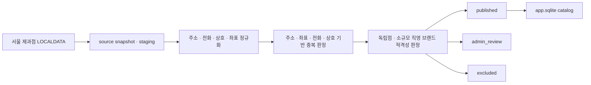

# 빵찾깅 (Bread Map)

> 먹고 싶은 빵과 오늘의 방문 조건으로, 서울의 검수된 독립 베이커리를 찾는 로컬 우선 웹 서비스

빵찾깅은 지역·가게명·메뉴·카테고리를 조합해 방문 가능한 베이커리 후보를 찾고, 지도·목록·매장 상세에서 메뉴와 실제 리뷰 근거를 비교하도록 돕는 프로젝트입니다. 인기 순위나 불투명한 AI 점수보다 **재현 가능한 판정 규칙과 확인 가능한 근거**를 우선합니다.

현재 저장소는 로컬 MVP를 단계별로 개발하고 있습니다. **Feature 1~3이 완료되어 서울 제과점 공공 원장을 수집하고, 매장을 정규화·중복 판정·적격성 검수한 뒤 `app.sqlite` 카탈로그에 게시하는 기반**까지 구현되어 있습니다. 검색·추천·지도 UI는 후속 Feature이며, 현재 `apps/web`은 기본 화면만 제공하는 scaffold입니다.

## 현재 구현 상태

| Feature | 상태 | 구현 범위 |
|---:|:---:|---|
| 1. Local SQLite storage foundation | 완료 | `app.sqlite`·`raw.sqlite`, 독립 Drizzle migration, WAL·backup, web/raw 접근 경계 |
| 2. Seoul source ingestion | 완료 | LOCALDATA 응답 계약, snapshot·staging 분리, page checkpoint, 멱등 fixture 적재 |
| 3. Store normalization and eligibility | 완료 | 매장 정규화, 4-signal 중복 판정, 독립점 적격성 판정, `admin_review` 격리, 멱등 catalog 게시 |
| 4~10. Review → Search → Web | 예정 | 리뷰 수집·비식별화·FTS5, 결정론적 검색·추천, 인증·지도 API·UI, 로컬 E2E |

Feature 3까지의 데이터 흐름은 다음과 같습니다.



## Feature 3에서 보장하는 것

- 공공 원장의 주소·전화·상호를 보수적으로 정규화하고 EPSG:5174 좌표를 WGS84로 변환합니다.
- 주소, 좌표 거리, 전화, 상호 유사도 근거를 모두 기록해 중복 후보를 `auto_merge`, `admin_review`, `separate`로 판정합니다.
- 서울 단일 독립점과 2~5개 소규모 직영 브랜드는 명시적인 독립성·운영 주체 근거와 관리자 승인 아래에서만 게시합니다.
- 공정위 자료에서 프랜차이즈를 찾지 못했다는 사실만으로 독립점이라고 단정하지 않습니다.
- 좌표·중복·운영 상태·브랜드 근거가 불충분한 후보는 자동 게시하지 않고 `admin_review`로 격리합니다.
- 동일 snapshot과 판정 버전을 다시 처리해도 store·decision·publish 행이 중복되지 않습니다.

자동 검증은 고정 fixture를 사용합니다. 실제 서울 전체 브랜드의 공정위 자료, 운영 주체와 관리자 검수 근거까지 검증되었다는 의미는 아닙니다.

## 프로젝트 원칙

- **Local first:** 사용자 PC의 `127.0.0.1`과 로컬 SQLite 파일에서 실행합니다.
- **Evidence first:** 숫자형 추천 총점 대신 메뉴·영업·거리·리뷰와 판정 근거를 보여줍니다.
- **Deterministic:** 같은 입력·snapshot·규칙 버전에는 같은 결과를 만듭니다.
- **Safe boundaries:** web은 worker 전용 `raw.sqlite`와 원문·비밀 정보에 접근하지 않습니다.
- **OpenAI 비용 `$0`:** 현재 MVP에는 OpenAI client, 활성 챗봇 API와 생성형 응답이 없습니다.
- **Honest fallback:** 리뷰나 외부 근거가 부족해도 정보를 만들어내지 않고 한계와 대체 근거를 안내합니다.

## 빠르게 확인하기

### 요구 환경

- Node.js `>=24.15.0 <25`
- Corepack과 pnpm `11.16.0`
- Git

Docker, PostgreSQL, OpenAI key와 외부 API key는 fixture 기반 설치·검증에 필요하지 않습니다.

### 설치와 migration

```powershell
corepack pnpm install --frozen-lockfile
corepack pnpm db:migrate
```

기본 경로에 `var/app.sqlite`와 `var/raw.sqlite`가 생성됩니다. 두 경로는 환경변수 `APP_SQLITE_PATH`, `RAW_SQLITE_PATH`로 변경할 수 있습니다.

### 서울 source fixture 적재

```powershell
corepack pnpm ingest:catalog:fixture
```

고정 fixture는 서울 3건과 비서울 1건을 포함합니다. 새 DB의 첫 실행은 4건을 읽어 3건을 적재하고 1건을 거부하며, 재실행해도 staging 중복이 생기지 않습니다.

### Feature 3 검증

```powershell
corepack pnpm test:catalog:feature3
```

이 명령은 매장 정규화, 중복 판정, 적격성 경계, `admin_review`, catalog 게시와 재실행 멱등성을 함께 검증합니다.

전체 repository gate는 다음과 같습니다.

```powershell
corepack pnpm typecheck
corepack pnpm lint
corepack pnpm test
corepack pnpm build
corepack pnpm db:check
```

### 현재 web scaffold 실행

```powershell
corepack pnpm dev
```

브라우저에서 `http://127.0.0.1:3000`으로 접근할 수 있습니다. 현재 화면은 scaffold이며, 실제 검색·지도 경험은 Feature 8~9에서 연결합니다.

## 기술 구성

| 영역 | 기술 |
|---|---|
| Web | Next.js 16, React 19 |
| Language | TypeScript 6 |
| Database | SQLite, `better-sqlite3`, Drizzle ORM |
| Worker | Node.js, Zod, `proj4` |
| Test | Vitest, Playwright |
| Workspace | pnpm monorepo |

```text
Bread_map/
├── apps/
│   ├── web/                  # Next.js UI와 server route
│   └── worker/               # source 수집·정규화·catalog 게시
├── packages/
│   ├── contracts/            # 공유 schema와 type
│   ├── sqlite-core/          # SQLite 연결·PRAGMA·backup
│   ├── app-db/               # 사용자 서비스용 app DB
│   ├── raw-db/               # worker 전용 raw DB
│   ├── recommendation/       # 후속 결정론적 추천
│   └── testkit/              # 고정 fixture와 test helper
├── drizzle/                  # app/raw 독립 migration
├── scripts/                  # migration·backup·경계 검사
└── docs/                     # 제품·기술 기준 문서
```

## 다음 로드맵

1. **Feature 4:** 제한형 Kakao 리뷰 수집과 암호화 raw 저장
2. **Feature 5:** 리뷰 비식별화, 중복 방지와 FTS5 검색
3. **Feature 6:** 구조화 검색과 결정론적 추천
4. **Feature 7:** Kakao 인증과 계정별 즐겨찾기·기록
5. **Feature 8:** 매장 검색·상세·지도 server API
6. **Feature 9:** 지도 중심 UI와 비활성 빵빵이 채팅 셸
7. **Feature 10:** 로컬 E2E, 복구와 release gate

자연어 멀티턴 챗봇, RAG·생성형 설명, Vercel·Turso 배포와 원격 5인 파일럿은 현재 로컬 MVP 이후의 독립 범위입니다.

## 문서

- [문서 허브](docs/README.md)
- [제품 요구사항](docs/00-product/prd.md)
- [로컬 MVP 마스터 구현 계획](docs/superpowers/plans/2026-07-24-local-first-sqlite-mvp-master.md)
- [Feature 3 상세 구현 계획](docs/superpowers/plans/2026-07-26-store-normalization-eligibility.md)
- [로컬 개발 환경](docs/10-delivery/local-development.md)
- [기술 스택 기준](docs/10-delivery/technology-stack.md)
- [결정 기록](docs/09-decisions/decision-log.md)

> 빵찾깅은 빵집 추천 서비스입니다. 재료·알레르기·교차접촉 정보는 검증하지 않으며 안전을 보장하지 않습니다. 주문하거나 방문하기 전에 매장에 직접 확인해 주세요.
