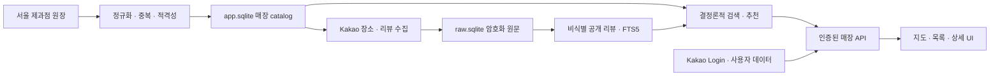

# 빵찾깅 (Bread Map)

> 먹고 싶은 빵과 오늘의 방문 조건으로 서울의 검수된 독립 베이커리를 찾는 로컬 우선 웹 서비스

빵찾깅은 지역·가게명·메뉴·카테고리와 방문 조건을 조합해 베이커리를 검색하고, 지도·목록·매장 상세에서 메뉴와 비식별 리뷰 근거를 비교하도록 돕습니다. 인기 순위나 불투명한 AI 점수보다 **재현 가능한 판정 규칙과 확인 가능한 근거**를 우선합니다.

현재 저장소는 **Feature 1~10의 로컬 웹 MVP 자동 구현과 검증을 완료**한 상태입니다. SQLite 데이터 파이프라인부터 결정론적 검색·추천, Kakao 인증 경계, 지도 중심 UI, 복구와 production browser E2E를 한 저장소에서 제공합니다. 다만 실제 Kakao Login·Map과 리뷰 수집은 사용자 소유 자격증명 및 운영자 검증이 필요한 별도 live 경계입니다.

## 주요 기능

- 서울 제과점 공공 원장 수집, 정규화, 중복 판정과 독립점 적격성 검수
- Kakao 장소 발견 및 공개 리뷰의 최근 12개월 backfill·수동 증분 수집
- 리뷰 비식별화, AES-256-GCM 암호화 raw 보존, 공개 corpus와 FTS5 색인
- 지역·가게명·메뉴·카테고리·영업·거리·리뷰 상태 기반 구조화 검색
- 강한 제외와 안정된 동점 규칙을 적용하는 결정론적 추천
- Kakao Login, 계정별 즐겨찾기·검색/선택 기록과 로컬 우선 탈퇴
- 지도·목록·매장 상세가 같은 snapshot을 사용하는 반응형 웹 UI
- 비활성 빵빵이 채팅 셸: OpenAI 호출과 메시지 전송 없이 후속 UX만 제공
- checkpoint 재개, app DB snapshot·복구, 품질 보고서와 로컬 release gate

## 구현 상태

| Feature | 상태 | 구현 범위 |
|---:|:---:|---|
| 1 | 완료 | `app.sqlite`·`raw.sqlite`, 독립 Drizzle migration, WAL, app-only backup, web/raw 경계 |
| 2–3 | 완료 | LOCALDATA 적재, 매장 정규화·중복 판정·적격성 검수, 멱등 catalog 게시 |
| 4–5 | 완료 | Kakao 장소·리뷰 수집 경계, 비식별·암호화, 공개 리뷰 corpus와 FTS5 retrieval |
| 6 | 완료 | strict 구조화 검색 계약, 검수 근거, hard filter와 결정론적 정렬·fallback |
| 7 | 완료 | 최소 Kakao 계정, 6시간 암호화 JWT, session 폐기, 사용자 데이터 격리·탈퇴 |
| 8 | 완료 | 인증된 매장 검색·상세 API, map/list 동일 후보, snapshot 고정과 review pagination |
| 9 | 완료 | 지도 중심 검색·목록·상세 UI, 반응형·접근성 상태, map fallback, 비활성 chat shell |
| 10 | 완료 | fresh DB bootstrap, 수집 재개, app DB 복구, 품질 gate, production browser E2E |

여기서 `완료`는 고정 fixture와 격리된 로컬 환경의 자동 gate를 통과하는 구현 범위를 뜻합니다. 실제 서울 전체 데이터 품질이나 외부 Kakao 서비스 연동까지 검증됐다는 의미는 아닙니다.

## 동작 구조



`apps/web`은 서비스용 `app.sqlite`만 사용합니다. 리뷰 원문과 수집 비밀을 보관하는 `raw.sqlite`는 worker 전용이며 정적 경계 검사로 web 접근을 차단합니다.

## 빠르게 검증하기

### 요구 환경

- Node.js `>=24.15.0 <25` (기준 버전 `24.18.0`)
- Corepack과 pnpm `11.16.0`
- Git
- UI·통합 E2E에 사용할 로컬 Chrome

Docker, PostgreSQL, OpenAI key와 외부 API key는 자동 fixture 검증에 필요하지 않습니다.

### 설치

```powershell
corepack pnpm install --frozen-lockfile
```

### 전체 로컬 MVP gate

```powershell
corepack pnpm verify:local-mvp
```

이 명령은 격리된 fresh SQLite DB에서 migration과 fixture 적재를 수행한 뒤 리뷰 수집 재개, app DB backup·복구, 검색 품질, production build와 실제 route 기반 browser E2E, 보안·경계 감사를 순서대로 실행합니다. 성공 보고서는 `test-results/local-mvp/report.json`에 생성됩니다.

일반 repository 검증 명령은 다음과 같습니다.

```powershell
corepack pnpm typecheck
corepack pnpm lint
corepack pnpm test
corepack pnpm build
corepack pnpm db:check
```

Feature별 gate와 live smoke 명령은 [로컬 개발 환경](docs/10-delivery/local-development.md)에 정리돼 있습니다.

## 로컬 실행

기본 SQLite 파일을 준비하고 web을 실행합니다.

```powershell
corepack pnpm db:migrate
corepack pnpm dev
```

브라우저에서 `http://127.0.0.1:3000`으로 접속합니다. 기본 DB 경로는 `var/app.sqlite`와 `var/raw.sqlite`이며 각각 `APP_SQLITE_PATH`, `RAW_SQLITE_PATH`로 변경할 수 있습니다.

실제 Kakao Login과 Map을 사용하려면 Git에 포함하지 않은 로컬 환경에 다음 값을 준비해야 합니다.

- `KAKAO_CLIENT_ID`, `KAKAO_CLIENT_SECRET`
- `NEXT_PUBLIC_KAKAO_MAP_APP_KEY`
- `AUTH_SECRET`
- `AUTH_URL=http://127.0.0.1:3000`

Kakao Login callback은 다음 주소로 등록합니다.

```text
http://127.0.0.1:3000/api/auth/callback/kakao
```

리뷰 수집에는 별도의 worker 전용 자격증명, 암호화 키, 승인된 selector contract가 필요합니다. 실제 비밀값은 문서·Git·SQLite·터미널 출력에 남기지 마세요. 전체 환경변수와 안전한 live 절차는 [로컬 개발 환경](docs/10-delivery/local-development.md)을 따릅니다.

## 현재 검증 경계

저장소에 기록된 최신 자동 gate는 외부 네트워크를 사용하지 않으며 OpenAI 비용은 `$0`입니다. 다음 항목은 자동 완료와 분리돼 있습니다.

| 외부 항목 | 현재 상태 |
|---|---|
| Kakao Login | `NOT_RUN_CREDENTIALS_REQUIRED` |
| Kakao Map SDK | `NOT_RUN_CREDENTIALS_REQUIRED` |
| Kakao 리뷰 live 수집 | `SELECTOR_STOP_STATE_UNCONFIRMED` |
| Public tunnel | `NOT_RUN_OPERATOR_ATTESTATION_REQUIRED` |

고정 검색 fixture의 품질 gate는 구현의 결정성과 회귀 방지를 증명합니다. 실제 서울 source, 운영 주체·메뉴·영업 근거와 독립 평가자의 추천 품질은 별도 운영자 검수 대상입니다.

## 프로젝트 원칙

- **Local first:** 사용자 PC의 `127.0.0.1`과 로컬 SQLite에서 실행합니다.
- **Evidence first:** 숫자형 총점 대신 메뉴·영업·거리·리뷰와 판정 근거를 보여줍니다.
- **Deterministic:** 같은 입력·snapshot·규칙 버전에는 같은 결과 순서를 만듭니다.
- **Privacy by boundary:** 정확한 위치를 저장하지 않고 raw 리뷰·수집 비밀을 web에서 격리합니다.
- **Honest fallback:** 리뷰나 외부 근거가 부족하면 정보를 만들지 않고 한계와 대체 근거를 안내합니다.
- **OpenAI 비용 `$0`:** 현재 runtime에는 OpenAI client, `/api/chat`, 생성형 답변이 없습니다.

## 기술 구성

| 영역 | 기술 |
|---|---|
| Runtime | Node.js 24 |
| Web | Next.js 16, React 19, Auth.js |
| Language | TypeScript 6 |
| Database | SQLite, FTS5, `better-sqlite3`, Drizzle ORM |
| Worker | Node.js, Zod, Playwright, `proj4` |
| Test | Vitest, Playwright Test |
| Workspace | pnpm monorepo |

```text
Bread_map/
├── apps/
│   ├── web/                  # Next.js UI와 server route
│   └── worker/               # 원장·리뷰 수집과 catalog/evidence 게시
├── packages/
│   ├── contracts/            # 공유 schema와 API 계약
│   ├── sqlite-core/          # SQLite 연결·PRAGMA·backup
│   ├── app-db/               # 서비스용 app DB
│   ├── raw-db/               # worker 전용 암호화 raw DB
│   ├── retrieval/            # app-only FTS5·검색 repository
│   ├── recommendation/       # 순수 결정론적 추천 engine
│   └── testkit/              # 고정 fixture와 test helper
├── drizzle/                  # app/raw 독립 migration
├── scripts/                  # migration·backup·품질·release gate
└── docs/                     # 제품·경험·구조·운영 기준 문서
```

## 후속 범위

다음 항목은 현재 로컬 MVP에 포함되지 않은 독립 Feature입니다.

- 자유 형식 자연어와 멀티턴 챗봇
- RAG와 생성형 추천 설명
- Kakao Route 기반 경로 대안
- Vercel·Turso 등 원격 배포
- 5인 비공개 파일럿과 live 품질 평가

## 문서

- [문서 허브](docs/README.md)
- [제품 요구사항](docs/00-product/prd.md)
- [시스템 구조](docs/04-architecture/system-architecture.md)
- [데이터 설계](docs/05-data/data-design.md)
- [보안 설계](docs/06-trust/security-design.md)
- [결정 기록](docs/09-decisions/decision-log.md)
- [구현·릴리스 안내](docs/10-delivery/README.md)
- [로컬 개발 환경](docs/10-delivery/local-development.md)
- [기술 스택 기준](docs/10-delivery/technology-stack.md)
- [로컬 MVP 마스터 구현 계획](docs/superpowers/plans/2026-07-24-local-first-sqlite-mvp-master.md)
- [Feature 10 release gate 계획](docs/superpowers/plans/2026-07-31-local-e2e-recovery-release-gate.md)

> 빵찾깅은 빵집 추천 서비스입니다. 재료·알레르기·교차접촉 정보는 검증하지 않으며 안전을 보장하지 않습니다. 주문하거나 방문하기 전에 매장에 직접 확인해 주세요.
