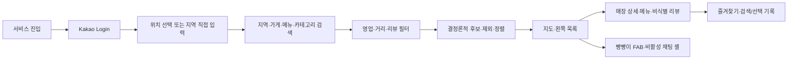

# 빵찾깅 제품 요구사항 문서

[문서 허브](../README.md) · [사용자 여정](../01-experience/user-journey.md) · [추천 기준](../02-recommendation/recommendation-spec.md) · [결정 기록](../09-decisions/decision-log.md)

**상태:** 로컬 우선 웹 MVP 기준 승인

**기준일:** 2026-07-30

**대상:** 제품, 디자인, 개발, 데이터 검수와 로컬 운영

## 1. 제품 한 문장

지역·가게명·메뉴·카테고리와 방문 조건으로 서울의 검수된 독립 베이커리를 구조화 검색하고, 결정론적 순서와 실제 비식별 리뷰 근거를 지도·목록·매장 상세에서 비교하게 해주는 로컬 웹 서비스다.

## 2. 핵심 사용자와 JTBD

### 주 사용자

현재 로컬 MVP의 주 사용자는 **특정 메뉴 탐색형 사용자**다. 원하는 특정 빵이나 맛·식감은 있지만 어느 빵집에 있는지 모르는 사람을 뜻한다.

### JTBD

> 먹고 싶은 빵과 오늘의 방문 조건을 입력했을 때, 갈 수 있는 베이커리 후보와 실제 근거를 빠르게 비교하고 방문할 곳을 정하고 싶다.

### 핵심 상황

- 지역과 `사워도우`, `크루아상` 같은 메뉴 또는 카테고리로 후보를 찾는다.
- 가게명을 알고 있을 때 바로 검색해 상세와 메뉴·리뷰 근거를 확인한다.
- 현재 영업 여부와 거리 조건을 적용해 지금 방문 가능한 후보를 좁힌다.
- 리뷰가 충분한 매장과 부족한 매장을 구분해서 근거의 한계를 이해한다.
- 지도와 왼쪽 목록을 함께 보며 후보를 고르고 즐겨찾기에 저장한다.

## 3. 문제

지도 서비스는 위치와 인기도 탐색에는 강하지만 빵 메뉴와 검수된 독립점 여부, 리뷰 근거의 최신성을 한 흐름에서 비교하기 어렵다. 검색 문서와 후기는 최신 영업 상태·실제 이동 가능성·강한 제외를 일관된 규칙으로 적용하기 어렵다.

빵찾깅은 다음 간극을 해결한다.

1. 지역·가게·메뉴·카테고리 조건을 하나의 구조화 검색으로 결합한다.
2. 싫다고 지정한 특징을 관련도 때문에 다시 추천하지 않는다.
3. 검수된 서울 독립 베이커리와 승인된 소규모 직영 브랜드만 사용한다.
4. 메뉴·리뷰·영업·거리 근거와 데이터 한계를 함께 보여준다.
5. 동일한 입력·데이터·버전에는 동일한 결과를 제공한다.

## 4. 제품 가설

| ID | 가설 | 확인 방법 |
|---|---|---|
| `HYP-L01` | 구조화된 지역·가게·메뉴·카테고리 검색으로 원하는 후보를 찾을 수 있다. | 대표 구조화 검색 Hit Rate@5 |
| `HYP-L02` | 강한 제외와 안정 동점 규칙은 동일 입력의 결과를 재현한다. | 제외 위반과 100회 반복 순서 |
| `HYP-L03` | 지도·상세·비식별 리뷰 근거가 실제 방문 후보 비교를 돕는다. | 대표 과업과 근거 노출 검사 |
| `HYP-L04` | 리뷰 부족 매장도 메뉴·영업·거리 근거로 탐색할 수 있다. | 리뷰 부족 시나리오 결과 |
| `HYP-L05` | 비활성 채팅 셸은 실제 AI 호출 없이 후속 인터랙션을 검증한다. | 입력 차단과 외부 호출 0건 |

## 5. 제품 원칙

1. **구조화 검색이 현재 입력이다.** 지역·가게·메뉴·카테고리·영업·거리·리뷰 상태를 명시적으로 입력한다.
2. **강한 제외가 관련도보다 우선한다.** 제외 조건은 FTS 관련도나 별점으로 되돌아오지 않는다.
3. **계산은 결정론적이다.** 후보·제외·순위·동점은 코드와 버전이 책임진다.
4. **점수보다 근거를 보여준다.** 내부 계산값은 유지할 수 있지만 숫자 총점은 사용자에게 공개하지 않는다.
5. **리뷰 부족은 결측이지 탈락 사유가 아니다.** 메뉴·영업·거리·데이터 완성도로 대체한다.
6. **위치는 일시적으로 사용한다.** 정확 좌표는 요청 메모리에서만 쓰고 저장·로그·분석하지 않는다.
7. **안전을 단정하지 않는다.** 재료·알레르기·교차접촉을 판정하지 않고 매장 직접 확인을 안내한다.
8. **현재 비용과 범위를 지킨다.** 빵빵이 채팅은 비활성 셸이고 OpenAI를 호출하지 않으며 비용 목표는 `$0`이다.

## 6. 현재 로컬 MVP 범위

### 로컬 실행과 저장소

- 사용자 PC의 `127.0.0.1`에서 web과 worker 실행
- SQLite/libSQL 호환 `app.sqlite`와 worker 전용 `raw.sqlite`
- Drizzle migration, FTS5, WAL과 bounded checkpoint
- 큰 수집·migration 전 app DB snapshot과 새 파일 복구 검증

### 매장·리뷰 데이터

- 서울 제과점 공공 원장 snapshot, 정규화와 적격성 판정
- 독립점과 검수된 소규모 직영 브랜드만 게시
- 관리자 로컬 수동 batch로 Kakao Map 리뷰 수집
- 최초 run의 최근 12개월 공개 리뷰 전량 backfill과 이후 operator 수동 incremental 수집, 매장별 hard cap 없음
- 닉네임 폐기, 본문 비식별, 암호화 raw 보존과 30일 hard delete
- 비식별 리뷰의 `app.sqlite` 게시와 FTS5 색인

### 구조화 검색과 추천

- 지역·가게명·메뉴·카테고리 검색
- 영업 중, 거리, 리뷰 근거 상태 필터
- 적격성·강한 제외를 먼저 적용하는 결정론적 추천
- 명시 메뉴/카테고리, FTS 관련도, 리뷰 최신성, 방문 조건, 데이터 완성도 순의 안정 정렬
- 별점은 마지막 동점 보조값이며 최종 동점은 `store_id`
- 리뷰 부족 매장 대체 순서와 사용자 안내

### 계정과 경험

- 일반 Kakao Login과 서비스 내부 계정
- 계정별 즐겨찾기와 검색/선택 기록 격리
- 위치 선택 동의와 지역 직접 입력 대체
- 전체 지도, 왼쪽 가게 드로어, 매장 상세·메뉴·비식별 리뷰
- 우측 하단 빵빵이 FAB와 입력할 수 없는 채팅 셸
- 키보드 탐색, 포커스, 의미 있는 상태·오류·빈 결과

### 복구와 검증

- source·review 수집 checkpoint와 재개
- 실패 매장 격리와 중복 게시 0건
- app DB snapshot 생성·무결성 확인·대표 검색 복구
- 고정 데이터 통합 검사와 로컬 E2E

## 7. 후속 독립 Feature

다음 항목은 삭제하지 않지만 현재 로컬 MVP의 완료 조건과 runtime 요구사항이 아니다.

- 자유 형식 자연어를 구조화 의도로 변환하는 챗봇
- 추천 전 확인 질문과 전체 세션 멀티턴 조건 수정
- RAG, 생성형 추천 설명과 실제 빵빵이 답변
- OpenAI model·prompt·token·호출 수·비용 승인
- Kakao 경로 API 기반 경로 대안
- Vercel·Turso 배포, HTTPS production callback과 원격 운영
- 5인 비공개 파일럿과 사용성 지표

## 8. 비목표

- 계정 전체 장기 취향 프로필
- 백그라운드 GPS 추적과 정확 좌표 저장
- 빵집의 알레르기·재료·교차접촉 안전 판정
- 숫자형 추천 총점 공개
- LLM이 후보·순위·영업 상태·매장 사실을 생성하는 기능
- 플랫폼 접근 제한을 우회하는 리뷰 수집
- 프랜차이즈 전체 또는 팝업·배달 전용·폐업 매장 추천
- 현재 로컬 MVP를 공개 인터넷 서비스로 운영하는 것

## 9. 핵심 사용자 흐름

세부 흐름과 상태·카피는 [사용자 여정](../01-experience/user-journey.md)과 [화면 상태·카피](../01-experience/ux-states-and-copy.md)가 책임진다.

## 10. 현재 기능 요구사항

### 구조화 검색과 추천

| ID | 요구사항 | 로컬 MVP 수용 기준 |
|---|---|---|
| `FR-SEARCH-01` | 지역·가게명·메뉴·카테고리를 조합해 검색한다. | 빈 값과 조합 입력이 정규화된 검색 조건으로 처리된다. |
| `FR-SEARCH-02` | 영업·거리·리뷰 근거 상태를 필터링한다. | 각 필터가 결과 수와 표시 상태에 일관되게 반영된다. |
| `FR-SEARCH-03` | 강한 제외는 FTS 관련도와 별점보다 먼저 적용한다. | 대표 시나리오의 제외 위반이 0건이다. |
| `FR-SEARCH-04` | 동일 입력·snapshot·추천 버전은 동일한 순서를 만든다. | 100회 반복 순서가 100% 일치한다. |
| `FR-SEARCH-05` | 리뷰 검색 실패 시 메뉴·카테고리·지역 조건으로 대체한다. | 가짜 리뷰 근거 없이 결과와 대체 안내가 표시된다. |
| `FR-SEARCH-06` | 숫자 추천 총점을 공개하지 않는다. | 사용자 응답과 UI에 공개 총점 필드가 없다. |

### 매장과 근거

| ID | 요구사항 | 로컬 MVP 수용 기준 |
|---|---|---|
| `FR-STORE-01` | 승인된 영업 매장만 추천 후보로 사용한다. | 프랜차이즈·폐업·팝업·미검수 노출이 0건이다. |
| `FR-STORE-02` | 지도와 목록에서 같은 후보 집합을 사용한다. | 지도 후보를 선택해 같은 매장 상세를 열 수 있다. |
| `FR-STORE-03` | 매장 상세에 주소·메뉴·영업·근거 최신성을 표시한다. | 각 항목이 출처와 snapshot 버전으로 역추적된다. |
| `FR-STORE-04` | 리뷰가 3개 미만인 매장도 자동 제외하지 않는다. | 메뉴·영업·거리 근거와 리뷰 부족 안내가 표시된다. |
| `FR-STORE-05` | 의료 안전을 판정하지 않는다. | 공식 고지와 매장 직접 확인 안내를 제공한다. |

### 데이터

| ID | 요구사항 | 로컬 MVP 수용 기준 |
|---|---|---|
| `FR-DATA-01` | 공공 원장과 관리자 판정을 멱등하게 게시한다. | 같은 snapshot 재실행의 중복이 0건이다. |
| `FR-DATA-02` | Kakao 리뷰는 관리자 로컬 worker가 명시적으로 수집한다. | 한 run·한 페이지로 순차 실행하고 중단·재개할 수 있다. |
| `FR-DATA-03` | 최초 run은 최근 12개월 공개 리뷰를 개수 상한 없이 backfill하고 이후 run은 operator가 수동 incremental로 시작한다. | 모든 적격 매장에 성공·리뷰 부족·접근 실패 결과가 남고, anchor 유실 시 같은 logical run이 12개월 cutoff까지 backfill로 대체된다. |
| `FR-DATA-04` | 닉네임은 fingerprint 계산 직후 폐기하고 본문을 비식별한다. | 닉네임·비식별 실패 원문이 서비스 DB·FTS·로그에 없다. |
| `FR-DATA-05` | raw 원문은 암호화하고 30일 후 hard delete한다. | `raw.sqlite` 외 평문 노출 0건, 만료 raw 0건이다. |
| `FR-DATA-06` | 비식별 리뷰만 `app.sqlite`와 FTS5에 게시한다. | 게시 행과 FTS 색인의 불일치가 0건이다. |

### 인증과 계정

| ID | 요구사항 | 로컬 MVP 수용 기준 |
|---|---|---|
| `FR-AUTH-01` | 일반 Kakao Login으로 내부 계정을 만든다. | KakaoSync와 불필요한 개인정보 동의를 요구하지 않는다. |
| `FR-AUTH-02` | 즐겨찾기와 검색/선택 기록을 계정별로 격리한다. | 다른 계정의 ID 직접 조회가 거부된다. |
| `FR-AUTH-03` | 탈퇴 시 로컬 계정 데이터를 삭제하고 외부 연결 해제를 요청한다. | 로컬 삭제는 즉시 완료되고 외부 실패는 비민감 재시도로 분리된다. |
| `FR-AUTH-04` | 정확한 좌표를 영구 저장하지 않는다. | DB·로그·분석 이벤트에서 좌표 노출이 0건이다. |

### UI

| ID | 요구사항 | 로컬 MVP 수용 기준 |
|---|---|---|
| `FR-UI-01` | 전체 지도와 왼쪽 가게 드로어를 함께 제공한다. | 지도·목록 선택과 상세가 양방향으로 동기화된다. |
| `FR-UI-02` | 로딩·부분 성공·빈 결과·오래된 데이터·오류를 구분한다. | 각 상태에 다음 행동이 있는 공식 카피가 표시된다. |
| `FR-UI-03` | 빵빵이 FAB와 채팅 셸을 표시하되 입력은 차단한다. | 메시지 제출과 OpenAI 네트워크 호출이 0건이다. |
| `FR-UI-04` | 키보드·포커스·레이블·명도 대비를 지원한다. | 핵심 흐름이 키보드로 완료되고 WCAG 2.2 AA를 목표로 한다. |

### 복구와 운영

| ID | 요구사항 | 로컬 MVP 수용 기준 |
|---|---|---|
| `FR-RECOVERY-01` | 수집은 마지막 commit checkpoint에서 재개한다. | 중단 후 재실행이 완료 항목을 중복 게시하지 않는다. |
| `FR-RECOVERY-02` | 큰 수집과 migration 전에 app DB snapshot을 만든다. | snapshot 생성 실패 시 destructive 작업을 시작하지 않는다. |
| `FR-RECOVERY-03` | snapshot은 새 파일로 복구해 검증한다. | `PRAGMA integrity_check`, migration과 대표 검색이 통과한다. |
| `FR-RECOVERY-04` | 원장 최신성 임계값을 적용한다. | 7일 초과 경고, 30일 초과 새 추천 차단이 적용된다. |

## 11. 후속 Feature 요구사항

기존 온라인 P0의 ID는 추적 가능하도록 보존한다. 아래 항목은 현재 runtime에 연결하지 않는다.

| ID | 후속 요구사항 |
|---|---|
| `FR-CONV-01` | 자연어로 원하는 빵과 방문 조건을 입력한다. |
| `FR-CONV-02` | 원하는 것, 약한 회피, 강한 제외와 방문 조건을 분리한다. |
| `FR-CONV-03` | 추천 시도당 확인 질문을 최대 2개로 제한한다. |
| `FR-CONV-04` | 추천 이후 조건 수정·취소·결과 제외·정렬 변경을 대화로 처리한다. |
| `FR-CONV-05` | 새 대화는 다른 대화 조건을 자동 상속하지 않는다. |
| `FR-CONV-06` | 과거 대화를 열람·계속하기·삭제한다. |
| `FR-CONV-07` | 사용자가 선택하면 과거 조건으로 독립된 새 대화를 만든다. |
| `FR-ROUTE-01` | Kakao 경로 API의 유효 대안을 짧은 총 이동시간순으로 제공한다. |

## 12. 비기능 요구사항과 성공 지표

| ID·지표 | 목표 |
|---|---:|
| 대표 구조화 검색 Hit Rate@5 | 85% 이상 |
| 강한 제외 위반 | 0건 |
| 동일 입력·snapshot·버전의 100회 순서 결정성 | 100% |
| 외부 호출 제외 검색·필터·정렬 p95 | 1.5초 이하 |
| LLM 없는 검색 응답 p95 | 2초 이하 |
| 키보드 탐색·레이블·포커스·명도 대비 | WCAG 2.2 AA 목표 |
| 비밀·닉네임·raw 평문·정확 위치 노출 | 0건 |
| OpenAI 비용 | `$0` |

Feature 6 자동 gate는 고정 fixture의 기대 후보로 구현 결정성만 검증한다. 실제 서울 source와 독립 평가자의 품질 판정은 후속 cross-feature E2E·live 품질 검증으로 분리한다. 구체적인 시나리오와 판정은 [평가 계획](../02-recommendation/evaluation-plan.md)을 따른다.

## 13. 분석 이벤트 원칙

현재 최소 이벤트는 로그인 결과, 위치 동의·대체, 검색 실행·빈 결과, 필터·정렬 변경, 지도·상세 선택, 즐겨찾기와 검색/선택 기록 삭제다.

이벤트에는 검색 원문 전체, 정확 좌표, 건강 관련 표현, 리뷰 본문, 닉네임과 비밀을 넣지 않는다. 자연어 메시지·확인 질문·대화 이벤트는 후속 챗봇 Feature가 별도 승인한다.

## 14. 로컬 MVP 구현 순서

1. SQLite 저장소 기반과 migration·snapshot
2. 서울 원장 수집과 검증
3. 적격성 판정과 검수
4. Kakao 리뷰 수집·비식별·FTS 게시
5. 구조화 검색·결정론적 추천
6. 조회 API와 상태 계약
7. Kakao Login과 계정 격리
8. 지도·가게 드로어·매장 상세
9. 빵빵이 비활성 채팅 셸
10. 로컬 E2E와 릴리스 gate

세부 Feature 경계는 [로컬 MVP 마스터 구현 계획](../superpowers/plans/2026-07-24-local-first-sqlite-mvp-master.md)이 책임진다.

## 15. 관련 기준

- 경험: [사용자 여정](../01-experience/user-journey.md), [화면 상태·카피](../01-experience/ux-states-and-copy.md), [UI 디자인 시스템](../01-experience/design-system.md)
- 추천: [추천 기준](../02-recommendation/recommendation-spec.md), [평가 계획](../02-recommendation/evaluation-plan.md)
- 후속 챗봇: [LLM 계약](../03-contracts/llm-contracts.md)
- 구조: [시스템 구조](../04-architecture/system-architecture.md), [Worker 설계](../04-architecture/worker-design.md)
- 데이터·신뢰: [데이터 설계](../05-data/data-design.md), [보안 설계](../06-trust/security-design.md), [정책 검토](../06-trust/policy-review.md)
- 운영·변경: [운영 기준](../08-operations/operating-baselines.md), [결정 기록](../09-decisions/decision-log.md)
