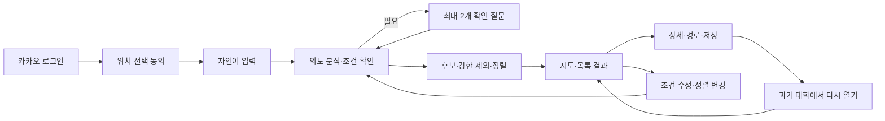

# 빵찾깅 제품 요구사항 문서

[문서 허브](../README.md) · [사용자 여정](../01-experience/user-journey.md) · [추천 기준](../02-recommendation/recommendation-spec.md) · [결정 기록](../09-decisions/decision-log.md)

**상태:** 비공개 MVP 기준 승인

**기준일:** 2026-07-23

**대상:** 제품, 디자인, 개발, 데이터 검수와 파일럿 운영

## 1. 제품 한 문장

먹고 싶은 빵의 특징과 오늘의 방문 조건을 자연어로 말하면, 갈 수 있는 서울 독립 베이커리 후보와 선택 이유를 지도·목록·경로로 비교하게 해주는 서비스다.

## 2. 핵심 사용자와 JTBD

### 주 사용자

MVP의 주 사용자는 **특정 메뉴 탐색형 사용자**다. 원하는 특정 빵이나 맛·식감은 있지만 어느 빵집에 있는지 모르는 사람을 뜻한다.

### JTBD

> 먹고 싶은 빵의 특징과 오늘의 방문 조건을 말했을 때, 갈 수 있는 베이커리 후보와 이유를 빠르게 비교하고 실제 방문할 곳을 정하고 싶다.

### 핵심 상황

- `겉은 바삭하고 안은 촉촉한 사워도우`처럼 메뉴와 특징을 함께 찾는다.
- `초콜릿은 빼고 과일이 들어간 페이스트리`처럼 강한 제외와 선호를 함께 말한다.
- 현재 위치에서 빨리 갈 수 있는 후보를 찾거나 관련도가 더 높은 후보로 바꿔 본다.
- 추천 후 `더 가까운 곳`, `2번은 제외`, `초콜릿은 이제 괜찮아`라고 조건을 계속 수정한다.
- 과거 대화를 다시 열어 이전 후보를 확인하고 다른 빵집에 방문한다.

## 3. 문제

지도 서비스는 위치와 인기도 탐색에는 강하지만 사용자가 표현한 빵의 맛·식감·메뉴 조건을 중심으로 후보를 좁히기 어렵다. 반대로 검색·후기 문서는 최신 영업 상태와 실제 이동 가능성을 한 화면에서 비교하기 어렵다.

빵찾깅은 다음 간극을 해결한다.

1. 자연어 취향을 추천 가능한 구조로 바꾼다.
2. 싫다고 말한 특징을 유사도 때문에 다시 추천하지 않는다.
3. 검수된 서울 독립 베이커리 후보만 사용한다.
4. 관련성과 실제 이동시간을 분리해 비교한다.
5. 추천 이유와 데이터 한계를 함께 보여준다.

## 4. 제품 가설

| ID | 가설 | 확인 방법 |
|---|---|---|
| `HYP-01` | 자연어 입력과 짧은 확인 질문이 상세 필터보다 첫 추천 완료율을 높인다. | 5인 파일럿 완료율·소요시간 |
| `HYP-02` | 강한 제외를 유사도 검색 전에 적용하면 추천 신뢰가 높아진다. | 20개 평가 시나리오 제외 위반 0건 |
| `HYP-03` | 숫자 점수보다 이유·이동시간·거리·주의점이 선택에 유용하다. | 설명 만족도와 결과 선택 인터뷰 |
| `HYP-04` | 이동시간순과 관련도순이 다른 선두 후보를 제공하면 상황별 탐색이 쉬워진다. | 정렬 전환율과 선택 변화 기록 |
| `HYP-05` | 과거 대화와 추천 결과를 다시 볼 수 있으면 재탐색 비용이 줄어든다. | 과거 대화 재열람 과업 성공률 |

## 5. 제품 원칙

1. **자연어가 중심이다.** 칩과 폼은 확인·수정·실패 대체 수단이다.
2. **강한 부정이 유사도보다 우선한다.** `초콜릿 제외`는 관련도가 높아도 되돌아오지 않는다.
3. **계산과 설명을 분리한다.** 후보·제외·순위는 결정론적 코드, LLM은 구조화·설명만 담당한다.
4. **점수보다 근거를 보여준다.** 내부 관련도는 유지하되 화면에는 숫자 총점을 표시하지 않는다.
5. **위치는 일시적으로 사용한다.** 선택 동의 후 앱 전경에서 갱신하되 정확 좌표를 저장하지 않는다.
6. **안전을 단정하지 않는다.** 의료 상태를 추천에 사용하지 않고 매장 직접 확인을 안내한다.
7. **대화 경계를 존중한다.** 새 대화가 과거 취향을 자동 상속하지 않는다.

## 6. P0 범위

사용자는 초기 P0 축소안보다 다음의 넓은 범위를 유지하기로 승인했다.

### 계정과 개인정보

- 일반 카카오 로그인과 서비스 내부 계정
- 계정별 대화·추천·즐겨찾기·피드백 격리
- 대화별 삭제와 회원탈퇴 전체 삭제
- 위치 선택 동의, 직접 출발지 대체, 정확 좌표 비저장

### 대화와 추천

- 자연어 중심 전체 세션 멀티턴
- 원하는 특징·약한 회피·강한 제외·방문 조건 분리
- 추천 시도당 시스템 확인 질문 최대 2개
- 조건 요약과 자연어·칩 수정
- 결정론적 후보·제외·내부 관련도·동점 처리
- 이동시간순과 관련도순
- 지도 전체 후보, 목록 선두 후보와 추천 이유

### 방문과 기록

- Kakao 경로 API를 이용한 도보·대중교통 경로 대안
- 매장 상세, 주소·메뉴·근거 최신성 표시
- 과거 대화 열람·계속하기·삭제
- `이 조건으로 새 대화 시작`
- 즐겨찾기와 방문 피드백

### 데이터와 운영

- 서울 제과점 공공 원장 적재와 정규화
- 독립점·소규모 직영 브랜드 판정과 관리자 검수
- 관리자 화면, 작업 상태와 데이터 최신성
- 서울 전체 적격 매장을 대상으로 하는 관리자 로컬 Kakao Map 리뷰 수집
- 매장별 최근 12개월·최대 20개 리뷰와 리뷰 부족 대체 추천
- 비식별 리뷰 특징 추출과 근거 집계
- 비용·쿼터·오래된 데이터·외부 장애 대체 흐름

## 7. 후순위와 비목표

### 후순위

- 버스만, 버스+지하철 등 교통수단 조합 필터
- 기본 두 방식 외의 정렬과 개인별 정렬 기본값
- 서울 밖 지역 확장
- 공개 서비스용 라이선스 리뷰 데이터

### 비목표

- 계정 전체 장기 취향 프로필
- 백그라운드 GPS 추적
- 빵집의 알레르기·재료·교차접촉 안전 판정
- 숫자형 추천 점수 공개
- LLM이 후보·순위·영업 상태·매장 사실을 생성하는 기능
- 플랫폼 접근 제한을 우회하는 리뷰 수집
- 프랜차이즈 전체 또는 팝업·배달 전용·폐업 매장 추천

## 8. 핵심 사용자 흐름

세부 흐름과 화면 상태는 [사용자 여정](../01-experience/user-journey.md)과 [화면 상태·카피](../01-experience/ux-states-and-copy.md)가 책임진다.

## 9. 기능 요구사항

### 인증과 계정

| ID | 요구사항 | P0 수용 기준 |
|---|---|---|
| `FR-AUTH-01` | 사용자는 일반 카카오 로그인으로 만든 서비스 내부 계정으로 서비스를 이용한다. | 비로그인 추천·대화 API는 인증 오류를 반환하고 KakaoSync를 요구하지 않는다. |
| `FR-AUTH-02` | 서비스는 기능에 필요하지 않은 카카오 개인정보를 요청하지 않는다. | 이메일·전화번호·생일·성별 필드가 동의 항목과 DB에 없다. |
| `FR-AUTH-03` | 계정 데이터는 사용자별로 격리한다. | 다른 사용자의 대화·추천·즐겨찾기 ID 조회가 거부된다. |
| `FR-AUTH-04` | 탈퇴는 서비스 데이터 삭제와 카카오 연결 해제를 함께 요청한다. | 로컬 데이터 즉시 삭제, 외부 해제 실패는 비민감 재시도로 분리한다. |

### 대화

| ID | 요구사항 | P0 수용 기준 |
|---|---|---|
| `FR-CONV-01` | 자연어로 원하는 빵과 방문 조건을 입력한다. | 구조화 폼 없이 첫 추천 흐름을 시작할 수 있다. |
| `FR-CONV-02` | 시스템은 원하는 것, 약한 회피, 강한 제외와 방문 조건을 분리한다. | 구조화 상태에 네 범주가 별도로 존재한다. |
| `FR-CONV-03` | 시스템 확인 질문은 한 추천 시도당 최대 2개다. | 세 번째 질문 대신 수정 가능한 조건 요약으로 진행한다. |
| `FR-CONV-04` | 추천 이후에도 조건 수정·취소·결과 제외·정렬 변경을 대화로 처리한다. | 새 요청을 같은 대화 상태에 반영해 새 결과를 만든다. |
| `FR-CONV-05` | 새 대화는 다른 대화 조건을 자동 상속하지 않는다. | 새 대화의 조건 상태가 비어 있다. |
| `FR-CONV-06` | 과거 대화는 열람·계속하기·삭제할 수 있다. | 대화 목록, 재개와 cascade 삭제가 동작한다. |
| `FR-CONV-07` | 사용자가 선택하면 과거 조건으로 새 대화를 만든다. | 원본과 독립된 새 대화에 조건만 복사한다. |

### 위치와 경로

| ID | 요구사항 | P0 수용 기준 |
|---|---|---|
| `FR-LOC-01` | 위치 사용은 로그인과 분리된 선택 동의다. | 거부해도 역·동·구 입력으로 추천을 완료한다. |
| `FR-LOC-02` | 앱 전경에서 현재 위치를 계속 갱신한다. | 100m 이상 이동하거나 사용자가 요청할 때 경로를 갱신한다. |
| `FR-LOC-03` | 정확한 좌표를 영구 저장하지 않는다. | DB·로그·분석·대화·OpenAI 요청에 좌표가 없다. |
| `FR-LOC-04` | 경로 계산 전 Kakao 전송을 안내한다. | 동의 문구에 목적·전송·비저장·거부 대체가 포함된다. |
| `FR-ROUTE-01` | 목적지별 경로 대안을 짧은 총 이동시간순으로 보여준다. | 반환된 유효 경로 전체가 오름차순이며 실패 시 가짜 시간을 표시하지 않는다. |

### 추천과 결과

| ID | 요구사항 | P0 수용 기준 |
|---|---|---|
| `FR-REC-01` | 서울의 승인된 영업 매장만 후보로 사용한다. | 프랜차이즈·폐업·팝업·미검수 노출 0건이다. |
| `FR-REC-02` | 강한 제외는 유사도·관련도보다 먼저 적용한다. | 20개 대표 시나리오에서 제외 위반 0건이다. |
| `FR-REC-03` | 기본 이동시간순과 대안 관련도순을 제공한다. | 정렬 변경 시 선두 후보와 순위가 실제 기준으로 재계산된다. |
| `FR-REC-04` | 지도에는 조건을 통과한 전체 후보를 표시한다. | 목록 밖 후보도 지도에서 선택하고 상세를 열 수 있다. |
| `FR-REC-05` | 결과에는 이유·주의점·시간·거리를 표시하고 숫자 총점은 숨긴다. | UI 응답 계약에 공개 점수 필드가 없다. |
| `FR-REC-06` | 의료 상태를 필터·점수에 사용하지 않는다. | 안전 판정 대신 공식 고지와 직접 확인 안내가 나온다. |
| `FR-REC-07` | 동일 입력·상태·데이터·버전은 같은 결과를 낸다. | 100회 반복의 순위 차이가 0건이다. |

### 데이터와 운영

| ID | 요구사항 | P0 수용 기준 |
|---|---|---|
| `FR-DATA-01` | 매장·메뉴·특징은 출처와 검수 상태를 가진다. | 추천 항목에서 근거 ID와 최신성으로 역추적할 수 있다. |
| `FR-DATA-02` | 원장 최신성이 임계값을 넘으면 경고·차단한다. | 7일 초과 경고, 30일 초과 새 추천 차단이 적용된다. |
| `FR-DATA-03` | Kakao Map 리뷰 수집은 관리자 로컬 worker에서만 명시적으로 시작한다. | 서울 전체 적격 매장 batch가 1개 브라우저 페이지로 순차 실행되고 중단·재개·실패 매장 재실행을 지원한다. |
| `FR-DATA-04` | 대화 삭제는 연결된 상태·추천·피드백을 제거한다. | 삭제 후 모든 연결 조회가 비어 있거나 404다. |
| `FR-DATA-05` | 외부 공급자 장애에 명시적 대체 흐름을 제공한다. | LLM·지도·경로·위치 실패 시 해당 대체 과업을 완료한다. |
| `FR-DATA-06` | 리뷰는 Kakao Map의 최근 12개월·매장당 최대 20개만 사용한다. | Naver 수집 코드가 없고 모든 적격 매장에 성공·리뷰 부족·접근 실패 중 하나의 수집 결과가 있다. |
| `FR-DATA-07` | 리뷰가 3개 미만이어도 적격 매장을 추천 후보에서 제거하지 않는다. | 검수 메뉴·방문 조건·이동시간·데이터 완성도 중심의 대체 순서가 적용되고 리뷰 부족 안내가 표시된다. |

## 10. 비기능 요구사항

| ID | 요구사항 | 목표 |
|---|---|---:|
| `NFR-PERF-01` | 외부 호출 제외 후보·필터·내부 관련도 p95 | 1.5초 이하 |
| `NFR-PERF-02` | LLM 설명 없는 추천 응답 p95 | 2초 이하 |
| `NFR-UX-01` | 사용자 입력 후 진행 상태 표시 | 100ms 이내 |
| `NFR-ACC-01` | 키보드 탐색·폼 레이블·포커스·명도 대비 | WCAG 2.2 AA 목표 |
| `NFR-REL-01` | 동일 입력·버전의 결과 결정성 | 100% |
| `NFR-SEC-01` | 정확 좌표·리뷰 평문·비밀의 로그 노출 | 0건 |
| `NFR-OPS-01` | 개발·운영 확보 시간 | 주당 5시간 이상 |
| `NFR-COST-01` | 5인 파일럿 반복 운영비 | 월 30,000원 이하 |

## 11. 성공 지표

비공개 파일럿 참여자는 5명이다.

| 지표 | 목표 |
|---|---:|
| 첫 추천 과업 완료율 | 80% 이상 |
| 입력 시작부터 결과 확인까지 중앙값 | 2분 이하 |
| 20개 대표 시나리오 Hit Rate@5 | 85% 이상 |
| 관련도·설명 만족도 | 5점 중 4.0 이상 |
| LLM·경로 장애 대체 흐름 완료율 | 90% 이상 |
| 빈 결과 후 조건 수정 성공률 | 80% 이상 |
| 강한 제외 위반 | 0건 |
| 동일 입력·동일 버전 결과 결정성 | 100% |

예상 후보 정답은 개발자와 베이커리에 익숙한 독립 평가자 1명이 만들고, 불일치는 공식 메뉴·출처·검수 근거를 확인해 합의한다. 구체적인 수집·판정 방법은 [평가 계획](../02-recommendation/evaluation-plan.md)을 따른다.

## 12. 분석 이벤트 원칙

최소 이벤트는 로그인, 위치 동의·대체, 대화 생성·재열기·삭제, 메시지 제출, 확인 질문, 추천 완료·빈 결과, 정렬 변경, 결과·경로 열기, 즐겨찾기와 피드백이다.

이벤트에는 메시지 원문, 취향 문장, 정확 좌표, 건강 관련 표현과 리뷰 본문을 넣지 않는다. 이벤트별 이름·허용 속성·지표 연결은 [운영 기준](../08-operations/operating-baselines.md)에서 관리한다.

## 13. 릴리스 단계

1. **데이터 기반:** 서울 원장, 독립점 판정, 관리자 검수와 멱등 적재를 완성한다.
2. **비공개 P0:** 일반 카카오 로그인, 멀티턴 추천, 지도·경로, 대화 기록과 실패 대체를 5명에게 제공한다.
3. **품질 확장:** 평가 세트와 공식 메뉴 근거를 확대하고 경로 비용·정확도를 조정한다.
4. **공개 전환 검토:** 리뷰 수집 실험을 제거하거나 라이선스 데이터로 교체하고 공개 운영 보안·정책을 재검토한다.

## 14. 관련 기준

- 경험: [사용자 여정](../01-experience/user-journey.md), [화면 상태·카피](../01-experience/ux-states-and-copy.md)
- 추천: [추천 기준](../02-recommendation/recommendation-spec.md), [평가 계획](../02-recommendation/evaluation-plan.md)
- 기술: [LLM 계약](../03-contracts/llm-contracts.md), [시스템 구조](../04-architecture/system-architecture.md)
- 데이터·신뢰: [데이터 설계](../05-data/data-design.md), [보안 설계](../06-trust/security-design.md), [정책 검토](../06-trust/policy-review.md)
- 운영·변경: [운영 기준](../08-operations/operating-baselines.md), [결정 기록](../09-decisions/decision-log.md)
