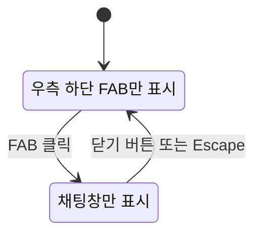

# 빵찾깅 UI 디자인 시스템

[문서 허브](../README.md) · [제품 요구사항](../00-product/prd.md) · [사용자 여정](user-journey.md) · [화면 상태와 카피](ux-states-and-copy.md) · [결정 기록](../09-decisions/decision-log.md)

**상태:** 사용자 웹 핵심 화면 `v0.1` 승인

**승인일:** 2026-07-24

**적용 범위:** 사용자용 지도·가게 탐색·빵빵이 채팅 UI

이 문서는 빵찾깅 사용자 웹의 시각 언어와 공통 상호작용을 정의한다. 제품 요구사항과 공식 문구는 각각 [PRD](../00-product/prd.md)와 [화면 상태와 카피](ux-states-and-copy.md)가 소유하며, 이 문서는 그 내용을 어떤 화면 구조와 컴포넌트로 표현할지를 소유한다.

현재 `apps/web/src/app/page.tsx`는 제목만 표시하는 구현 기반 상태다. 이 문서의 토큰과 컴포넌트 경로는 구현 전 계약이며 아직 소스 코드에 적용되지 않았다. 전체 로그인·위치·기록·삭제·관리자 흐름에 대한 최종 UI/UX 승인은 별도의 Feature 15 검토에서 진행한다.

## 1. 디자인 목표

### 핵심 인상

- 갓 구운 빵을 연상시키는 갈색·연갈색·흰색 중심의 따뜻한 화면
- 소금빵처럼 둥글고 부드러운 실루엣
- 귀엽지만 정보 판독과 지도 탐색을 방해하지 않는 절제된 장식
- 실재 매장·메뉴·리뷰의 출처와 한계를 숨기지 않는 신뢰감

### 제품 원칙의 시각화

1. **지도 우선:** 지도는 사용자 웹의 지속적인 배경이며 채팅 때문에 크기가 재배치되지 않는다.
2. **탐색은 왼쪽:** 가게 검색 결과와 가게 상세는 하나의 왼쪽 드로어에서 전환한다.
3. **대화는 필요할 때만:** 빵빵이 채팅은 우측 하단 FAB에서 열리는 비모달 플로팅 창이다.
4. **근거 우선:** 별점보다 추천 이유, 실제 메뉴, 리뷰 근거, 최신성과 주의점을 먼저 읽을 수 있게 한다.
5. **상태를 숨기지 않음:** loading, partial, empty, error, stale 상태를 색상과 문구로 함께 표현한다.

## 2. 승인된 핵심 화면 구조

### 데스크톱 기본 구조

```text
┌──────────────────────────────────────────────────────────────┐
│ 왼쪽 가게 탐색 드로어 │              지도                    │
│ 검색 결과 ↔ 가게 상세 │                                      │
│                       │                         ┌───────────┐ │
│                       │                         │ 채팅창     │ │
│                       │                         │ 열린 상태 │ │
│                       │                         └───────────┘ │
└──────────────────────────────────────────────────────────────┘
```

- 지도는 전체 화면을 사용한다.
- 왼쪽 드로어는 지도 위에 배치하며 접을 수 있다.
- 검색 결과와 가게 상세를 중첩 드로어로 쌓지 않고 같은 영역에서 전환한다.
- 채팅은 우측 하단에 떠 있는 창이며 지도 레이아웃을 밀거나 줄이지 않는다.
- 가게 마커를 선택하면 왼쪽 드로어가 해당 가게 상세로 전환되고, 열린 채팅창에는 같은 가게가 대화 기준으로 표시된다.

### 빵빵이 FAB 상태 전이



- `Closed`에서는 소금빵 캐릭터 FAB만 표시한다.
- FAB를 누르면 FAB는 사라지고 같은 우측 하단 기준점에 채팅창이 나타난다.
- `Open`에서 FAB와 채팅창을 동시에 유지하지 않는다.
- 채팅창의 닫기 버튼이나 `Escape`로 닫으면 FAB가 다시 나타난다.
- 채팅은 비모달이다. 배경을 어둡게 덮지 않으며 채팅 밖 지도와 왼쪽 드로어를 계속 조작할 수 있다.
- 닫은 뒤 키보드 포커스는 다시 FAB로 돌아간다.

## 3. 색상

### 의미 기반 토큰

| 토큰 | 값 | 용도 |
|---|---:|---|
| `--color-canvas` | `#FFF8EF` | 앱 배경, 채팅 배경 |
| `--color-surface` | `#FFFDF9` | 드로어, 카드, 입력창 |
| `--color-surface-muted` | `#F6E7D6` | 선택 전 칩, 보조 블록 |
| `--color-border` | `#EAD8C6` | 기본 테두리와 구분선 |
| `--color-text-primary` | `#39271F` | 제목과 본문 |
| `--color-text-secondary` | `#73503D` | 보조 설명과 메타데이터 |
| `--color-action-primary` | `#422B21` | 주요 버튼, 선택된 고대비 제어 |
| `--color-brand` | `#B87845` | 브랜드 장식, 마커, 강조선 |
| `--color-brand-soft` | `#E9BA73` | 빵 일러스트, 선택 배경, 배지 |
| `--color-success` | `#4D7555` | 영업 중, 완료 |
| `--color-warning` | `#A85C28` | 오래된 데이터, 확인 필요 |
| `--color-danger` | `#9A3B32` | 오류, 삭제 |
| `--color-info` | `#48748B` | 위치·출처 안내, 포커스 링 |

### 사용 규칙

- 주요 버튼은 `action-primary` 배경과 흰색 텍스트를 사용한다.
- 작은 흰색 텍스트를 `brand` 배경 위에 놓지 않는다. 해당 조합의 대비는 일반 텍스트 AA 기준을 충족하지 않는다.
- `brand`는 장식, 아이콘, 마커와 굵은 강조선에 사용하고 작은 텍스트가 필요한 선택 상태는 `action-primary`를 사용한다.
- 상태는 색상만으로 구분하지 않는다. 아이콘과 `영업 중`, `확인 필요`, `오류` 같은 텍스트를 함께 표시한다.
- 지도 공급자의 지도 색상은 재정의하지 않는다. 지도 위 서비스 제어는 흰색 표면과 테두리, 그림자로 분리한다.

### 검증된 기본 대비

| 전경 / 배경 | 대비 |
|---|---:|
| `text-primary` / `surface` | `13.93:1` |
| `text-secondary` / `surface` | `7.02:1` |
| 흰색 / `action-primary` | `13.13:1` |
| `text-primary` / `brand-soft` | `7.91:1` |
| 흰색 / `success` | `5.26:1` |
| 흰색 / `warning` | `4.97:1` |
| 흰색 / `danger` | `6.90:1` |
| 흰색 / `info` | `5.06:1` |

## 4. 타이포그래피

### 글꼴

```text
Pretendard Variable, Pretendard, system-ui, -apple-system,
"Segoe UI", sans-serif
```

- 구현 시 Pretendard Variable을 프로젝트에 자체 호스팅하고 시스템 글꼴을 대체 경로로 둔다.
- 캐릭터 말풍선도 본문과 같은 글꼴을 사용한다. 별도의 손글씨체는 읽기와 로딩 비용 때문에 P0에 넣지 않는다.
- 숫자형 이동시간과 거리에는 고정폭 숫자 기능인 `font-variant-numeric: tabular-nums`를 적용한다.

### 크기 체계

| 토큰 | 크기 / 행간 | 용도 |
|---|---:|---|
| `display` | `32 / 40px` | 시작 화면 핵심 제목 |
| `heading-1` | `24 / 32px` | 화면 제목 |
| `heading-2` | `20 / 28px` | 드로어·채팅 제목 |
| `heading-3` | `17 / 24px` | 카드·매장명 |
| `body` | `15 / 23px` | 기본 본문과 채팅 |
| `body-small` | `13 / 19px` | 메타데이터와 근거 |
| `label` | `12 / 16px` | 칩과 배지 |
| `caption` | `11 / 16px` | 기준일·보조 설명 |

- 본문은 데스크톱과 모바일 모두 `15px` 아래로 줄이지 않는다.
- 제목은 `-0.02em`까지 자간을 줄일 수 있고 본문은 기본 자간을 유지한다.
- 굵기는 본문 `400`, 강조 `600`, 제목 `700`을 기본으로 한다. `800` 이상은 브랜드 로고와 짧은 배지에만 쓴다.

## 5. 간격, 모서리와 높이

### 간격

4px 배수를 기본으로 사용한다.

| 토큰 | 값 | 대표 용도 |
|---|---:|---|
| `space-1` | `4px` | 아이콘 내부 간격 |
| `space-2` | `8px` | 인라인 요소 |
| `space-3` | `12px` | 칩·작은 카드 |
| `space-4` | `16px` | 기본 컴포넌트 패딩 |
| `space-6` | `24px` | 화면 가장자리와 큰 카드 |
| `space-8` | `32px` | 섹션 구분 |
| `space-10` | `40px` | 시작 화면 큰 여백 |

### 모서리

| 토큰 | 값 | 대상 |
|---|---:|---|
| `radius-sm` | `8px` | 배지, 작은 제어 |
| `radius-md` | `12px` | 입력, 칩 그룹 |
| `radius-lg` | `16px` | 카드, 말풍선 |
| `radius-xl` | `24px` | 드로어 내부 큰 카드, 채팅창 |
| `radius-round` | `999px` | FAB, 필터 칩, 상태 배지 |

- 귀여운 인상은 둥근 모서리에서 만들되 모든 블록을 캡슐형으로 만들지 않는다.
- 삭제 확인과 오류도 같은 모서리 체계를 사용하며 위험한 행동을 장식으로 가볍게 보이게 만들지 않는다.

### 최소 크기

- 포인터·터치 대상: 최소 `44 × 44px`
- 데스크톱 입력 높이: 최소 `44px`
- 모바일 입력과 주요 버튼 높이: 최소 `48px`
- 빵빵이 FAB: 데스크톱 `64px`, 모바일 `56px`

## 6. 그림자와 레이어

| 토큰 | 값 | 용도 |
|---|---|---|
| `shadow-raised` | `0 6px 18px rgba(68, 42, 28, 0.10)` | 지도 제어, 카드 |
| `shadow-drawer` | `10px 0 28px rgba(62, 40, 27, 0.15)` | 왼쪽 드로어 |
| `shadow-popover` | `0 20px 55px rgba(58, 35, 23, 0.24)` | 채팅창 |
| `shadow-focus` | `0 0 0 3px rgba(72, 116, 139, 0.30)` | 포커스 보조 |

레이어 순서는 다음을 기준으로 한다.

1. 지도
2. 지도 마커와 지도 제어
3. 왼쪽 가게 드로어
4. 빵빵이 FAB 또는 채팅창
5. 확인 대화상자와 전역 알림

그림자만으로 경계를 표현하지 않고 반투명 지도 위 컴포넌트에는 `color-border` 테두리를 함께 사용한다.

## 7. 빵빵이 캐릭터

### 기본 설정

- 빵빵이는 소금빵을 모티브로 한 독자적인 2D 캐릭터다.
- 실루엣은 양끝이 살짝 말린 둥근 소금빵이고 표정은 작은 점눈과 짧은 미소를 사용한다.
- 몸색은 `brand-soft`를 중심으로 하고 구운 면은 `brand`, 외곽선은 `action-primary`를 사용한다.
- 기존 캐릭터나 제삼자 IP의 얼굴·의상·고유 동작을 모사하지 않는다.
- SVG 원본 하나를 기본으로 만들고 CSS transform과 opacity만으로 P0 동작을 표현한다. 별도 Lottie 런타임은 추가하지 않는다.

### 상태

| 상태 | 표현 | 반복 |
|---|---|---|
| `idle` | 2~3px 천천히 위아래로 움직임 | 가능 |
| `greeting` | 한쪽 팔을 한 번 흔듦 | 진입 시 1회 |
| `thinking` | 표정 유지, 작은 점 3개 또는 미세한 호흡 | 응답 대기 중 |
| `success` | 2px 위로 한 번 통통 뜀 | 응답 완료 시 1회 |
| `error` | 움직임을 멈추고 차분한 안내 아이콘 표시 | 반복 없음 |

- 캐릭터 애니메이션은 상태 전달의 유일한 수단이 아니다.
- `prefers-reduced-motion: reduce`에서는 반복 이동과 흔들기를 제거한다.
- FAB의 접근 가능한 이름은 `빵빵이에게 물어보기`로 고정한다.

## 8. 레이아웃과 반응형

| 구간 | 왼쪽 탐색 | 지도 | 빵빵이 채팅 |
|---|---|---|---|
| `≥ 1200px` | `clamp(320px, 26vw, 380px)` 드로어 | 전체 배경 | 우측 하단 `380px`, 최대 `calc(100dvh - 48px)` |
| `768~1199px` | `320px` 오버레이 드로어 | 전체 배경 | 우측 하단 `360px`, 최대 `72dvh` |
| `< 768px` | 목록 우선 전체면, 상세는 같은 면에서 전환 | `지도 보기`로 전환 | FAB에서 최대 `85dvh` 하단 시트로 열림 |

### 데스크톱

- 왼쪽 드로어를 접으면 지도 너비가 추가로 확보된다.
- 채팅창은 우측·하단에서 각각 `24px` 떨어진다.
- 채팅창은 왼쪽 드로어 위까지 확장하지 않는다.

### 모바일

- [사용자 여정](user-journey.md)의 목록 우선 원칙을 따른다.
- 지도와 목록을 동시에 좁게 배치하지 않고 한 번에 하나를 주요 탐색면으로 보여준다.
- FAB는 우측·하단에서 각각 `16px` 떨어진다.
- FAB를 누르면 FAB가 사라지고 하단 시트형 채팅이 열린다. 닫으면 FAB가 같은 위치로 돌아온다.
- 모바일 채팅 입력은 가상 키보드가 열려도 전송 버튼과 최근 메시지가 보이도록 `dvh` 기준으로 높이를 계산한다.

## 9. 핵심 컴포넌트

| 컴포넌트 | 책임 | 필수 상태·변형 |
|---|---|---|
| `MapCanvas` | 전체 후보와 선택 매장을 지도에 표시 | loading, success, partial, error |
| `StoreExplorerDrawer` | 검색 결과와 가게 상세를 같은 왼쪽 영역에서 전환 | expanded, collapsed, result-list, store-detail |
| `StoreSearchField` | 지역·가게·메뉴 검색 | idle, typing, loading, no-match, error |
| `FilterChip` | 카테고리와 영업 상태를 좁힘 | default, selected, disabled |
| `BakeryMarker` | 지도 후보와 선택 상태 표시 | default, selected, unavailable |
| `StoreResultCard` | 가게 비교 정보 표시 | default, selected, review-poor, stale |
| `StoreDetailTabs` | 정보·메뉴·리뷰 전환 | information, menu, reviews |
| `ReviewEvidenceCard` | 비식별 실제 리뷰 근거와 기준일 표시 | available, insufficient, stale |
| `BbangBbangFab` | 채팅을 여는 유일한 닫힘 상태 제어 | idle, unread, disabled |
| `BbangBbangChat` | 선택 매장 기반 대화와 추천 근거 표시 | empty, thinking, response, fallback, error |
| `ConversationContext` | 현재 대화 기준 가게·조건 표시 | store-selected, no-store |
| `StatusNotice` | partial, empty, error, stale 안내와 회복 행동 | 각 공통 비동기 상태 |
| `ConfirmDialog` | 삭제·외부 전송 범위 확인 | confirming, submitting, error |

### 왼쪽 드로어

- 검색 결과에서 가게를 고르면 상세 화면으로 교체하고 `검색 결과로 돌아가기`를 제공한다.
- 검색창과 핵심 필터는 결과·상세 양쪽에서 유지한다.
- 리뷰 탭에는 별점, 게시일, 비식별 리뷰 내용과 최신성을 표시할 수 있다.
- 리뷰 작성자 닉네임과 내부 HMAC 지문은 저장하거나 화면에 표시하지 않는다.
- 최근 유효 리뷰가 3개 미만이면 가게를 숨기지 않고 `최근 리뷰 근거가 부족해 메뉴와 방문 조건을 중심으로 표시합니다`를 제공한다.

### 빵빵이 채팅

- 닫힘 상태에는 `BbangBbangFab`, 열림 상태에는 `BbangBbangChat`만 렌더링한다.
- FAB를 누르면 채팅 입력으로 포커스를 옮기고, 닫으면 FAB로 포커스를 복귀한다.
- 채팅창 상단에는 현재 선택한 가게를 대화 기준으로 표시한다. 가게가 없으면 일반 취향 탐색 상태를 표시한다.
- 답변 근거 카드는 사용한 실제 리뷰 수와 기준일을 보여주고 상세 근거를 펼칠 수 있게 한다.
- 내부 추천 점수, 프롬프트, 정확 위치와 리뷰 작성자 식별정보는 표시하지 않는다.
- 새 응답은 전체 대화 로그가 아니라 새 메시지 요약만 `aria-live="polite"`로 알린다.

## 10. 모션

| 동작 | 시간 | 방식 |
|---|---:|---|
| 버튼·칩 hover/press | `120ms` | 색상·그림자 |
| 왼쪽 드로어 열기·닫기 | `220ms` | 수평 이동 |
| FAB 닫힘 → 채팅 열림 | `180ms` | FAB 제거 후 채팅 fade + scale |
| 채팅 닫힘 → FAB 복귀 | `160ms` | 채팅 fade 후 FAB fade |
| 말풍선 추가 | `160ms` | 아래 4px에서 fade |
| 캐릭터 idle | `2400ms` | 완만한 상하 이동 |

- 채팅은 오른쪽에서 밀려오는 슬라이드 애니메이션을 사용하지 않는다.
- 열림·닫힘의 안정 상태에서는 FAB와 채팅창이 동시에 보이지 않는다.
- 기본 easing은 `cubic-bezier(0.2, 0.8, 0.2, 1)`이다.
- reduced motion에서는 위치·크기 변화를 제거하고 `80ms` 이하 opacity 전환만 허용한다.

## 11. 아이콘과 이미지

- 아이콘은 둥근 모서리의 1.75~2px 선형 스타일로 통일한다.
- 아이콘 단독 버튼에는 항상 접근 가능한 이름과 tooltip을 제공한다.
- 별점의 별 아이콘은 장식이 아니며 숫자와 함께 읽을 수 있는 레이블을 둔다.
- 실제 매장 사진이 없으면 빵 패턴과 브랜드 색상의 중립 대체 이미지를 사용한다. 존재하지 않는 매장 사진을 생성해 실제 사진처럼 표시하지 않는다.
- 캐릭터와 장식 이미지는 추천 근거나 오류 내용을 가리지 않는다.

## 12. 문구와 음성

### 기본 어조

- 친근하고 짧게 말하되 사용자가 어린이라고 가정하지 않는다.
- `제가 골라드릴게요`처럼 동행하는 어조를 사용한다.
- 확실하지 않은 사실을 `분명해요`, `무조건`처럼 단정하지 않는다.
- 오류는 사용자 탓으로 표현하지 않고 유지되는 기능과 다음 행동을 먼저 알려준다.
- 캐릭터 말투 때문에 공식 안전·위치·삭제 안내를 축약하지 않는다.

공식 문구와 실패 대체 흐름은 [화면 상태와 카피](ux-states-and-copy.md)를 그대로 따른다.

## 13. 공통 비동기 상태

| 상태 | 시각 처리 | 필수 내용 |
|---|---|---|
| `idle` | 기본 표면 | 현재 조건과 다음 행동 |
| `loading` | 형태를 유지하는 skeleton | 진행 대상, 취소 가능 여부 |
| `success` | 결과와 짧은 상태 알림 | 완료 내용, 다음 행동 |
| `partial` | 사용 가능한 결과 유지 + warning notice | 실패한 부분, 대체 수단 |
| `empty` | 빈 화면 일러스트 + 회복 행동 | 데이터 범위, 제거 이유 |
| `error` | danger notice | 재시도, 목록 등 대체 경로 |
| `stale` | 기준일과 warning badge | 오래된 범위와 신뢰 영향 |
| `confirming` | 포커스가 갇힌 대화상자 | 되돌리기 어려운 범위 |

- 100ms 이상 걸리는 작업은 진행 상태를 표시한다.
- skeleton은 실제 최종 레이아웃과 비슷한 크기를 사용해 화면 흔들림을 줄인다.
- 지도 실패 시 왼쪽 목록·주소·거리를 유지한다.
- LLM 실패 시 지도·순위·가게 정보와 템플릿 설명을 유지한다.

## 14. 접근성

목표는 WCAG 2.2 AA다.

- `main`, `nav`, `aside`, `form`과 제목 구조로 영역을 구분한다.
- 지도에서 제공하는 모든 후보는 키보드로 탐색 가능한 왼쪽 목록에도 존재해야 한다.
- 마커 선택만으로 필요한 정보를 얻도록 만들지 않는다.
- 포커스 링은 `2px color-info`와 `2px surface` offset을 사용하고 제거하지 않는다.
- 필터와 정렬 변경은 화면 낭독기에 결과 수와 선두 후보 변경을 알린다.
- FAB에는 `aria-expanded`, `aria-controls`와 `빵빵이에게 물어보기` 레이블을 제공한다.
- 채팅창은 `role="region"`과 제목 연결을 사용한다. 확인 대화상자가 아니므로 일반 채팅에 `role="dialog"`와 포커스 trap을 적용하지 않는다.
- 새 메시지 알림은 `polite`로 제한하고 스트리밍 중인 전체 문장을 반복 낭독하지 않는다.
- 색상, 애니메이션과 캐릭터 표정은 상태의 보조 수단으로만 사용한다.
- 키보드만으로 검색, 필터, 가게 열기, 채팅 열기·닫기, 메시지 전송, 즐겨찾기와 삭제를 완료할 수 있어야 한다.

## 15. 구현 계약

구현 Feature는 다음 경계를 따른다.

- 디자인 토큰은 `apps/web`의 단일 CSS 토큰 파일에서 정의하고 컴포넌트에 hex 값을 반복하지 않는다.
- 빵빵이 원본 SVG와 상태별 장식은 `apps/web/public` 아래 한 폴더에서 관리한다.
- 지도, 왼쪽 드로어와 채팅은 서로 상태를 직접 변경하지 않고 선택된 `store_id`와 공개된 UI 상태를 통해 연결한다.
- 채팅 열림 여부는 화면 UI 상태이며 대화 메시지나 서버 데이터로 저장하지 않는다.
- 정확 위치, 리뷰 닉네임, 인증 식별자와 프롬프트를 DOM 속성·분석 이벤트·오류 메시지에 넣지 않는다.
- P0는 밝은 테마만 제공한다. 어두운 테마 토큰은 실제 요구가 생기기 전 만들지 않는다.
- Figma MCP 없이 이 문서와 승인된 로컬 목업을 구현 기준으로 사용한다.

구체적인 파일명은 Feature 16 상세 구현 계획에서 확정하되 위 소유권과 토큰 단일화 원칙은 바꾸지 않는다.

## 16. 검증 체크리스트

### 시각

- [ ] 갈색·연갈색·흰색이 기본 화면의 주조색이다.
- [ ] 지도 위 제어와 드로어가 테두리와 표면색으로 구분된다.
- [ ] 기본 본문과 모든 필수 제어가 WCAG AA 대비를 충족한다.
- [ ] 360×800, 768×1024, 1440×900, 1920×1080에서 핵심 내용이 잘리지 않는다.

### 상호작용

- [ ] 검색 결과와 가게 상세가 왼쪽 한 드로어에서 전환된다.
- [ ] 왼쪽 드로어를 접고 다시 열어도 검색·선택 상태가 유지된다.
- [ ] 닫힘 상태에는 FAB만 보이고 열린 상태에는 채팅창만 보인다.
- [ ] 채팅을 열고 닫아도 지도 크기와 중심이 불필요하게 바뀌지 않는다.
- [ ] 선택한 가게가 왼쪽 상세, 지도 마커와 채팅 컨텍스트에서 일치한다.

### 접근성과 대체 상태

- [ ] 키보드만으로 핵심 탐색과 채팅 과업을 완료한다.
- [ ] 채팅 닫기 후 포커스가 FAB로 돌아온다.
- [ ] reduced motion에서 반복 캐릭터 모션이 제거된다.
- [ ] 지도·LLM·경로 실패 시 유지 가능한 정보와 다음 행동이 보인다.
- [ ] 리뷰 부족 가게가 숨겨지지 않고 대체 근거와 기준일이 표시된다.

## 17. 변경 절차

이 문서는 `v0.1` 기준이다. 구현 중 수정이 필요하면 다음 순서로 갱신한다.

1. 바꾸려는 토큰, 컴포넌트 또는 상태 전이를 식별한다.
2. 지도 가시성, 접근성, 모바일, 공식 카피에 미치는 영향을 확인한다.
3. 로컬 목업에서 변경안을 확인하고 사용자 승인을 받는다.
4. 이 문서와 관련 테스트 수용 기준을 같은 변경에서 갱신한다.
5. 제품 범위나 개인정보 경계가 바뀌면 해당 기준 문서와 결정 기록도 함께 갱신한다.

## 관련 문서

- 사용자 흐름: [사용자 여정](user-journey.md)
- 공식 상태와 카피: [화면 상태와 카피](ux-states-and-copy.md)
- 기능 범위와 접근성 목표: [PRD](../00-product/prd.md)
- 사용자 웹 구현 순서: [P0 마스터 구현 계획](../superpowers/plans/2026-07-23-p0-master-implementation.md)
