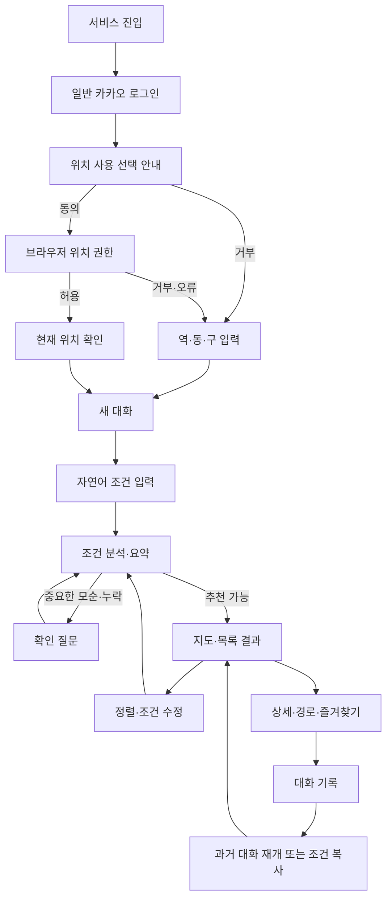

# 사용자 여정

[문서 허브](../README.md) · [PRD](../00-product/prd.md) · [화면 상태와 카피](ux-states-and-copy.md) · [시스템 구조](../04-architecture/system-architecture.md)

이 문서는 사용자가 빵찾깅을 처음 열고 로그인한 시점부터 추천·경로·과거 대화·삭제까지 경험하는 순서를 정의한다. 화면별 세부 문구와 오류 상태는 [화면 상태와 카피](ux-states-and-copy.md)가 기준이다.

## 1. 여정 원칙

- 카카오 로그인은 필수지만 현재 위치 사용은 선택이다.
- 일반 카카오 로그인과 브라우저 GPS 권한은 별개 단계다.
- 자연어 입력이 기본이고 칩·폼은 확인과 대체 수단이다.
- 시스템이 먼저 묻는 질문은 한 추천 시도당 최대 2개다.
- 결과를 받은 뒤에도 같은 대화에서 조건을 계속 바꿀 수 있다.
- 새 대화는 다른 대화의 취향을 자동으로 가져오지 않는다.
- 정확한 현재 위치는 계정이나 대화 기록에 저장하지 않는다.

## 2. 전체 흐름

## 3. 첫 방문과 로그인

### 사용자 목표

서비스가 무엇을 하고 어떤 데이터를 사용하는지 이해한 뒤 자신의 계정으로 안전하게 시작한다.

### 흐름

1. 시작 화면에서 서비스의 한 문장 가치와 안전 고지를 확인한다.
2. `카카오로 시작하기`를 선택한다.
3. Kakao OAuth 동의 화면에서 서비스가 요청하는 최소 제공 정보를 확인한다.
4. 서비스는 계정 식별에 필요한 최소 정보만 요청한다. 이메일·전화번호·생일·성별은 요구하지 않는다.
5. 로그인 성공 후 위치 안내 화면으로 이동한다.

### 대체 흐름

- 로그인을 취소하면 시작 화면으로 돌아가며 서비스 데이터는 만들지 않는다.
- 로그인 실패 시 실패 이유를 추측하지 않고 재시도와 고객 문의에 사용할 요청 ID만 보여준다.
- 정지·탈퇴 계정은 새 세션을 만들지 않고 계정 상태 안내를 보여준다.

## 4. 위치 선택 동의

### 동의 순서

1. 서비스 자체 안내 카드에서 위치 사용 목적, Kakao 전송, 비저장, 거부 대체를 설명한다.
2. 사용자가 `현재 위치 사용`을 선택한 뒤에만 브라우저 권한을 요청한다.
3. 허용하면 지도·추천 화면이 전경에 있는 동안 위치를 갱신한다.
4. 100m 이상 이동하거나 사용자가 `현재 위치로 새로 계산`을 누를 때 경로를 다시 계산한다.

카카오 로그인 동의는 브라우저 GPS 권한을 허용하지 않는다. 위치 사용을 서비스 가입 필수 동의로 표현하지 않는다.

### 거부·오류 흐름

- `직접 출발지 입력`에서 역·동·구 중 하나를 검색·선택한다.
- 브라우저 권한 거부, 5초 시간 초과, 위치 서비스 꺼짐, 낮은 정확도는 같은 대체 진입점을 제공한다.
- 권한을 나중에 허용하면 현재 대화의 출발지만 갱신한다. 취향 조건은 바꾸지 않는다.
- 권한을 철회하면 위치 갱신을 즉시 중단하고 마지막 정확 좌표를 폐기한다.

## 5. 새 대화와 자연어 입력

### 시작 상태

새 대화는 다음 값이 비어 있다.

- 원하는 빵·맛·식감
- 약한 회피 조건
- 강한 제외 조건
- 오늘의 방문 조건
- 제외한 추천 결과와 정렬 방식

다른 대화의 취향이나 제외 조건은 자동으로 나타나지 않는다. 계정 전체 장기 취향도 만들지 않는다.

### 입력 예시

- `겉은 바삭하고 안은 촉촉한 사워도우를 찾고 있어. 지금 위치에서 30분 안이면 좋겠어.`
- `초콜릿은 완전히 빼고 상큼한 과일 데니시가 먹고 싶어.`
- `성수역 근처에서 선물할 만한 버터 향 강한 빵 찾아줘.`

입력 후 즉시 사용자 메시지를 표시하고 100ms 이내에 분석 진행 상태를 보여준다.

## 6. 의도 분석과 확인 질문

시스템은 입력을 다음 네 범주로 나눠 보여준다.

| 범주 | 표시 예 | 의미 |
|---|---|---|
| 원하는 것 | `사워도우`, `바삭함 높음` | 관련도 계산에 양의 신호 |
| 덜 선호 | `너무 달지 않게` | 완전 제외하지 않고 순위를 낮추는 신호 |
| 반드시 제외 | `초콜릿 제외` | 후보 계산 전에 제거하는 신호 |
| 방문 조건 | `현재 위치`, `30분 안`, `선물` | 거리·경로·방문 적합 조건 |

결과를 바꿀 만큼 중요한 모순이나 누락이 있을 때만 확인 질문을 한다. 시스템이 먼저 묻는 질문은 한 추천 시도당 최대 2개다. 두 번으로도 해소되지 않으면 안전하게 해석한 조건 요약을 보여주고 사용자가 칩이나 자연어로 고치게 한다.

사용자가 의료·알레르기 상태를 말하면 추천 조건으로 구조화하지 않는다. 안전성을 판정할 수 없다는 안내와 매장 직접 확인을 제공한 뒤, 맛 취향과 방문 조건만 다시 묻는다.

## 7. 추천 결과

### 기본 구성

- 지도에는 조건을 통과한 전체 베이커리 매장을 표시한다.
- 목록은 기본적으로 현재 출발지에서 이동시간이 짧은 순서다.
- 카드에는 매장명, 대표 매칭 메뉴, 추천 이유 최대 2개, 주의점 1개, 이동시간과 거리를 표시한다.
- 숫자형 추천 점수는 표시하지 않는다.
- 데이터가 부족하거나 오래되면 숨기지 않고 `메뉴 근거 부족`, `영업시간 확인 필요`처럼 표시한다.
- 최근 유효 리뷰가 3개 미만이어도 적격 매장을 숨기지 않고 검수된 메뉴·방문 조건 중심으로 정렬한다.

### 정렬

- `이동시간순`: 짧은 총 이동시간, 내부 관련도, 근거 신뢰, 자체 ID 순으로 정렬한다.
- `관련도순`: 현재 대화의 맛·식감·메뉴 일치, 근거 신뢰, 이동시간, 자체 ID 순으로 정렬한다.

정렬을 바꾸면 기존 카드의 라벨만 바꾸는 것이 아니라 선두 결과가 새 기준으로 다시 구성된다. 지도 마커는 두 정렬 모두 전체 적격 후보를 유지한다.

## 8. 추천 이후 멀티턴

결과 화면의 입력창은 계속 활성화되어 있다. 다음 발화는 같은 대화 상태를 수정한다.

| 발화 | 상태 변화 |
|---|---|
| `더 가까운 곳 보여줘` | 이동시간 상한을 좁히거나 이동시간 우선 재정렬 |
| `관련도순으로 바꿔줘` | 정렬을 `RELEVANCE`로 변경 |
| `2번은 빼줘` | 해당 `store_id`를 현재 대화에서 강하게 제외 |
| `초콜릿은 이제 괜찮아` | 기존 초콜릿 강한 제외를 명시적으로 제거 |
| `빵 종류를 베이글로 바꿀래` | 원하는 카테고리를 교체하고 새 추천 실행 |
| `왜 1번을 골랐어?` | 저장된 근거만 사용해 설명, 순위 변화 없음 |

사용자의 후속 발화 수에는 제한이 없다. 새로운 추천 시도가 시작되면 그 시도의 시스템 확인 질문 횟수만 0으로 초기화한다.

## 9. 상세와 경로

상세 화면은 매장 기본 정보, 매칭 메뉴·특징 근거, 마지막 검수일, 데이터 한계, 즐겨찾기와 경로 요청을 제공한다.

경로 화면은 Kakao 경로 API가 반환한 유효 대안을 총 이동시간이 짧은 순으로 모두 보여준다. 각 대안은 총 시간, 도보·대중교통 구간, 환승과 주요 단계만 표시한다. 후순위 교통수단 조합 필터가 없더라도 현재 MVP의 유효 경로를 임의로 한 개만 숨기지 않는다.

경로 API가 실패하면 직선거리와 주소는 유지하되 이동시간을 추정해 만들지 않는다. `카카오맵에서 열기`, 주소·좌표 복사와 재시도를 제공한다.

## 10. 과거 대화

### 대화 목록

계정별로 제목, 마지막 메시지 시각과 최근 추천 매장 요약을 보여준다. 정확 위치나 민감한 자연어를 목록 미리보기에 노출하지 않는다.

### 대화 다시 열기

- 당시 메시지, 분석된 조건, 추천 결과와 생성 시각을 보여준다.
- 대화를 그대로 이어가면 기존 조건에서 새 발화를 처리한다.
- 당시 이동시간을 현재 시간처럼 보이지 않게 한다.
- `현재 위치로 새로 계산`을 선택하면 현재 위치 권한을 확인한 뒤 경로만 갱신한다.

### 이 조건으로 새 대화 시작

사용자가 명시적으로 선택할 때만 구조화된 조건을 복사한다. 메시지 원문, 추천 결과, 결과 제외 목록과 위치 좌표는 복사하지 않는다. 새 대화는 원본과 독립적으로 수정·삭제할 수 있다.

## 11. 삭제와 탈퇴

### 대화 삭제

삭제 확인에는 대화 메시지, 분석 조건, 추천 결과와 연결 피드백이 함께 삭제됨을 표시한다. 즐겨찾기는 대화와 독립된 계정 데이터이므로 별도 선택 없이 삭제하지 않는다.

### 회원탈퇴

탈퇴 확인에는 다음 범위를 표시한다.

- 모든 대화·추천·피드백
- 즐겨찾기
- 로그인 세션과 서비스 계정 연결
- 카카오 연결 해제 요청

서비스 데이터는 즉시 삭제한다. Kakao 연결 해제가 일시 실패해도 서비스 데이터 삭제를 늦추지 않는다.

## 12. 접근성과 반응형 기준

- 지도 정보는 동일한 목록으로 제공한다.
- 키보드만으로 로그인 후 대화 입력, 조건 수정, 정렬, 결과 열기, 즐겨찾기와 삭제를 수행할 수 있어야 한다.
- 상태 변화는 색상뿐 아니라 텍스트와 아이콘으로 알린다.
- 새 결과가 나타날 때 포커스를 강제로 지도에 옮기지 않고 결과 요약 영역에 접근 가능한 알림을 제공한다.
- 모바일에서는 목록을 기본 탐색면으로 두고 지도를 접거나 펼칠 수 있게 한다.

## 관련 문서

- 제품 범위와 요구사항: [PRD](../00-product/prd.md)
- 화면 상태와 공식 문구: [화면 상태와 카피](ux-states-and-copy.md)
- 대화 처리: [LLM 계약](../03-contracts/llm-contracts.md), [시스템 구조](../04-architecture/system-architecture.md)
- 계정·위치 보호: [보안 설계](../06-trust/security-design.md)
