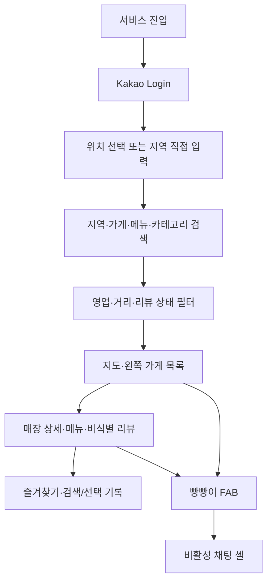

# 사용자 여정

[문서 허브](../README.md) · [PRD](../00-product/prd.md) · [화면 상태와 카피](ux-states-and-copy.md) · [UI 디자인 시스템](design-system.md) · [시스템 구조](../04-architecture/system-architecture.md)

이 문서는 현재 로컬 MVP에서 사용자가 서비스를 열고 구조화 검색·지도·매장 상세·계정별 기록과 비활성 채팅 셸을 사용하는 순서를 정의한다. 화면별 문구와 오류 상태는 [화면 상태와 카피](ux-states-and-copy.md)가 책임진다.

## 1. 여정 원칙

- 현재 서비스는 사용자 PC의 `127.0.0.1`에서 실행한다.
- Kakao Login은 계정 기능에 필요하지만 위치 사용은 별도 선택이다.
- 현재 입력은 지역·가게명·메뉴·카테고리와 영업·거리·리뷰 상태의 구조화 검색이다.
- 지도와 목록은 같은 적격 후보 집합을 사용한다.
- 리뷰가 부족한 매장도 메뉴·영업·거리 근거로 탐색할 수 있다.
- 검색/선택 기록과 즐겨찾기는 계정별로 격리한다.
- 정확한 현재 위치는 요청 메모리에서만 사용하고 계정·검색 기록·로그에 저장하지 않는다.
- 빵빵이 채팅은 비활성 UI 셸이며 메시지 제출과 OpenAI 호출을 만들지 않는다.

## 2. 전체 흐름

## 3. 첫 방문과 로그인

### 사용자 목표

서비스 범위와 데이터 사용을 이해한 뒤 자신의 계정으로 시작한다.

### 흐름

1. 시작 화면에서 서비스 한 문장 가치와 의료 안전 고지를 확인한다.
2. `카카오로 시작하기`를 선택한다.
3. Kakao OAuth 화면에서 최소 동의 범위를 확인한다.
4. 서비스는 계정 식별에 필요하지 않은 이메일·전화번호·생일·성별을 요구하지 않는다.
5. 로그인 후 위치 선택 또는 지역 직접 입력으로 이동한다.

### 대체 흐름

- 로그인 취소 시 시작 화면으로 돌아가며 서비스 계정 데이터를 만들지 않는다.
- 로그인 실패 시 원인을 추측하지 않고 재시도와 비민감 요청 ID를 제공한다.
- 정지·탈퇴 계정은 새 세션을 만들지 않고 상태 안내를 표시한다.

## 4. 위치 선택과 지역 직접 입력

### 선택 동의

1. 위치 사용 목적, Kakao Map 전송 가능성, 비저장과 거부 대체를 먼저 설명한다.
2. 사용자가 `현재 위치 사용`을 선택한 뒤에만 브라우저 권한을 요청한다.
3. 허용된 정확 좌표는 현재 검색의 거리 계산과 지도 중심에만 사용한다.
4. 검색 응답이 끝나거나 사용자가 위치 사용을 중지하면 정확 좌표를 폐기한다.

Kakao Login 동의가 브라우저 위치 권한을 포함한다고 표현하지 않는다.

### 거부·오류

- 구·동·역 등 지역을 검색해 직접 선택한다.
- 권한 거부, 시간 초과, 위치 서비스 꺼짐과 낮은 정확도는 같은 직접 입력 진입점을 제공한다.
- 권한을 나중에 허용해도 검색 조건 중 출발지만 바꾸며 메뉴·카테고리·필터는 유지한다.
- 권한을 철회하면 위치 갱신을 즉시 멈추고 마지막 정확 좌표를 폐기한다.

## 5. 구조화 검색

### 검색 필드

사용자는 필요한 필드만 조합한다.

| 필드 | 예 | 의미 |
|---|---|---|
| 지역 | `성수동`, `망원역` | 후보 지역 또는 거리 계산 기준 |
| 가게명 | `○○베이커리` | 알려진 매장 직접 탐색 |
| 메뉴 | `사워도우`, `크루아상` | 명시 메뉴 우선 일치 |
| 카테고리 | `발효빵`, `페이스트리` | 검수된 카테고리 일치 |
| 영업 | `현재 영업 중` | 검수된 영업시간 필터 |
| 거리 | `2km 이내` | 요청 메모리의 출발지 기준 |
| 리뷰 상태 | `근거 있음`, `부족 포함` | 리뷰 근거 수준 표시·필터 |

검색어 원문 전체를 분석 이벤트에 보내지 않는다. 검색 조건은 정규화된 허용 값과 계정별 검색 기록에 필요한 최소 표시값만 저장한다.

### 검색 시작과 수정

- 검색을 제출하면 100ms 이내 진행 상태를 표시한다.
- 필터나 정렬을 바꾸면 결과 수와 선두 후보 변경을 접근 가능한 상태 메시지로 알린다.
- 강한 제외는 관련도보다 먼저 적용하고 자동으로 완화하지 않는다.
- 의료·알레르기 표현은 검색 조건으로 사용하지 않고 매장 직접 확인 안내를 제공한다.

## 6. 지도와 왼쪽 가게 목록

### 기본 구성

- 지도에는 조건을 통과한 전체 후보를 표시한다.
- 왼쪽 목록은 같은 후보를 결정론적 순서로 보여준다.
- 카드에는 매장명, 대표 메뉴, 핵심 근거, 리뷰 상태, 영업·거리와 기준일을 표시한다.
- 숫자형 추천 총점은 표시하지 않는다.
- 지도 마커 선택은 목록 선택과 동기화하고 같은 매장 상세를 연다.

### 정렬과 대체

현재 정렬은 명시 메뉴·카테고리, FTS5 리뷰 관련도, 유효 리뷰 수·최신성, 영업·거리 조건, 데이터 완성도와 안정 동점 규칙을 따른다.

- FTS5 검색이 실패하면 메뉴·카테고리·지역 조건으로 결과를 유지한다.
- 지도가 실패하면 목록·주소·거리와 상세 진입을 유지한다.
- 리뷰가 3개 미만이어도 매장을 숨기지 않고 리뷰 부족 상태와 대체 근거를 표시한다.
- 결과가 0개면 단계별 제거 이유와 사용자가 선택할 수 있는 범위·필터 완화를 제시한다.

프랜차이즈·폐업·서울 범위·관리자 차단·사용자 강한 제외는 완화하지 않는다.

## 7. 매장 상세

상세 화면은 다음을 제공한다.

- 매장명, 정규화 주소, 검수된 영업 상태와 기준일
- 실제 메뉴·카테고리와 출처
- 비식별 리뷰 본문, 게시일과 FTS 검색 근거
- 리뷰 충분·부족·오래됨 상태
- 즐겨찾기 추가·제거
- 지도에서 위치 확인과 목록으로 돌아가기

리뷰 작성자 닉네임, 내부 fingerprint, 암호화 원문과 raw 저장소 경로는 표시하지 않는다. 리뷰 근거로 재료·알레르기·교차접촉 안전을 판정하지 않는다.

## 8. 즐겨찾기와 검색/선택 기록

### 즐겨찾기

- 즐겨찾기는 계정별 `store_id` 기록이다.
- 다른 계정의 즐겨찾기는 ID 직접 조회로도 열 수 없다.
- 매장이 비적격 또는 폐업 상태가 되면 새 추천에는 나오지 않지만 기록에는 상태를 표시할 수 있다.

### 검색 기록

- 검색 시각, 정규화된 표시 조건, snapshot·추천 버전과 결과 수를 저장할 수 있다.
- 자연어 대화나 메시지 기록으로 표현하지 않는다.
- 정확 좌표, 리뷰 본문과 민감한 검색 원문을 저장하지 않는다.

### 선택 기록

- 지도·목록·상세에서 선택한 `store_id`와 비민감 화면 context만 저장한다.
- 사용자는 자신의 기록을 확인하고 삭제할 수 있다.
- 삭제 후 관련 조회는 비어 있거나 404를 반환한다.

## 9. 빵빵이 FAB와 비활성 채팅 셸

- FAB를 누르면 지도 레이아웃을 밀지 않는 비모달 채팅 셸을 연다.
- 선택한 매장이 있으면 셸 상단에 공개 가능한 매장 context를 표시한다.
- `챗봇 기능은 다음 단계에서 제공할 예정이에요` 안내를 표시한다.
- 입력창과 제안 행동은 비활성화한다.
- submit handler, OpenAI client, 챗봇 API route와 메시지 저장을 연결하지 않는다.
- 닫을 때 포커스를 FAB로 되돌린다.

## 10. 삭제와 탈퇴

### 기록 삭제

삭제 확인에는 즐겨찾기 또는 검색/선택 기록 중 실제 삭제 범위를 명시한다. 한 기록 삭제가 다른 종류의 계정 데이터를 조용히 지우지 않는다.

### 회원탈퇴

탈퇴 확인에는 다음을 표시한다.

- 즐겨찾기와 검색/선택 기록
- 로그인 세션과 서비스 계정 연결
- Kakao 연결 해제 요청

서비스 데이터는 즉시 삭제한다. Kakao 연결 해제가 실패해도 로컬 삭제를 늦추지 않고 비민감 재시도로 분리한다.

## 11. 접근성과 반응형

- 지도 후보는 모두 키보드로 탐색 가능한 목록에도 존재한다.
- 키보드만으로 로그인, 검색, 필터, 매장 상세, 즐겨찾기, 기록 삭제와 채팅 셸 열기·닫기를 수행할 수 있다.
- 상태 변화는 색상뿐 아니라 텍스트와 아이콘으로 알린다.
- 새 결과가 나타날 때 포커스를 강제로 지도에 옮기지 않고 결과 요약을 `polite`로 알린다.
- 모바일에서는 목록을 기본 탐색면으로 두고 지도를 접거나 펼칠 수 있게 한다.

## 12. 후속 챗봇 Feature

다음 여정은 현재 UI와 runtime에 연결하지 않는다.

- 자유 형식 자연어 입력과 네 의도 범주
- 추천 시도당 최대 2개의 확인 질문
- 결과 이후 조건 수정·철회·매장 제외·정렬 변경 멀티턴
- 과거 대화 열람·재개·삭제
- 사용자가 명시적으로 선택하는 조건 복사
- 생성형 설명과 실제 빵빵이 답변

후속 Feature가 시작되면 [LLM 계약](../03-contracts/llm-contracts.md), 개인정보 보존, 비용과 실패 대체를 다시 승인한다.

## 관련 문서

- 제품 범위와 요구사항: [PRD](../00-product/prd.md)
- 화면 상태와 공식 문구: [화면 상태와 카피](ux-states-and-copy.md)
- 시각 토큰과 핵심 상호작용: [UI 디자인 시스템](design-system.md)
- 검색·추천 계산: [추천 기준](../02-recommendation/recommendation-spec.md)
- 계정·위치 보호: [보안 설계](../06-trust/security-design.md)
