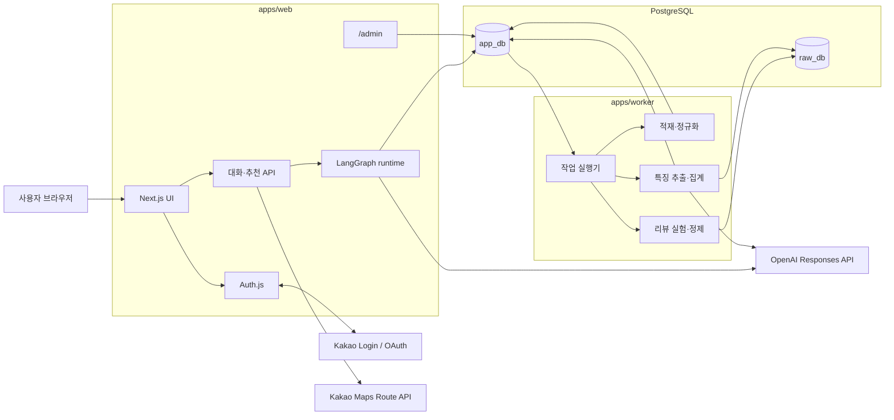
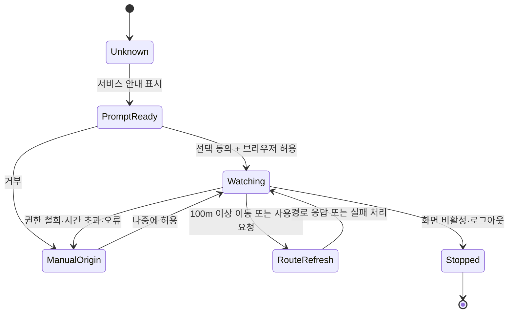
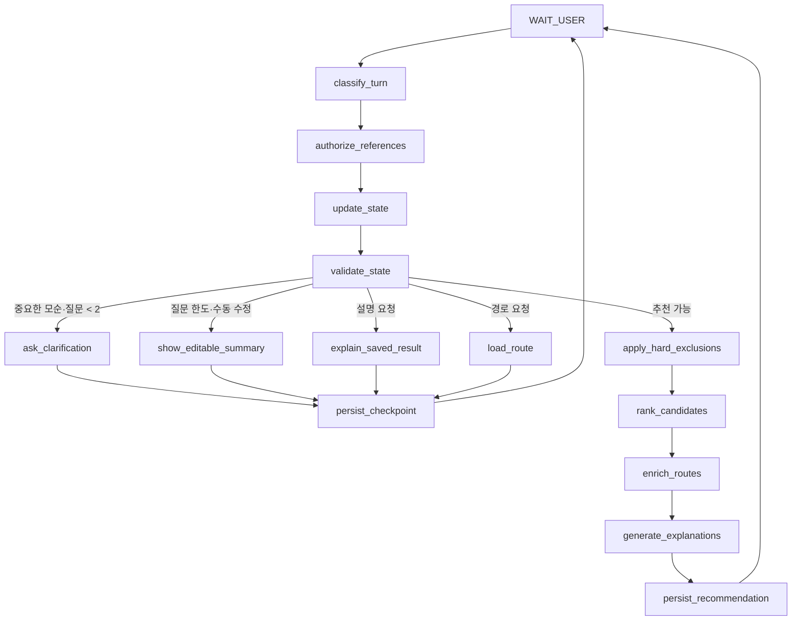
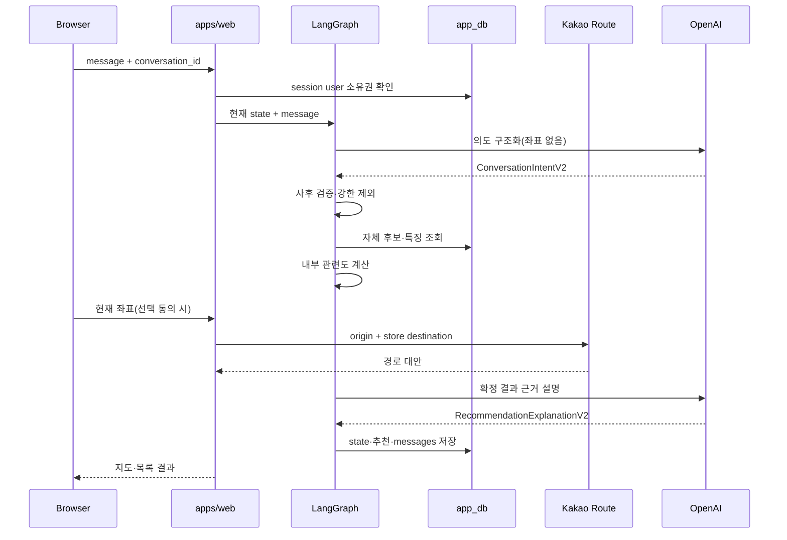

# 시스템 구조

[문서 허브](../README.md) · [PRD](../00-product/prd.md) · [LLM 계약](../03-contracts/llm-contracts.md) · [데이터 설계](../05-data/data-design.md) · [보안 설계](../06-trust/security-design.md)

이 문서는 카카오 계정 기반 비공개 MVP의 런타임 구성, 전체 세션 멀티턴 상태와 외부 API 경계를 정의한다. 아직 애플리케이션 코드는 없으며 이 문서는 구현 기준이다.

## 1. 기술 기준

- TypeScript 단일 언어와 `pnpm workspace` 모노레포
- Next.js 기반 `apps/web`: 사용자 화면, 서버 API와 `/admin`
- LangGraph: 대화별 상태 전이와 checkpoint
- Auth.js: Kakao provider, 데이터베이스 세션과 안전한 쿠키
- PostgreSQL + Prisma
- `apps/worker`: 적재·정규화·리뷰 실험·LLM 특징 추출·집계
- `app_db`: 서비스 구조화 데이터
- `raw_db`: 비식별 리뷰 원문 암호문
- PostgreSQL 작업 테이블 + `FOR UPDATE SKIP LOCKED`
- MVP에서 Redis·BullMQ 제외
- Kakao Login, Kakao Maps REST API, OpenAI Responses API

## 2. 컨테이너 경계



`apps/web`은 `raw_db` 접속 문자열이나 암호화 키를 갖지 않는다. worker만 리뷰 원문을 복호화할 수 있다. 사용자의 정확 위치는 `app_db`, `raw_db`, LangGraph checkpoint와 OpenAI로 들어가지 않는다.

## 3. 인증과 계정 경계

### 로그인

1. 사용자가 `카카오로 시작하기`를 선택한다.
2. Auth.js Kakao provider가 Authorization Code 흐름을 시작한다.
3. Kakao OAuth 동의 화면에서 최소 제공 정보만 요청한다.
4. callback에서 provider account ID를 자체 `user_id`에 연결한다.
5. 데이터베이스 세션을 만들고 `HttpOnly`, `Secure`, 적절한 `SameSite` 쿠키를 발급한다.

OAuth state, PKCE/nonce 등 provider·framework가 제공하는 검증을 생략하거나 직접 축약하지 않는다.

### 최소 정보

- 필수: 자체 `user_id`, provider=`kakao`, Kakao provider account ID
- 선택: 사용자가 동의한 프로필 닉네임
- 미수집: 이메일, 전화번호, 생일, 성별

닉네임은 인사 표시일 뿐 소유권이나 계정 병합 키가 아니다.

### 요청 권한

모든 사용자 데이터 쿼리는 `session.user.id`를 조건에 포함한다. 클라이언트가 보낸 `user_id`를 신뢰하지 않는다.

```text
loadConversation(sessionUserId, conversationId)
  -> WHERE conversation.user_id = sessionUserId
  -> 없음: 404
```

다른 사용자의 존재를 드러내지 않기 위해 소유권 실패는 기본적으로 404로 응답한다. `/admin`은 별도의 관리자 권한과 재인증을 요구한다.

## 4. 카카오 동의와 위치 권한

세 단계는 서로 대체하지 않는다.

1. **Kakao Login:** OAuth 로그인과 최소 Kakao 제공 정보
2. **서비스 위치 선택 동의:** 목적, Kakao 전송, 비저장, 직접 입력 대체
3. **브라우저·OS 위치 권한:** 실제 GPS 접근

위치 선택 동의를 거부해도 로그인과 추천을 계속할 수 있다. 브라우저 권한은 사용자가 서비스 안내에서 현재 위치 사용을 선택한 뒤에만 요청한다.

## 5. 위치 런타임

브라우저는 지도·추천 화면이 전경에 있을 때 `watchPosition`에 해당하는 흐름으로 위치를 갱신한다.



- 좌표는 브라우저 메모리와 현재 경로 HTTP 요청에만 존재한다.
- 100m 미만의 흔들림은 경로 재계산을 만들지 않는다.
- 동시 위치 이벤트는 debounce하고 동일 목적지 요청을 합친다.
- 화면이 숨겨지거나 사용자가 중지하면 watcher를 해제하고 메모리 좌표를 버린다.
- 서비스 worker, 분석 SDK와 오류 추적 SDK에는 좌표를 전달하지 않는다.

정확한 출발 좌표는 경로 계산 중 Kakao에 전송될 수 있다. 목적지 매장 좌표는 공개 매장 데이터로 DB에 저장된다.

## 6. 전체 세션 LangGraph

### 그래프



이 그래프는 첫 추천 뒤 종료하지 않는다. 같은 `conversation_id`의 사용자가 다시 말하면 마지막 checkpoint에서 `WAIT_USER` 이후를 계속 실행한다.

### 사용자 발화 처리

- 조건 추가·교체·철회
- 특정 결과 제외
- 정렬 변경
- 새 추천 요청
- 결과 이유 질문
- 특정 매장 경로 요청
- 현재 대화 초기화

시스템 확인 질문은 한 추천 시도에서 최대 2개다. 사용자의 후속 발화에는 제한이 없다. 추천이 완료된 뒤 사용자가 새 조건을 추가하면 새 추천 시도로 보고 `clarificationCount`만 초기화한다.

## 7. 대화 상태와 checkpoint

checkpoint는 `thread_id = conversation_id`로 분리하고 소유권은 `conversation.user_id`로 확인한다.

```text
GraphState
├─ conversationId
├─ stateVersion
├─ messages              현재 대화의 메시지 참조
├─ wanted
├─ avoided
├─ hardExcluded
├─ visitContext          정확 좌표 없음
├─ resultControls
├─ clarificationCount
├─ lastRecommendationRunId
├─ pendingAction
└─ schemaVersions
```

새 대화는 빈 checkpoint를 만든다. 계정의 다른 checkpoint를 검색해 취향을 합치지 않으며 계정 전체 장기 취향을 만들지 않는다.

`이 조건으로 새 대화 시작`은 애플리케이션 서비스가 원본의 구조화 조건을 검증해 새 `conversation_id`에 복사하는 명시적 작업이다. 메시지, 추천 결과, 제외한 결과 목록, 위치 좌표와 checkpoint ID는 복사하지 않는다.

## 8. 메시지와 추천 저장

사용자 메시지는 계정별 대화 기록을 다시 보여주기 위해 `conversation_message`에 저장한다. 분석·오류 로그에는 원문을 복제하지 않는다.

상태 수정은 다음 트랜잭션 경계를 사용한다.

1. 대화 소유권 확인
2. 사용자 메시지 저장
3. 현재 state version 잠금
4. 구조화·검증 결과로 새 state version 저장
5. 추천이 있으면 `recommendation_run`과 항목 저장
6. 도우미 메시지 저장
7. commit 후 클라이언트에 이벤트 전송

동일 idempotency key를 다시 받으면 같은 메시지·추천을 중복 생성하지 않는다.

정확 위치, Kakao 경로 원본 응답과 OpenAI 전체 응답은 이 트랜잭션에 포함하지 않는다. 추천 항목에는 당시 표시한 경로 상태와 비민감 요약을 저장할 수 있지만 과거 화면에서 현재 값처럼 표시하지 않는다.

## 9. 추천 요청 흐름



브라우저의 위치 전달과 대화 메시지 처리는 논리적으로 같은 사용자 작업일 수 있지만 좌표가 LangGraph checkpoint 또는 OpenAI 요청에 섞이지 않도록 타입과 호출 경계를 분리한다.

## 10. 정렬과 외부 실패

- 후보와 내부 관련도는 Kakao 실패와 무관하게 계산한다.
- 이동시간순은 경로가 유효한 후보 안에서만 완전한 시간순을 주장한다.
- 일부 경로 실패는 후보를 숨기지 않고 `계산할 수 없음`으로 표시한다.
- 전체 경로 보강이 불가능하면 관련도순 또는 직선거리순 대체 상태로 명시적으로 전환한다.
- LLM 설명 실패는 템플릿으로 전환하며 결과 순서를 바꾸지 않는다.
- OpenAI 비용 상한에서도 구조화 폼과 결정론적 추천은 동작한다.

## 11. 과거 대화 읽기

과거 대화를 열 때는 저장된 메시지·상태·추천 스냅숏을 먼저 반환한다. 저장된 이동시간에는 생성 시각을 표시한다.

사용자가 현재 위치 재계산을 요청하면:

1. 위치 선택 동의와 브라우저 권한 확인
2. 현재 좌표를 메모리에 받음
3. 저장된 추천의 목적지 좌표로 Kakao 경로 재호출
4. 화면만 갱신하고 정확 좌표는 폐기

경로 재계산은 대화의 맛·제외 조건이나 당시 추천 순서를 자동으로 바꾸지 않는다. 사용자가 `현재 조건으로 다시 추천`을 요청해야 새 추천 실행을 만든다.

## 12. 삭제와 탈퇴

### 대화 삭제

한 DB 트랜잭션에서 소유권을 확인한 뒤 메시지, checkpoint·상태, 추천 항목·실행과 연결 피드백을 cascade 삭제한다. 즐겨찾기는 별도 계정 자원이므로 유지한다.

### 회원탈퇴

1. 사용자 재인증 또는 최근 인증 확인
2. 새 요청 차단과 활성 세션 폐기
3. 계정의 대화·추천·즐겨찾기·피드백 삭제
4. auth account·session과 사용자 삭제
5. Kakao unlink 요청

Kakao unlink가 실패하면 서비스 데이터 삭제는 rollback하지 않는다. 최소 provider 작업 ID와 비민감 오류 코드만 별도 재시도 큐에 남긴다.

## 13. 관리자 경계

- `/admin`은 일반 카카오 로그인만으로 접근할 수 없다.
- 관리자 role과 재인증, CSRF 보호를 요구한다.
- 리뷰 원문은 웹 프로세스에서 직접 읽지 않는다.
- worker가 승인된 검수 요청에 대해 루프백의 일회성 `no-store` 스트림으로 최소 범위만 제공한다.
- Kakao 로그인 세션·쿠키는 리뷰 수집 실험에 재사용하지 않는다.

## 14. 관측성과 로그

허용 로그:

- 자체 `request_id`, 내부 사용자·대화 ID의 비가역 운영 식별자
- 노드 이름, 상태 버전, 비민감 오류 코드
- 후보·제외 개수, 소요 시간, 공급자 호출 상태
- 모델·스키마·추천 버전과 토큰·비용

금지 로그:

- 메시지·프롬프트·리뷰 원문
- 정확 좌표와 상세 주소
- Kakao provider account ID, OAuth token과 session cookie
- 암호문, nonce, 인증 태그, HMAC와 API 키
- 건강·알레르기 표현

## 15. 배포 경계

5인 비공개 파일럿은 원격 사용자가 접근 가능한 제한된 배포가 필요하다. HTTPS, 허용된 Kakao redirect URI, 비밀 관리, DB 백업과 사용자별 격리는 P0 전제다.

리뷰 수집기는 배포된 사용자 웹에 포함하지 않는다. 관리자 로컬 worker에서만 실행한다. 공개 서비스 전환은 [정책 검토](../06-trust/policy-review.md)의 재검토 게이트를 통과해야 한다.

## 관련 문서

- Worker 작업: [Worker 설계](worker-design.md)
- 데이터 스키마: [데이터 설계](../05-data/data-design.md)
- 인증·권한 상세: [보안 설계](../06-trust/security-design.md)
- 대화 JSON: [LLM 계약](../03-contracts/llm-contracts.md)
- 장애 대응: [운영 기준](../08-operations/operating-baselines.md)
