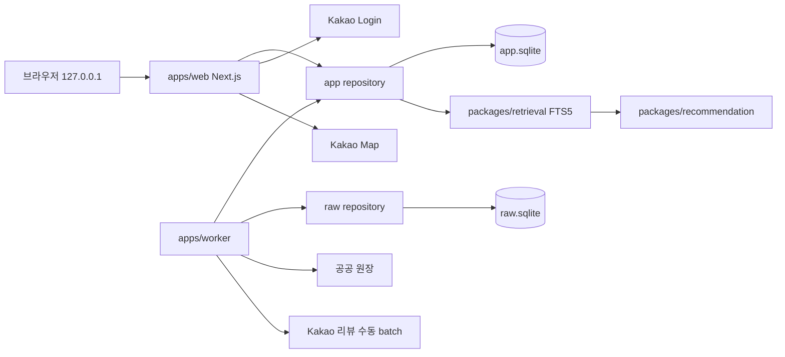
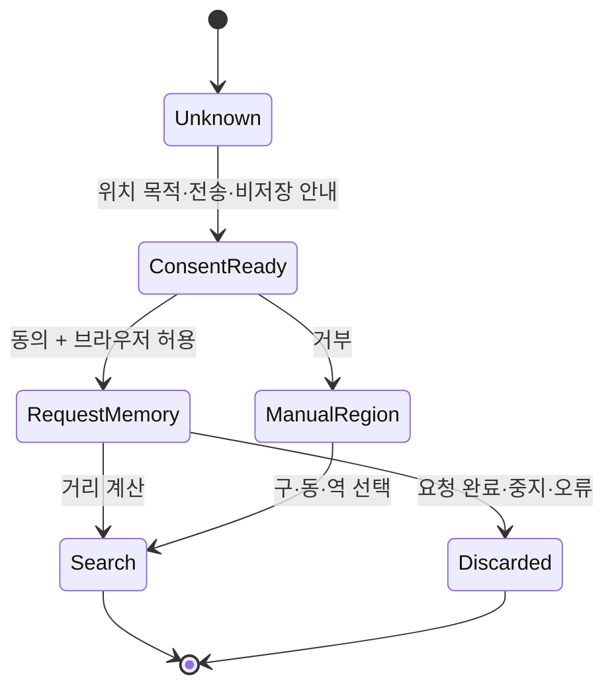
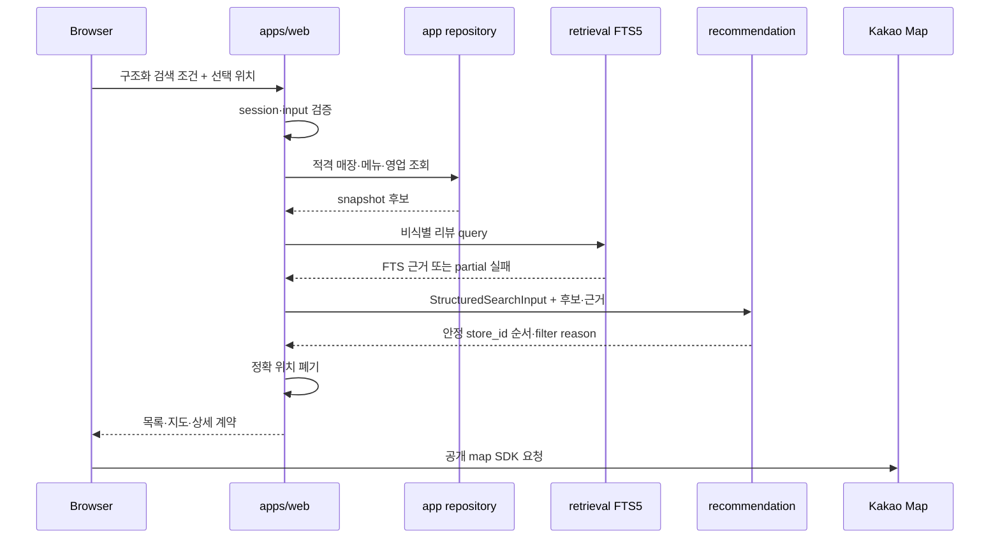

# 시스템 구조

[문서 허브](../README.md) · [PRD](../00-product/prd.md) · [추천 기준](../02-recommendation/recommendation-spec.md) · [데이터 설계](../05-data/data-design.md) · [보안 설계](../06-trust/security-design.md)

**상태:** 승인된 로컬 MVP 목표 구조

**전환 상태:** 실제 저장소에는 PostgreSQL·Prisma 기반 최소 scaffold가 남아 있다. 이 문서는 Feature 1 이후 목표 구조를 정의하며 SQLite 전환이 이미 구현됐다고 주장하지 않는다.

## 1. 기술 기준

- TypeScript와 `pnpm workspace` 모노레포
- Next.js 기반 `apps/web`: `127.0.0.1` 사용자 UI와 server route
- `apps/worker`: 공공 원장·리뷰 수집, 정규화·비식별·게시
- SQLite/libSQL 호환 `app.sqlite`, worker 전용 `raw.sqlite`
- Drizzle schema·migration과 별도 migration history
- `packages/sqlite-core`: 연결, pragma, transaction, backup 공통 규칙
- `packages/retrieval`: FTS5 query와 snippet 경계
- `packages/recommendation`: 구조화 입력의 결정론적 필터·정렬
- Auth.js 호환 Kakao provider와 server-scoped account/session
- Kakao Login과 Kakao Map
- LangGraph·OpenAI·원격 database는 로컬 MVP runtime에서 제외

## 2. 현재 컨테이너와 데이터 흐름



### 경계

- web은 app repository만 사용하고 `raw.sqlite`를 열지 않는다.
- worker는 app repository와 raw repository를 각각 명시적으로 사용한다.
- 브라우저에는 SQLite 경로, WAL/SHM 경로, raw secret와 encryption metadata를 보내지 않는다.
- FTS5 query·snippet 생성과 추천 정렬은 server-side에서 수행한다.
- 정확한 사용자 위치는 요청 메모리에서만 사용하고 repository·로그·분석에 전달하지 않는다.
- Kakao provider account와 token은 server-scoped이며 client가 소유권 식별자로 보내지 않는다.

## 3. 저장소와 package 소유권

### app repository

소유 데이터:

- 매장·브랜드·메뉴·영업·적격성·출처
- 비식별 리뷰와 FTS5 index
- data snapshot·추천 version
- 사용자·account·session
- 즐겨찾기와 검색/선택 기록

접근:

- web: 읽기와 인증된 사용자 데이터 쓰기
- worker: snapshot publish와 비식별 리뷰 게시

### raw repository

소유 데이터:

- AES-256-GCM 암호화 리뷰 원문
- HMAC fingerprint
- 수집·비식별 checkpoint와 실패 상태
- nonce·tag·key version metadata

접근:

- worker만 읽기·쓰기
- web·browser·retrieval·recommendation은 import와 path 접근 모두 금지

### package 규칙

- repository interface는 driver type과 file path를 외부에 노출하지 않는다.
- web route는 raw repository package를 import할 수 없다.
- worker가 app/raw 양쪽을 갱신할 때 짧은 개별 transaction과 재실행 가능한 publish 단계를 사용한다.
- 두 SQLite 파일 간 DB-level foreign key나 cross-file transaction을 전제로 하지 않는다.

## 4. 인증과 계정

### 로그인

1. 사용자가 `카카오로 시작하기`를 선택한다.
2. server가 OAuth Authorization Code 흐름을 시작한다.
3. 최소 제공 정보만 요청한다.
4. callback에서 provider account ID를 내부 `user_id`에 연결한다.
5. server-scoped session과 `HttpOnly`, 환경에 맞는 `Secure`, 적절한 `SameSite` cookie를 발급한다.

OAuth state, PKCE/nonce와 provider callback 검증을 생략하거나 축약하지 않는다.

### 최소 정보

- 필수: 내부 `user_id`, provider=`kakao`, provider account ID
- 선택: 사용자가 동의한 표시용 profile nickname
- 미수집: 이메일, 전화번호, 생일, 성별

모든 사용자 데이터 query는 `session.user.id`를 소유권 조건에 포함한다. client가 보낸 `user_id`를 신뢰하지 않는다.

```text
loadFavorite(sessionUserId, favoriteId)
  -> WHERE favorite.user_id = sessionUserId
  -> 없음 또는 다른 소유자: 404
```

## 5. 위치 경계

Kakao Login, 서비스 위치 선택 동의와 브라우저 위치 권한은 별도 단계다.



- 정확 좌표는 현재 HTTP request와 server memory에서만 사용한다.
- 좌표를 `StructuredSearchInput`의 저장본, 검색/선택 기록, SQLite, log와 analytics에 넣지 않는다.
- 위치 권한 거부·시간 초과·낮은 정확도는 지역 직접 입력으로 대체한다.
- 목적지 매장 좌표는 공개 영업장 데이터이므로 `app.sqlite`에 저장할 수 있다.

## 6. 구조화 검색 요청 흐름



### 처리 규칙

- FTS5 실패는 메뉴·카테고리·지역 검색을 유지하는 `partial`이다.
- Kakao Map 실패는 목록·주소·거리·상세를 유지한다.
- 추천 순서와 근거는 OpenAI나 map 응답에 의존하지 않는다.
- 지도와 목록은 같은 `store_id` 집합을 사용한다.
- 검색 결과 저장 시 정확 위치 대신 거친 지역 또는 거리 조건만 남긴다.

## 7. 사용자 기록 transaction

즐겨찾기와 검색/선택 기록은 다음 경계를 사용한다.

1. session user 확인
2. input과 resource 소유권 검증
3. 짧은 `app.sqlite` transaction
4. idempotency key 또는 unique constraint로 중복 방지
5. commit 뒤 응답

한 사용자 작업에서 transaction을 연 채 Kakao 또는 다른 network 호출을 기다리지 않는다. 탈퇴는 로컬 사용자 데이터 삭제를 먼저 완료하고 Kakao unlink 실패를 비민감 재시도로 분리한다.

## 8. SQLite 동시성과 안정성

- 연결 시 `foreign_keys=ON`, WAL과 bounded `busy_timeout`을 적용한다.
- request transaction과 worker publish transaction을 짧게 유지한다.
- lock retry는 횟수·지연 상한을 갖고 같은 작업을 무한 반복하지 않는다.
- 한 종류의 수동 수집 run은 동시에 하나만 활성화한다.
- 큰 수집·migration 전에 app DB snapshot을 만든다.
- raw DB는 장기 snapshot 대상이 아니며 원문은 30일 뒤 hard delete한다.

정확한 pragma와 backup 절차는 [데이터 설계](../05-data/data-design.md)와 [운영 기준](../08-operations/operating-baselines.md)이 책임진다.

## 9. 관리자와 worker 경계

- 관리자 작업은 로컬에서 명시적으로 시작한다.
- 일반 Kakao Login만으로 관리자 작업을 시작할 수 없다.
- review 수집에 사용자 Kakao session·cookie를 재사용하지 않는다.
- web이 raw 원문을 직접 읽는 관리자 route를 만들지 않는다.
- 수집 중 로그인·CAPTCHA·401·403·429·DOM contract 변경이 나타나면 전체 run을 멈춘다.

## 10. 장애 격리

| 실패 | 유지하는 것 | 동작 |
|---|---|---|
| 공공 원장 갱신 | 이전 성공 snapshot | 7일 경고, 30일 새 검색 차단 |
| FTS5 query·index | 메뉴·카테고리·지역 결과 | `partial`, snippet 제거 |
| Kakao Map | 목록·주소·거리·상세 | 재시도와 목록 계속 보기 |
| `raw.sqlite` | 기존 `app.sqlite` 검색 | review run 중단 |
| 한 매장 리뷰 | 다른 매장 run | 실패 매장 격리 후 다음 매장 |
| SQLite lock | 기존 committed 데이터 | bounded retry 후 명시적 실패 |
| app DB 손상 | 검증된 snapshot | 새 파일 복구와 무결성 검사 |

## 11. 관측성과 로그

허용:

- request ID와 내부 ID의 비가역 운영 식별자
- repository operation, 상태, 비민감 오류 코드와 소요 시간
- 후보·제외·review·FTS 문서 수
- snapshot·migration·recommendation·FTS version

금지:

- 검색 원문 전체와 리뷰 raw 본문
- 정확 좌표와 상세 사용자 주소
- provider account ID, OAuth token과 session cookie
- SQLite 절대 path, encryption key, nonce·tag·HMAC
- 건강·알레르기 표현

## 12. 전환 전 실제 scaffold

PostgreSQL·Prisma client, Docker Compose, LangGraph와 OpenAI dependency는 실제 code에 남아 있다. Feature 1은 먼저 SQLite 연결·Drizzle migration·repository·backup을 검증한 뒤 대체된 runtime dependency와 path를 제거한다.

전환 전에는 다음을 구현 사실로 말하지 않는다.

- `app.sqlite`·`raw.sqlite`가 이미 생성된다.
- SQLite migration·backup command가 이미 존재한다.
- web의 raw import guard가 이미 적용됐다.

## 13. 후속 아키텍처

다음은 별도 Feature와 결정 승인 뒤에만 현재 구조에 연결한다.

- LangGraph 또는 다른 멀티턴 상태 runtime
- `ConversationIntentV2`, 대화 message·checkpoint
- OpenAI 자연어 구조화·생성형 설명·review feature 추출
- Kakao Route API의 이동시간·경로 대안
- Vercel·Turso 등 원격 배포와 HTTPS callback
- 원격 5인 파일럿, production secret·backup·incident 운영

후속 adapter도 `StructuredSearchInput`, 결정론적 추천과 raw 경계를 우회할 수 없다.

## 관련 문서

- Worker 작업: [Worker 설계](worker-design.md)
- 검색·정렬: [추천 기준](../02-recommendation/recommendation-spec.md)
- 데이터 schema: [데이터 설계](../05-data/data-design.md)
- 인증·권한: [보안 설계](../06-trust/security-design.md)
- 후속 대화 JSON: [LLM 계약](../03-contracts/llm-contracts.md)
- 장애 대응: [운영 기준](../08-operations/operating-baselines.md)
