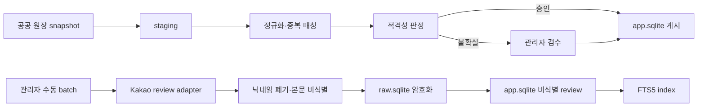

# Worker 설계

[문서 허브](../README.md) · [시스템 구조](system-architecture.md) · [데이터 설계](../05-data/data-design.md) · [리뷰 수집 실험](../07-experiments/review-collection-experiment.md)

`apps/worker`는 공공 원장 snapshot, 정규화·적격성 판정, 관리자 로컬 리뷰 수집, 비식별·암호화와 `app.sqlite`·FTS5 게시를 담당한다. 사용자 인증·검색 HTTP 응답은 `apps/web`의 책임이다.

**상태:** 승인된 로컬 MVP 목표 설계. PostgreSQL·Prisma scaffold는 실제 저장소의 Feature 1 전환 전 구현 상태다.

## 1. 설계 원칙

1. 모든 단계는 재실행해도 중복 결과가 생기지 않는 멱등 작업이다.
2. source snapshot, staging, 정규화, 판정과 publish를 분리한다.
3. 자동화가 확신하지 못하면 게시하지 않고 관리자 검수로 보낸다.
4. 서비스 데이터 `app.sqlite`와 암호화 raw·checkpoint `raw.sqlite`를 분리한다.
5. 리뷰 수집 실패는 공공 원장과 기존 검색을 멈추지 않는다.
6. 로그인·CAPTCHA·접근 거부·rate limit을 우회하지 않는다.
7. 사용자 Kakao account와 정확 위치는 worker 입력이 아니다.
8. worker는 로컬 MVP에서 OpenAI를 호출하지 않는다.

## 2. 현재 파이프라인

```text
source snapshot → staging → normalize → eligibility → publish app.sqlite
eligible stores → Kakao review collection → deidentify
→ encrypt raw.sqlite → publish deidentified review to app.sqlite → FTS5
```



## 3. 실행기와 checkpoint

현재 로컬 실행기는 범용 분산 queue가 아니다.

- 한 source/review 작업 유형마다 활성 run은 하나다.
- 리뷰 수집 browser page는 하나다.
- store·page cursor와 마지막 committed 단계는 로컬 SQLite checkpoint row에 저장한다.
- run 상태와 결과 쓰기는 짧은 transaction 또는 재실행 가능한 두 단계 publish로 구성한다.
- process 종료 후 마지막 committed checkpoint 다음 항목부터 재개한다.
- 같은 `dedupe_key`와 provider review fingerprint는 unique constraint로 막는다.
- SQLite 연결은 WAL, `foreign_keys=ON`과 bounded `busy_timeout`을 사용한다.
- lock retry는 시도 횟수와 총 지연 상한을 넘으면 실패로 종료한다.

```text
Run lifecycle
READY -> RUNNING -> SUCCEEDED
                 -> PAUSED
                 -> FAILED_STORE
                 -> FAILED_FINAL
                 -> STOPPED_POLICY
                 -> STOPPED_ACCESS
                 -> STOPPED_LIMIT
```

payload와 log에는 원문·secret·SQLite 절대 path를 넣지 않는다.

## 4. 공공 원장 snapshot

### 기본 원장

행정안전부 LOCALDATA의 `식품_제과점영업` 서울 자료를 후보 원장으로 사용한다. 외부 `MNG_NO`는 source identifier이며 내부 `store_id`를 대신하지 않는다.

### 단계

1. provider 응답, checksum과 기준 시각을 source snapshot으로 저장
2. staging에 로드하고 필수 필드·record count·schema 검사
3. 영업 상태를 내부 enum으로 변환
4. 주소, 전화, 업소명과 좌표 정규화
5. 기존 source link와 중복 후보 매칭
6. 폐업·비활성 전이를 먼저 반영
7. 전체 quality gate 통과 후 새 version을 `app.sqlite`에 게시

실패한 snapshot으로 이전 성공 version을 덮지 않는다. 마지막 성공 동기화가 7일을 넘으면 경고하고 30일을 넘으면 새 검색을 차단한다.

## 5. 좌표·이름·주소 정규화

### 좌표

- 공공 원장 원 좌표와 좌표계 metadata를 추적한다.
- EPSG:5174 등 원 좌표를 WGS84 매장 좌표로 변환한다.
- 서울 경계, 주소 자치구와 좌표 자치구, 유효 범위를 검사한다.
- 공개 매장 좌표는 게시할 수 있지만 사용자 위치는 이 파이프라인에 들어오지 않는다.

### 이름

Unicode 정규화, 공백·구두점·법인 접미사와 지점 표기 분리를 적용한다. 원 source 값은 snapshot에 보존한다.

### 주소

도로명·지번, 건물 본번·부번, 층·호와 행정구역 code를 구조화한다. 비어 있는 값을 외부 검색이나 추측으로 채우지 않는다.

### 중복 후보

이름, 정규화 주소, 매장 좌표 거리와 유효 전화 신호로 후보를 만든다.

- 0.92 이상이고 주소 충돌 없음: 자동 연결
- 0.75 이상 0.92 미만: 관리자 검수
- 0.75 미만: 별개 후보

임계값은 versioned 운영 휴리스틱이며 변경 시 고정 평가 세트와 새 run으로 다시 검증한다.

## 6. 적격성 판정

상태:

- `INDEPENDENT_SINGLE`
- `DIRECT_ONLY_SMALL_CHAIN`
- `FRANCHISE`
- `CHAIN_TOO_LARGE`
- `UNCERTAIN_REVIEW_REQUIRED`

소규모 직영 브랜드는 다음을 모두 만족해야 한다.

1. 서울 영업점 2~5개
2. 공정위 가맹 증거 없음
3. 공식 channel 또는 공개 목록상 같은 운영 주체
4. 관리자 검수 완료

공정위 미일치만으로 직영을 확정하지 않는다. 서울 영업점 6개 이상은 전 점포 직영이어도 현재 범위에서 제외한다.

## 7. 관리자 검수

관리자 작업함에는 중복·좌표·영업 상태·chain·메뉴 근거·오래된 데이터의 reason code를 표시한다.

- 자동 판정의 입력 근거와 version을 보여준다.
- 승인·제외·병합은 관리자와 시각을 audit row로 남긴다.
- source snapshot을 덮어쓰지 않고 correction 또는 새 판정 version을 만든다.
- 동시 수정은 optimistic version check로 충돌을 감지한다.
- 일반 사용자 web에서 raw 원문을 열지 않는다.

## 8. 리뷰 수집

리뷰 수집은 예약 daemon이나 일반 web request가 아니다. 관리자가 정책 위험 문구를 확인하고 로컬 PC에서 명시적으로 시작한다.

고정 한도:

- Kakao Map 단일 출처
- 적격 매장만 대상
- 매장별 최근 12개월·최대 20건
- 활성 browser page 1개
- 활성 review run 1개
- store·page checkpoint
- 일시정지·재개·전체 중단·실패 매장 재실행
- cron·지속 감시·사이트 전체 탐색 없음

한 매장의 DOM parse·데이터 오류는 해당 매장을 `FAILED_STORE`로 격리하고 다음 매장으로 진행할 수 있다. 다음 상황은 전체 run을 즉시 멈춘다.

- 로그인 요구 또는 account wall
- CAPTCHA
- HTTP 401·403·429
- 접근 거부·비정상 traffic 경고
- selector·DOM contract 변경
- policy 또는 kill switch 활성화

위 조건을 우회하거나 자동으로 무한 재시도하지 않는다.

## 9. 비식별·fingerprint·암호화

처리 순서:

1. 렌더링된 review body·별점·날짜와 transient nickname을 memory에서 읽는다.
2. URL, email, phone, account handle과 identifier pattern을 본문에서 제거한다.
3. 안전하게 비식별할 수 없으면 review 전체를 `REJECTED_PII`로 폐기한다.
4. `provider | store_id | normalized_nickname | published_date | normalized_deidentified_text`를 HMAC-SHA-256으로 계산한다.
5. 원 nickname을 즉시 폐기한다.
6. 비식별 본문을 AES-256-GCM으로 암호화해 `raw.sqlite`에 저장한다.
7. 비식별 본문·별점·날짜·출처·fingerprint의 허용 subset을 `app.sqlite`에 게시한다.
8. 같은 transaction boundary 안에서 FTS5 index를 갱신하거나 재실행 가능한 index checkpoint를 남긴다.

저장하지 않는 정보:

- nickname·provider user ID·profile URL·photo
- 작성자의 다른 활동과 좋아요 사용자
- 정확한 작성 시각, review image와 EXIF

HMAC은 store 범위 중복 차단에만 사용하고 다른 매장의 작성자를 연결하지 않는다. encryption key와 HMAC key는 DB·Git·log에 없다. raw 암호문은 수집일부터 30일 뒤 hard delete하고 장기 backup을 만들지 않는다.

## 10. app 게시와 FTS5

- 비식별 성공 review만 게시한다.
- review row와 FTS document는 안정 ID와 index version으로 연결한다.
- 동일 fingerprint 재실행은 새 row를 만들지 않는다.
- 비식별 실패, 만료와 삭제 row는 검색되지 않아야 한다.
- publish가 중간 실패하면 기존 성공 version을 유지한다.
- index rebuild는 새 version에서 검증한 뒤 활성 version을 교체한다.
- FTS 불일치는 review 검색만 `partial`로 낮추고 메뉴·category·지역 검색을 유지한다.

현재 worker는 review 본문에서 LLM taste feature를 추출하지 않는다. 메뉴·category·검색 근거는 검수 데이터와 FTS5가 책임진다.

## 11. transaction과 일관성

두 SQLite 파일을 하나의 cross-file transaction으로 묶지 않는다.

### review 한 건

1. `raw.sqlite`에 암호화 row와 fingerprint commit
2. `app.sqlite`에 비식별 review upsert
3. FTS5 index upsert
4. checkpoint에 publish 상태 commit

중간 실패는 같은 fingerprint와 checkpoint로 재실행한다. 이미 commit된 단계는 idempotent upsert로 건너뛴다.

### store 단위

- 한 store의 transaction을 짧게 유지한다.
- network·browser wait 중 transaction을 열지 않는다.
- store 완료 뒤 다음 store cursor를 commit한다.
- process crash 후 마지막 store checkpoint에서 재개한다.

## 12. 실패 격리

| 실패 | 영향 | 동작 |
|---|---|---|
| LOCALDATA download | 새 source 갱신 | 이전 성공 snapshot 유지 |
| 공정위 보조 조회 | 자동 chain 판정 | 불확실 후보를 관리자 검수로 이동 |
| 한 store parse | 해당 store review | 실패 격리 후 다음 store |
| `raw.sqlite` read/write | 현재 review run | run 중단, 기존 검색 유지 |
| `app.sqlite` publish | 새 data/review version | 이전 성공 version 유지 |
| FTS5 update | review 검색 | partial 상태, rebuild 필요 |
| SQLite lock | 해당 짧은 transaction | bounded retry 후 실패 |
| 로그인·CAPTCHA·401·403·429 | 전체 provider run | 즉시 중단, 재승인 전 재실행 금지 |
| DOM contract 변경 | 전체 provider run | fixture·selector 검토 전 중단 |

## 13. 복구

- source/review run은 마지막 committed checkpoint에서 재개한다.
- 큰 source publish와 review batch 전 app DB snapshot을 만든다.
- snapshot 생성 실패 시 큰 작업을 시작하지 않는다.
- app restore는 원본 파일을 덮지 않고 새 file에서 수행한다.
- `PRAGMA integrity_check`, migration history, row count, FTS consistency와 대표 검색을 확인한다.
- raw DB는 장기 snapshot에서 제외하고 30일 삭제를 유지한다.

## 14. 운영 관측

관리자에게 표시:

- provider별 마지막 성공·실패 시각
- snapshot 기준일, checksum과 record count
- run·store·page checkpoint
- 성공·review 부족·접근 실패 store 수
- deidentification 실패와 중복 제거 수
- app review row와 FTS document 수
- raw 만료·삭제 성공 수
- policy stop·kill switch 상태

표시 금지:

- review 원문과 nickname
- 정확 사용자 위치와 OAuth 정보
- SQLite 절대 path
- encryption key·HMAC key·nonce·tag
- 전체 DOM snapshot과 secret

## 15. 테스트 기준

- 같은 source snapshot 두 번 실행의 row·link·version 동일
- 폐업 전이가 새 게시 version의 검색 후보에서 제거됨
- 좌표 변환 fixture가 허용 오차 안에 있음
- 매칭 0.92·0.75 경계와 주소 충돌 처리
- chain 2·5·6개 경계와 불확실 처리
- 한 active run과 one-page 제한
- 최근 12개월·최대 20개·Kakao 단일 출처
- 중단·재개 뒤 누락·중복 0건
- 로그인·CAPTCHA·401·403·429·DOM 변경 전체 중단
- failed store 격리
- nickname 원문 미저장과 HMAC 결정성
- 비식별 실패 review 게시·FTS 노출 0건
- AES-256-GCM 변조 검출과 30일 hard delete
- app review row·FTS document 불일치 0건
- web package의 raw repository import·path 접근 거부

## 16. 대체된 온라인 P0 구조

기존 PostgreSQL `job` table, `FOR UPDATE SKIP LOCKED`, Prisma client와 materialized view는 현재 승인 목표가 아니다. Feature 1이 SQLite repository와 checkpoint를 검증한 뒤 관련 scaffold를 제거한다.

## 17. 후속 챗봇 Feature

다음은 별도 승인 전 현재 worker에 연결하지 않는다.

- OpenAI `BakeryTasteFeatureV1` 추출
- model·prompt·schema·token·call count·비용
- deidentified text의 외부 전송
- LLM observation·evidence offset과 aggregate
- 원격 queue·scheduler와 hosted worker

후속 LLM 처리는 닉네임 폐기, 비식별 성공, raw 접근과 hard cap 경계를 완화할 수 없다.

## 관련 문서

- 전체 app 경계: [시스템 구조](system-architecture.md)
- 필드·ERD·보존: [데이터 설계](../05-data/data-design.md)
- 후속 LLM 출력: [LLM 계약](../03-contracts/llm-contracts.md)
- review 정책: [정책 검토](../06-trust/policy-review.md), [리뷰 수집 실험](../07-experiments/review-collection-experiment.md)
- 운영 임계값: [운영 기준](../08-operations/operating-baselines.md)
