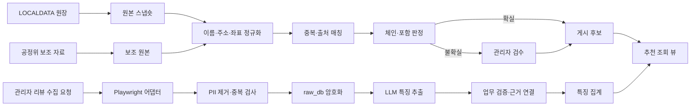

# Worker 설계

[문서 허브](../README.md) · [시스템 구조](system-architecture.md) · [데이터 설계](../05-data/data-design.md) · [리뷰 수집 실험](../07-experiments/review-collection-experiment.md)

`apps/worker`는 공공데이터 적재, 정규화, 매칭, 체인 판정, 리뷰 수집 실험, 개인정보 제거, LLM 특징 추출과 집계를 담당한다. 사용자 대화·인증·추천 HTTP 응답은 `apps/web`의 책임이다.

## 1. 설계 원칙

1. 모든 작업은 재시도해도 중복 결과가 생기지 않는 멱등 작업이다.
2. 원본 적재, 정규화, 판정, 게시와 집계를 분리한다.
3. 자동화가 확신하지 못하면 게시하지 않고 관리자 검수로 보낸다.
4. `app_db`의 구조화 데이터와 `raw_db`의 리뷰 암호문을 분리한다.
5. 리뷰 수집 실패는 공공 원장과 기존 추천을 멈추지 않는다.
6. 로그인·CAPTCHA·접근 거부를 기술적으로 우회하지 않는다.
7. 사용자 Kakao 계정과 위치 데이터는 worker 입력이 아니다.

## 2. 작업 실행기

MVP는 PostgreSQL `job` 테이블과 `FOR UPDATE SKIP LOCKED`로 작업을 선점한다. Redis와 BullMQ를 추가하지 않는다.

```text
Job lifecycle
QUEUED -> RUNNING -> SUCCEEDED
                  -> FAILED_RETRYABLE -> QUEUED
                  -> FAILED_FINAL
                  -> STOPPED_POLICY
                  -> STOPPED_ACCESS
                  -> STOPPED_LIMIT
```

각 작업은 `job_type`, `dedupe_key`, 입력 스냅숏 ID, 상태, 시도 횟수, 다음 실행 시각, 비민감 오류 코드와 결과 요약을 가진다. 원문 데이터와 비밀을 작업 payload·로그에 넣지 않는다.

동일 `dedupe_key`의 활성 작업은 하나만 허용한다. 작업 완료는 결과 쓰기와 상태 변경을 같은 트랜잭션 또는 재실행 가능한 단계로 구성한다.

## 3. 전체 파이프라인



## 4. 공공 원장 적재

### 기본 원장

행정안전부 LOCALDATA의 `식품_제과점영업` 서울 자료를 후보 원장으로 사용한다. 외부 `MNG_NO`는 출처 식별자이며 자체 `store_id`를 대신하지 않는다.

### 적재 단계

1. 공급자 응답과 기준 시각의 원본 스냅숏 저장
2. 필수 필드·레코드 수·스키마 검사
3. 영업 상태를 내부 enum으로 변환
4. 주소, 전화, 업소명과 좌표 원본 정규화
5. 기존 `store_source_link`와 매칭
6. 폐업·비활성 전이를 먼저 반영해 추천에서 제거
7. 전체 실행 품질 통과 뒤 게시용 뷰 갱신

원장 성공 동기화가 7일을 넘으면 경고하고 30일을 넘으면 새 추천을 차단한다. 실패한 새 스냅숏으로 성공한 이전 스냅숏을 덮지 않는다.

## 5. 좌표 정규화

- 공공 원장 원 좌표와 좌표계 메타데이터를 보존한다.
- EPSG:5174 등 원 좌표를 WGS84로 변환해 파생 좌표를 만든다.
- 서울 경계, 주소 자치구와 좌표 자치구, 유효 범위를 검사한다.
- 매장 좌표는 공개 영업장 데이터이므로 저장한다.
- 사용자의 현재 위치 좌표는 이 파이프라인에 들어오지 않는다.

좌표 변환 버전과 원본·파생 값을 함께 추적해 잘못된 변환을 재처리할 수 있게 한다.

## 6. 중복과 출처 매칭

### 이름 정규화

유니코드 정규화, 공백·구두점·법인 접미사와 지점 표기 분리를 적용하되 원문을 보존한다.

### 주소 정규화

도로명·지번, 건물 본번·부번, 층·호와 행정구역 코드를 구조화한다. 주소 일부가 비어도 임의 보완하지 않는다.

### 매칭

이름, 정규화 주소, 좌표 거리와 전화의 유효 신호로 후보 점수를 만든다.

- 0.92 이상이고 주소 충돌 없음: 자동 연결
- 0.75 이상 0.92 미만: 관리자 검수
- 0.75 미만: 별개 후보

임계값은 공식 기준이 아니라 버전된 운영 휴리스틱이다. 평가 세트로 정밀도·재현율을 확인하고 변경 시 전체 후보를 새 실행으로 재평가한다.

## 7. 체인과 포함 판정

### 상태

- `INDEPENDENT_SINGLE`
- `DIRECT_ONLY_SMALL_CHAIN`
- `FRANCHISE`
- `CHAIN_TOO_LARGE`
- `UNCERTAIN_REVIEW_REQUIRED`

### 소규모 직영 포함

다음 네 조건을 모두 만족해야 한다.

1. 서울 영업점 2~5개
2. 공정위 가맹 증거 없음
3. 공식 브랜드 채널 또는 사업자 공개 목록상 같은 운영 주체
4. 관리자 검수 완료

공정위 미일치만으로 직영을 확정하지 않는다. 서울 영업점 6개 이상은 전 점포 직영이어도 MVP에서 제외한다.

## 8. 관리자 검수

관리자 작업함에는 중복·좌표·영업 상태·체인·메뉴 근거·오래된 데이터의 이유 코드가 표시된다.

- 자동 판정의 입력 근거와 버전을 보여준다.
- 승인·제외·병합은 관리자와 시각을 감사 기록으로 남긴다.
- 원본을 덮어쓰지 않고 보정 레코드 또는 새 판정 버전을 만든다.
- 같은 레코드를 두 관리자가 동시에 편집하지 않도록 낙관적 잠금 또는 상태 잠금을 사용한다.

## 9. 리뷰 수집 실험

리뷰 수집은 일반 worker 예약 작업이 아니다. 관리자가 장소별로 위험 문구를 확인한 뒤 로컬에서만 시작한다.

고정 한도:

- 장소·플랫폼별 최근 30건
- 실행당 최대 5개 장소
- 동시 페이지 1개
- 이동·동작 사이 무작위 2~5초
- 예약·지속 감시·사이트 전체 탐색 없음

로그인, CAPTCHA, 403, 429, 접근 거부와 비정상 트래픽 경고가 나오면 즉시 중단한다. 상세 금지 사항과 운영 흐름은 [리뷰 수집 실험](../07-experiments/review-collection-experiment.md)이 책임진다.

## 10. 개인정보 제거와 원문 저장

수집하지 않는 정보:

- 작성자 닉네임·사용자 ID·프로필 URL·사진
- 작성자의 다른 활동과 좋아요 사용자
- 정확한 작성 시각, 리뷰 이미지와 EXIF

본문에서 URL, 이메일, 전화번호, 계정 핸들과 식별번호 패턴을 제거한다. 사람 이름이나 건강·결제 등 민감정보가 의심되는데 안전하게 제거할 수 없으면 리뷰 전체를 `REJECTED_PII`로 폐기한다.

중복 방지는 별도 비밀키의 HMAC-SHA-256을 사용한다. 원문은 AES-256-GCM으로 암호화해 `raw_db`에 저장하고 nonce·인증 태그·키 버전을 분리한다. 암호화 키는 DB·Git·로그에 없다.

암호화 원문은 수집일부터 30일 뒤 hard delete한다. 암호화는 수집 권한을 만들어 주는 수단이 아니다.

## 11. LLM 특징 추출

worker는 PII 제거가 완료된 리뷰만 OpenAI에 전송한다. 관리자 실행 화면은 텍스트가 로컬 PC 밖으로 전송됨을 알린다.

1. 복호화한 최소 배치를 메모리에 로드
2. `BakeryTasteFeatureV1` strict schema로 요청
3. JSON Schema·업무 규칙 검사
4. 근거 오프셋과 원문 해시 검증
5. 유효 관측만 `app_db`에 저장
6. 평문 메모리와 임시 파일 폐기

LLM은 맛·식감·카테고리·태그만 추출한다. 가격, 영업 상태, 추천 점수, 인기, 의료 안전과 독립점 여부를 추론하지 않는다.

## 12. 특징 집계

- 공식 메뉴·운영자 정보와 관리자 직접 검수는 높은 근거 가중치
- 검증된 리뷰 LLM 관측은 0.65의 초기 출처 가중치
- 같은 리뷰에서 같은 특징을 반복해도 리뷰·특징당 한 표
- 리뷰 기반 특징은 서로 다른 리뷰 3개 미만이면 추천에 사용하지 않음
- 집계 신뢰도 0.55 미만은 추천에서 제외
- 리뷰 반감기 90일, 180일 이후 관측 만료
- LLM의 자체 확신도는 집계 가중치로 사용하지 않음

집계 결과는 `aggregate_run_id`와 입력 관측 집합을 추적한다. 새 집계가 성공한 뒤에만 추천용 materialized view를 교체한다.

## 13. 실패 격리

| 실패 | 영향 범위 | 동작 |
|---|---|---|
| LOCALDATA 다운로드 | 새 데이터 갱신 | 이전 성공 스냅숏 유지, 30일 차단 규칙 적용 |
| 공정위 보조 조회 | 체인 자동 판정 | 불확실 후보를 관리자 검수로 보냄 |
| `raw_db` 연결 | 리뷰 실험·특징 갱신 | 기존 구조화 추천 유지 |
| OpenAI | 특징 추출 | 한 번 재시도 후 배치 실패, 기존 집계 유지 |
| 집계 검증 | 추천 뷰 갱신 | 이전 성공 집계 유지 |
| 정책·접근 중단 | 해당 플랫폼·장소 | 관리자 검토 전 재실행 금지 |

한 파이프라인의 실패가 무관한 작업을 전역 중단하지 않는다. 다만 게시 품질을 위협하는 원장·영업 상태 실패는 새 추천을 차단한다.

## 14. 운영 관측

관리자 화면에는 다음을 보여준다.

- 공급자별 마지막 성공·실패 시각
- 스냅숏 기준일과 레코드 수
- 작업 상태·재시도 횟수·비민감 오류 코드
- 관리자 검수 대기 개수와 이유
- LLM 토큰·예상 비용과 자체 상한
- 원문 보존 만료·삭제 성공 개수
- 정책 중단과 kill switch 상태

원문, 정확 사용자 위치, OAuth 정보, 암호화 키와 전체 프롬프트는 표시하지 않는다.

## 15. 테스트 기준

- 동일 원본 적재를 두 번 실행해 행 수와 연결이 같음
- 원장 폐업 전이가 추천 뷰에서 즉시 제거됨
- 좌표 변환 fixture가 허용 오차 안에 있음
- 매칭 0.92·0.75 경계값과 주소 충돌 처리
- 체인 2·5·6개 경계와 공정위 미일치의 불확실 처리
- job 선점 시 두 worker가 같은 작업을 실행하지 않음
- 리뷰 30건·5개 장소·동시 1개·2~5초 제한
- 로그인·CAPTCHA·403·429에서 즉시 중단
- PII 검출 실패 리뷰 전체 폐기
- 암호문 변조 검출과 30일 hard delete
- 서로 다른 리뷰 3개·신뢰 0.55·180일 만료 경계
- web DB role의 `raw_db` 접근 거부

## 관련 문서

- 전체 앱 경계: [시스템 구조](system-architecture.md)
- 필드·ERD·보존: [데이터 설계](../05-data/data-design.md)
- LLM 출력: [LLM 계약](../03-contracts/llm-contracts.md)
- 리뷰 정책: [정책 검토](../06-trust/policy-review.md), [리뷰 수집 실험](../07-experiments/review-collection-experiment.md)
- 운영 임계값: [운영 기준](../08-operations/operating-baselines.md)
