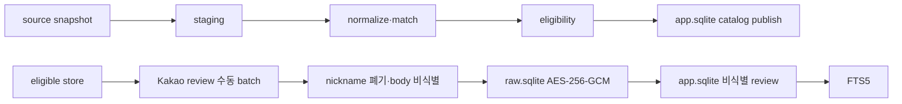
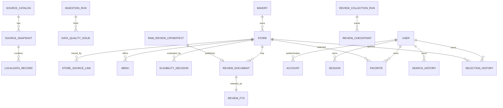

# 빵찾깅 데이터 설계서

[문서 허브](../README.md) · [PRD](../00-product/prd.md) · [추천 기준](../02-recommendation/recommendation-spec.md) · [시스템 구조](../04-architecture/system-architecture.md) · [보안 설계](../06-trust/security-design.md)

**서비스:** 빵찾깅

**버전:** 0.5

**기준일:** 2026-07-30

**대상 지역:** 서울특별시

**실행 환경:** 사용자 PC의 로컬 web, 로컬 worker, SQLite 이중 저장소

**상태:** 승인된 데이터 계약. Feature 1~7의 SQLite·catalog·review·검색·account table과 migration은 구현됐으며 후속 table은 각 Feature 완료 전까지 목표로 구분한다.

> **핵심 결정**
>
> 행정안전부 지방행정 인허가 계열의 `식품_제과점영업` 자료를 후보 원장으로 삼고 공정거래위원회 자료와 관리자 검수로 franchise 여부를 판별한다. 승인된 매장·메뉴·비식별 review·FTS5·account 데이터는 `app.sqlite`, 암호화 review·fingerprint·collection checkpoint는 worker 전용 `raw.sqlite`에 둔다. 구조화 검색과 추천은 결정론적이며 OpenAI를 사용하지 않는다.

## 1. 목적과 범위

이 문서는 데이터 출처, 식별자, SQLite 저장 경계, 목표 table, 보존·삭제·migration·backup과 quality gate의 유일한 기준이다.

포함 대상:

- 서울에 영업 중인 단일 독립 bakery
- 서울 영업점이 2~5개이고 모든 점포가 직영임을 관리자 검수로 확인한 소규모 brand
- Kakao Map의 최근 12개월 initial backfill·수동 증분 review 중 비식별에 성공한 본문
- Kakao account 기반 사용자·session·즐겨찾기·검색/선택 기록

제외 대상:

- 가맹 franchise, 폐업·휴업·상태 불명 매장
- 편의점·마트 제빵 corner, pop-up, 배달 전용과 서울 영업점 6개 이상 brand
- 정확한 사용자 위치와 Kakao 원본 응답
- review nickname·profile·비식별 실패 본문
- 현재 runtime의 conversation·prompt·LLM extraction·생성 설명 데이터

## 2. 설계 원칙

1. **source와 service 판단을 분리한다.** 외부 record는 immutable snapshot으로 추적하고 이름·상태·적격성은 별도 version으로 판정한다.
2. **외부 key를 내부 identity로 사용하지 않는다.** `MNG_NO`, FTC brand ID와 Kakao place ID는 내부 `store_id`를 대신하지 않는다.
3. **출처와 판단 근거를 함께 보존한다.** 게시 매장을 snapshot·rule·관리자 결정으로 역추적할 수 있어야 한다.
4. **확신하지 못하면 게시하지 않는다.** status·matching·chain 판정 충돌은 검수 전 검색 대상에서 제외한다.
5. **민감 데이터를 최소화한다.** nickname은 fingerprint 직후 폐기하고 정확한 사용자 위치는 요청 memory에만 둔다.
6. **재현성을 version으로 확보한다.** normalization, matching, eligibility, data snapshot, FTS index와 recommendation version을 기록한다.
7. **policy 위험을 실행 경계로 제어한다.** review 수집은 관리자 로컬 수동 batch이며 access 제한을 우회하지 않는다.
8. **게시와 복구를 검증한다.** 실패한 새 version은 이전 성공 version을 교체하지 않고 snapshot은 새 file로 복구한다.

## 3. SQLite 저장 규약

### 3.1 파일

| 파일 | 소유 data | 접근 |
|---|---|---|
| `app.sqlite` | catalog, menu, 비식별 review, FTS5, account, 즐겨찾기, 검색/선택 기록 | web 읽기·제한 쓰기, worker 게시 |
| `raw.sqlite` | Kakao 장소 관측·임시 locator, 암호화 review, fingerprint, 수집·비식별 checkpoint, 실패 상태 | worker만 읽기·쓰기 |

두 파일은 물리적으로 분리하고 각각 독립된 Drizzle schema와 migration history를 가진다. DB-level cross-file FK나 atomic transaction을 전제로 하지 않는다.

### 3.2 type

| 의미 | SQLite 저장 |
|---|---|
| 내부 ID | application-generated stable `TEXT` |
| UTC timestamp | SQLite `INTEGER` UTC epoch milliseconds |
| source local date | 정규화된 `YYYY-MM-DD` `TEXT` |
| boolean | CHECK가 있는 `INTEGER` 0/1 |
| enum | 허용 값 CHECK가 있는 `TEXT` |
| decimal·score | scale을 고정한 `INTEGER` 또는 검증된 `REAL` |
| canonical JSON | schema validator를 통과한 canonical JSON `TEXT` |
| hash·ciphertext·nonce·tag | 길이 검증을 거친 `BLOB` |

- 관계 column으로 표현할 수 있는 값을 JSON에 넣지 않는다.
- JSON `TEXT`는 canonical serialization과 schema version을 가진다.
- date만 의미가 있는 값에 UTC timestamp를 쓰지 않는다.
- ID는 row insert 전에 application에서 생성한다.

### 3.3 연결 pragma

모든 connection은 다음 의미를 적용한다.

- `foreign_keys=ON`
- WAL journal
- bounded `busy_timeout`
- transaction 중 network·browser wait 금지
- read/write connection 용도 분리
- 종료 시 uncommitted transaction 없음

정확한 Drizzle migration과 pragma 적용 코드는 Feature 1이 구현한다. 이 문서는 raw SQL migration을 소유하지 않는다.

## 4. 데이터 출처

| 구분 | 기준 | 현재 사용 | 한계 |
|---|---|---|---|
| 후보 원장 | 행정안전부 `식품_제과점영업` [S1][S2] | 서울 후보·영업·주소·매장 좌표 | 신고 시차, 누락·중복, menu 없음 |
| LOCALDATA 계보 | 공식 file·sample catalog [S3] | field·source lineage 확인 | runtime endpoint가 아님 |
| franchise | FTC brand·store·직영 count·취소 [S4]~[S8] | 가맹 증거와 보조 matching | 미일치는 독립점 증거가 아님 |
| account | Kakao Login [S19] | provider account와 session | 위치 권한과 별개 |
| map | Kakao Map | 공개 매장 좌표 표시 | 지도 실패 시 목록 유지 |
| review 실험 | Kakao Map에서 관리자가 볼 수 있는 최근 review | 비식별 검색 근거 | 자동 수집 허용 근거 미확인, 공개 배포 금지 |

Kakao Route와 OpenAI [S10][S13][S14]는 후속 Feature 참고 출처다. 현재 data pipeline이나 release gate에 연결하지 않는다.

## 5. LOCALDATA 계약

### 5.1 수집

- 전국 file snapshot을 고정한 뒤 서울 주소 record를 staging한다.
- OpenAPI delta도 응답 주소로 서울 여부를 다시 확인한다.
- `source_snapshot.basis_date`와 `downloaded_at_ms`를 분리한다.
- `(snapshot_id, MNG_NO)`는 unique다.
- 다음 snapshot의 변경은 새 record로 저장하고 이전 version을 덮지 않는다.

### 5.2 최소 field

| source field | 의미 | target type | 처리 |
|---|---|---|---|
| `OPN_ATMY_GRP_CD` | 자치단체 group | `TEXT` | 요청 filter와 응답 값을 분리 |
| `MNG_NO` | 관리번호 | `TEXT` | source business key |
| `LCPMT_YMD` | 인허가일 | date `TEXT` | 빈 값은 `null` |
| `SALS_STTS_CD`, `SALS_STTS_NM` | 영업 상태 | `TEXT` | code·name 충돌 시 게시 차단 |
| `DTL_SALS_STTS_CD`, `DTL_SALS_STTS_NM` | 상세 상태 | `TEXT` | status history |
| `CLSBIZ_YMD` | 폐업일 | date `TEXT` | 비영업 검증 |
| `BPLC_NM` | 사업장명 | `TEXT` | display 후보·normalization |
| `ROAD_NM_ADDR`, `LOTNO_ADDR` | 주소 | `TEXT` | source 보존 후 구조화 |
| `CRD_INFO_X`, `CRD_INFO_Y` | source 좌표 | scale 고정 `INTEGER` | EPSG:5174 값 보존 |
| `DAT_UPDT_PNT`, `LAST_MDFCN_PNT` | 갱신 시각 | epoch ms `INTEGER` | delta·freshness |

source payload 전체가 꼭 필요하면 field contract validator를 통과한 canonical JSON `TEXT`로 staging에 한정한다.

### 5.3 좌표

- source EPSG:5174 값을 scale이 고정된 integer로 보존한다.
- versioned transform으로 WGS84 매장 좌표를 만든다.
- 서울 유효 범위, 주소 자치구와 좌표 자치구를 검사한다.
- ambiguity가 있으면 재해석하지 않고 `CRS_AMBIGUOUS`로 격리한다.

공개 매장 좌표는 저장한다. 정확한 사용자 좌표는 어떤 SQLite table에도 저장하지 않는다.

## 6. franchise와 적격성

FTC 자료는 긍정적인 가맹 증거로 사용한다.

- 정규화 brand name 또는 승인 alias 일치
- franchise store name·주소·좌표 일치
- 기준연도 가맹점 수 1개 이상
- 등록·취소 이력과 후보 영업기간 중첩

다음은 독립점 증거가 아니다.

- FTC 검색 결과 없음
- 오래된 기준연도
- 직영점 count만 존재
- spelling·spacing 차이
- LOCALDATA의 동일 이름이 한 곳뿐임

`DIRECT_ONLY_SMALL_CHAIN`은 서울 영업점 2~5개, 가맹 증거 없음, 공식 운영 주체 근거와 관리자 검수를 모두 만족한다. 6개 이상은 `CHAIN_TOO_LARGE`로 제외한다.

## 7. 저장 경계

### 7.1 `app.sqlite`

저장:

- source catalog·snapshot metadata와 staging
- bakery·store·menu·eligibility와 관리자 판정
- 비식별 review metadata·body와 FTS5 index
- data publish·quality issue
- user·account·session
- favorite·search history·selection history

금지:

- exact user location
- review nickname·profile·raw cipher metadata
- encryption·HMAC key
- conversation message·prompt·LLM response

### 7.2 `raw.sqlite`

저장:

- 비식별 review body의 AES-256-GCM ciphertext
- nonce·auth tag·key version
- store-scoped review fingerprint
- review collection run·store/page checkpoint
- deidentification failure reason의 비민감 code
- retention deadline과 delete audit

금지:

- nickname 원문
- provider user ID·profile URL·photo
- exact user location와 account token
- 장기 backup

### 7.3 file 간 연결

두 file은 같은 application-generated `review_id`, `store_id`, `snapshot_id`를 논리 key로 사용한다. worker가 다음을 검증한다.

- raw commit 뒤 app publish idempotency
- app review와 FTS document 존재 일치
- 만료 raw 삭제가 app의 공개 비식별 review를 되살리지 않음
- 실패 checkpoint 재실행의 duplicate 0

## 8. 현재 pipeline



각 단계는 version과 checkpoint를 가진다. 실패한 새 publish는 이전 성공 version을 교체하지 않는다.

## 9. 논리 ERD



`RAW_REVIEW_CIPHERTEXT`와 `REVIEW_DOCUMENT`의 연결은 논리 관계이며 SQLite FK가 아니다.

## 10. `app.sqlite` current·target table 사전

아래는 승인 계약이다. 실제 column·constraint의 실행 기준은 `packages/app-db/src/schema`와 `drizzle/app`이며, 후속 Feature가 소유한 항목은 구현 전까지 target이다.

### 10.1 source·ingestion

| table | 주요 column | key·index·retention |
|---|---|---|
| `source_catalog` | `source_id TEXT`, `source_key`, `official_url`, `required_fields_json`, `terms_checked_at_ms` | PK `source_id`, UQ `source_key`; 영구 |
| `source_snapshot` | `snapshot_id`, `source_id`, `sha256 BLOB`, `byte_size`, `basis_date`, `downloaded_at_ms`, `local_path_hint` | UQ `(source_id,sha256)`; metadata 영구, 공개 file 730일 |
| `localdata_bakery_record` | `record_id`, `snapshot_id`, `mng_no`, status, 주소, source 좌표, `payload_json` | UQ `(snapshot_id,mng_no)`; 730일 |
| `ftc_brand_record` | `record_id`, `snapshot_id`, provider brand key, name, registration status | source key index; 730일 |
| `ftc_store_record` | `record_id`, `snapshot_id`, brand key, store name·address | brand·name index; 730일 |
| `ingestion_run` | `run_id`, `source_id`, input snapshot, status, started/finished ms, version | `(source_id,started_at_ms)`; 400일 |
| `source_checkpoint` | `checkpoint_id`, run, page/cursor, last committed key, state | UQ active run; run 종료 뒤 400일 |
| `data_quality_issue` | `issue_id`, run, optional store, rule, severity, redacted details | `(status,severity)`; 400일 |

`local_path_hint`는 repository-relative 또는 logical label이며 사용자에게 absolute path를 반환하지 않는다.

### 10.2 catalog·eligibility

| table | 주요 column | key·index·retention |
|---|---|---|
| `bakery` | `bakery_id`, display name, normalized name, status | normalized name index; 영구 |
| `store` | `store_id`, `bakery_id`, name, normalized address, WGS84 scaled coordinates, business status, latest verified ms | 서울·status·name index; 영구 |
| `store_source_link` | `link_id`, store, source record type·ID, valid from/to | UQ source record link; 영구 |
| `match_candidate` | `match_id`, store, source reference, scaled score, signals JSON, matcher version, status | status·score index; 해결 후 180일 |
| `eligibility_decision` | `decision_id`, store/bakery, chain class, reason JSON, rule version, status, decided ms | current decision UQ; 영구 |
| `manual_review` | `manual_review_id`, target, type, status, decision, evidence refs JSON, decided ms | status·created index; 730일 |
| `menu` | `menu_id`, store, name, normalized name, category, source, verified ms, active | store·category·name index; 영구 |
| `store_alias` | `alias_id`, store/bakery, alias, normalized alias, source | normalized alias index; 영구 |
| `data_publish` | `publish_id`, input snapshot, eligibility version, status, published ms | one active version; 영구 |

partial uniqueness가 필요한 계약은 generated predicate column 또는 Drizzle migration이 검증한 SQLite partial index 중 하나로 구현한다.

### 10.3 비식별 review·FTS

| table | 주요 column | key·index·retention |
|---|---|---|
| `review_document` | `review_id`, store, provider, deidentified body, rating scaled, published date, collected ms | PK `review_id`, store·date index; published·active 매장만 보유, 12개월 검색 범위 |
| `review_publish_version` | `version_id`, collection run, row count, FTS count, status, published ms | one active version; 영구 |
| `review_fts` | FTS5 virtual table의 review ID, store ID, normalized body | content row와 version 일치; rebuild 가능 |
| `fts_index_state` | `index_version`, publish version, document count, checksum, status | one active version; 영구 |

FTS5 table은 비식별 body만 색인한다. nickname, fingerprint, rating, raw metadata와 secret는 색인하지 않는다. review 만료나 매장의 공개 상태 해제는 content row와 FTS document를 함께 hard-delete한다. 현재 MVP에는 비공개 review archive나 자동 복원용 status를 두지 않는다.

### 10.4 account·기록

| table | 주요 column | key·index·retention |
|---|---|---|
| `user` | `user_id`, status, created/updated ms, deleted ms | PK; 탈퇴 시 삭제 |
| `account` | `account_id`, user, type=`oauth`, provider=`kakao`, provider account ID, created ms | UQ `(provider,provider_account_id)`·`(user,provider)`; 탈퇴 시 삭제 |
| `session` | `session_id`, user, SHA-256 session ID hash, authenticated/expires/created ms | 64 lowercase hex hash UQ; 만료·logout·탈퇴 시 삭제 |
| `favorite` | `favorite_id`, user, store, created ms | UQ `(user_id,store_id)`; 사용자 삭제 |
| `search_history` | `search_history_id`, user, normalized display filters JSON, snapshot/recommendation version, result count, created ms | user·created index; 사용자 삭제 |
| `selection_history` | `selection_history_id`, user, store, source surface, created ms | user·created index; 사용자 삭제 |

`search_history`에는 exact origin, raw search text, medical 표현과 review body를 넣지 않는다. 구조화 filter JSON은 allowlist schema와 version을 가진다.

Feature 7의 `user`·`account` 물리 schema에는 email·phone·birthday·gender·nickname·image column이 없고 `account`에는 access·refresh·ID token, scope와 expiry column이 없다. 현재 Kakao access token은 탈퇴 unlink를 위해 갱신되지 않는 절대 6시간 암호화 session cookie 안에서만 유지하며 SQLite에 기록하지 않는다.

## 11. `raw.sqlite` 목표 table 사전

| table | 주요 column | key·index·retention |
|---|---|---|
| `kakao_discovery_run` | `run_id`, query, region, category, coverage, candidate/match count | 서울 discovery run; 400일 |
| `kakao_place_observation` | `observation_id`, run, allowlist 장소 field, category tag, match state | provider 전체 응답 미저장; 400일 |
| `kakao_place_locator` | `locator_id`, observation 연결, temporary place ID/URL | review navigation·resume 전용; run 완료 또는 최대 30일 |
| `review_collection_run` | `run_id`, source/policy/selector/key version, as-of date, budget, status, mode별 store count | one active run; 400일 |
| `review_checkpoint` | `checkpoint_id`, run, store, page cursor, last fingerprint, state, committed ms | UQ `(run_id,store_id,page)`; run 뒤 400일 |
| `raw_review_ciphertext` | `review_id`, store, provider, ciphertext/nonce/tag `BLOB`, key/aad version, fingerprint `BLOB`, collected/retention ms | UQ `(store_id,provider,key_version,fingerprint)`; 30일 hard delete |
| `review_seen_fingerprint` | store, provider, fingerprint key version, HMAC fingerprint, published date, first/last seen ms | body·nickname 없음; 400일 |
| `review_store_sync_state` | store, provider, 마지막 성공 mode/run/as-of date, anchor tuple, completed ms | worker-only incremental anchor; 400일 |
| `deidentification_failure` | `failure_id`, run, store, reason code, occurred ms | 본문 없음; 400일 |
| `raw_key_rotation_run` | `rotation_id`, from/to version, status, row count, started/finished ms | key 본문 없음; 400일 |
| `raw_delete_audit` | `delete_run_id`, cutoff ms, attempted/deleted/failed counts, status | row content 없음; 400일 |

`kakao_place_observation`은 공식 keyword search 응답의 승인된 장소 field만 저장한다. Kakao place ID와 URL locator는 permanent catalog identity가 아니며 `kakao_place_locator` 밖으로 복제하지 않는다. `raw_review_ciphertext`는 비식별 성공 body의 암호문만 가진다. `review_seen_fingerprint`와 `review_store_sync_state`는 body·nickname·locator를 가지지 않는다. nickname은 어떤 column에도 없다.

## 12. 상태 enum

### source·publish

- `READY`, `RUNNING`, `SUCCEEDED`
- `FAILED_RETRYABLE`, `FAILED_FINAL`
- `BLOCKED_QUALITY`, `SUPERSEDED`

### eligibility

- `INDEPENDENT_SINGLE`
- `DIRECT_ONLY_SMALL_CHAIN`
- `FRANCHISE`
- `CHAIN_TOO_LARGE`
- `UNCERTAIN_REVIEW_REQUIRED`

### review run

- `READY`, `RUNNING`, `PAUSED_OPERATOR`, `PAUSED_BUDGET`, `SUCCEEDED`, `PARTIAL`
- `FAILED_STORE`, `FAILED_FINAL`
- `STOPPED_POLICY`, `STOPPED_ACCESS`

### review document

- `PENDING_PUBLISH`, `PUBLISHED`
- `REJECTED_PII`, `EXPIRED`, `DELETED`

상태 전이는 application service가 검증하고 transition 시각과 비민감 reason을 남긴다.

## 13. review 개인정보와 암호화

### 13.1 저장하지 않는 정보

- nickname·provider user ID·profile URL·photo
- 작성자의 다른 활동과 like user
- 정확한 작성 시각, image·EXIF
- 비식별에 실패한 body

### 13.2 fingerprint

비식별 성공 뒤 다음 canonical input을 별도 secret key로 HMAC-SHA-256 처리한다.

```text
provider | store_id | normalized_nickname | published_date | normalized_deidentified_text
```

fingerprint 계산 직후 nickname을 memory에서 폐기한다. fingerprint는 같은 store의 duplicate 방지에만 사용하고 cross-store author 연결에 사용하지 않는다.

### 13.3 AES-256-GCM

`raw_review_ciphertext`는 다음을 갖는다.

- `ciphertext BLOB`
- 12-byte `nonce BLOB`
- 16-byte `auth_tag BLOB`
- `key_version`, `aad_version`
- 32-byte `review_fingerprint_hmac BLOB`
- `retention_until_ms INTEGER`

key는 environment 또는 OS-protected secret에서 주입하고 SQLite·Git·log·snapshot에 넣지 않는다. nonce 재사용은 금지하고 decrypt 전에 tag와 AAD를 검증한다.

### 13.4 보존

- raw ciphertext: collection부터 30일 뒤 hard delete
- raw 장기 snapshot: 없음
- app 비식별 review: 최근 12개월 검색 범위, source와 정책상 삭제 반영
- nickname·비식별 실패 body: 저장 0

encryption은 수집 권한을 만들어 주는 수단이 아니다.

## 14. 수집과 publish 일관성

review 한 건:

1. DOM memory에서 field 추출
2. body 비식별과 nickname HMAC 후 폐기
3. `raw.sqlite` ciphertext·fingerprint commit
4. `raw.sqlite` checkpoint commit

Feature 5 publish 한 건:

1. Feature 4 payload decrypt·tag·AAD 검증
2. `app.sqlite` 비식별 review idempotent upsert
3. FTS5 document upsert
4. review publish version commit

중간 실패는 같은 stable ID·fingerprint·checkpoint로 재실행한다. 양쪽 file의 원자성을 가정하지 않는다.

무결성 gate:

- duplicate fingerprint 0
- app published review와 active FTS document count 일치
- `REJECTED_PII`의 app·FTS row 0
- raw 만료 row 0
- app/log/browser에 nickname·cipher metadata 0

## 15. 검색·추천 data view

repository query 또는 versioned publish table은 다음을 제공한다.

- eligible store·menu·category·business status
- normalized name·alias
- recent deidentified review와 FTS result
- review count·latest date·evidence status
- data freshness·completeness
- adjusted rating input

PostgreSQL materialized view를 전제로 하지 않는다. active `data_publish`·`review_publish_version`과 repository query로 같은 snapshot을 재현한다.

숫자 total score는 public API에 포함하지 않는다. 정확 사용자 origin은 view와 cache key에 영속 저장하지 않는다.

## 16. data quality

### 게시 차단

- 필수 source field drift
- status code·name 충돌
- 서울 밖 또는 CRS ambiguity
- duplicate merge 미해결
- eligibility 미승인
- 마지막 성공 source snapshot 30일 초과
- deidentification 실패 review
- app review·FTS document 불일치

### 경고

- source snapshot 7일 초과
- menu·business hours 부족
- review 0~2개
- FTS rebuild 필요
- snapshot restore 검증 오래됨

quality issue는 raw data 대신 redacted count·rule code·entity stable ID를 저장한다.

## 17. 삭제와 tombstone

### account

- favorite·search/selection history·session·account·user를 ownership 검증 뒤 삭제한다.
- Kakao unlink 실패는 local delete를 rollback하지 않는다.
- 현재 구현은 provider token이나 account ID를 담은 retry row를 만들지 않고 `PENDING_MANUAL`만 응답한다.
- exact location과 conversation data는 현재 schema에 없다.

### review

- raw expiry는 ciphertext를 hard delete한다.
- source/policy 삭제 대상은 app review와 FTS document를 같은 publish에서 제거한다.
- 재수집 금지가 필요한 경우 body 없는 tombstone 또는 fingerprint deny record를 제한 기간 보존할 수 있다.

### snapshot 복구 후

삭제 tombstone과 current expiry를 먼저 적용해 삭제된 user/review가 복구 파일에서 다시 노출되지 않게 한다.

## 18. backup과 복구

### app snapshot

- 큰 source/review publish와 migration 전에 SQLite backup API로 일관된 snapshot을 만든다.
- 최근 몇 개의 검증된 app snapshot만 보존하고 실제 개수는 운영 기준이 소유한다.
- snapshot에는 raw DB·secret·runtime log를 포함하지 않는다.
- 생성 실패 시 큰 작업을 시작하지 않는다.

### raw

- `raw.sqlite`는 장기 backup 대상이 아니다.
- 손실 시 원문을 복구하거나 재수집을 자동으로 시도하지 않는다.
- 관련 app review 상태와 검증 가능 범위를 점검한다.

### restore rehearsal

1. 운영 file을 덮지 않고 새 path로 restore
2. `PRAGMA integrity_check`
3. foreign key·migration history 확인
4. table·row·FTS document count와 checksum 확인
5. 필요한 forward migration 적용
6. 대표 구조화 검색과 결정성 fixture 실행
7. checkpoint resume와 duplicate 0 확인
8. 검증된 file만 명시적 swap 후보로 표시

## 19. migration

- `app.sqlite`와 `raw.sqlite`는 별도 Drizzle migration directory와 history를 가진다.
- schema 변경은 Drizzle source에서 생성하고 이 문서에 raw SQL migration을 복제하지 않는다.
- application과 worker의 compatibility version을 migration log에 남긴다.
- additive change → backfill → read 전환 → obsolete field 제거 순서를 기본으로 한다.
- destructive app migration 전 snapshot·restore rehearsal을 수행한다.
- raw encryption field 변경은 live row의 decrypt·reencrypt·tag 검증 뒤 이전 field를 제거한다.
- FTS5 schema 변경은 새 index version을 build·검증한 뒤 활성 version을 교체한다.

SQLite partial index, virtual table과 CHECK는 Drizzle migration이 생성·검증하며 database capability test를 가져야 한다.

## 20. 필수 test

- 새 file migration과 이미 migration된 file 재실행
- `foreign_keys`, WAL, `busy_timeout` 적용
- app/raw repository import boundary
- same source snapshot 두 번의 row·link·version 동일
- status·좌표·matching·chain 경계 fixture
- 하나의 active review run과 active browser page 1개 제한
- 최근 12개월 initial backfill·수동 incremental·Kakao only
- stop·resume 뒤 duplicate 0
- nickname column·log·FTS 노출 0
- PII failure app·FTS 게시 0
- AES-GCM nonce·tag·tamper·key version
- 30일 raw hard delete
- FTS publish·rebuild·fallback
- account IDOR와 cascade delete
- exact location persistence 0
- app snapshot 생성·새 file restore·integrity·대표 검색

## 21. 관측

허용:

- snapshot·migration·publish·FTS version
- record·eligible·review·FTS document count
- checkpoint와 상태별 store count
- deidentification failure·duplicate·expiry count
- SQLite lock retry와 operation duration
- backup·restore result와 checksum

금지:

- review body·nickname·prompt
- exact user location·detailed user address
- provider account ID·token
- SQLite absolute path
- key·ciphertext·nonce·tag·HMAC

## 22. 로컬 MVP 단계별 목표

1. SQLite storage foundation
2. 서울 source ingestion
3. normalization과 eligibility
4. Kakao 장소 발견, review 최소 비식별·HMAC과 encrypted raw store
5. app review publish와 FTS5
6. deterministic search·recommendation
7. account·map integration
8. local release gate

어느 단계도 OpenAI benchmark나 원격 배포를 완료 조건으로 요구하지 않는다.

## 23. 후속 챗봇 데이터 모델

다음 table·field는 현재 migration에 만들지 않는다.

- conversation·message·conversation state/checkpoint
- `ConversationIntentV2` patch
- LLM model·prompt·schema execution
- review feature extraction·evidence offset·aggregate
- recommendation explanation
- token·call count·cost ledger
- remote deployment session·incident data

후속 Feature는 [LLM 계약](../03-contracts/llm-contracts.md), 개인정보 전송, retention과 비용을 다시 승인한 뒤 독립 migration 계획을 만든다.

## 24. 대체된 온라인 P0 메모

PostgreSQL·Prisma, `jsonb`·`timestamptz`·`bytea`, GIN·trigram, materialized view, `FOR UPDATE SKIP LOCKED`와 `pg_dump`는 2026-07-23 온라인 P0 설계 이력이다. 실제 scaffold에서 제거하는 시점은 Feature 1 검증 뒤다.

원격 service RPO/RTO, PostgreSQL extension과 5인 pilot backup 정책은 후속 배포 Feature가 새 운영 환경에 맞춰 다시 결정한다.

## 25. 공식 출처

원장·review 정책 link는 기존 검토 기록을 보존한다.

- **[S1] 행정안전부, 식품_제과점영업 조회서비스**
  https://www.data.go.kr/data/15155252/openapi.do
- **[S2] 행정안전부, 식품_제과점영업 파일데이터**
  https://www.data.go.kr/data/15044973/fileData.do
- **[S3] LOCALDATA 공식 file·sample catalog**
  https://file.localdata.go.kr/file/bakeries/info
  https://sample.localdata.go.kr/public/bakeries/info
- **[S4] 공정거래위원회 가맹사업거래 정보공개서 비교**
  https://franchise.ftc.go.kr/firHope/comparePopup.do
- **[S5] 공정거래위원회 가맹정보 brand 목록 제공 service**
  https://www.data.go.kr/data/15125467/openapi.do
- **[S6] 공정거래위원회 brand 가맹점 목록 정보 제공 service**
  https://www.data.go.kr/data/15125492/openapi.do
- **[S7] 공정거래위원회 brand 가맹점 및 직영점정보 제공 service**
  https://www.data.go.kr/data/15125490/openapi.do
- **[S8] 공정거래위원회 취소 brand 목록 정보 제공 service**
  https://www.data.go.kr/data/15125518/openapi.do
- **[S10] Kakao Map Route API 후속 참고**
  https://developers.kakao.com/docs/ko/kakaomap/rest-api
- **[S11] Kakao 통합서비스약관 및 운영정책**
  https://www.kakao.com/policy/terms?lang=ko&type=ts
  https://www.kakao.com/policy/oppolicy?lang=ko
- **[S12] Kakao Map robots.txt**
  https://map.kakao.com/robots.txt
  https://place.map.kakao.com/robots.txt
- **[S13] OpenAI Responses API 후속 참고**
  https://platform.openai.com/docs/api-reference/responses
- **[S14] OpenAI API data controls 후속 참고**
  https://platform.openai.com/docs/models/default-usage-policies-by-endpoint
- **[S18] 국가법령정보센터, 개인정보 보호법·저작권법**
  https://www.law.go.kr/법령/개인정보보호법
  https://www.law.go.kr/법령/저작권법
- **[S19] Kakao Developers, Kakao Login**
  https://developers.kakao.com/docs/ko/kakaologin/common
  https://developers.kakao.com/docs/ko/kakaologin/rest-api
