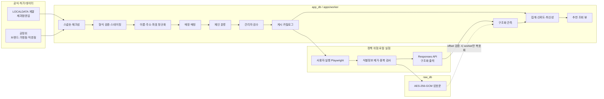
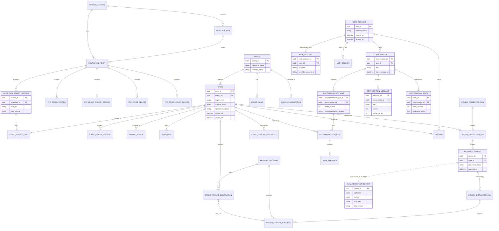

# 빵찾깅 데이터 설계서

[문서 허브](../README.md) · [PRD](../00-product/prd.md) · [추천 기준](../02-recommendation/recommendation-spec.md) · [시스템 구조](../04-architecture/system-architecture.md) · [보안 설계](../06-trust/security-design.md)

**서비스:** 빵찾깅

**챗봇:** 빵빵이

**버전:** 0.2

**기준일:** 2026-07-22

**대상 지역:** 서울특별시

**실행 환경:** 카카오 계정 기반 5인 비공개 MVP, 관리자 로컬 worker

**독자:** 제품·설계·구현·데이터 검수·운영 담당자

> **핵심 결정**
>
> 행정안전부 지방행정 인허가 계열의 `식품_제과점영업` 자료를 후보 원장으로 삼고, 공정거래위원회 자료와 수동 검수로 프랜차이즈 여부를 판별한다. 영업 중인 독립점과 서울 영업점 2~5개를 모두 직영하는 소규모 브랜드만 게시한다. 서비스·계정·대화 데이터는 `app_db`, 리뷰 원문은 `raw_db`로 분리한다. 리뷰 수집기는 정책 위험을 인지한 관리자 로컬 실험이며 접근 제한을 우회하지 않는다. 추천은 구조화 데이터로 결정론적으로 계산하고 LLM은 현재 대화 의도 구조화, 리뷰 특징 추출과 확정된 결과 설명에만 사용한다.

## 1. 목적과 범위

이 문서는 데이터를 어디서 가져오고, 어떤 식별자와 상태를 사용하며, 어떤 검증을 통과한 레코드를 추천에 사용할지 정하는 실행 기준서다. `pnpm workspace` 모노레포와 TypeScript 단일 언어를 사용하고, 저장소는 PostgreSQL, ORM은 Prisma로 통일한다. `apps/worker`가 공공데이터 적재, 정규화, 매칭, 관리자 로컬 리뷰 수집, LLM 추출과 집계를 담당하고, Next.js 기반 `apps/web`은 카카오 계정 기반 사용자 화면과 `/admin`을 제공한다. Redis와 BullMQ는 MVP에 넣지 않으며 작업 큐는 PostgreSQL 작업 테이블과 `FOR UPDATE SKIP LOCKED`로 처리한다. 내부 관련도는 TypeScript가 결정론적으로 계산하고 화면에는 숫자로 공개하지 않는다. LLM은 현재 대화 의도 구조화, 리뷰 특징 추출과 이미 결정된 추천의 설명 생성에만 사용한다.

포함 대상은 다음 두 유형이다.

- 서울에 영업 중인 단일 독립 베이커리
- 서울 영업점이 2~5개이고, 모든 점포가 직영임을 관리자 검수로 확인한 소규모 브랜드

프랜차이즈 가맹사업을 하는 브랜드, 폐업·휴업 사업장, 편의점·마트 안의 제빵 코너, 한시적 팝업, 서울 영업점이 6개 이상인 브랜드는 게시 대상에서 제외한다. 공정위 자료에 없다는 사실만으로 독립점 또는 전 점포 직영이라고 판정하지 않는다.

## 2. 설계 원칙과 용어

### 2.1 설계 원칙

1. **원본과 서비스 판단을 분리한다.** 외부 레코드는 수정하지 않고 버전이 있는 스테이징으로 보존한다. 서비스의 이름, 상태, 분류와 노출 여부는 별도 정규화·검수 레코드로 관리한다.
2. **외부 키를 내부 정체성으로 사용하지 않는다.** `MNG_NO`와 공정위 브랜드관리번호는 출처 식별자이고, Kakao 장소 ID는 요청 중에만 쓰는 임시 조회값이다. 즐겨찾기와 추천 이력은 자체 `bakery_id`와 `store_id`만 참조한다.
3. **출처와 판단 근거를 함께 보존한다.** 모든 게시 매장은 어떤 스냅숏의 어떤 레코드에서 왔는지, 어떤 규칙과 사람이 분류했는지 추적할 수 있어야 한다.
4. **자동화가 확신하지 못하면 숨긴다.** 상태, 매칭, 체인 분류 중 하나라도 충돌하면 `manual_review`로 보내고 추천 뷰에서 제외한다.
5. **민감도가 높은 데이터는 최소화한다.** 리뷰 작성자 정보는 수집하지 않으며, 리뷰 본문 속 식별정보는 저장 전에 제거한다. 사용자의 현재 위치 정확 좌표는 앱 전경의 메모리와 현재 경로 요청에서만 사용한다.
6. **재현 가능성을 버전으로 확보한다.** 정규화 규칙, 체인 판별 규칙, 프롬프트, JSON 스키마, 모델과 집계식의 버전을 실행 레코드에 남긴다.
7. **외부 정책 위험은 기능 경계로 제어한다.** 리뷰 수집은 예약 실행하지 않고 관리자가 로컬에서 장소별로 시작한다. 차단, 로그인, CAPTCHA가 나오면 즉시 끝내며 우회 수단을 두지 않는다.
8. **게시 데이터는 최신성 문턱을 통과해야 한다.** 오래된 원장 상태와 만료된 리뷰 특징은 추천에 조용히 남겨두지 않고 숨기거나 가중치를 낮춘다.

### 2.2 핵심 용어

- **베이커리(`bakery`)**: 사용자에게 보이는 상호 또는 직영 브랜드 단위. 독립점은 보통 하나의 매장만 갖는다.
- **매장(`store`)**: 주소와 영업 상태를 가진 물리적 영업점.
- **출처 레코드**: LOCALDATA 계열, 공정위 등 외부 자료에서 가져온 한 행.
- **후보(`candidate`)**: 공식 원장에서 서울·영업 상태 조건을 통과했지만 게시 승인은 받지 않은 매장.
- **정규화 키**: 이름·주소를 비교하기 위한 파생 문자열. 화면에 표시하지 않고 원문을 대체하지 않는다.
- **체인 분류**: `INDEPENDENT_SINGLE`, `DIRECT_ONLY_SMALL_CHAIN` 등 서비스 포함 정책에 따른 판정.
- **관측(`observation`)**: 메뉴, 관리자 입력, 리뷰 추출 등 한 근거가 말하는 하나의 구조화 특징.
- **근거(`evidence`)**: 관측이 리뷰 원문의 어느 범위를 사용했는지 나타내는 오프셋과 해시. 인용문 자체는 `app_db`에 저장하지 않는다.
- **집계(`aggregate`)**: 최신성, 근거 유효성, 출처 가중치를 적용해 매장·특징별로 계산한 값.
- **기준일**: 원장·리뷰 정책은 2026-07-18, 계정·Kakao 경로는 2026-07-22에 확인했다. 원본 자료의 `basis_date`와는 구분한다.

모든 저장 시각은 `timestamptz` UTC로 기록하고 화면에서만 Asia/Seoul로 표시한다. 날짜만 의미가 있는 인허가일·폐업일·리뷰 게시일은 `date`를 사용한다. 내부 식별자는 애플리케이션에서 생성한 UUIDv7을 사용한다.

## 3. 데이터 출처 카탈로그

| 구분 | 공식 자료와 기준 | 사용 목적 | 수집 주기 | 주요 한계 |
|---|---|---|---|---|
| 후보 원장 | 행정안전부 `식품_제과점영업` OpenAPI·파일데이터 [S1][S2] | 서울 제과점 후보, 영업 상태, 주소, 공공 매장 좌표 | 일 1회 04:00 KST | 지자체 신고 시차, 누락·중복, 빈 좌표, 브랜드·메뉴 정보 없음 |
| 프랜차이즈 브랜드 | 공정위 브랜드 목록과 브랜드 취소 목록 [S5][S8] | 가맹사업 브랜드명, 관리번호, 등록·취소 이력 | 주 1회, 기준연도 갱신 시 재적재 | 미등록·시차·표기 차이. 미일치는 독립점 증명이 아님 |
| 프랜차이즈 점포 | 공정위 브랜드 가맹점 목록 [S6] | 브랜드별 가맹점명과 좌표의 보조 매칭 | 주 1회 | 가맹점 중심 자료이며 직영점 주소의 완전한 목록이 아님 |
| 가맹·직영 규모 | 공정위 브랜드 가맹점·직영점 수 API [S7]와 정보공개서 비교 [S4] | 가맹사업 존재 확인, 직영점 수의 연도별 보조 증거 | 월 1회 메타 확인, 새 기준연도 발견 시 적재 | 집계 수치이므로 개별 점포의 직영 여부를 직접 증명하지 못함 |
| 계정 인증 | KakaoSync·Kakao Login [S19], Auth.js Kakao provider [S20] | 계정 식별, 로그인과 세션 | 사용자 로그인 시 | Kakao 동의는 브라우저 위치 권한을 대신하지 않음; 최소 provider ID만 저장 |
| 외부 장소 조회 | Kakao Local 공식 API [S9] | 요청 시 장소명·주소 확인과 외부 지도 연결 보조 | 사용자 요청 시 | 응답과 `id`를 영속 저장하지 않음. 공식 원장을 대체하지 않음 |
| 경로 | Kakao Maps REST API [S10] | 도보·대중교통 경로 대안과 이동시간 | 사용자 요청·100m 이상 전경 이동 | 정확 출발 좌표가 Kakao에 전송됨; 원본 응답·출발 좌표 비저장 |
| 리뷰 실험 입력 | 카카오맵·네이버지도에서 관리자가 브라우저로 볼 수 있는 최근 리뷰 | 취향 특징 추출 | 관리자 로컬 수동 실행만 | 자동수집 허용 근거가 확인되지 않은 정책 위험 기능 |
| LLM | OpenAI Responses API, Structured Outputs [S13][S14] | 현재 대화 의도, 비식별 리뷰 특징, 확정 추천 설명 | 대화·리뷰 적재 후 | 텍스트가 로컬 밖으로 전송됨. 위치·장소·점수·리뷰 수 생성 금지 |

구 LOCALDATA 포털 UI는 2026-04-16 종료되었지만 같은 지방행정 인허가 계열은 공공데이터포털의 OpenAPI·파일데이터와 공식 파일·샘플 카탈로그에서 계속 확인할 수 있다 [S1][S2][S3]. 따라서 문서에서 “LOCALDATA”는 데이터 계보와 공통 필드 체계를 뜻한다. 런타임 URL은 `source_catalog` 설정으로 관리하고, 현재 OpenAPI 메타데이터의 base URL `apis.data.go.kr/1741000/bakeries`를 코드에 중복 하드코딩하지 않는다. OpenAPI는 **일간** 갱신이며 파일데이터는 **매일 갱신, 2일 전 기준 현행화**이므로 `source_snapshot.basis_date`와 `downloaded_at`을 분리한다.

## 4. LOCALDATA 제과점영업 원장

### 4.1 수집 범위와 상태

파일데이터는 전국 자료를 한 번 받아 원본 스냅숏을 고정한 뒤 `ROAD_NM_ADDR` 또는 `LOTNO_ADDR`가 서울특별시인 행만 스테이징한다. OpenAPI 증분 실행은 `cond[OPN_ATMY_GRP_CD::EQ]=6110000_ALL`, `cond[SALS_STTS_CD::EQ]=01`, 페이지당 최대 100건을 사용하되 주소로 서울을 다시 검증한다. `6110000_ALL`은 요청용 집계 필터이므로 응답의 실제 `OPN_ATMY_GRP_CD`와 같다고 가정하지 않는다. 재현성과 누락 감지를 위해 월 1회 전국 파일 건수와 서울 필터 건수도 비교한다.

1차 후보는 `SALS_STTS_CD = '01'`이고 상태명이 정상 영업을 나타내는 레코드다. 코드와 이름이 충돌하면 하나를 임의로 우선하지 않고 `DQ_STATUS_CONFLICT`를 생성해 게시를 막는다. 상세 상태는 `DTL_SALS_STTS_CD`, `DTL_SALS_STTS_NM`, 폐업일은 `CLSBIZ_YMD`로 보조 확인한다.

| 원본 상태 | 내부 상태 | 게시 처리 |
|---|---|---|
| `SALS_STTS_CD='01'`, 코드·명 일치 | `ACTIVE` 후보 | 다른 검증을 계속 진행 |
| 공식 코드 사전에서 비영업으로 매핑 | `TEMP_CLOSED`, `CLOSED` 또는 `LICENSE_INACTIVE` | 즉시 숨기고 상태 이력 보존 |
| 코드 미등록, 공백, 코드·명 충돌 | `UNKNOWN` | 코드 사전 갱신·관리자 검수 전 게시 금지 |

`02`, `03`, `04`의 의미를 코드에 직접 박지 않는다. 공공데이터포털이 제공하는 개방자치단체·영업상태 코드 파일을 버전 있는 `source_snapshot`으로 적재한 뒤 내부 상태로 매핑한다.

### 4.2 공식 공통 필드 매핑

파일 헤더의 대소문자 차이는 수집 어댑터에서 대문자 표준명으로 매핑한다. 아래 필드를 최소 계약으로 고정하며, 필드가 사라지면 스키마 드리프트로 전체 게시 갱신을 중단한다.

| 공식 필드 | 의미 | 스테이징 타입 | 처리 |
|---|---|---|---|
| `OPN_ATMY_GRP_CD` | 개방자치단체 그룹 코드 | `varchar(20)` | 요청용 집계 필터와 응답 실제 코드를 구분해 보존 |
| `MNG_NO` | 관리번호 | `text` | 출처 내 업무키. 정규화 매장의 PK로 쓰지 않음 |
| `LCPMT_YMD` | 인허가일자 | `date` | 빈 문자열은 `null` |
| `SALS_STTS_CD`, `SALS_STTS_NM` | 영업상태 코드·명 | `varchar(20)`, `text` | 1차 게시 상태와 코드·명 충돌 검증 |
| `DTL_SALS_STTS_CD`, `DTL_SALS_STTS_NM` | 상세 영업상태 코드·명 | `text` | 상세 상태 이력과 충돌 검증 |
| `CLSBIZ_YMD` | 폐업일자 | `date` | 폐업 상태 보조 확인 |
| `BPLC_NM` | 사업장명 | `text` | 표시명 후보, 이름 정규화 입력 |
| `BZSTAT_SE_NM`, `SNTTN_BZSTAT_NM` | 업태 구분·위생 업태명 | `text` | 제과점영업 교차 검증 |
| `TELNO`, `HPG` | 전화번호·홈페이지 | `text` | 원장 검수 보조만 사용하고 LLM 입력에는 넣지 않음 |
| `ROAD_NM_ADDR`, `LOTNO_ADDR` | 도로명·지번주소 | `text` | 원문 보존 후 정규화 |
| `ROAD_NM_ZIP` | 도로명 우편번호 | `varchar(10)` | 주소 검증 보조 |
| `CRD_INFO_X`, `CRD_INFO_Y` | 좌표정보 X·Y | `numeric(15,4)` | EPSG:5174 원 좌표 보존 |
| `DAT_UPDT_SE`, `DAT_UPDT_PNT` | 데이터 갱신 구분·시점 | `text`, `timestamptz` | 증분 적재와 신선도 |
| `LAST_MDFCN_PNT` | 최종 수정 시점 | `timestamptz` | 변경 탐지 |

`(source_snapshot_id, MNG_NO)`에 유니크 제약을 둔다. 한 관리번호가 다음 스냅숏에서 바뀌면 새 버전을 적재하고 기존 행을 덮어쓰지 않는다. 같은 장소가 새 인허가를 받아 다른 `MNG_NO`를 가질 수 있으므로 이름·주소·좌표 매칭을 거쳐 같은 `store_id`에 여러 출처 레코드가 연결될 수 있다.

### 4.3 좌표계

공식 설명의 원 좌표계는 보정계수가 없는 Bessel 중부원점 TM, EPSG:5174다 [S1][S2]. `source_x_5174`, `source_y_5174`를 그대로 보존하고, 버전이 고정된 PROJ 정의로 WGS84(EPSG:4326) 파생 좌표를 만든다.

- 원 좌표: `numeric(15,4)`, `source_crs = 'EPSG:5174'`
- 파생 좌표: `wgs84_lat numeric(9,6)`, `wgs84_lon numeric(9,6)`
- 변환 메타데이터: `transform_version`, `transformed_at`, `coordinate_quality`
- 서울 유효 범위 초기 운영값: 위도 37.40~37.72, 경도 126.70~127.30
- 원 좌표가 이미 경·위도처럼 보이거나 변환 결과가 서울 범위를 벗어나면 재해석하지 않고 `CRS_AMBIGUOUS`로 격리

공공 원장에 있는 **매장 좌표**는 저장 대상이다. 저장하지 않는 정확 좌표는 사용자의 현재 위치와 Kakao Local의 일시 응답 좌표다. 두 규칙을 혼동하지 않는다.

## 5. 공정위 자료와 프랜차이즈 판별 한계

공정위 브랜드 목록과 취소 목록은 브랜드관리번호를 중심으로 등록·취소 상태를 제공하고, 브랜드 가맹점 목록은 기준연도·브랜드관리번호별 가맹점 정보를 제공한다 [S5][S6][S8]. 브랜드 가맹점·직영점 수 API와 정보공개서 비교는 연도별 집계를 보조한다 [S7][S4]. 네 자료는 각각 `ftc_brand_record`, `ftc_brand_cancel_record`, `ftc_store_record`, `ftc_store_count_record`에 적재한다.

판별에 사용할 수 있는 긍정 증거는 다음과 같다.

- 정규화 브랜드명 또는 검수된 별칭이 공정위 브랜드와 일치
- 공정위 가맹점명과 후보 매장명·주소·좌표가 함께 일치
- 어느 기준연도든 가맹점 수가 1개 이상
- 브랜드 등록·취소 이력상 후보 영업기간과 겹치는 가맹사업 기간이 존재

다음은 독립점 또는 전 점포 직영의 증거로 쓰지 않는다.

- 공정위 검색 결과가 없음
- 공정위 자료의 기준연도가 오래되었음
- 직영점 수가 1개 이상이라는 집계만 있음
- 상호 철자나 띄어쓰기가 다름
- LOCALDATA에 동일 이름이 한 곳만 보임

직영점 수는 브랜드 단위 집계이며 개별 주소의 고용·소유 관계를 증명하지 않는다. 따라서 `DIRECT_ONLY_SMALL_CHAIN`은 서울 영업점 2~5개, 공정위 가맹 증거 없음, 공식 브랜드 채널 또는 사업자가 공개한 점포 목록상 같은 운영 주체, 관리자 검수 완료라는 네 조건을 모두 만족해야 한다. 서울 영업점 6개 이상은 전 점포 직영이어도 MVP 범위에서 `CHAIN_TOO_LARGE`로 제외한다.

## 6. 데이터 저장 경계와 접근 권한

### 6.1 이중 데이터베이스

`app_db`는 서비스가 조회할 수 있는 구조화 데이터베이스다. 사용자 계정·인증 연결·세션, 대화·메시지·구조화 상태, 베이커리, 매장, 메뉴, 특징, 집계, 추천, 즐겨찾기, 피드백, 작업 상태와 출처 메타데이터를 저장한다. 정확한 사용자 위치, Kakao 경로 원본 응답, 리뷰 인용문, 암호문, nonce와 인증 태그는 저장하지 않는다.

`raw_db`는 식별정보를 제거한 리뷰 본문 암호문과 복호화·중복 제거·보존에 필요한 최소 메타데이터만 저장한다. `apps/worker`만 쓰기·복호화 권한을 갖는다. `/admin`의 검수 요청은 `app_db` 작업 행을 만들고, worker가 로컬 루프백의 일회성 스트림으로 필요한 최소 범위를 반환한다. `apps/web` 프로세스에는 `raw_db` 접속 문자열이나 암호화 키를 주지 않는다. 응답은 `Cache-Control: no-store`이고 브라우저 저장소에 쓰지 않는다.

두 DB는 물리적으로 분리하고 각각 별도 Prisma schema와 클라이언트를 둔다.

- `prisma/app/schema.prisma` → `AppPrismaClient`
- `prisma/raw/schema.prisma` → `RawPrismaClient`
- 사용자 웹·추천 role → `app_db` 읽기/제한 쓰기만
- worker app role → `app_db` 작업·적재 권한
- worker raw role → `raw_db` 암호문 쓰기·복호화 작업
- 백업 role → `app_db`와 공개 원본 스냅숏의 필요한 읽기만, 애플리케이션 실행과 `raw_db` 접근에 사용 금지

데이터베이스 사이에는 FK를 만들 수 없다. `review_document.review_id`와 `raw_review_ciphertext.review_id`는 같은 UUID를 쓰되, worker의 보상 트랜잭션과 일일 무결성 검사로 양쪽 존재 여부를 확인한다.

### 6.2 정확 위치와 외부 장소 식별자

사용자의 정확한 위도·경도는 사용자가 선택 동의한 뒤 앱의 지도·추천 화면이 전경에 있을 때만 갱신한다. 좌표는 브라우저 메모리와 현재 거리·경로 요청에서만 사용하고 DB, 브라우저 영구 저장소, 대화·LangGraph checkpoint, 로그, 분석 이벤트, 오류 추적과 OpenAI 요청에 기록하지 않는다. 추천 이력에는 사용자가 직접 선택한 경우의 `origin_label`과 `origin_type`만 남길 수 있으며 GPS에서 얻은 정확 주소나 좌표는 남기지 않는다.

Kakao Local 응답의 `id`, `place_url`, 응답 좌표와 전체 응답 JSON은 요청 종료 즉시 버린다. 스키마 어디에도 `kakao_place_id` 열을 만들지 않는다. 즐겨찾기, 대화와 추천 이력·피드백은 자체 `store_id`를 사용한다.

2026-07-21 출시된 Kakao 도보·대중교통 경로 API를 P0의 `KakaoRouteAdapter`로 사용한다 [S10]. 정확한 출발 좌표와 저장된 공식 매장 WGS84 목적지 좌표는 경로 요청 중 Kakao에 전송될 수 있다. 위치가 100m 이상 바뀌거나 사용자가 새로 계산을 요청할 때만 재호출하고, Kakao 원본 경로 응답과 정확한 출발 좌표는 요청 종료 후 폐기한다. 추천 항목에는 `route_status`, 당시 표시한 총 시간·거리의 비민감 요약과 계산 시각만 저장할 수 있으며 과거 화면에서 현재 값처럼 표시하지 않는다. 실제 구현 전 공식 요금·쿼터·호출 제한과 응답 저장 조건을 다시 확인한다.

## 7. 종단 간 파이프라인



실행 순서는 다음과 같다.

1. `source_catalog`에서 URL, 이용 범위, 필수 필드, 예상 주기와 기준일 규칙을 읽는다.
2. 원본을 임시 파일로 내려받아 바이트 수와 SHA-256을 확인한 뒤 변경 불가능한 스냅숏으로 승격한다.
3. 형식·필수 필드·행 수를 검증하고 외부 값은 문자열 상태로 먼저 스테이징한다.
4. 서울과 영업 상태 후보를 선택하고 이름·주소·좌표를 버전이 있는 규칙으로 정규화한다.
5. `MNG_NO`, 이름, 주소, 좌표를 사용해 기존 매장과 매칭한다. 충돌은 자동 합치지 않는다.
6. 공정위 브랜드·가맹점·직영점 자료를 결합해 체인 분류 후보와 신뢰도를 만든다.
7. 자동 확정이 불가능한 후보를 `/admin` 검수 큐로 보내고 승인된 매장만 `PUBLISHED`로 바꾼다.
8. 관리자가 로컬 `/admin`에서 승인 매장을 최대 5개 선택해 리뷰 수집 실험을 시작한다. 수집기는 플랫폼·장소별 최근 30건을 넘지 않는다.
9. 작성자 정보와 본문 속 식별정보를 제거하고, HMAC 중복 검사 후 본문을 즉시 AES-256-GCM으로 암호화한다.
10. 같은 비식별 텍스트를 `store:false` Responses API에 보내 엄격한 JSON 스키마로 특징을 추출한다.
11. worker가 임시 근거 문자열을 원문에서 다시 찾아 UTF-8 바이트 오프셋과 해시를 만들고 문자열은 폐기한다.
12. 유효 관측만 최신성 감쇠를 적용해 집계하고 추천용 뷰를 갱신한다.
13. 품질 문턱에 실패한 스냅숏·매장·특징은 이전 게시 버전을 유지하거나 숨기며, 부분 결과를 섞어 게시하지 않는다.

## 8. 정규화와 매칭

### 8.1 이름 정규화

원문 `BPLC_NM`은 그대로 보존하고 다음 세 값을 별도로 만든다.

- `display_name_norm`: Unicode NFKC, 제로폭 문자 제거, 앞뒤 공백 제거, 연속 공백 축약, 라틴 문자 소문자화
- `brand_key`: `(주)`, `주식회사`, `㈜` 같은 법인 표기와 주소에서 확인된 말단 지점 토큰만 제거
- `name_tokens`: 괄호·구분기호를 토큰 경계로 바꾼 검색용 배열

`베이커리`, `빵집`, `카페` 같은 업종 단어는 동명이인 구분에 필요할 수 있으므로 기본 키에서 삭제하지 않는다. `강남점`, `연남 2호점` 같은 지점 표현은 주소의 행정구역 또는 검수된 브랜드 별칭과 일치할 때만 `brand_key`에서 제거한다. 원문과 정규화 결과가 1:N이 될 수 있으므로 별칭은 `brand_alias`에 출처와 유효기간을 함께 저장한다.

### 8.2 주소 정규화

도로명주소를 우선하되 지번주소도 버리지 않는다.

1. 시도명을 `서울특별시`로 표준화한다.
2. 연속 공백과 불필요한 쉼표를 정리한다.
3. 도로명·건물번호까지의 `address_base`와 층·호·매장명인 `address_unit`을 분리한다.
4. 도로명주소가 없으면 지번주소를 기준키로 사용한다.
5. `address_hash = SHA-256(normalization_version || address_base || address_unit)`을 만든다.

같은 건물이어도 층·호가 다르면 자동 병합하지 않는다. 쇼핑몰 안의 코너 여부는 건물명·층·사업장명을 함께 보고 검수한다.

### 8.3 좌표와 후보 점수

EPSG:5174 원 좌표를 WGS84로 변환한 뒤 다음 신호를 사용한다.

- 동일 출처·동일 `MNG_NO`: 같은 출처 레코드 버전으로 확정
- 정규화 도로명주소와 호수까지 일치: 강한 신호
- 이름 정확 일치 + 좌표 30m 이내: 강한 신호
- 검수된 브랜드 별칭 일치 + 주소 100m 이내: 보조 신호
- 이름 유사도만 높음: 후보 생성만 하고 자동 병합 금지

교차 출처 점수가 0.92 이상이고 주소 충돌이 없을 때만 자동 연결한다. 0.75 이상 0.92 미만은 관리자 검수, 0.75 미만은 별개 후보로 둔다. 이 좌표 범위와 임계값은 공식 기준이 아니라 `coordinate-validation@1.0.0`, `matching@1.0.0`의 초기 운영 휴리스틱이다. 변경 시 평가 세트로 정밀도·재현율을 확인하고 전체 후보를 새 실행으로 재평가한다.

## 9. 체인 분류 알고리즘

체인 분류는 규칙 결과와 최종 승인 상태를 분리한다. 규칙은 다음 순서로 평가한다.

1. `ACTIVE`가 아니거나 서울이 아니면 영업·지역 사유로 제외한다.
2. 편의점·마트·백화점 코너 패턴과 한시 운영 근거가 있으면 각각 `RETAIL_CORNER`, `POPUP` 후보로 보내고 사람이 확인한다.
3. 공정위 가맹점 주소 매칭 또는 해당 브랜드의 가맹점 수 1개 이상이 확인되면 `FRANCHISE_OR_AFFILIATE`로 제외한다. 동일 브랜드의 직영점도 서비스 범위에서 제외한다.
4. 정규화 브랜드명이 공정위 브랜드와 일치하지만 점포 연결이 불확실하면 `UNKNOWN`으로 숨기고 검수한다.
5. 서울 후보 중 같은 검수 브랜드가 2~5개이고, 공식 브랜드 채널의 점포 목록과 관리자 검수로 전 점포 직영을 확인하면 `DIRECT_ONLY_SMALL_CHAIN`으로 승인한다.
6. 같은 브랜드의 서울 영업점이 6개 이상이면 `CHAIN_TOO_LARGE`로 제외한다.
7. 반복 브랜드가 없고 프랜차이즈·코너·팝업 신호가 없는 단일점은 `INDEPENDENT_SINGLE` 후보가 되지만, 공정위 미일치만으로 자동 게시하지 않고 관리자 승인을 거친다.

분류 결과에는 `rule_version`, `evidence_source_ids`, `confidence`, `reason_codes`, `decided_by`, `decided_at`을 저장한다. 사람의 override는 원래 규칙 결과를 덮어쓰지 않고 새 이력으로 추가한다. 최종 게시 조건은 `classification_status = 'APPROVED'`다.

간단한 TypeScript 계약 예시는 다음과 같다.

```ts
type ChainClass =
  | "INDEPENDENT_SINGLE"
  | "DIRECT_ONLY_SMALL_CHAIN"
  | "FRANCHISE_OR_AFFILIATE"
  | "CHAIN_TOO_LARGE"
  | "RETAIL_CORNER"
  | "POPUP"
  | "UNKNOWN";

type ClassificationDecision = {
  candidate: ChainClass;
  confidence: number;       // 0..1
  reasonCodes: string[];
  ruleVersion: "chain-classifier@1.0.0";
  requiresHumanApproval: true;
};
```

## 10. 논리 ERD



카탈로그 관계의 중심은 `bakery 1:N store`, 사용자 관계의 중심은 `user_account 1:N conversation`이다. 독립점도 베이커리·매장 구조를 사용해 추천과 즐겨찾기의 키 체계를 통일한다. 새 대화는 독립된 `conversation_state`로 시작하며 다른 대화의 취향을 자동 상속하지 않는다. `store_source_link`는 한 매장에 여러 시점의 `MNG_NO` 또는 공정위 보조 레코드를 연결한다. 리뷰의 구조화 메타데이터와 암호문은 같은 `review_id`를 공유하지만 물리 FK는 없다. `review_feature_evidence`는 LLM 실행과 특징 분류를 연결하고 실제 관측은 검증된 근거만 참조한다.

## 11. 상태 enum과 전이

| enum | 값 | 규칙 |
|---|---|---|
| `OperationalStatus` | `ACTIVE`, `TEMP_CLOSED`, `CLOSED`, `LICENSE_INACTIVE`, `UNKNOWN` | 원장 상태가 비활성으로 바뀌면 즉시 추천 뷰에서 제외 |
| `VisibilityStatus` | `CANDIDATE`, `PUBLISHED`, `HIDDEN`, `EXCLUDED` | `PUBLISHED`는 관리자 승인과 품질 문턱을 모두 요구 |
| `ClassificationStatus` | `PENDING`, `APPROVED`, `REJECTED`, `SUPERSEDED` | 한 베이커리에 current 행은 하나만 허용 |
| `ReviewJobStatus` | `QUEUED`, `RUNNING`, `SUCCEEDED`, `PARTIAL`, `STOPPED_POLICY`, `STOPPED_ACCESS`, `STOPPED_LIMIT`, `FAILED`, `CANCELLED` | 정책·접근 중단은 자동 재시도하지 않음 |
| `ReviewDocumentStatus` | `SEALED`, `EXTRACTED`, `REJECTED_PII`, `EXPIRED`, `DELETED` | 평문 상태는 존재하지 않음 |
| `ExtractionStatus` | `QUEUED`, `RUNNING`, `VALIDATED`, `REQUIRES_REVIEW`, `FAILED_RETRYABLE`, `FAILED_FINAL`, `SUPERSEDED` | 스키마·근거 검증 완료 후에만 `VALIDATED` |
| `EvidenceStatus` | `VERIFIED`, `AMBIGUOUS`, `INVALID`, `EXPIRED` | `VERIFIED`만 집계 입력 |
| `IssueSeverity` | `INFO`, `WARN`, `ERROR`, `BLOCKER` | `BLOCKER`가 있는 스냅숏은 게시 승격 금지 |

`RUNNING` 작업은 15분 heartbeat가 없으면 worker가 `FAILED`로 바꾸되, 정책·접근 중단 상태는 유지한다. 폐업과 삭제는 되돌릴 수 있는 화면 숨김과 복구 불가능한 원문 삭제를 구분한다.

## 12. 핵심 테이블 사전

### 12.1 출처·적재·정규화

| 테이블 / 목적 | PK·FK | 주요 컬럼 예시 | 중요 인덱스 / 보존 |
|---|---|---|---|
| `source_catalog` — 출처 계약 | PK `source_id`; self FK 없음 | `source_key varchar(80)`, `official_url text`, `update_cadence`, `required_fields jsonb`, `terms_checked_at` | UQ `source_key`; 영구 |
| `ingestion_run` — 적재 실행 | PK `run_id`; FK `source_id` | `status`, `started_at`, `finished_at`, `row_count`, `error_code`, `worker_version` | `(source_id, started_at desc)`, partial `(status)`; 400일 |
| `source_snapshot` — 불변 원본 매니페스트 | PK `snapshot_id`; FK `source_id`, `run_id` | `sha256 bytea`, `byte_size bigint`, `basis_date date`, `downloaded_at`, `local_path` | UQ `(source_id, sha256)`; 메타 영구, 공개 원본 파일 730일 |
| `localdata_bakery_record` — 원장 버전 | PK `record_id`; FK `snapshot_id` | `mng_no text`, `sals_stts_cd`, 주소, `crd_info_x numeric(15,4)`, `crd_info_y`, 원본 `payload jsonb` | UQ `(snapshot_id,mng_no)`; `(sals_stts_cd)`, GIN `payload`; 730일 |
| `ftc_brand_record` — 브랜드 목록 | PK `record_id`; FK `snapshot_id` | `basis_year smallint`, `brand_management_no text`, `brand_name`, `registration_status` | UQ `(snapshot_id,brand_management_no)`; trigram `brand_name`; 영구 |
| `ftc_brand_cancel_record` — 브랜드 취소 목록 | PK `record_id`; FK `snapshot_id` | `basis_year`, `brand_management_no`, `brand_name`, `cancelled_at` | `(brand_management_no,cancelled_at)`; 영구 |
| `ftc_store_record` — 가맹점 목록 | PK `record_id`; FK `snapshot_id` | `brand_management_no`, `store_name`, `source_lat`, `source_lon`, `basis_year` | `(brand_management_no,basis_year)`, trigram `store_name`; 5년 후 압축 보관 |
| `ftc_store_count_record` — 가맹·직영 집계 | PK `record_id`; FK `snapshot_id` | `basis_year`, `brand_management_no`, `franchise_count int`, `company_owned_count int` | UQ `(brand_management_no,basis_year,snapshot_id)`; 영구 |
| `normalization_version` — 규칙 매니페스트 | PK `version_id` | `name_version`, `address_version`, `crs_version`, `code_sha256` | UQ 세 버전 조합; 영구 |
| `match_candidate` — 교차 출처 매칭 | PK `match_id`; FK `store_id`; 출처 행은 다형 참조 | `source_record_type`, `source_record_id`, `score numeric(4,3)`, `signals jsonb`, `status`, `matcher_version` | `(status,score desc)`, UQ `(store_id,source_record_type,source_record_id,matcher_version)`; 출처별 FK 대신 worker 무결성 검사, 해결 후 180일 |
| `collection_policy_snapshot` — 리뷰 정책 사전검사 | PK `policy_snapshot_id`; FK `source_id` | `terms_url`, `robots_url`, `content_sha256`, `checked_at`, `decision` | `(source_id,checked_at desc)`; 730일 |
| `data_quality_issue` — 품질 위반 | PK `issue_id`; FK `run_id`, 선택 `store_id` | `rule_code`, `severity`, `entity_ref`, `details_redacted jsonb`, `resolved_at` | partial `(severity,status)`; 400일 |

### 12.2 카탈로그와 분류

| 테이블 / 목적 | PK·FK | 주요 컬럼 예시 | 중요 인덱스 / 보존 |
|---|---|---|---|
| `bakery` — 사용자 표시 단위 | PK `bakery_id` | `canonical_name`, `brand_key`, `visibility_status`, `created_at` | trigram `canonical_name`, `(visibility_status)`; 삭제 요청 전까지 |
| `store` — 물리 매장 | PK `store_id`; FK `bakery_id` | 주소 원문·정규화, `region_code char(2)`, `visibility_status`, `operational_status`, `wgs84_lat numeric(9,6)`, `wgs84_lon`, `district_code`, `source_fresh_at` | `(region_code,visibility_status,operational_status,district_code)`, `(wgs84_lat,wgs84_lon)`, trigram `display_name`; 삭제 후 tombstone만 |
| `store_source_link` — 계보 연결 | PK `link_id`; FK `store_id`, `source_id` | `source_record_type`, `source_record_id uuid`, `link_confidence`, `valid_from`, `valid_to` | UQ current `(source_id,source_record_id)`; 영구 감사 이력 |
| `store_status_history` — 상태 변화 | PK `history_id`; FK `store_id`, `snapshot_id` | `from_status`, `to_status`, `effective_date`, `reason_code` | `(store_id,effective_date desc)`; 영구 |
| `brand_alias` — 검수 별칭 | PK `alias_id`; FK `bakery_id` | `alias_raw`, `alias_norm`, `source_kind`, `valid_from`, `valid_to` | `(alias_norm)`, trigram `alias_norm`; 영구 |
| `chain_classification` — 분류 이력 | PK `classification_id`; FK `bakery_id`, `run_id` | `chain_class`, `confidence`, `reason_codes jsonb`, `rule_version`, `status`, `is_current` | UQ partial `(bakery_id) WHERE is_current`; `(chain_class,status)`; 영구 |
| `manual_review` — 사람 검수 | PK `manual_review_id`; 선택 FK `store_id`, `bakery_id` | `review_type`, `status`, `decision`, `reason`, `evidence_refs jsonb`, `decided_at` | `(status,created_at)`, `(store_id)`; 730일 |
| `menu_item` — 메뉴 사실 | PK `menu_item_id`; FK `store_id` | `name`, `category`, `price_krw int`, `available_status`, `observed_at`, `source_kind` | `(store_id,available_status)`, trigram `name`; 비활성 후 365일 |

### 12.3 특징·리뷰·LLM

| 테이블 / 목적 | PK·FK | 주요 컬럼 예시 | 중요 인덱스 / 보존 |
|---|---|---|---|
| `feature_taxonomy` — 허용 특징 사전 | PK `feature_id` | `feature_key varchar(80)`, `label_ko`, `value_type`(`AXIS_0_TO_4`/`PRESENCE`), `taxonomy_version`, `active` | [LLM 계약](../03-contracts/llm-contracts.md)의 `BakeryTasteFeatureV1`과 같은 분류·축·태그; UQ `(taxonomy_version,feature_key)`; 영구 |
| `review_collection_run` — 관리자 실행 단위 | PK `collection_run_id` | `accepted_risk_token_hash`, `status`, `requested_place_count` CHECK 1~5, `max_actions` CHECK ≤200, `deadline_at`, `started_at`, `finished_at` | partial `(status,started_at)`, `(started_at desc)`; 400일, 실행당 장소 상한의 감사·동시성 경계 |
| `review_collection_job` — 장소·플랫폼 수집 작업 | PK `job_id`; FK `collection_run_id`, `store_id`, `policy_snapshot_id` | `provider`, `status`, `requested_limit` CHECK 1~30, `stop_reason`, `heartbeat_at` | partial `(status,created_at)`, `(collection_run_id,store_id,provider)`, `(store_id,provider,created_at desc)`; 400일 |
| `review_document` — 비민감 리뷰 메타 | PK `review_id`; FK `store_id`, `job_id` | `provider`, `captured_at`, `published_date`, `document_status`, `raw_expires_at` | `(store_id,captured_at desc)`, `(document_status,raw_expires_at)`; 365일 |
| `prompt_version` — 프롬프트 원장 | PK `prompt_id` | `prompt_key`, `semantic_version`, `template_sha256`, `template_text`, `active` | UQ `(prompt_key,semantic_version)`; 영구 |
| `review_extraction_run` — 모델 실행 | PK `extraction_id`; FK `review_id`, `prompt_id` | `requested_model_id`, `resolved_model_id`, `schema_version`, `status`, `request_tokens`, `response_tokens`, `store_disabled` | `(review_id,created_at desc)`, `(status)`; 365일 |
| `review_feature_evidence` — 오프셋 근거 | PK `evidence_id`; FK `extraction_id`, `feature_id` | `start_utf8 int`, `end_utf8 int`, `document_hmac bytea`, `span_sha256 bytea`, `status` | UQ `(extraction_id,feature_id,start_utf8,end_utf8)`; 365일, 원문 만료 시 `EXPIRED` |
| `store_feature_observation` — 개별 구조화 신호 | PK `observation_id`; FK `store_id`, `feature_id`, 선택 `evidence_id` | `value_num numeric(4,2)`, `value_bool boolean`, `confidence`, `observed_at`, `expires_at`, `source_kind` | 축은 0~4, 존재 신호는 boolean; `(store_id,feature_id,expires_at)`, 리뷰 유래 180일 |
| `aggregate_build_run` — 집계 실행 | PK `aggregate_run_id` | `formula_version`, `status`, `source_cutoff_at`, `row_count`, `built_at` | `(built_at desc)`; 400일 |
| `store_feature_aggregate` — 추천 입력 | 복합 PK `(store_id,feature_id)`; FK 양쪽 | `score`, `confidence`, `effective_n`, `freshness`, `last_observed_at`, `aggregate_run_id` | `(feature_id,score desc)`, `(store_id,confidence)`; 매 실행 upsert, 이전 스냅숏 90일 |

### 12.4 계정·대화·추천·운영·raw

| 테이블 / 목적 | PK·FK | 주요 컬럼 예시 | 중요 인덱스 / 보존 |
|---|---|---|---|
| `user_account` — 서비스 사용자 | PK `user_id` | `account_status`, 선택 `display_nickname`, `created_at`, `deleted_at`; 이메일·전화번호·생일·성별 없음 | `(account_status)`, 활성 시 `deleted_at IS NULL`; 탈퇴 시 삭제 또는 tombstone 최소화 |
| `auth_account` — Kakao 연결 | PK `auth_account_id`; FK `user_id` | `provider='kakao'`, `provider_account_id`, `linked_at`, `unlink_status`; token 평문 저장 금지 | UQ `(provider,provider_account_id)`, `(user_id)`; 탈퇴 시 삭제, unlink 실패는 비민감 작업만 유지 |
| `auth_session` — 로그인 세션 | PK `session_id`; FK `user_id` | `session_token_hash`, `expires_at`, `created_at`, `last_seen_at` | UQ `session_token_hash`, `(user_id,expires_at)`; 만료·로그아웃·탈퇴 시 삭제 |
| `conversation` — 계정별 대화 | PK `conversation_id`; FK `user_id` | `title`, `created_at`, `last_message_at`, `deleted_at` | `(user_id,last_message_at desc)`; 사용자가 삭제하거나 탈퇴할 때까지 |
| `conversation_message` — 대화 원문 | PK `message_id`; FK `conversation_id` | `role`, `content`, `sequence_no`, `created_at`, `idempotency_key`; 정확 좌표·토큰 메타 없음 | UQ `(conversation_id,sequence_no)`, UQ `(conversation_id,idempotency_key)`; 대화와 cascade 삭제 |
| `conversation_state` — LangGraph checkpoint | PK `state_id`; FK `conversation_id` | `state_version`, `schema_version`, `structured_state jsonb`, `clarification_count`, `created_at`; 정확 좌표·의료 필드·계정 전체 장기 취향 없음 | UQ `(conversation_id,state_version)`, current 조회 인덱스; 대화와 cascade 삭제 |
| `favorite` — 즐겨찾기 | 복합 PK `(user_id,store_id)` | `created_at` | `(user_id,created_at desc)`; 사용자가 해제할 때까지 |
| `recommendation_run` — 대화 내 추천 실행 | PK `recommendation_run_id`; FK `conversation_id` | `state_version`, `intent_schema_version`, `recommendation_version`, `data_snapshot_version`, `sort_mode`, 선택 `origin_type`, `origin_label`, `created_at`, `context_hash`; 정확 좌표 없음 | `(conversation_id,created_at desc)`, UQ `(conversation_id,context_hash,recommendation_version)`; 대화와 cascade 삭제 |
| `recommendation_item` — 순위 결과 | 복합 PK `(recommendation_run_id,store_id)` | `rank int`, 내부 `relevance numeric(8,7)` CHECK 0~1, `route_status`, 선택 `route_summary jsonb`, `route_calculated_at`, `reason_feature_ids uuid[]`; Kakao 원본 응답 없음 | UQ `(recommendation_run_id,rank)`; 대화와 cascade 삭제, API/UI에 내부 관련도 비공개 |
| `user_feedback` — 추천 피드백 | PK `feedback_id`; FK `recommendation_run_id`, `store_id`, `user_id` | `feedback_type`, `value`, `created_at`; 다른 대화 순위 학습에 자동 사용하지 않음 | `(user_id,created_at desc)`, `(store_id)`; 대화 삭제·탈퇴 또는 사용자 개별 삭제까지 |
| `deletion_tombstone` — 삭제 재적용 | PK `tombstone_id` | `entity_type`, `entity_id`, `deleted_at`, `reason_code`, `expires_at`; 본문·키 없음 | UQ `(entity_type,entity_id)`; 400일 |
| `raw_review_ciphertext` (`raw_db`) — 암호문 | PK `review_id`; 논리키 `store_id` | `provider`, `ciphertext bytea`, `nonce bytea`, `auth_tag bytea`, `key_version`, `aad_version`, `content_hmac`, `retention_until` | UQ `(store_id,provider,content_hmac)`, `(retention_until)`; 30일 후 hard delete |
| `raw_key_rotation_run` (`raw_db`) — 키 회전 감사 | PK `rotation_id` | `from_version`, `to_version`, `status`, `row_count`, `started_at`, `finished_at`; 키 본문 없음 | `(started_at desc)`; 400일 |

## 13. 추천 조회용 뷰

추천 경로는 기본 테이블을 직접 조합하지 않고 다음 계층을 사용한다.

- `v_recommendable_store`: 서울, `ACTIVE`, `PUBLISHED`, 최신 원장, 허용 체인 분류만 노출
- `mv_store_feature_vector`: 매장별 유효 특징을 JSONB 벡터로 집계, `aggregate_build_run` 성공 후 refresh
- `v_recommendation_candidate`: 두 결과를 결합하고 신뢰도 0.55 미만 특징을 제거

```sql
CREATE VIEW v_recommendable_store AS
SELECT s.store_id, s.bakery_id, b.canonical_name,
       s.district_code, s.wgs84_lat, s.wgs84_lon
FROM store s
JOIN bakery b ON b.bakery_id = s.bakery_id
JOIN chain_classification c
  ON c.bakery_id = b.bakery_id AND c.is_current
WHERE s.operational_status = 'ACTIVE'
  AND s.region_code = '11'
  AND s.visibility_status = 'PUBLISHED'
  AND b.visibility_status = 'PUBLISHED'
  AND c.status = 'APPROVED'
  AND c.chain_class IN ('INDEPENDENT_SINGLE','DIRECT_ONLY_SMALL_CHAIN')
  AND s.source_fresh_at >= now() - interval '30 days';
```

정확한 사용자 원점은 이 뷰, 계정·대화·추천 테이블에 들어가지 않는다. 웹 요청이 후보 매장 좌표를 받아 TypeScript로 거리와 내부 관련도를 계산하고 Kakao 경로를 일시 보강한 뒤 원점 좌표와 원본 경로 응답을 폐기한다. 내부 관련도는 추천 재현을 위해 저장할 수 있지만 사용자 API와 화면에는 숫자로 공개하지 않는다.

## 14. 로컬 Playwright 리뷰 수집 작업

### 14.1 기능 성격

이 수집기는 자동수집이 정책상 허용되었다는 의미가 아니다. 2026-07-18 확인 결과 자동 수집 허용 근거가 확인되지 않았고, 관련 약관과 robots.txt는 자동 접근·복제에 제한을 둔다 [S11][S12][S16][S17]. 관리자 로컬 실행, 비영리, 낮은 빈도와 암호화는 그 제한을 해소하지 않는다. 비공개 사용자 웹에는 이 기능을 배포하지 않으며 공개 배포 전에는 제거하거나 리뷰 저장과 재이용을 명시적으로 허용하는 공식 API·서면 라이선스로 교체한다.

### 14.2 실행 한도

- 관리자가 로컬 `/admin`에서 장소를 직접 선택하고 매 실행 확인 문구에 동의
- 실행당 최대 5개 장소
- 장소·플랫폼별 최근 리뷰 최대 30건
- 브라우저 페이지 1개, 병렬 수집 없음
- 페이지 이동·다음 동작 사이 2~5초의 무작위 간격
- 작업 최대 15분, 전체 동작 최대 200회
- 예약, 백그라운드 반복, 무한 스크롤 없음

각 `/admin` 실행은 먼저 `review_collection_run` 한 행을 만들고, 선택한 장소·플랫폼 조합을 하위 `review_collection_job`으로 생성한다. `requested_place_count` CHECK, 같은 트랜잭션의 장소 수 검증, 실행별 worker advisory lock을 함께 사용해 UI를 우회한 요청도 5개 장소를 넘지 못하게 한다. worker는 run의 `deadline_at` 또는 `max_actions`에 도달하면 남은 job을 `STOPPED_LIMIT`으로 종료한다.

### 14.3 어댑터

```ts
interface ReviewSourceAdapter {
  readonly provider: "KAKAO_MAP" | "NAVER_MAP";
  preflight(
    userAcceptedRiskToken: string
  ): Promise<"RISK_ACCEPTED" | "STOP_SNAPSHOT_CHANGED" | "STOP_ACCESS">;
  collectVisibleReviews(
    page: import("playwright").Page,
    target: { storeId: string; query: string },
    limit: 30
  ): AsyncIterable<{ body: string; publishedDate?: string }>;
}
```

기준일 스냅숏에 자동수집 제한이 있다는 사실만으로 실행 코드를 비활성화하지는 않는다. 사용자가 현재 실행의 위험 문구를 확인하면 `RISK_ACCEPTED`로 시작할 수 있다. 다만 약관·robots 내용이 마지막 검토본과 달라졌거나 접근 거부가 감지되면 새 위험을 알 수 없으므로 실행을 멈추고 다시 확인한다. 이 절차는 허가 판정이 아니라 사용자의 위험 수용과 변경 감지를 기록하는 장치다.

어댑터는 사용자가 볼 수 있는 렌더링 DOM만 읽는다. 비공개 JSON/XHR 엔드포인트 재현, 네트워크 응답 가로채기, 모바일 내부 API 호출, 세션 쿠키 재사용을 구현하지 않는다. 로그인 자동화, CAPTCHA 해결, 프록시·IP 회전, stealth 플러그인, 브라우저 지문 위장, User-Agent 순환도 금지한다.

### 14.4 즉시 중단 조건

다음 중 하나가 보이면 현재 장소와 전체 실행을 즉시 중단하고 자동 재시도하지 않는다.

- CAPTCHA 또는 사람 확인
- 로그인·재로그인 요구
- HTTP 401, 403, 429
- 접근 거부, 비정상 트래픽, 자동화 제한 문구
- robots 또는 약관 해시가 마지막 승인 스냅숏과 다름
- DOM 구조가 승인된 선택자 계약과 달라 본문과 작성자 영역을 구분할 수 없음
- 최근 30건 또는 동작·시간 상한 도달

`STOPPED_POLICY`, `STOPPED_ACCESS`, `STOPPED_LIMIT` 중 하나와 비민감 사유 코드만 기록한다. 스크린샷, 비디오, Playwright trace, HAR, 다운로드, 영구 브라우저 프로필은 만들지 않는다. 임시 사용자 데이터 디렉터리는 작업 종료 후 삭제하고 브라우저 캐시도 보존하지 않는다.

## 15. 리뷰 개인정보 제거, 중복 방지와 암호화

### 15.1 수집하지 않는 정보

작성자 닉네임, 사용자 ID, 프로필 URL·사진, 작성자의 다른 활동, 좋아요 사용자, 정확한 작성 시각, 리뷰 사진과 EXIF는 수집하지 않는다. 본문 안의 URL, 이메일, 전화번호, 계정 핸들, 주민·사업자 식별번호 패턴을 제거한다. 사람 이름이나 건강·결제 등 민감정보가 의심되는데 안전하게 지울 수 없으면 리뷰 전체를 `REJECTED_PII`로 폐기한다. 이미지 OCR은 하지 않는다.

수집 직후 메모리에서 Unicode NFKC, 제로폭 문자 제거, 줄바꿈 표준화와 연속 공백 축약을 수행한다. 이것이 `text_normalization_version = review-text@1.0.0`인 기준 평문이다. 식별정보 제거 전 본문은 파일, DB, 로그에 쓰지 않는다.

### 15.2 중복 해시

짧은 리뷰는 일반 SHA-256만 저장하면 사전 대입 위험이 있으므로 별도 비밀키를 사용하는 HMAC-SHA-256을 쓴다.

`content_hmac = HMAC-SHA-256(dedupe_key, store_id || provider || normalized_deidentified_text)`

`dedupe_key`는 암호화 키와 분리한다. `(store_id, provider, content_hmac)` 유니크 제약으로 같은 리뷰의 반복 수집을 막는다. HMAC 값은 로그에 남기지 않는다.

### 15.3 AES-256-GCM 필드

```sql
CREATE TABLE raw_review_ciphertext (
  review_id uuid PRIMARY KEY,
  store_id uuid NOT NULL,
  provider text NOT NULL,
  ciphertext bytea NOT NULL,
  nonce bytea NOT NULL CHECK (octet_length(nonce) = 12),
  auth_tag bytea NOT NULL CHECK (octet_length(auth_tag) = 16),
  key_version varchar(40) NOT NULL,
  aad_version smallint NOT NULL DEFAULT 1,
  content_hmac bytea NOT NULL CHECK (octet_length(content_hmac) = 32),
  created_at timestamptz NOT NULL,
  retention_until timestamptz NOT NULL,
  UNIQUE (store_id, provider, content_hmac)
);
```

worker는 32바이트 키와 매 레코드마다 새로 생성한 12바이트 nonce로 AES-256-GCM 암호화를 수행한다. AAD는 `review_id | store_id | provider | text_normalization_version | aad_version`의 길이 접두 canonical encoding이다. 인증 태그 검증에 실패하면 평문을 반환하지 않고 `RAW_AUTH_FAILED`를 기록한다.

### 15.4 키 관리와 로그 금지

- 키는 Windows Credential Manager 또는 OS 자격증명 저장소에서 실행 시 주입
- DB, `.env` 파일, Git, 소스 코드, 백업 매니페스트에 키 저장 금지
- `key_version`만 DB에 저장
- 새 쓰기는 현재 키, 기존 행은 작은 배치로 복호화·재암호화
- 모든 live 행이 새 키로 넘어가고 인증 태그 검증을 통과한 뒤에만 구 키 폐기
- 앱 로그에는 `job_id`, 건수, 소요시간, 상태·오류 코드만 기록
- 리뷰 본문, 근거 문자열, 암호문, nonce, 인증 태그, HMAC, 프롬프트 입력, 모델 응답 원문을 로그에 기록하지 않음
- 예외 객체와 DOM 스냅숏을 그대로 직렬화하지 않음
- 로컬 클라우드 동기화 폴더에 raw DB·브라우저 임시 폴더를 두지 않음

암호화된 리뷰는 수집 시각부터 30일 뒤 `retention_until`에 hard delete한다. 추출이 끝났더라도 관리자가 대상 원문 삭제를 요청하면 즉시 삭제한다. 암호화는 수집 권한을 만들어 주는 수단이 아니라 유출 영향을 줄이는 안전조치다.

## 16. LLM 특징 추출

### 16.1 모델·프롬프트·스키마 버전

기준일의 초기 설정은 다음과 같다.

| 항목 | 값 | 저장 위치 |
|---|---|---|
| API | OpenAI Responses API | 코드 계약 |
| 요청 모델 ID | `gpt-5.6-luna` | 환경변수 `OPENAI_REVIEW_MODEL`, 실행 행에도 복제 |
| 계획 가격 기준 | 입력 US$1.00 / 100만 토큰, 출력 US$6.00 / 100만 토큰 [S15] | 운영 문서 기준일 표 |
| 프롬프트 | `review-feature-ko@1.0.0` | `prompt_version` |
| 출력 스키마 | `review-features@1.0.0` | 코드와 `review_extraction_run` |
| 저장 설정 | `store: false`, `background: false` | 요청과 실행 감사값 |

요청한 `requested_model_id`와 응답이 반환한 `resolved_model_id`를 함께 남긴다. 공식 문서에 별도 불변 snapshot ID가 제공되지 않으면 날짜형 ID를 만들어 쓰지 않는다. 가격은 기준일 계산값이며 런타임 비용은 실제 사용량과 당시 공식 가격으로 다시 계산한다. `store:false`는 응답을 API에서 다시 가져오기 위한 애플리케이션 상태 저장을 끄지만 조직 차원의 Zero Data Retention을 보장하지 않는다. OpenAI API 입력·출력은 기본적으로 모델 학습에 사용되지 않지만, 기본 abuse-monitoring 로그는 최대 30일 보존될 수 있다 [S14]. 리뷰 텍스트가 로컬 PC 밖으로 전송된다는 사실을 `/admin` 실행 전에 표시한다.

프롬프트의 역할은 [LLM 계약](../03-contracts/llm-contracts.md)의 `BakeryTasteFeatureV1`과 같은 분류·0~4 축·태그만 찾고, 값과 모델 확신도, 짧은 근거 문자열을 반환하는 것이다. 매장명, 별점, 리뷰 수, 메뉴 가격, 내부 관련도, 영업 상태를 생성하거나 추론하라는 지시를 넣지 않는다. 정보가 없으면 빈 배열과 기권 사유를 반환한다. 모델 확신도는 검수 우선순위에만 쓰고 추천 집계 가중치로 사용하지 않는다.

### 16.2 구조화 출력 JSON 스키마

아래는 핵심을 보여 주는 축약본이다. 실제 스키마도 `additionalProperties: false`, 모든 필드 required, 허용 특징 enum이라는 원칙을 유지한다.

```json
{
  "type": "object",
  "additionalProperties": false,
  "required": ["schema_version", "document_id", "signals", "pii_suspected", "abstain_reason"],
  "properties": {
    "schema_version": { "type": "string", "const": "review-features@1.0.0" },
    "document_id": { "type": "string", "format": "uuid" },
    "signals": {
      "type": "array",
      "maxItems": 12,
      "items": {
        "type": "object",
        "additionalProperties": false,
        "required": ["feature_key", "value_type", "axis_value", "present", "model_confidence", "evidence_texts"],
        "properties": {
          "feature_key": {
            "type": "string",
            "enum": [
              "category.SOURDOUGH", "category.BAGUETTE", "category.CIABATTA_FOCACCIA",
              "category.BAGEL", "category.SANDWICH", "category.CROISSANT_DANISH",
              "category.BRIOCHE", "category.SHOKUPAN", "category.SAVORY_BREAD",
              "category.SWEET_BREAD", "category.DONUT_FRIED", "category.CAKE_TART_COOKIE",
              "category.OTHER", "texture.crustiness", "texture.chewiness",
              "texture.moisture", "texture.airiness", "texture.flakiness",
              "taste.sweetness", "taste.saltiness", "taste.acidity",
              "taste.butteriness", "taste.richness", "tag.WHOLE_GRAIN",
              "tag.FERMENTED", "tag.NUTTY", "tag.CHOCOLATE", "tag.FRUIT",
              "tag.CHEESE", "tag.CREAM", "tag.RED_BEAN", "tag.HERB",
              "tag.SPICY", "tag.SESAME", "tag.PLAIN"
            ]
          },
          "value_type": { "type": "string", "enum": ["AXIS_0_TO_4", "PRESENCE"] },
          "axis_value": { "type": ["integer", "null"], "minimum": 0, "maximum": 4 },
          "present": { "type": ["boolean", "null"] },
          "model_confidence": { "type": "number", "minimum": 0, "maximum": 1 },
          "evidence_texts": {
            "type": "array",
            "minItems": 1,
            "maxItems": 3,
            "items": { "type": "string", "minLength": 2, "maxLength": 160 }
          }
        }
      }
    },
    "pii_suspected": { "type": "boolean" },
    "abstain_reason": {
      "type": ["string", "null"],
      "enum": ["NO_RELEVANT_SIGNAL", "AMBIGUOUS", "PII_RISK", null]
    }
  }
}
```

업무 검증은 `AXIS_0_TO_4`이면 `axis_value`만, `PRESENCE`이면 `present`만 값을 갖도록 강제한다. 부재 언급이 없는 것은 `present=false`가 아니라 신호 없음이다. 식이·알레르기·교차접촉 안전은 추출 스키마와 추천 판정에 포함하지 않는다. 방문 목적, 분위기, 가격과 웨이팅도 리뷰만으로 확정하지 않고 현재 추천 특징 집계에서 제외한다.

요청 형태는 짧게 다음과 같다.

```ts
await client.responses.create({
  model: env.OPENAI_REVIEW_MODEL,
  store: false,
  background: false,
  input: deidentifiedText,
  text: { format: { type: "json_schema", name: "review_features", strict: true, schema } }
});
```

### 16.3 근거 오프셋

LLM이 반환한 `evidence_texts`는 DB에 바로 넣지 않는다. worker가 암호화 직전과 동일한 기준 평문에서 각 문자열을 정확히 찾는다.

1. 기준 평문의 HMAC과 `text_normalization_version`을 확인한다.
2. 근거 문자열이 정확히 한 번 나타나면 UTF-8 바이트 기준 반개구간 `[start_utf8, end_utf8)`을 계산한다.
3. `span_sha256 = SHA-256(해당 UTF-8 바이트)`를 계산한다.
4. 동일 문자열이 여러 번 나오면 `AMBIGUOUS`, 없으면 `INVALID`로 처리한다.
5. `VERIFIED`일 때만 관측을 만든 뒤 근거 문자열과 모델 응답 원문을 메모리에서 폐기한다.

관리자 검수 시 worker가 raw 암호문을 복호화하고 `document_hmac`, 인증 태그, 오프셋, `span_sha256`을 순서대로 검증한 뒤 해당 범위만 일시 표시한다. `app_db`에는 인용문을 복제하지 않는다. raw 원문이 30일 후 삭제되면 근거 상태는 `EXPIRED`가 되고, 구조화 관측은 최대 180일 정책에 따라 별도로 만료한다.

## 17. 집계, 신뢰도와 최신성

하나의 긴 리뷰가 같은 특징을 반복해도 리뷰·특징당 한 표만 준다. 축 값은 서비스 기획서와 같은 0~4 정수이고, 카테고리·태그는 명시적 존재 여부다. 값이 없는 리뷰는 중립값을 만들지 않는다.

관측 가중치는 다음과 같다.

`w_i = source_weight × evidence_weight × exp(-ln(2) × age_days / 90)`

- 관리자 확인 메뉴·특징: `source_weight = 1.0`
- 공식 구조화 출처: `0.95`
- 검증된 리뷰 LLM 관측: `0.65`
- `VERIFIED` 근거: `evidence_weight = 1.0`; 그 외는 0
- 리뷰 반감기: 90일, 180일 이후 관측 만료

0~4 축은 `Σ(w_i × axis_value_i) / Σw_i`, 존재 특징은 명시값의 가중 지지율로 집계한다. `effective_n = Σ min(w_i, 1)`을 저장한다. 신뢰도는 표본량, 관측 간 합의도, 최신성, 출처 다양성의 곱으로 계산하며 LLM의 자기 확신도는 포함하지 않는다.

`confidence = clamp((1 - exp(-effective_n / 5)) × agreement × freshness × source_coverage, 0, 1)`

리뷰 기반 특징은 서로 다른 리뷰 3개 미만이면 `insufficient_evidence = true`로 표시하고 내부 관련도에 넣지 않는다. 신뢰도 0.55 미만도 제외한다. 리뷰가 없는 매장은 공식·관리자 메뉴 특징만으로 추천할 수 있지만 화면 설명에 `리뷰 근거 부족`을 표시한다.

최신성 규칙은 다음과 같다.

- LOCALDATA 계열 상태: 0~7일 `FRESH`, 8~30일 `AGING`·경고·신뢰도 저하, 31일 이상 `STALE`이며 새 추천 차단
- 공정위 기준연도: 24개월 이내 정상, 그 이상은 체인 판별 신뢰도 상한 0.7로 낮추고 수동 검수
- 리뷰: 30일 이내 `FRESH`, 31~90일 `CURRENT`, 91~180일 `AGING`, 181일 이상 만료
- 관리자 검수: 상태·소유구조는 180일마다 재확인하고 원장 변화가 있으면 즉시 재검수

## 18. 데이터 품질 규칙

### 18.1 게시 차단 규칙

- 필수 LOCALDATA 필드 `MNG_NO`, `SALS_STTS_CD`, `BPLC_NM` 중 하나라도 누락
- `(snapshot_id, MNG_NO)` 중복
- 상태 코드와 상태명 충돌
- 현재 스냅숏 행 수가 직전 7회 중앙값 대비 20% 이상 변동
- 서울 필터 건수가 직전 적재 대비 10% 이상 변동하면서 폐업·신규 이력으로 설명되지 않음
- 주소가 서울이 아니거나 주소·좌표가 서로 다른 자치구를 가리킴
- CRS 변환 결과가 서울 범위 밖이거나 축 순서가 모호함
- 한 출처 레코드가 둘 이상의 current `store_id`에 연결
- 승인 체인 분류가 없거나 프랜차이즈 증거와 충돌
- raw 암호문에 nonce·auth tag·키 버전 중 하나가 없음
- LLM 출력이 strict schema 또는 근거 검증을 통과하지 못함
- 추천 뷰에 비활성·숨김·제외 매장이 한 건이라도 포함

### 18.2 경고와 관찰 지표

- 좌표 유효율이 직전 30일 평균보다 5%p 이상 하락
- 자동 매칭률, 수동 검수 유입률, 공정위 불확실 매칭률
- 수집 중복률이 80% 이상이어서 불필요한 재실행이 의심됨
- evidence 검증률이 배치 기준 98% 미만
- 리뷰 식별정보 탐지 또는 평문 로그 탐지 1건 이상
- 원문 만료 뒤 살아 있는 `VERIFIED` evidence
- 현재 키가 아닌 암호문이 키 회전 완료 뒤 남아 있음
- `kakao_place_id`, `place_url`, `current_lat`, `current_lon` 같은 금지 열·로그 키가 스키마 검사에서 발견됨

품질 실패는 `data_quality_issue.rule_code`로 구조화한다. 상세값에는 리뷰 본문이나 개인정보를 넣지 않는다.

## 19. 재처리와 삭제

정규화·매칭·분류·프롬프트·스키마·집계 버전이 바뀌면 기존 행을 직접 수정하지 않고 새 실행을 만든다. 동일 스냅숏과 동일 버전 조합은 idempotency key로 중복 실행을 막는다. 새 결과가 품질 문턱을 통과하면 current 플래그와 materialized view를 한 트랜잭션에서 교체하고, 실패하면 이전 게시 결과를 유지한다.

리뷰, 사용자, 매장 상태는 서로 다른 참조를 가지므로 삭제 흐름을 분리한다.

**리뷰 만료·삭제**

1. `deletion_tombstone`과 리뷰 삭제 작업을 `app_db`에 만든다.
2. worker가 해당 `raw_db.raw_review_ciphertext`를 hard delete한다.
3. `review_feature_evidence`, 리뷰 유래 관측, 리뷰 메타데이터를 삭제하거나 `DELETED`로 최소화한다.
4. 해당 리뷰가 기여한 매장 집계를 다시 만들고 양쪽 DB 무결성을 확인한다.

**대화 삭제**

1. 현재 세션의 `user_id`와 `conversation.user_id` 소유권을 확인한다.
2. 대화 tombstone을 만들고 새 메시지·추천 쓰기를 차단한다.
3. `user_feedback`, `recommendation_item`, `recommendation_run`, `conversation_state`, `conversation_message`, `conversation`을 한 트랜잭션에서 cascade 삭제한다.
4. 즐겨찾기는 대화와 독립된 계정 데이터이므로 유지한다.
5. 삭제 건수와 비민감 tombstone 식별자만 감사 로그에 남긴다.

**회원탈퇴**

1. 최근 인증 또는 재인증을 확인하고 계정을 `DELETING`으로 전환한다.
2. 모든 대화 삭제 흐름을 실행하고 `user_feedback`, `favorite`, `auth_session`을 제거한다.
3. `auth_account`, `user_account`을 삭제하고 tombstone에는 복구 방지용 자체 ID와 삭제 시각만 남긴다.
4. Kakao unlink를 요청한다. 외부 해제가 실패해도 서비스 데이터 삭제를 되돌리지 않고 비민감 작업 ID·오류 코드로 제한된 재시도를 수행한다.
5. 리뷰 데이터는 사용자를 참조하지 않으므로 함께 삭제하지 않는다.

**개별 계정 데이터 삭제**

- 즐겨찾기는 선택한 `favorite` 행 또는 해당 사용자의 즐겨찾기 전체를 삭제한다.
- 피드백은 선택한 `user_feedback` 행 또는 해당 사용자의 피드백 전체를 삭제한다. 원래 추천 실행과 항목은 유지할 수 있다.
- 대화와 추천 이력은 항상 대화 단위 cascade 삭제를 사용한다. 추천만 지워 메시지와 상태가 서로 다른 내용을 가리키게 만들지 않는다.
- 모든 작업은 서버 세션의 `user_id` 소유권 조건을 포함하고 클라이언트가 보낸 사용자 ID를 신뢰하지 않는다.

**폐업·매장 제외**

매장과 행정 이력은 지우지 않고 `HIDDEN` 처리해 추천에서 즉시 제외한다. 매장 상태 변경은 사용자 즐겨찾기 행을 자동 삭제하지 않고 “현재 추천 제외”로 표시한다.

모든 작업은 재실행해도 같은 결과가 나와야 한다. `app_db` 백업 복구 후에는 400일 tombstone을 먼저 재생해 이미 삭제된 사용자 데이터가 다시 나타나지 않게 한다. `raw_db`는 백업하지 않으므로 리뷰 원문 hard delete는 즉시 복구 불가능하다.

## 20. 백업과 복구

- `app_db`: 매일 암호화 `pg_dump`, 최근 7개 일간 + 4개 주간 보관
- `raw_db`: 기본 백업 제외. 원문 손실을 허용하고 구조화된 `app_db`만 복구 대상으로 삼음
- 공개 원본 스냅숏: 체크섬과 함께 730일, 코드·규칙 버전은 영구
- 백업 파일은 클라우드 동기화 밖의 로컬 암호화 디스크에 저장
- raw DB 암호화 키와 app DB 백업 암호는 서로 분리하고 OS 자격증명 저장소에 보관
- 목표는 `app_db` RPO 24시간, RTO 2시간
- 월 1회 빈 복구 DB에 restore, Prisma migration 적용, 행 수·FK·체크섬·추천 뷰·tombstone 재생 확인

`raw_db` 손실 또는 손상 시 원문을 복구하지 않는다. 관련 `review_document`는 `EXPIRED`로 전환하고 검증 불가능한 evidence를 제외한 뒤 집계를 다시 만든다. app DB 복구 검증 중에는 원문을 사용하지 않고 행 수·FK·체크섬·추천 뷰만 확인한다.

## 21. 마이그레이션, 테스트와 모니터링

### 21.1 마이그레이션

두 Prisma schema는 별도 migration history를 가진다. 배포 순서는 `app_db`의 호환 가능한 열·테이블 추가, worker 코드 배포, 백필, 읽기 전환, 사용하지 않는 열 제거의 expand–migrate–contract 방식이다. `raw_db`는 새 암호화 필드를 먼저 추가하고 모든 live 행의 재암호화와 인증 태그 검증을 확인한 후 구 필드를 제거한다.

`pg_trgm` 확장, partial unique index, check constraint, view와 materialized view는 Prisma migration의 명시적 SQL로 관리한다. destructive migration 전에는 `app_db` 백업·복구 리허설을 수행하고, `raw_db`는 손실 허용 여부와 live 행 재처리 가능성을 확인한다. migration 파일 이름과 애플리케이션 `schema_compatibility_version`을 실행 로그에 남긴다.

### 21.2 필수 테스트

- LOCALDATA·공정위 고정 fixture로 필드 계약과 날짜·숫자 파싱 테스트
- 알려진 EPSG:5174 기준점의 WGS84 변환과 축 순서 테스트
- 이름·주소 정규화 property test와 멱등성 테스트
- 동명이점, 같은 건물 다른 층, 새 `MNG_NO`, 브랜드 별칭 회귀 테스트
- 프랜차이즈 양성, 공정위 미일치, 직영 2~5개, 6개 이상 경계 테스트
- 추천 뷰가 휴업·폐업·프랜차이즈·오래된 상태를 제외하는 SQL 테스트
- AES-256-GCM round-trip, 잘못된 AAD·tag 거부, nonce 중복 0 검증
- HMAC 중복 차단과 dedupe key·encryption key 분리 테스트
- 로그 캡처에 리뷰 본문·키·현재 좌표·Kakao ID가 없는지 테스트
- Structured Outputs schema 거부, evidence 단일·중복·불일치 오프셋 테스트
- 모델을 호출하지 않는 고정 응답 fixture로 집계 결정성 테스트
- 카카오 provider ID 유일성, 세션 만료와 다른 계정 IDOR 차단 테스트
- 새 대화의 빈 상태와 과거 조건 명시 복사 시 원본 독립성 테스트
- 대화 삭제 cascade, 회원탈퇴 전체 삭제와 Kakao unlink 실패 분리 테스트
- 정확 좌표가 대화·추천·로그·분석에 저장되지 않는지 테스트
- 100m 미만 이동의 경로 미호출, 100m 이상·사용자 요청의 재호출 테스트
- Kakao 원본 경로 응답 미저장과 과거 이동시간의 계산 시각 표시 테스트
- raw 만료·손실 처리, 계정 개별·전체 삭제, app DB 백업 복구 후 tombstone 재적용 end-to-end 테스트
- Playwright 어댑터가 CAPTCHA·로그인·403·429 fixture에서 즉시 중단하고 재시도하지 않는 테스트

### 21.3 모니터링

관리자 `/admin` 대시보드에는 원문 없이 다음 지표만 표시한다.

- 원장 마지막 성공 기준일, 스냅숏 행 수와 변화율
- 서울 active 후보 수, 주소·좌표 유효율, 미매칭·검수 대기 건수
- 체인 분류별 수와 공정위 자료 기준연도
- 리뷰 작업 성공·부분·정책 중단·접근 중단 수, 중복률
- LLM schema 실패율, evidence 검증률, 토큰과 예상 비용
- raw 만료 예정·기한 초과 수, 키 버전 분포, 인증 실패 수
- 추천 뷰 매장 수, 특징 커버리지, stale 매장 수
- 로그인 성공·실패율, 활성 세션 수와 계정 소유권 거부 수
- Kakao 경로 성공·부분·실패율, 호출량·비용과 위치 대체 사용률

원장 8~30일 지연은 노란 경고와 신뢰도 저하로 표시한다. 원장 31일 이상 지연, BLOCKER 1건, evidence 검증률 98% 미만, 평문·식별정보 탐지 1건, raw 기한 초과 1건, AES 인증 실패 1건은 빨간 상태로 표시하고 관련 게시·수집 작업을 자동 중단한다.

## 22. MVP 단계별 적재 목표

| 단계 | 적재 목표 | 통과 기준 |
|---|---|---|
| 0. 계약 고정 | LOCALDATA 현재 스냅숏 1개, 공정위 브랜드·가맹점·직영 집계의 최신 가용 기준연도, 정책 snapshot | 필수 필드 계약·체크섬·기준일 기록 100% |
| 1. 서울 후보 원장 | 공식 스냅숏의 서울 `ACTIVE` 행 100% 스테이징 | `MNG_NO` 중복 0, 상태 충돌 0, 주소 파싱 99% 이상 |
| 2. 검수 파일럿 | 10개 이상 자치구의 게시 매장 50개; 독립점과 직영 2~5개 브랜드 사례 포함 | 모든 게시 매장 출처 연결·체인 승인·최신 상태 보유 |
| 3. 리뷰·추출 파일럿 | 승인 매장 20개, 장소·플랫폼별 최대 30건, 한 번에 5개 장소 이하 | 식별정보 저장 0, evidence 검증률 98% 이상, 암호문 누락 0 |
| 4. 추천 MVP | 15개 이상 자치구의 게시 매장 100개; 그중 60개 이상에 리뷰 3개 또는 관리자 특징 | 결정론적 추천 회귀 테스트, 신뢰도·최신성 표시, 정확 원점 비저장 |
| 5. 서울 확장 | 25개 자치구의 active 후보 100% 분류·검수 큐 등록 | 승인 매장만 게시, 일간 delta 적재, 8일 경고·31일 추천 차단 운영 |

적재 목표는 숫자를 채우기 위해 품질 기준을 낮추는 할당량이 아니다. 100개를 승인하지 못하면 추천 MVP는 더 적은 매장으로 실행하되 미검수 후보를 게시하지 않는다. 리뷰 수집은 실행 횟수를 늘려 상한을 우회하지 않는다.

## 23. 확장 조건

공개 배포 전에는 리뷰 수집기를 제거하거나 서면 허가·공식 라이선스 데이터로 교체한다. 2026-07-21 출시된 Kakao 도보·대중교통 경로 API는 P0의 별도 adapter로 구현하되 공식 문서의 쿼터·요금·응답 저장 범위와 사용자 위치 처리 조건을 릴리스마다 확인한다. 매장 수와 거리 질의가 PostgreSQL B-tree 범위를 넘으면 PostGIS를 별도 migration으로 도입하되 현재 `numeric` 좌표와 변환 계보를 유지한다. 작업량이 단일 worker의 PostgreSQL queue 한계를 넘을 때만 외부 큐를 검토한다.

## 24. 공식 출처

원장·리뷰 정책 링크는 2026-07-18, Kakao 계정·경로 링크는 2026-07-22에 확인했다.

- **[S1] 행정안전부, 식품_제과점영업 조회서비스** — 필드 범위, EPSG:5174, 일간 업데이트  
  https://www.data.go.kr/data/15155252/openapi.do
- **[S2] 행정안전부, 식품_제과점영업 파일데이터** — 매일 갱신, 2일 전 기준 현행화  
  https://www.data.go.kr/data/15044973/fileData.do
- **[S3] LOCALDATA 공식 파일·샘플 카탈로그** — 제과점영업 자료 계보와 현재 조회 지점  
  https://file.localdata.go.kr/file/bakeries/info  
  https://sample.localdata.go.kr/public/bakeries/info
- **[S4] 공정거래위원회 가맹사업거래 정보공개서 비교** — 브랜드, 등록번호, 최근 3개 사업연도 가맹점·직영점 수  
  https://franchise.ftc.go.kr/firHope/comparePopup.do
- **[S5] 공정거래위원회, 가맹정보 브랜드 목록 제공 서비스**  
  https://www.data.go.kr/data/15125467/openapi.do
- **[S6] 공정거래위원회, 브랜드 가맹점 목록 정보 제공 서비스**  
  https://www.data.go.kr/data/15125492/openapi.do
- **[S7] 공정거래위원회, 브랜드 가맹점 및 직영점정보 제공 서비스**  
  https://www.data.go.kr/data/15125490/openapi.do
- **[S8] 공정거래위원회, 취소 브랜드 목록 정보 제공 서비스**  
  https://www.data.go.kr/data/15125518/openapi.do
- **[S9] Kakao Developers, Local REST API** — 장소 응답의 `id`, 주소, 좌표 필드  
  https://developers.kakao.com/docs/ko/local/dev-guide  
  https://devtalk.kakao.com/t/faq-api/125610  
  https://devtalk.kakao.com/t/api/145284
- **[S10] Kakao Developers 공지, 카카오맵 신규 경로 API 적용일 2026-07-21**  
  https://devtalk.kakao.com/t/api-notice-on-new-kakao-map-api-features-and-free-quota-policy/150222
  https://developers.kakao.com/docs/ko/kakaomap/rest-api
- **[S11] 카카오 통합서비스약관 및 운영정책**  
  https://www.kakao.com/policy/terms?lang=ko&type=ts  
  https://www.kakao.com/policy/oppolicy?lang=ko
- **[S12] 카카오맵 robots.txt**  
  https://map.kakao.com/robots.txt  
  https://place.map.kakao.com/robots.txt
- **[S13] OpenAI Responses API reference** — `store`, Structured Outputs  
  https://platform.openai.com/docs/api-reference/responses
- **[S14] OpenAI API data controls** — Responses API 저장과 조직 데이터 제어  
  https://platform.openai.com/docs/models/default-usage-policies-by-endpoint
- **[S15] OpenAI, GPT-5.6 Luna model** — Responses API·Structured Outputs 지원과 기준일 가격  
  https://developers.openai.com/api/docs/models/gpt-5.6-luna
- **[S16] 네이버 이용약관·책임의 한계와 법적고지·검색결과 수집정책**  
  https://policy.naver.com/policy/service.html  
  https://policy.naver.com/policy/disclaimer.html  
  https://policy.naver.com/policy/search_policy.html
- **[S17] 네이버지도 robots.txt**  
  https://map.naver.com/robots.txt  
  https://m.place.naver.com/robots.txt  
  https://pcmap.place.naver.com/robots.txt
- **[S18] 국가법령정보센터, 개인정보 보호법·저작권법**  
  https://www.law.go.kr/법령/개인정보보호법  
  https://www.law.go.kr/법령/저작권법
- **[S19] Kakao Developers, KakaoSync 개념·도입 준비**
  https://developers.kakao.com/docs/ko/kakaosync/common
  https://developers.kakao.com/docs/ko/kakaosync/prerequisite
- **[S20] Auth.js Kakao provider**
  https://github.com/nextauthjs/next-auth/blob/main/packages/core/src/providers/kakao.ts
