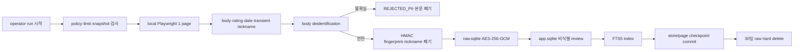

# 관리자 로컬 review 수집 실험

[문서 허브](../README.md) · [정책 검토](../06-trust/policy-review.md) · [Worker 설계](../04-architecture/worker-design.md) · [데이터 설계](../05-data/data-design.md)

이 문서는 Kakao Map 공개 화면의 최근 review를 비식별해 로컬 검색 근거와 FTS5 corpus로 사용할 수 있는지 확인하는 **정책 위험 관리자 로컬 실험**을 정의한다. Naver Map은 대상이 아니며 자동 수집 권한이나 법적 적합성이 확인됐다는 의미가 아니다.

## 1. 실험 질문

1. 낮은 빈도·한 page·강제 중단 아래 기술적으로 수집할 수 있는가?
2. nickname과 본문 PII를 저장·log·표시하지 않을 수 있는가?
3. encrypted raw 30일 삭제와 SQLite checkpoint resume을 지킬 수 있는가?
4. 비식별 review row와 FTS5 index를 중복·불일치 없이 게시할 수 있는가?
5. menu·category 검색에 실제 review 근거를 추가할 가치가 있는가?
6. policy·operation 위험을 감수할 수 있는가?

실험 성공은 공개 배포 승인이나 수집 권한 확인을 뜻하지 않는다.

## 2. 노출과 접근

- 일반 user UI·API에 수집 진입점을 만들지 않는다.
- local operator의 명시적 실행과 재확인을 요구한다.
- 실제 browser 수집은 관리자 PC의 local worker에서만 실행한다.
- Kakao Login user session·cookie·token을 재사용하지 않는다.
- remote schedule, cron과 상시 daemon을 제공하지 않는다.
- user service Playwright와 package·config·fixture·command를 분리한다.

## 3. 실행 전 확인

매 실행 다음 문구를 확인한다.

> 이 기능은 자동 수집 허용이 확인된 기능이 아닙니다. 플랫폼 약관, robots.txt, 저작권과 개인정보 위험이 남습니다. 접근 제한을 우회하지 않으며 로그인·CAPTCHA·401·403·429·접근 거부가 나타나면 즉시 중단합니다. 공개 배포에는 사용할 수 없습니다.

확인 결과는 원문이 아닌 policy snapshot ID, 확인 시각과 비민감 audit ID로 기록한다.

실행 전 gate:

- platform 약관·robots snapshot 30일 이내
- global·provider kill switch 비활성
- 서울 적격 `store_id`의 고정 snapshot 생성
- active review run 0
- raw retention 초과 0건
- `RAW_SQLITE_PATH`, encryption·HMAC key 주입 검증
- app snapshot 생성과 restore 가능 상태
- FTS5 capability·active index version 정상

하나라도 실패하면 run을 시작하지 않는다.

## 4. 강제 한도

| 항목 | 한도 |
|---|---:|
| 대상 | run 시작 시점 서울 전체 적격 store snapshot |
| source | Kakao Map만 |
| store당 review | 최근 12개월·최대 20개 |
| active browser page | 1개 |
| active run | 1개 |
| raw 보존 | 수집 후 최대 30일 |

최근 12개월 또는 20개 상한에 도달하면 해당 store를 완료한다. store·page cursor와 마지막 committed fingerprint를 local SQLite checkpoint에 저장하고 process 종료 후 같은 run을 이어간다.

pause·resume·전체 stop과 실패 store 선택 재실행을 제공한다. 최초 전체 run 뒤 증분이나 전체 갱신이 필요해도 operator가 새 snapshot과 policy 확인을 거쳐 수동 시작한다.

## 5. 허용 동작

- 로그인 없이 일반 사용자에게 렌더링되는 review DOM 읽기
- 명시적인 다음 page·더 보기 control을 제한 횟수 클릭
- 화면에 있는 date를 날짜 수준으로 읽기
- body·rating·date와 transient nickname을 memory에서 분리
- body 비식별 후 store-scoped HMAC fingerprint 계산
- nickname 즉시 폐기
- policy·access 상태와 비민감 stop code 기록

scroll은 현재 store의 12개월·20개 상한에 도달하기 위한 제한 동작만 허용한다.

## 6. 금지 동작

- login 자동화, account pool과 Kakao user session 사용
- CAPTCHA OCR·풀이 service·수동 통과 뒤 자동 resume
- proxy·VPN·IP·User-Agent rotation
- browser fingerprint·WebDriver 위장과 stealth plugin
- private JSON/XHR·GraphQL endpoint 탐색·호출·interception
- session cookie·token 추출·재사용
- robots.txt·access denial 무시
- nickname·ID·profile·photo·다른 활동 수집
- review image·OCR·EXIF
- screenshot·video·trace·HAR·permanent browser profile 보존
- site 전체 탐색·지속 감시·무한 scroll
- 여러 run으로 limit 우회

## 7. 즉시 중단

다음 신호는 전체 provider run을 즉시 끝낸다.

- login·relogin 요구
- CAPTCHA 또는 human verification
- HTTP 401·403·429
- access denial·abnormal traffic·automation warning
- DOM이 승인 selector contract와 다름
- robots·policy snapshot이 `DENY` 또는 `UNKNOWN`
- PII scrubber·encryption·SQLite integrity 실패
- operator 또는 global kill switch

12개월 또는 20개 상한 도달은 해당 store의 정상 완료다. policy·access·DOM 중단은 자동 retry하지 않는다.

## 8. 데이터 흐름



평문은 browser→deidentification→encryption·app publish의 process memory에만 존재한다. temporary file, clipboard, screenshot, log와 browser storage에 쓰지 않는다.

## 9. 비식별과 fingerprint

본문에서 제거:

- URL·email·phone·account handle
- 주민·사업자 등 identifier pattern
- 정확 주소와 사람을 식별할 수 있는 조합

사람 이름, health·payment·분쟁 등 sensitive 정보가 의심되고 안전하게 제거할 수 없으면 전체 review를 `REJECTED_PII`로 폐기한다.

비식별 성공 뒤 다음 canonical input을 HMAC-SHA-256 처리한다.

```text
provider | store_id | normalized_nickname | published_date | normalized_deidentified_text
```

nickname은 fingerprint 직후 폐기한다. fingerprint는 same-store duplicate 차단에만 사용하고 `raw.sqlite` 밖으로 내보내지 않는다.

## 10. encryption·보존

- AES-256-GCM, row별 unique nonce
- AAD에 `review_id`, `store_id`, provider와 schema version
- encryption key와 HMAC key 분리
- key version만 SQLite에 기록
- `raw.sqlite` 장기 backup 없음
- collection부터 30일 뒤 hard delete
- policy·권리상 삭제 대상은 즉시 hard delete

auth tag failure, key mismatch와 retention 초과가 하나라도 있으면 kill switch를 활성화한다.

## 11. app publish와 FTS5

- 비식별 성공 body·rating·date·source만 `app.sqlite`에 게시한다.
- nickname·fingerprint·cipher metadata는 app row와 FTS에 없다.
- stable `review_id`로 content row와 FTS document를 연결한다.
- 같은 fingerprint 재실행은 new row를 만들지 않는다.
- FTS snippet은 비식별 body 범위 안에서만 생성한다.
- FTS update 실패 시 기존 active index를 유지하고 review 검색을 `partial`로 낮춘다.
- 비식별 실패·expired·deleted review는 검색되지 않는다.

현재 실험은 LLM feature extraction이나 OpenAI 전송을 수행하지 않는다.

## 12. checkpoint·resume

- `review_collection_run`: 하나의 대상 snapshot과 policy version
- `review_checkpoint`: store, page cursor, last fingerprint, publish state
- network·browser wait 중 SQLite transaction을 열지 않는다.
- raw commit, app publish, FTS update와 checkpoint를 idempotent 단계로 나눈다.
- crash 뒤 마지막 committed 단계에서 resume한다.
- failed store는 reason code와 함께 격리하고 다음 store로 진행할 수 있다.
- policy·access stop은 다른 store로 진행하지 않는다.

resume 검증은 missing review와 duplicate 모두 `0`이어야 한다.

## 13. 관측과 log gate

허용:

- requested·collected·duplicate·PII rejected·encrypted·published review count
- policy·access·limit·DOM stop count
- store·page checkpoint와 duration
- app review row·FTS document count
- raw expiry·delete count

금지:

- body·nickname·fingerprint
- ciphertext·nonce·tag·key
- SQLite absolute path
- session·cookie·token과 DOM 전체

다음 중 하나면 global kill switch:

- app/raw/browser/log의 금지 값 탐지 1건
- raw retention 초과 1건
- AES auth failure 1건
- duplicate published review 1건
- app review·FTS active document 불일치 1건

## 14. 실험 판정

### 계속 검토 가능

- 정책·limit 위반 0
- nickname·PII·raw 평문 노출 0
- duplicate 0
- app review·FTS active document 불일치 0
- raw 30일 삭제 100%
- stop·resume missing 0
- 대표 menu·category search에서 review 근거가 확인됨

### 즉시 종료

- platform의 명시적 금지·이의 제기
- access limit 우회가 필요해짐
- 식별정보·원문 유출 또는 삭제 실패
- FTS 근거가 실제 body와 불일치
- 주당 운영 capacity를 지속 초과
- 공식 menu·관리자 data 대비 검색 가치가 없음

기술적 성공 여부와 무관하게 공개 서비스 전에는 수집기를 제거하거나 허용된 official API·written permission·licensed data로 교체한다.

## 15. 검증 checklist

- one page·one active run
- 12개월·20개·Kakao only
- login·CAPTCHA·401·403·429·DOM change 전체 stop
- pause·resume·failed store retry
- nickname storage 0과 store-scoped HMAC 결정성
- PII failure app·FTS publish 0
- AES-GCM tamper와 30일 delete
- duplicate 0
- app review·FTS count·ID 일치
- app/raw path·body·secret log exposure 0
- review experiment command가 CI·user web build에서 자동 실행되지 않음

## 관련 문서

- policy 판단: [정책 검토](../06-trust/policy-review.md)
- worker·SQLite: [Worker 설계](../04-architecture/worker-design.md), [데이터 설계](../05-data/data-design.md)
- operation·kill switch: [운영 기준](../08-operations/operating-baselines.md)
