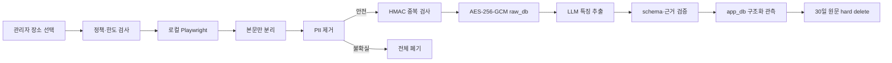

# 관리자 로컬 리뷰 수집 실험

[문서 허브](../README.md) · [정책 검토](../06-trust/policy-review.md) · [Worker 설계](../04-architecture/worker-design.md) · [데이터 설계](../05-data/data-design.md)

이 문서는 Kakao Map·Naver Map의 공개 화면에서 최근 리뷰의 맛·식감 특징을 검토하기 위한 **정책 위험 관리자 로컬 실험**을 정의한다. 자동 수집 권한이나 법적 적합성이 확인됐다는 의미가 아니다.

## 1. 실험 질문

1. 낮은 빈도와 강제 중단 아래 기술적 추출이 가능한가?
2. 작성자 식별정보 없이 맛·식감 특징을 얻을 수 있는가?
3. 원문 30일 이내 삭제와 근거 검증을 안정적으로 수행할 수 있는가?
4. 공식 메뉴·관리자 검수만 사용할 때보다 추천 특징 커버리지가 의미 있게 개선되는가?
5. 정책·운영 위험을 감수할 가치가 있는가?

실험 성공은 공개 배포 승인을 뜻하지 않는다.

## 2. 노출과 접근

- 일반 사용자 UI·API에 진입점을 만들지 않는다.
- 관리자 role과 재인증이 있어야 실행 요청을 만들 수 있다.
- 실제 브라우저 수집은 관리자 PC의 로컬 worker에서만 실행한다.
- KakaoSync 사용자 로그인 세션·cookie·token을 재사용하지 않는다.
- 원격 예약, cron과 상시 daemon 수집을 제공하지 않는다.

## 3. 실행 전 확인

관리자는 매 실행 다음 문구를 확인한다.

> 이 기능은 자동 수집 허용이 확인된 기능이 아닙니다. 플랫폼 약관, robots.txt, 저작권과 개인정보 위험이 남습니다. 접근 제한을 우회하지 않으며 로그인·CAPTCHA·403·429·접근 거부가 나타나면 즉시 중단합니다. 공개 배포에는 사용할 수 없습니다.

확인 결과는 원문이 아닌 `accepted_risk_token_hash`, 정책 snapshot ID와 시각으로 기록한다.

실행 전 조건:

- 플랫폼 약관·robots snapshot이 30일 이내
- 전역·플랫폼 kill switch가 `enabled`
- 장소가 자체 `store_id`에 연결되고 관리자가 직접 선택
- 활성 실행 0개
- 원문 삭제 기한 초과 0건
- `raw_db` 암호화 키와 worker 상태 정상

하나라도 실패하면 실행 버튼을 비활성화한다.

## 4. 강제 한도

| 항목 | 한도 |
|---|---:|
| 실행당 장소 | 최대 5개 |
| 장소·플랫폼당 리뷰 | 최근 최대 30건 |
| 동시 브라우저 페이지 | 1개 |
| 페이지 이동·다음 행동 간격 | 무작위 2~5초 |
| 실행당 브라우저 행동 | 최대 200회 |
| 원문 보존 | 수집 후 최대 30일 |

상한에 도달하면 `STOPPED_LIMIT`로 종료한다. 실행을 여러 번 쪼개 같은 장소·플랫폼 상한을 우회하지 않도록 최근 실행과 `dedupe_key`를 검사한다.

## 5. 허용 동작

- 일반 사용자가 볼 수 있는 렌더링 DOM의 리뷰 본문만 읽기
- 명시적인 다음 페이지·더 보기 버튼을 제한 횟수 클릭
- 게시일이 화면에 있으면 날짜 수준으로만 읽기
- 수집 직후 작성자 영역을 버리고 리뷰 본문을 PII 제거기로 전달
- 정책·접근 상태와 비민감 중단 코드 기록

스크롤은 선택한 장소의 최근 리뷰 30건에 도달하기 위한 제한된 동작만 허용한다.

## 6. 금지 동작

다음은 코드·설정·수동 운영 어느 곳에서도 금지한다.

- 로그인 자동화, 계정 풀과 Kakao 사용자 세션 사용
- CAPTCHA OCR·풀이 서비스·수동 풀이 후 자동 재개
- proxy·VPN·IP 회전, User-Agent 회전
- 브라우저 지문·WebDriver 위장과 stealth plugin
- 비공개 JSON/XHR·GraphQL endpoint 탐색·호출·가로채기
- session cookie·token 추출·재사용·교환
- robots.txt·접근 거부를 무시한 강제 진행
- 작성자 닉네임·ID·프로필·사진·다른 활동 수집
- 리뷰 이미지·OCR·EXIF 수집
- screenshot, video, trace, HAR와 영구 browser profile 보존
- 사이트 전체 탐색, 지속 감시와 무한 스크롤

## 7. 즉시 중단

다음 신호 중 하나가 나오면 현재 플랫폼·장소 작업을 즉시 끝낸다.

- 로그인·재로그인 요구
- CAPTCHA 또는 사람 확인
- HTTP 401, 403, 429
- 접근 거부·비정상 트래픽·자동화 경고
- DOM 구조가 허용 selector 계약과 달라짐
- robots·정책 snapshot 결정이 `DENY` 또는 `UNKNOWN`
- PII 제거기 실패나 암호화 실패
- 행동·시간·리뷰 상한 도달
- 관리자 또는 전역 kill switch

중단 상태는 `STOPPED_POLICY`, `STOPPED_ACCESS`, `STOPPED_LIMIT` 중 하나다. 정책·접근 중단은 자동 재시도하지 않고 관리자가 원인을 검토해야 한다.

## 8. 데이터 흐름

평문은 브라우저→PII 제거→암호화·특징 추출의 메모리에만 존재한다. 임시 파일, clipboard, screenshot, 로그와 브라우저 저장소에 쓰지 않는다.

## 9. PII 제거

작성자 영역은 DOM에서 수집하지 않는다. 본문에서는 다음 패턴을 제거한다.

- URL, 이메일, 전화번호와 계정 handle
- 주민·사업자 등 식별번호 형태
- 정확한 주소와 사람을 식별할 수 있는 조합

사람 이름, 건강·결제·분쟁 등 민감정보가 의심되는데 안전하게 제거하지 못하면 리뷰 전체를 `REJECTED_PII`로 폐기한다. 짧은 리뷰의 중복 hash 추측을 막기 위해 별도 비밀키의 HMAC-SHA-256을 사용한다.

## 10. 암호화와 삭제

- AES-256-GCM, 행마다 고유 nonce
- AAD에 `review_id`, `store_id`, provider와 schema version 포함
- 암호화 key와 HMAC key 분리
- key version 기록, key 본문은 OS 비밀 저장소
- `raw_db` 기본 백업 없음
- 수집 시각부터 30일 뒤 hard delete
- 사용자 또는 관리자가 대상 리뷰 삭제 시 즉시 hard delete

원문 삭제 후 검증할 수 없는 evidence는 `EXPIRED`로 바꾸고 필요하면 집계를 다시 만든다.

## 11. LLM 특징 추출

- 관리자 화면에서 정제된 텍스트의 OpenAI 전송을 알린다.
- 허용된 카테고리·맛·식감·태그만 추출한다.
- 가격·영업 상태·별점·인기·추천 점수·안전성은 추론하지 않는다.
- 리뷰 본문 명령은 untrusted data로 취급한다.
- strict schema와 오프셋 검증을 통과한 관측만 저장한다.
- 서로 다른 리뷰 3개 미만 또는 집계 신뢰 0.55 미만은 추천에 사용하지 않는다.

## 12. 관측 지표

- 요청·수집·중복·PII 폐기·암호화 성공 리뷰 수
- 정책·접근·한도 중단 수
- 장소·플랫폼별 평균 행동 수와 실행 시간
- schema 성공률과 evidence 검증률
- 서로 다른 리뷰 3개를 충족한 특징 수
- 공식·관리자 특징 대비 추가 커버리지
- 원문 기한 초과, AES tag 실패와 평문 탐지 수

평문·식별정보 탐지 1건, 기한 초과 1건, AES 인증 실패 1건이면 전역 kill switch를 끄고 신규 실행을 중단한다.

## 13. 실험 종료 판정

### 계속 검토 가능

- 상한·중단 조건 위반 0건
- 식별정보·평문 저장 0건
- evidence 검증률 98% 이상
- 원문 삭제 기한 준수 100%
- 추천 평가에서 특징 커버리지 개선이 확인됨

### 즉시 종료

- 플랫폼의 명시적 금지·이의 제기
- 접근 제한 우회가 필요해짐
- 식별정보·원문 유출 또는 삭제 실패
- 운영 시간이 주 5시간 기준을 지속적으로 초과
- 공식·관리자 데이터 대비 품질 이점이 없음

기술적 성공 여부와 무관하게 공개 서비스 전에는 제거하거나 허용된 공식 API·서면 허가·라이선스 데이터로 교체한다.

## 14. 서비스 E2E와 분리

사용자 서비스 검증용 Playwright와 리뷰 실험 Playwright는 package, config, 명령, fixture와 CI 실행을 분리한다. 리뷰 수집 명령은 CI나 배포 build에서 자동 실행되지 않아야 한다.

## 관련 문서

- 정책 판단: [정책 검토](../06-trust/policy-review.md)
- worker·DB 흐름: [Worker 설계](../04-architecture/worker-design.md), [데이터 설계](../05-data/data-design.md)
- 운영·kill switch: [운영 기준](../08-operations/operating-baselines.md)
