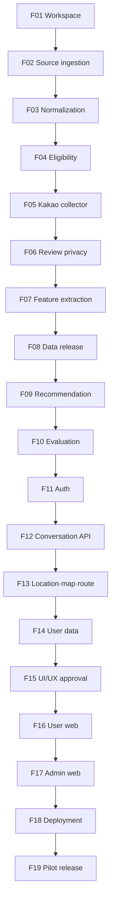

# Bread Map P0 Master Implementation Plan

> **For agentic workers:** REQUIRED SUB-SKILL: Use superpowers:executing-plans to execute one Feature at a time. Do not execute the whole Epic in one Codex task. Each Feature starts in a new user-approved Codex task and uses checkbox (`- [ ]`) syntax for tracking.

**Goal:** 실제 서울 데이터와 외부 연동을 사용하는 5인 비공개 Bread_map 파일럿을 데이터 우선 순서로 구현한다.

**Architecture:** Windows의 Node.js·pnpm 모노레포에서 `apps/web`과 `apps/worker`를 개발하고 PostgreSQL의 `app_db`와 `raw_db`를 version-pinned Docker Compose로 실행한다. 공식 데이터와 Kakao 리뷰를 검증된 데이터 릴리스로 고정한 뒤 순수 TypeScript 추천 엔진, 계정·대화·지도 API, 승인된 UI와 배포를 순차적으로 올린다.

**Tech Stack:** TypeScript, pnpm workspace, Next.js, Auth.js Kakao provider, LangGraph, PostgreSQL, Prisma, Playwright, OpenAI Responses API Structured Outputs, Vitest, Playwright E2E, Docker

## Global Constraints

- 최종 완료 지점은 실제 외부 연동을 포함한 5인 비공개 온라인 파일럿이다.
- 구현 순서는 데이터 릴리스 → 추천 코어 → 제품 백엔드 → UI/UX → 웹·관리자 → 배포·파일럿이다.
- 일반 Kakao Login과 서비스 내부 계정을 사용하며 KakaoSync는 사용하지 않는다.
- 서울 전체 적격 매장을 대상으로 Kakao Map 리뷰만 수집한다.
- 리뷰 범위는 매장별 최근 12개월·최대 20개다.
- 리뷰 닉네임은 매장 범위 HMAC 지문 생성 직후 폐기하며 저장·로그·표시하지 않는다.
- 리뷰 기반 특징은 서로 다른 유효 리뷰 3개 이상일 때만 확정하고 180일 반감기를 적용한다.
- 리뷰가 부족한 적격 매장은 추천 후보에서 제거하지 않는다.
- 별점은 핵심 관련도에 포함하지 않고 마지막 동점 보조값으로만 사용한다.
- `R = 0.60T + 0.25V + 0.15E`를 초기 추천식으로 사용한다.
- 정확한 사용자 좌표는 DB·로그·분석·대화 checkpoint·OpenAI에 저장하지 않는다.
- `apps/web`은 `raw_db` DSN과 리뷰 암호화·HMAC key를 갖지 않는다.
- 리뷰 수집은 관리자 로컬 worker에서만 수동 실행하고 동시 브라우저 페이지는 1개다.
- 로그인·CAPTCHA·401·403·429·접근 제한·DOM 계약 변경에서는 우회하지 않고 중단한다.
- 실제 Kakao 페이지는 CI에서 호출하지 않고 비식별 HTML fixture와 관리자 PC 수동 smoke로 검증한다.
- 5인 파일럿의 반복 운영비는 월 30,000원 이하다.
- 실제 리뷰 100개 benchmark와 사용자 비용 승인 전에는 서울 전체 LLM 추출을 실행하지 않는다.
- UI/UX는 Feature 15에서 별도 승인하며 Figma MCP를 사용하지 않는다.
- 각 Feature는 새 Codex 작업과 지정 `codex/...` 브랜치를 사용한다.
- Subagent 기본값은 0개이며 루트 `AGENTS.md`의 제한을 따른다.
- secret 실제 값은 대화·Markdown·Git에 넣지 않는다.

---

## 1. 이 문서의 실행 방식

이 문서는 P0 Epic의 의존성·Feature 경계·산출물·검증 gate를 소유한다. 뒤 Feature의 코드 세부 계획을 지금 모두 고정하지 않는다. 앞 Feature에서 확정되는 Prisma schema, package API와 운영 결과를 다시 쓰는 토큰 낭비를 막기 위해 다음 절차를 사용한다.

1. 사용자가 다음 Feature용 새 Codex 작업을 명시적으로 요청한다.
2. `main`의 직전 승인 결과에서 지정 브랜치를 만든다.
3. 해당 Feature와 직접 관련된 파일만 읽는다.
4. `docs/superpowers/plans/YYYY-MM-DD-<feature>.md`에 파일·함수·테스트 수준의 상세 실행 계획을 작성한다.
5. 같은 작업에서 TDD로 구현하고 수정 영역과 직접 의존성을 검증한다.
6. 결과, 검사, 미실행 항목과 위험을 사용자에게 보고한다.
7. 사용자가 요청한 경우에만 commit·merge를 수행한다.

각 Feature 상세 계획은 최소한 다음을 포함해야 한다.

- 만들거나 수정할 정확한 파일
- 이전 Feature에서 소비하는 type·function·table·CLI 계약
- 다음 Feature에 제공하는 공개 interface
- 실패하는 테스트 → 최소 구현 → 통과 테스트 순서
- 정확한 실행 명령과 기대 결과
- 외부 서비스 수동 smoke와 비용·정책 gate
- migration 재실행·worker 중단·복구 검증

## 2. 의존성



Feature 1~10은 순수 데이터 우선 결정을 지키기 위해 순차 실행한다. Feature 15는 데이터 릴리스, 추천 평가와 제품 API 계약이 안정된 뒤에만 시작한다.

## 3. 공통 완료 기준

모든 Feature는 다음 조건을 충족해야 완료다.

- [ ] 요구 범위와 acceptance criteria가 구현됐다.
- [ ] 새 동작을 먼저 실패하는 test로 고정했다.
- [ ] 관련 unit·integration test가 통과했다.
- [ ] `pnpm typecheck`, `pnpm lint`, `pnpm test`, 영향 package build가 통과했다.
- [ ] migration·batch·삭제처럼 재실행되는 작업은 idempotence를 검증했다.
- [ ] secret·정확 좌표·닉네임·리뷰 평문 금지 검사가 통과했다.
- [ ] 외부 연동을 실행하지 못한 경우 이유와 남은 위험을 보고했다.
- [ ] 계획 밖 파일과 사용자 변경을 보존했다.
- [ ] Feature 결과를 다음 interface 소비자가 사용할 수 있다.
- [ ] 사용자가 결과와 병합 여부를 확인했다.

공통 검증:

```powershell
corepack pnpm install --frozen-lockfile
corepack pnpm typecheck
corepack pnpm lint
corepack pnpm test
corepack pnpm build
git diff --check
git status --short
```

Expected:

- 모든 명령 exit code `0`
- secret·원문·정확 좌표가 출력되지 않음
- 현재 Feature 범위 밖의 예상하지 못한 변경 없음

---

### Feature 1: Workspace·Docker·테스트 기반

**Branch:** `codex/workspace-foundation`

**Goal:** 이후 모든 Feature가 같은 명령, package 경계와 두 PostgreSQL database에서 구현·검증되게 한다.

**Files:**

- Create: `package.json`
- Create: `pnpm-workspace.yaml`
- Create: `pnpm-lock.yaml`
- Create: `.node-version`
- Create: `.npmrc`
- Create: `.gitignore`
- Create: `.env.example`
- Create: `tsconfig.base.json`
- Create: `eslint.config.mjs`
- Create: `vitest.workspace.ts`
- Create: `.github/workflows/ci.yml`
- Create: `infra/compose.yaml`
- Create: `apps/web/package.json`
- Create: `apps/worker/package.json`
- Create: `packages/contracts/package.json`
- Create: `packages/app-db/package.json`
- Create: `packages/raw-db/package.json`
- Create: `packages/recommendation/package.json`
- Create: `packages/testkit/package.json`
- Create: `prisma/app/schema.prisma`
- Create: `prisma/raw/schema.prisma`

**Interfaces:**

- Consumes: [시스템 구조](../../04-architecture/system-architecture.md)의 package·database 경계
- Produces: root scripts `dev`, `build`, `typecheck`, `lint`, `test`; Docker services `app-db`, `raw-db`; package names `@bread-map/contracts`, `@bread-map/app-db`, `@bread-map/raw-db`, `@bread-map/recommendation`, `@bread-map/testkit`

**Tasks:**

- [ ] 현재 LTS Node.js, pnpm, Next.js, Prisma, Auth.js, Vitest와 Playwright 호환 조합을 공식 release 자료로 확인하고 exact version을 lockfile과 `.node-version`에 고정한다.
- [ ] workspace와 package boundary를 만들고 `apps/web`에서 `@bread-map/raw-db` import가 실패하도록 lint rule을 설정한다.
- [ ] PostgreSQL image를 digest 또는 정확한 patch tag로 고정하고 `app_db`, `raw_db`, health check와 분리 role을 구성한다.
- [ ] 두 Prisma client의 최소 schema와 migration history를 초기화한다.
- [ ] root CI가 install → typecheck → lint → unit test → build를 순서대로 실행하게 한다.
- [ ] `.env.example`에는 이름·설명만 넣고 실제 값 없이 local startup을 문서화한다.

**Verification:**

```powershell
docker compose -f infra/compose.yaml config
docker compose -f infra/compose.yaml up -d
docker compose -f infra/compose.yaml ps
corepack pnpm install --frozen-lockfile
corepack pnpm typecheck
corepack pnpm lint
corepack pnpm test
corepack pnpm build
```

Expected:

- 두 PostgreSQL service가 `healthy`
- 모든 workspace package가 동일 lockfile을 사용
- web package에서 raw DB 경계 위반 test가 실패 없이 차단됨
- 외부 API key 없이 전체 검증 가능

**User gate:** [개발 준비 체크리스트](../../10-delivery/development-readiness-checklist.md)의 로컬 개발 도구 준비

---

### Feature 2: 공공 원장·공정위 데이터 적재

**Branch:** `codex/source-ingestion`

**Goal:** 공식 응답을 불변 snapshot과 typed staging row로 멱등 적재한다.

**Files:**

- Create: `apps/worker/src/cli.ts`
- Create: `apps/worker/src/jobs/job-runner.ts`
- Create: `apps/worker/src/jobs/source-ingestion.ts`
- Create: `apps/worker/src/sources/source-contract.ts`
- Create: `apps/worker/src/sources/localdata.ts`
- Create: `apps/worker/src/sources/ftc.ts`
- Create: `apps/worker/src/storage/snapshot-store.ts`
- Modify: `prisma/app/schema.prisma`
- Test: `apps/worker/src/sources/*.test.ts`
- Test: `apps/worker/src/jobs/source-ingestion.integration.test.ts`
- Create: `packages/testkit/fixtures/sources/`

**Interfaces:**

- Consumes: `AppPrismaClient`, Docker `app_db`, `DATA_GO_KR_SERVICE_KEY`
- Produces: `SourceAdapter.fetch(): Promise<SourceArtifact>`, `ingestSource(sourceKey, runOptions): Promise<IngestionSummary>`, source/snapshot/staging/job tables

**Tasks:**

- [ ] 필수 field·pagination·basis date·checksum 계약을 sanitized fixture test로 고정한다.
- [ ] LOCALDATA 파일·API adapter와 공정위 4개 자료 adapter를 구현한다.
- [ ] 다운로드 임시 파일을 checksum 검증 뒤 Git 밖 snapshot 경로로 원자 승격한다.
- [ ] 같은 source checksum과 adapter version 재실행에서 staging 중복이 생기지 않게 한다.
- [ ] schema drift·행 수 급변·필수 field 누락을 publish blocker로 기록한다.
- [ ] 실제 API는 사용자가 key를 주입한 로컬 smoke에서 각 source 1회만 실행한다.

**Verification:**

```powershell
corepack pnpm --filter @bread-map/worker test -- source-ingestion
corepack pnpm --filter @bread-map/worker worker source ingest --source localdata --fixture
corepack pnpm --filter @bread-map/worker worker source ingest --source localdata --fixture
```

Expected:

- 두 번째 실행의 새 snapshot·staging 중복 `0`
- source row count, checksum, basis date와 blocker report 생성
- fixture·로그에 실제 key 없음

**User gate:** 공공데이터포털 승인과 key 보관 완료

---

### Feature 3: 매장 정규화·중복·좌표 처리

**Branch:** `codex/store-normalization`

**Goal:** 서울 후보의 이름·주소·EPSG:5174 좌표를 versioned rule로 정규화하고 매칭 후보를 만든다.

**Files:**

- Create: `apps/worker/src/normalization/name.ts`
- Create: `apps/worker/src/normalization/address.ts`
- Create: `apps/worker/src/normalization/coordinates.ts`
- Create: `apps/worker/src/normalization/matcher.ts`
- Create: `apps/worker/src/jobs/store-normalization.ts`
- Modify: `prisma/app/schema.prisma`
- Test: `apps/worker/src/normalization/*.test.ts`
- Test: `apps/worker/src/jobs/store-normalization.integration.test.ts`

**Interfaces:**

- Consumes: Feature 2 staging rows
- Produces: `normalizeName`, `normalizeAddress`, `toWgs84`, `scoreStoreMatch`; `bakery`, `store`, `store_source_link`, `match_candidate`, `normalization_version`

**Tasks:**

- [ ] Unicode·법인명·지점명과 도로명·지번·층호 정규화의 table/property test를 작성한다.
- [ ] 알려진 EPSG:5174 기준점과 축 반전 fixture를 작성한다.
- [ ] 0.92 자동 연결, 0.75~0.92 검수, 주소 충돌 분리 규칙을 구현한다.
- [ ] 새 `MNG_NO`, 같은 건물 다른 층, 동명이점 회귀를 고정한다.
- [ ] 같은 snapshot·normalization version 재실행의 결과 hash가 같게 한다.

**Verification:**

```powershell
corepack pnpm --filter @bread-map/worker test -- normalization
corepack pnpm --filter @bread-map/worker worker normalize stores --fixture
corepack pnpm --filter @bread-map/worker worker normalize stores --fixture
```

Expected:

- 좌표 fixture가 문서화한 허용 오차 안에서 통과
- 두 실행의 store/link/match count와 result hash 동일
- 충돌 후보는 자동 병합되지 않음

---

### Feature 4: 프랜차이즈 제외·적격 매장 검수

**Branch:** `codex/store-eligibility`

**Goal:** 모든 서울 활성 후보에 적격·제외·검수대기 상태와 재현 가능한 이유를 부여한다.

**Files:**

- Create: `apps/worker/src/eligibility/classifier.ts`
- Create: `apps/worker/src/eligibility/evidence.ts`
- Create: `apps/worker/src/jobs/store-eligibility.ts`
- Create: `apps/worker/src/cli/eligibility-review.ts`
- Modify: `prisma/app/schema.prisma`
- Test: `apps/worker/src/eligibility/*.test.ts`
- Test: `apps/worker/src/jobs/store-eligibility.integration.test.ts`

**Interfaces:**

- Consumes: normalized stores, FTC staging, match candidates
- Produces: `classifyBakery(input): EligibilityDecision`; `chain_classification`, `manual_review`, `visibility_status`, eligible-store snapshot

**Tasks:**

- [ ] 독립 단일점, 직영 2·5개, 6개, 프랜차이즈 양성, 공정위 미일치 fixture를 작성한다.
- [ ] 공정위 미일치만으로 독립점을 확정하지 않는 classifier를 구현한다.
- [ ] 폐업·팝업·배달 전용·좌표 무효·충돌·미검수를 추천에서 제외한다.
- [ ] CLI 검수 결정에 actor·근거·시각·version과 낙관적 잠금을 기록한다.
- [ ] 모든 활성 후보가 정확히 하나의 결과 상태를 갖는 completeness report를 만든다.

**Verification:**

```powershell
corepack pnpm --filter @bread-map/worker test -- eligibility
corepack pnpm --filter @bread-map/worker worker eligibility evaluate --fixture
corepack pnpm --filter @bread-map/worker worker eligibility report
```

Expected:

- 상태 없는 활성 후보 `0`
- 프랜차이즈·6개 이상·폐업·미검수의 eligible 노출 `0`
- 승인 결정의 근거와 rule version 역추적 가능

---

### Feature 5: Kakao 리뷰 수집 Worker

**Branch:** `codex/kakao-review-collector`

**Goal:** 서울 전체 적격 매장의 Kakao 공개 리뷰를 1개 페이지로 순차 탐색하고 안전한 in-memory record와 checkpoint를 제공한다.

**Files:**

- Create: `apps/worker/src/reviews/kakao/adapter.ts`
- Create: `apps/worker/src/reviews/kakao/selectors.ts`
- Create: `apps/worker/src/reviews/kakao/contracts.ts`
- Create: `apps/worker/src/reviews/batch-planner.ts`
- Create: `apps/worker/src/reviews/checkpoint.ts`
- Create: `apps/worker/src/jobs/review-collection.ts`
- Create: `apps/worker/src/cli/review-batch.ts`
- Modify: `prisma/app/schema.prisma`
- Test: `apps/worker/src/reviews/kakao/*.test.ts`
- Create: `packages/testkit/fixtures/kakao-reviews/`

**Interfaces:**

- Consumes: Feature 4 eligible-store snapshot, local Playwright browser
- Produces: `AsyncIterable<CollectedReview>` with body·transient nickname·rating·published date·cursor; collection run/job/checkpoint states

**Tasks:**

- [ ] 비식별 HTML fixture로 selector contract, 12개월 cutoff, 20개 cap과 날짜·별점 parsing test를 작성한다.
- [ ] 초기 전체·우선순위 증분·분기 전체·실패 전용 batch planner를 구현한다.
- [ ] active batch 하나, page 하나, store/page cursor checkpoint를 구현한다.
- [ ] pause·resume·stop·kill·failed-only CLI를 구현한다.
- [ ] 로그인·CAPTCHA·401·403·429·접근 제한·DOM 변경 fixture의 즉시 중단을 구현한다.
- [ ] Feature 6 sealing 전에는 live body를 저장하지 않는 fixture-only mode를 기본값으로 둔다.

**Verification:**

```powershell
corepack pnpm --filter @bread-map/worker test -- kakao
corepack pnpm --filter @bread-map/worker worker reviews plan --kind initial-full --fixture
corepack pnpm --filter @bread-map/worker worker reviews run --fixture
corepack pnpm --filter @bread-map/worker worker reviews resume --fixture
```

Expected:

- 매장별 기간·개수 상한 준수
- 중단·재개 뒤 처리 누락·중복 `0`
- 접근 중단 신호에서 자동 재시도 `0`
- CI의 실제 Kakao network call `0`

**User gate:** Kakao Map 첫 활성 앱과 무료 쿼터 표시 확인

---

### Feature 6: 리뷰 개인정보 제거·암호화·중복 방지

**Branch:** `codex/review-privacy`

**Goal:** 수집 리뷰를 저장 전에 비식별화하고 닉네임 비저장 지문과 AES-256-GCM 암호문으로 봉인한다.

**Files:**

- Create: `apps/worker/src/reviews/privacy/normalize.ts`
- Create: `apps/worker/src/reviews/privacy/deidentify.ts`
- Create: `apps/worker/src/reviews/privacy/fingerprint.ts`
- Create: `apps/worker/src/reviews/privacy/encryption.ts`
- Create: `apps/worker/src/reviews/privacy/seal-review.ts`
- Create: `apps/worker/src/jobs/raw-retention.ts`
- Modify: `prisma/app/schema.prisma`
- Modify: `prisma/raw/schema.prisma`
- Test: `apps/worker/src/reviews/privacy/*.test.ts`
- Test: `apps/worker/src/jobs/raw-retention.integration.test.ts`

**Interfaces:**

- Consumes: Feature 5 `CollectedReview`
- Produces: `sealReview(input): Promise<SealedReviewMetadata | RejectedPii>`; app metadata and raw ciphertext; 30-day deletion job

**Tasks:**

- [ ] URL·email·전화·handle·식별번호 제거와 불확실 PII 전체 폐기 test를 작성한다.
- [ ] store-scoped HMAC 입력 순서와 닉네임 비보존 test를 작성한다.
- [ ] AES-256-GCM round-trip, unique nonce, wrong AAD/tag 거부 test를 작성한다.
- [ ] rating·date·source·fingerprint만 app metadata에 저장하고 raw body를 `raw_db`에 봉인한다.
- [ ] 30일 hard delete와 양쪽 DB 보상·무결성 작업을 구현한다.
- [ ] 로그 capture에서 nickname·body·ciphertext·nonce·tag·HMAC·key가 0건인지 검사한다.
- [ ] fixture 1개 매장으로만 수동 live smoke를 하고 저장 상태를 확인한다.

**Verification:**

```powershell
corepack pnpm --filter @bread-map/worker test -- review-privacy
corepack pnpm --filter @bread-map/worker worker reviews run --fixture --seal
corepack pnpm --filter @bread-map/worker worker raw expire --at 2099-01-01T00:00:00Z
```

Expected:

- 동일 매장 동일 리뷰 중복 `0`
- 다른 매장 작성자 연결 정보 `0`
- 닉네임·평문·비밀 로그 match `0`
- 만료 대상 raw row `0`
- web role의 `raw_db` 연결 거부

**User gate:** Codex가 제공한 key 생성 명령을 사용자가 로컬에서 실행하고 실제 key를 비밀 저장소에 주입

---

### Feature 7: 리뷰 LLM 특징 추출·집계

**Branch:** `codex/review-feature-extraction`

**Goal:** 비식별 리뷰에서 strict schema 특징을 검증하고 180일 반감기의 versioned aggregate를 만든다.

**Files:**

- Create: `packages/contracts/src/review-features.ts`
- Create: `apps/worker/src/reviews/extraction/schema.ts`
- Create: `apps/worker/src/reviews/extraction/openai-adapter.ts`
- Create: `apps/worker/src/reviews/extraction/evidence.ts`
- Create: `apps/worker/src/reviews/extraction/validator.ts`
- Create: `apps/worker/src/reviews/aggregation/build.ts`
- Create: `apps/worker/src/jobs/review-extraction.ts`
- Create: `apps/worker/src/cli/review-benchmark.ts`
- Modify: `prisma/app/schema.prisma`
- Test: `apps/worker/src/reviews/extraction/*.test.ts`
- Test: `apps/worker/src/reviews/aggregation/*.test.ts`

**Interfaces:**

- Consumes: Feature 6 sealed reviews and in-memory decryption, `OPENAI_API_KEY`
- Produces: `BakeryTasteFeatureV1`, verified evidence offsets, feature observations, aggregate run, approved model/cost configuration

**Tasks:**

- [ ] strict schema·enum·axis·abstain·one-retry validator test를 작성한다.
- [ ] exact UTF-8 evidence offset·duplicate span·missing span test를 작성한다.
- [ ] OpenAI adapter에 `store:false`, token·cost capture와 hard cap을 구현한다.
- [ ] 실제 리뷰 100개 benchmark CLI와 사람이 판정할 비교 report를 만든다.
- [ ] 사용자가 model·전체 비용을 승인하기 전 full batch command가 거부되는 gate를 구현한다.
- [ ] 서로 다른 리뷰 3개, 180일 반감기, 최근 12개월 cutoff와 공식 메뉴 우선 집계를 구현한다.
- [ ] 재실패 extraction은 `REQUIRES_REVIEW`로 보내고 무한 재시도하지 않는다.

**Verification:**

```powershell
corepack pnpm --filter @bread-map/worker test -- extraction
corepack pnpm --filter @bread-map/worker test -- aggregation
corepack pnpm --filter @bread-map/worker worker reviews benchmark --limit 100
corepack pnpm --filter @bread-map/worker worker reviews extract --all
```

Expected:

- 마지막 명령은 사용자 승인 기록 전 `FULL_EXTRACTION_NOT_APPROVED`로 안전하게 종료
- schema 밖 출력 저장 `0`
- review count 2→미확정, 3→확정 경계 통과
- 동일 input/version aggregate hash 동일

**User gate:** 100개 benchmark의 모델·정확도·예상 전체 비용·시간 승인

---

### Feature 8: 데이터 품질·서울 전체 릴리스 gate

**Branch:** `codex/data-release-gate`

**Goal:** 수집 중인 데이터와 분리된 immutable data release를 검증하고 추천 소비자에게 제공한다.

**Files:**

- Create: `apps/worker/src/releases/data-release.ts`
- Create: `apps/worker/src/releases/quality-rules.ts`
- Create: `apps/worker/src/releases/report.ts`
- Create: `apps/worker/src/cli/data-release.ts`
- Modify: `prisma/app/schema.prisma`
- Test: `apps/worker/src/releases/*.test.ts`
- Create: `docs/10-delivery/data-release-runbook.md`

**Interfaces:**

- Consumes: Feature 2~7의 성공 snapshot·eligibility·collection·aggregate
- Produces: versioned `DataReleaseManifest`, `v_recommendable_store`, `mv_store_feature_vector`, quality report

**Tasks:**

- [ ] 원장 건수·누락·중복·상태 completeness rule을 test로 고정한다.
- [ ] 모든 적격 매장에 수집 성공·리뷰 부족·접근 실패 상태가 있는지 검사한다.
- [ ] 12개월·20개·닉네임 비저장·평문 로그·30일 삭제·web raw denial gate를 구현한다.
- [ ] 리뷰 3개 미만 매장에 검수 메뉴·방문 조건 대체 자료가 있는지 검사한다.
- [ ] 실패 release가 이전 current release를 바꾸지 않는 원자 승격을 구현한다.
- [ ] 사람이 읽는 Markdown/JSON report와 release manifest checksum을 만든다.

**Verification:**

```powershell
corepack pnpm --filter @bread-map/worker test -- data-release
corepack pnpm --filter @bread-map/worker worker data release --dry-run
corepack pnpm --filter @bread-map/worker worker data release --promote
```

Expected:

- 모든 blocker `0`일 때만 current release 변경
- failed release 뒤 이전 release query 결과 동일
- 적격 매장·리뷰 부족·접근 실패가 report에서 추적 가능

---

### Feature 9: 결정론적 추천 엔진

**Branch:** `codex/recommendation-engine`

**Goal:** 고정 data release와 구조화 조건으로 하드 제외, 리뷰 충분·부족 경로와 두 정렬을 순수 함수로 계산한다.

**Files:**

- Create: `packages/contracts/src/recommendation.ts`
- Create: `packages/recommendation/src/filter.ts`
- Create: `packages/recommendation/src/taste-score.ts`
- Create: `packages/recommendation/src/visit-score.ts`
- Create: `packages/recommendation/src/evidence-score.ts`
- Create: `packages/recommendation/src/sparse-fallback.ts`
- Create: `packages/recommendation/src/bayesian-rating.ts`
- Create: `packages/recommendation/src/rank.ts`
- Create: `packages/recommendation/src/explain-template.ts`
- Test: `packages/recommendation/src/*.test.ts`

**Interfaces:**

- Consumes: `RecommendationInput`, Feature 8 `DataReleaseManifest` candidate rows
- Produces: `recommend(input): RecommendationResult`; stable rank, representative menu, evidence IDs, caveat codes

**Tasks:**

- [ ] 강한 제외가 score 전에 적용되는 failing test를 작성한다.
- [ ] `T`, `V`, `E`, `R = 0.60T + 0.25V + 0.15E`와 고정 반올림을 구현한다.
- [ ] 검수 메뉴 category가 review inference보다 우선하는 test를 작성한다.
- [ ] 리뷰 0·1·2개 sparse fallback과 리뷰 3개 rich 경계 test를 작성한다.
- [ ] Bayesian rating이 1~5번 핵심 비교를 역전하지 못하게 구현한다.
- [ ] `TRAVEL_TIME`, `RELEVANCE`, 다양성, `store_id` 마지막 동점을 구현한다.
- [ ] 사용자 공개 응답에 내부 숫자 score가 없는지 contract test를 작성한다.

**Verification:**

```powershell
corepack pnpm --filter @bread-map/recommendation test
corepack pnpm --filter @bread-map/recommendation typecheck
corepack pnpm --filter @bread-map/recommendation build
```

Expected:

- package가 DB·network import 없이 실행
- hard exclusion violation `0`
- 같은 input 100회 result hash 차이 `0`
- 별점으로 핵심 취향 후보가 역전되는 case `0`

---

### Feature 10: 추천 평가·회귀 시나리오

**Branch:** `codex/recommendation-evaluation`

**Goal:** 20개 대표 시나리오와 고정 data release로 품질·결정성·sparse fallback을 자동 판정한다.

**Files:**

- Create: `packages/testkit/src/recommendation-scenarios.ts`
- Create: `packages/testkit/fixtures/recommendation/`
- Create: `scripts/evaluate-recommendation.ts`
- Create: `packages/recommendation/src/evaluation.test.ts`
- Create: `docs/10-delivery/recommendation-evaluation-runbook.md`

**Interfaces:**

- Consumes: Feature 9 `recommend`, Feature 8 release fixture
- Produces: versioned evaluation set, JSON/Markdown result report, release pass/fail

**Tasks:**

- [ ] 특정 메뉴·맛식감·강한 제외·멀티턴·방문 조건·실패 회복 20개 scenario를 고정한다.
- [ ] 개발자와 독립 평가자 합의 후보·절대 제외·허용 변형을 version한다.
- [ ] Hit Rate@5, hard exclusion, 100회 determinism과 두 정렬 차이를 계산한다.
- [ ] sparse fallback과 high-rating irrelevant store 회귀를 포함한다.
- [ ] 목표 미달 시 release가 실패하고 원인 scenario ID가 나오는 report를 만든다.

**Verification:**

```powershell
corepack pnpm exec tsx scripts/evaluate-recommendation.ts
```

Expected:

- Hit Rate@5 `>= 0.85`
- hard exclusion violation `0`
- 100회 rank difference `0`
- sparse fallback regression 통과
- rating reversal `0`

---

### Feature 11: Kakao Login·계정 격리

**Branch:** `codex/auth-accounts`

**Goal:** 일반 Kakao Login으로 내부 계정과 DB session을 만들고 사용자별 자원 경계를 강제한다.

**Files:**

- Create: `apps/web/src/auth.ts`
- Create: `apps/web/src/app/api/auth/[...nextauth]/route.ts`
- Create: `apps/web/src/server/auth/require-user.ts`
- Create: `apps/web/src/server/auth/ownership.ts`
- Modify: `prisma/app/schema.prisma`
- Test: `apps/web/src/server/auth/*.test.ts`
- Test: `apps/web/tests/integration/auth.test.ts`

**Interfaces:**

- Consumes: `AUTH_SECRET`, `AUTH_KAKAO_ID`, `AUTH_KAKAO_SECRET`, App DB
- Produces: `requireUser(): Promise<AuthenticatedUser>`, Auth.js session, `user_account`, `auth_account`, `auth_session`

**Tasks:**

- [ ] 비로그인·만료 session·callback state·redirect mismatch test를 작성한다.
- [ ] Auth.js Kakao provider와 database session을 최소 scope로 구성한다.
- [ ] provider ID를 자체 UUIDv7 user ID에 연결하고 불필요한 profile field를 저장하지 않는다.
- [ ] 모든 사용자 repository가 session user ID를 요구하는 ownership helper를 구현한다.
- [ ] 다른 계정 ID·삭제 ID·batch 혼합의 404 통일 test를 작성한다.
- [ ] 로컬 Kakao OAuth callback 수동 smoke를 수행한다.

**Verification:**

```powershell
corepack pnpm --filter @bread-map/web test -- auth
corepack pnpm --filter @bread-map/web build
```

Expected:

- 비로그인 보호 API 차단
- 이메일·전화·생일·성별 DB field `0`
- IDOR matrix 통과
- callback log에 provider ID·token `0`

**User gate:** 일반 Kakao Login, local callback과 secret 주입 완료

---

### Feature 12: 대화·LangGraph·추천 API

**Branch:** `codex/conversation-api`

**Goal:** 계정별 멀티턴 상태를 구조화하고 결정론적 추천을 반복 실행하는 API를 제공한다.

**Files:**

- Create: `packages/contracts/src/conversation-intent.ts`
- Create: `apps/web/src/server/llm/intent.ts`
- Create: `apps/web/src/server/conversation/graph.ts`
- Create: `apps/web/src/server/conversation/state.ts`
- Create: `apps/web/src/server/conversation/service.ts`
- Create: `apps/web/src/app/api/conversations/route.ts`
- Create: `apps/web/src/app/api/conversations/[conversationId]/messages/route.ts`
- Modify: `prisma/app/schema.prisma`
- Test: `apps/web/src/server/conversation/*.test.ts`
- Test: `apps/web/tests/integration/conversation-api.test.ts`

**Interfaces:**

- Consumes: Feature 9 recommendation API, Feature 11 authenticated user, OpenAI intent adapter
- Produces: `ConversationIntentV2`, versioned conversation state/checkpoint, idempotent message/recommendation API

**Tasks:**

- [ ] strict intent schema, negation post-check and one-retry fallback test를 작성한다.
- [ ] `WAIT_USER` 반복 graph와 추천 시도당 clarification 최대 2회를 구현한다.
- [ ] 조건 추가·교체·철회·결과 제외·정렬·설명 요청을 pure state patch로 적용한다.
- [ ] 정확 좌표와 의료 field가 checkpoint·OpenAI request에 들어가지 않게 type boundary를 만든다.
- [ ] message idempotency와 state version optimistic lock을 구현한다.
- [ ] LLM 실패에서 수정 가능한 form state와 template explanation을 반환한다.

**Verification:**

```powershell
corepack pnpm --filter @bread-map/web test -- conversation
corepack pnpm --filter @bread-map/web test -- conversation-api
```

Expected:

- 세 번째 시스템 질문 `0`
- 같은 idempotency key의 message·recommendation 중복 `0`
- 다른 대화 자동 취향 상속 `0`
- 좌표·의료 field schema 저장 `0`

---

### Feature 13: 위치·지도·경로 API

**Branch:** `codex/location-map-route`

**Goal:** 선택적 현재 위치와 직접 출발지로 Kakao 지도·경로를 보강하되 정확 좌표를 영속화하지 않는다.

**Files:**

- Create: `apps/web/src/features/location/location-controller.ts`
- Create: `apps/web/src/server/kakao/route-adapter.ts`
- Create: `apps/web/src/server/kakao/local-adapter.ts`
- Create: `apps/web/src/app/api/routes/route.ts`
- Create: `apps/web/src/app/api/origins/search/route.ts`
- Test: `apps/web/src/features/location/*.test.ts`
- Test: `apps/web/src/server/kakao/*.test.ts`
- Test: `apps/web/tests/integration/routes.test.ts`

**Interfaces:**

- Consumes: `NEXT_PUBLIC_KAKAO_JS_KEY`, `KAKAO_REST_API_KEY`, recommendation destination coordinates
- Produces: in-memory origin controller, route summary response, direct-origin search response

**Tasks:**

- [ ] service notice → browser permission 순서와 5초 fallback test를 작성한다.
- [ ] foreground watcher와 100m threshold/debounce를 구현한다.
- [ ] route adapter fixture로 전체 유효 대안 시간순·부분 실패를 고정한다.
- [ ] request body·원본 response·Kakao place ID가 DB와 log에 남지 않게 한다.
- [ ] quota 70%·90%·100% 상태와 관련도·직선거리 fallback을 구현한다.
- [ ] Kakao 지도·경로 로컬 수동 smoke를 실행한다.

**Verification:**

```powershell
corepack pnpm --filter @bread-map/web test -- location
corepack pnpm --filter @bread-map/web test -- kakao
corepack pnpm --filter @bread-map/web test -- routes
```

Expected:

- 99m 이동 route call `0`, 100m 이상 call `1`
- 권한 철회 후 watcher와 coordinate reference 없음
- 가짜 이동시간 `0`
- DB·log의 exact coordinate match `0`

**User gate:** Kakao JavaScript domain·key와 REST 경로 API 사용 가능

---

### Feature 14: 기록·즐겨찾기·피드백·삭제

**Branch:** `codex/user-data-management`

**Goal:** 계정별 과거 대화, 조건 복사, 즐겨찾기, 피드백, 대화 삭제와 탈퇴를 일관된 소유권·삭제 규칙으로 제공한다.

**Files:**

- Create: `apps/web/src/server/user-data/conversations.ts`
- Create: `apps/web/src/server/user-data/favorites.ts`
- Create: `apps/web/src/server/user-data/feedback.ts`
- Create: `apps/web/src/server/user-data/deletion.ts`
- Create: `apps/web/src/app/api/me/route.ts`
- Create: `apps/web/src/app/api/favorites/route.ts`
- Create: `apps/web/src/app/api/feedback/route.ts`
- Create: `apps/web/src/app/api/conversations/[conversationId]/route.ts`
- Test: `apps/web/src/server/user-data/*.test.ts`
- Test: `apps/web/tests/integration/user-data.test.ts`

**Interfaces:**

- Consumes: authenticated user and conversation/recommendation IDs
- Produces: account-scoped CRUD, `copyConditionsToNewConversation`, `deleteConversation`, `deleteAccount`

**Tasks:**

- [ ] 과거 대화 목록·재개·조건만 복사하는 test를 작성한다.
- [ ] 즐겨찾기와 피드백의 소유권·idempotence를 구현한다.
- [ ] 대화 cascade가 message·state·recommendation·feedback만 지우고 favorite는 유지하게 한다.
- [ ] 탈퇴가 session·대화·추천·favorite·feedback·auth account를 제거하게 한다.
- [ ] Kakao unlink 실패가 로컬 삭제를 rollback하지 않는 queue를 구현한다.
- [ ] backup tombstone 재적용 integration test를 작성한다.

**Verification:**

```powershell
corepack pnpm --filter @bread-map/web test -- user-data
```

Expected:

- 다른 계정 조회·수정·삭제 모두 404
- 대화 삭제 뒤 연결 row `0`, favorite 유지
- 탈퇴 뒤 서비스 사용자 row `0`
- unlink 실패에도 로컬 삭제 완료

---

### Feature 15: UI/UX 설계·로컬 목업

**Branch:** `codex/ui-ux-design`

**Goal:** 안정된 데이터·추천·API 계약을 기반으로 사용자·관리자 화면을 설계하고 코드 구현 전에 사용자 승인을 받는다.

**Files:**

- Create: `docs/10-delivery/ui-ux-spec.md`
- Create: `docs/10-delivery/ui-information-architecture.md`
- Create: `docs/10-delivery/ui-copy-and-states.md`
- Create: `apps/web/src/app/prototype/page.tsx`
- Create: `apps/web/src/app/prototype/prototype.css`
- Create: `apps/web/src/app/prototype/mock-data.ts`
- Test: `apps/web/tests/e2e/prototype.spec.ts`

**Interfaces:**

- Consumes: Feature 11~14 API contracts and Feature 10 scenarios
- Produces: approved information architecture, responsive states, component inventory, local interactive prototype

**Tasks:**

- [ ] 로그인·위치·대화·결과·상세·과거 기록·삭제·관리자 흐름을 정보 구조로 작성한다.
- [ ] loading·partial·empty·error·stale·confirming과 리뷰 부족 카피를 설계한다.
- [ ] mobile-first list와 optional map, keyboard·focus·contrast 기준을 정한다.
- [ ] 실제 API 호출 없는 local prototype을 mock data로 구현한다.
- [ ] 주요 viewport와 상태를 Playwright screenshot·keyboard flow로 검증한다.
- [ ] 사용자 피드백을 반영하고 명시적 UI/UX 승인을 기록한다.

**Verification:**

```powershell
corepack pnpm --filter @bread-map/web dev
corepack pnpm exec playwright test apps/web/tests/e2e/prototype.spec.ts
```

Expected:

- Figma MCP call `0`
- desktop·mobile 핵심 흐름 완료
- keyboard-only 핵심 과업 완료
- 사용자 승인 전 Feature 16 시작 금지

**User gate:** local interactive prototype 검토·수정·승인

---

### Feature 16: 사용자 웹 화면

**Branch:** `codex/user-web`

**Goal:** 승인된 목업을 실제 인증·대화·추천·지도·기록 API에 연결한다.

**Files:**

- Create: `apps/web/src/app/(public)/page.tsx`
- Create: `apps/web/src/app/(app)/layout.tsx`
- Create: `apps/web/src/app/(app)/conversations/page.tsx`
- Create: `apps/web/src/app/(app)/conversations/[conversationId]/page.tsx`
- Create: `apps/web/src/app/(app)/stores/[storeId]/page.tsx`
- Create: `apps/web/src/components/`
- Create: `apps/web/src/features/conversation/`
- Create: `apps/web/src/features/recommendation/`
- Create: `apps/web/src/features/map/`
- Test: `apps/web/tests/e2e/user-flow.spec.ts`

**Interfaces:**

- Consumes: Feature 11~14 API and Feature 15 approved design
- Produces: authenticated user experience for all P0 journeys

**Tasks:**

- [ ] component contract와 accessibility test를 먼저 작성한다.
- [ ] login·location notice·manual origin과 new conversation을 연결한다.
- [ ] condition summary, clarification, map/list, two sorts와 sparse notice를 연결한다.
- [ ] details·routes·favorites·history·copy·delete·account deletion을 연결한다.
- [ ] partial failure와 stale states를 가짜 데이터 없이 구현한다.
- [ ] mobile·desktop·keyboard·screen-reader state announcement E2E를 통과시킨다.

**Verification:**

```powershell
corepack pnpm --filter @bread-map/web test
corepack pnpm exec playwright test apps/web/tests/e2e/user-flow.spec.ts
corepack pnpm --filter @bread-map/web build
```

Expected:

- 공개 숫자 추천 score `0`
- 리뷰 nickname·본문 노출 `0`
- 위치 거부 상태에서도 추천 완료
- P0 사용자 journey E2E 통과

---

### Feature 17: 관리자 운영 화면

**Branch:** `codex/admin-web`

**Goal:** 원문을 브라우저에 노출하지 않고 데이터·batch·검수·비용·삭제 상태를 운영한다.

**Files:**

- Create: `apps/web/src/app/admin/layout.tsx`
- Create: `apps/web/src/app/admin/page.tsx`
- Create: `apps/web/src/app/admin/data/page.tsx`
- Create: `apps/web/src/app/admin/reviews/page.tsx`
- Create: `apps/web/src/app/admin/quality/page.tsx`
- Create: `apps/web/src/server/admin/authorization.ts`
- Create: `apps/web/src/app/api/admin/`
- Test: `apps/web/tests/e2e/admin-flow.spec.ts`

**Interfaces:**

- Consumes: app DB operational summaries and worker command/request tables
- Produces: admin-only review decisions, batch control requests, quality/cost/release status

**Tasks:**

- [ ] 일반 사용자·미재인증 관리자 접근 차단 test를 작성한다.
- [ ] 원장·검수·수집·추출·집계·release dashboard를 구현한다.
- [ ] batch start·pause·resume·stop·failed-only 요청을 app DB command로 만든다.
- [ ] 100개 benchmark·비용 승인·kill switch 상태를 표시한다.
- [ ] raw body·nickname·ciphertext·key가 web response에 없는 contract test를 작성한다.
- [ ] 감사 기록과 concurrent review conflict를 구현한다.

**Verification:**

```powershell
corepack pnpm --filter @bread-map/web test -- admin
corepack pnpm exec playwright test apps/web/tests/e2e/admin-flow.spec.ts
```

Expected:

- 일반 사용자 admin 접근 차단
- web process의 raw DB connection 시도 `0`
- destructive action에 confirmation·audit 존재
- batch 제어 상태가 worker CLI와 일치

---

### Feature 18: 배포·관측성·보안 강화

**Branch:** `codex/pilot-deployment`

**Goal:** 월 30,000원 안의 공급자에서 web·worker·PostgreSQL을 HTTPS로 운영하고 복구 가능한 production image를 만든다.

**Files:**

- Create: `infra/docker/web.Dockerfile`
- Create: `infra/docker/worker.Dockerfile`
- Create: `infra/docker/entrypoint-web.sh`
- Create: `infra/docker/entrypoint-worker.sh`
- Create: `infra/compose.production.yaml`
- Create: `scripts/build-images.ps1`
- Create: `scripts/migrate-production.ps1`
- Create: `scripts/backup-app-db.ps1`
- Create: `scripts/restore-app-db.ps1`
- Create: `docs/10-delivery/deployment-runbook.md`
- Create: `docs/10-delivery/incident-runbook.md`
- Create: `docs/10-delivery/cost-baseline.md`

**Interfaces:**

- Consumes: built web·worker artifacts, deployment secret store, selected provider
- Produces: versioned web/worker images, HTTPS deployment, health/readiness, backup·restore·rollback

**Tasks:**

- [ ] 최신 공급자 가격·worker 지원·PostgreSQL·backup·서울 latency를 비교하고 사용자 선택을 기록한다.
- [ ] non-root multi-stage Dockerfiles와 immutable image tag를 구현한다.
- [ ] web image에 raw DSN·review key가 없고 worker image에 browser runtime이 있는지 검사한다.
- [ ] migration preflight, health/readiness, graceful worker stop와 rollback을 구현한다.
- [ ] secret masking, CSP, secure cookie, rate limit, request body redaction을 검증한다.
- [ ] 매일 app DB backup과 빈 DB restore rehearsal을 실행한다.
- [ ] 반복 비용 예상치가 월 30,000원 이하인지 release 전에 확인한다.

**Verification:**

```powershell
powershell -ExecutionPolicy Bypass -File scripts/build-images.ps1
docker compose -f infra/compose.production.yaml config
docker compose -f infra/compose.production.yaml up -d
powershell -ExecutionPolicy Bypass -File scripts/backup-app-db.ps1
powershell -ExecutionPolicy Bypass -File scripts/restore-app-db.ps1
```

Expected:

- web·worker image build 성공
- HTTPS health/readiness 성공
- web container secret 목록에 raw DSN·review key 없음
- backup restore 뒤 migration·FK·release view·tombstone 검사 통과
- 월 예상 반복 비용 `<= 30,000원`

**User gate:** 공급자·도메인·비용 승인과 production secret 직접 주입

---

### Feature 19: E2E·5인 파일럿 릴리스

**Branch:** `codex/pilot-release`

**Goal:** 실제 외부 연동과 5인 과업으로 P0 acceptance를 검증하고 파일럿을 제한 공개한다.

**Files:**

- Create: `apps/web/tests/e2e/pilot/`
- Create: `scripts/pilot-smoke.ps1`
- Create: `docs/10-delivery/pilot-test-script.md`
- Create: `docs/10-delivery/pilot-release-checklist.md`
- Create: `docs/10-delivery/pilot-results-template.md`
- Modify: `docs/02-recommendation/evaluation-plan.md`
- Modify: `docs/09-decisions/decision-log.md`

**Interfaces:**

- Consumes: production deployment, current data release, 20-scenario evaluation, 5 pilot accounts
- Produces: automated E2E evidence, manual external smoke report, pilot metrics, release decision

**Tasks:**

- [ ] auth·location consent/denial·conversation·recommendation·map·route·history·delete E2E를 작성한다.
- [ ] LLM·map·route·raw DB·stale data·cost cap failure injection을 작성한다.
- [ ] production에서 실제 Kakao Login·map·route와 한정된 OpenAI call을 수동 smoke한다.
- [ ] 강한 제외 `0`, Hit Rate@5 `>=85%`, determinism `100%`, secret·좌표·평문 노출 `0`을 확인한다.
- [ ] 참여자 5명이 8개 사용자 과업을 수행하고 완료율·시간·설명 만족도·회복률을 기록한다.
- [ ] 탈퇴·unlink 실패·backup restore·worker resume를 운영자가 직접 검증한다.
- [ ] 미달 지표와 원인을 숨기지 않고 release·보류 결정을 기록한다.

**Verification:**

```powershell
corepack pnpm exec playwright test apps/web/tests/e2e/pilot
powershell -ExecutionPolicy Bypass -File scripts/pilot-smoke.ps1
corepack pnpm exec tsx scripts/evaluate-recommendation.ts
```

Expected:

- 자동 P0 acceptance 전부 통과
- 첫 추천 완료율 `>=80%`
- 입력→결과 중앙값 `<=2분`
- 설명 만족도 `>=4.0/5`
- 장애 대체 완료율 `>=90%`
- 빈 결과 회복률 `>=80%`
- 강한 제외 위반·민감정보 노출 `0`

**User gate:** 파일럿 참여자 5명, 테스트 일정과 제한 공개 승인

---

## 4. Epic 완료 기준

P0 Epic은 다음 조건을 모두 만족할 때 완료다.

- [ ] Feature 1~19가 순서대로 검증되고 사용자가 병합을 확인했다.
- [ ] 서울 전체 공식 후보와 모든 적격 매장의 데이터·리뷰 상태를 추적할 수 있다.
- [ ] 리뷰 닉네임·평문·정확 사용자 좌표·secret 노출이 0건이다.
- [ ] 리뷰가 부족한 적격 매장도 근거를 명시한 대체 추천을 받는다.
- [ ] 20개 추천 평가와 100회 결정성 기준을 통과한다.
- [ ] 5명이 일반 Kakao Login으로 HTTPS 파일럿을 사용할 수 있다.
- [ ] web·worker production Docker image와 rollback·backup·restore 절차가 검증됐다.
- [ ] 반복 운영비가 월 30,000원 이하다.
- [ ] 공개 서비스가 아니며 리뷰 수집기는 사용자 웹·CI·배포 자동 작업에 포함되지 않는다.
- [ ] 미해결 정책·데이터·운영 위험과 후속 Epic 후보가 결정 기록에 남아 있다.

## 5. 첫 실행

개발 준비 체크리스트의 로컬 도구가 준비되면 다음 독립 Feature는 `Workspace·Docker·테스트 기반`이다. 사용자가 새 Codex 작업 생성을 요청하면 그 작업에서 `codex/workspace-foundation` 브랜치와 Feature 1 상세 실행 계획부터 시작한다.
