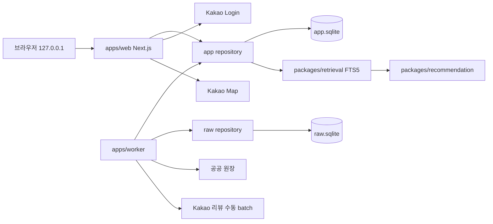

# Local MVP Responsibility Document Synchronization Implementation Plan

> **For agentic workers:** REQUIRED SUB-SKILL: Use superpowers:executing-plans to implement this plan task-by-task. Project `AGENTS.md` makes inline main-agent execution the default; do not dispatch Subagents unless the user explicitly requests delegation. Steps use checkbox (`- [ ]`) syntax for tracking.

**Goal:** DR-032·DR-033·DR-034와 승인된 로컬 MVP 설계를 모든 현재 책임 문서에 반영해, Feature 1 개발자가 온라인 P0 이력과 현재 완료 목표를 혼동하지 않게 한다.

**Architecture:** 현재 책임 문서는 `현재 로컬 MVP`, `전환 전 실제 scaffold`, `후속 독립 Feature`의 세 상태를 명시적으로 구분한다. 제품·경험에서 시작해 추천·아키텍처·데이터·신뢰·운영·전달 순으로 하향 동기화하고, 결정 로그와 기존 `docs/superpowers` 기록은 이력으로 보존한다.

**Tech Stack:** Markdown, Mermaid, PowerShell, ripgrep, Git

## Global Constraints

- 기준은 DR-032·DR-033·DR-034, `2026-07-24-local-first-sqlite-web-design.md`, `2026-07-24-local-first-sqlite-mvp-master.md` 순서다.
- 현재 로컬 MVP는 사용자 PC의 `127.0.0.1`에서 실행한다.
- 승인 목표 저장소는 SQLite/libSQL 호환 `app.sqlite`, worker 전용 `raw.sqlite`, Drizzle migration과 FTS5다.
- 현재 저장소 코드는 PostgreSQL·Prisma 기반 최소 scaffold이며 SQLite 전환은 아직 구현되지 않았다.
- 현재 사용자 입력은 지역·가게명·메뉴·카테고리·영업·거리·리뷰 상태의 구조화 검색이다.
- 현재 추천은 결정론적이며 사용자에게 숫자 총점을 표시하지 않는다.
- 현재 채팅은 비활성 UI 셸이고 OpenAI client·API route·key 요구사항이 없으며 비용 목표는 `$0`이다.
- 자연어·멀티턴·RAG·OpenAI·Vercel·Turso·5인 파일럿은 후속 독립 Feature다.
- 리뷰 수집의 정책 위험, 우회 금지, 닉네임 폐기, 원문 암호화와 30일 삭제 기준을 완화하지 않는다.
- 정확한 사용자 위치는 저장·로그·분석하지 않는다.
- 애플리케이션 코드, manifest, schema, migration과 runtime 설정을 변경하지 않는다.
- `docs/09-decisions/decision-log.md`와 기존 `docs/superpowers/specs/*`, `docs/superpowers/plans/*`는 수정하지 않는다. 이 실행 계획 파일만 새 기록으로 허용한다.
- 현재 코드에 없는 `db:migrate`, `db:backup:app` 명령을 실행 가능한 현재 명령으로 문서화하지 않는다.
- 각 Task는 지정 문서만 stage하고 `git diff --cached --check`를 통과한 뒤 별도 commit한다.

---

### Task 1: Align the Product Scope and Documentation Entry Points

**Files:**

- Modify: `README.md`
- Modify: `docs/README.md`
- Modify: `docs/service-plan.md`
- Modify: `docs/00-product/prd.md`

**Interfaces:**

- Consumes: DR-032·DR-033·DR-034와 승인된 로컬 MVP 목표
- Produces: 모든 하위 책임 문서가 참조하는 현재 P0, 후속 범위, 성공 기준과 문서 읽기 순서

- [ ] **Step 1: Capture the current product drift**

Run:

```powershell
rg -n "자연어|멀티턴|5인|HTTPS|월 30,000원|OpenAI|PostgreSQL|Prisma" README.md docs/00-product/prd.md docs/README.md docs/service-plan.md
```

Expected: 현재 로컬 MVP와 충돌하는 온라인 P0 표현이 `README.md`와 PRD에서 발견된다.

- [ ] **Step 2: Replace the root introduction with the current local MVP**

Update `README.md` so its opening sections state all of the following:

```md
현재 단계는 사용자 PC의 `127.0.0.1`에서 실행하는 로컬 우선 웹 MVP다.
지역·가게명·메뉴·카테고리와 방문 조건으로 서울의 검수된 독립 베이커리를
검색하고, 결정론적 순서와 실제 리뷰 근거를 지도·목록·상세에서 비교한다.

현재 MVP의 빵빵이 채팅은 비활성 UI 셸이며 OpenAI를 호출하지 않는다.
자연어 멀티턴 챗봇과 원격 5인 파일럿은 후속 독립 Feature다.
```

Replace the old P0 master link with the current local MVP master plan as the primary implementation link. Keep the old 19-Feature plan under a label containing `이전 온라인 P0 계획 이력`.

- [ ] **Step 3: Make the hub distinguish current, transition, and history**

Update `docs/README.md`:

- Put the local-first design, current master plan and Feature 1 detailed plan before 2026-07-23 delivery documents.
- Add a `현재 해석 기준` block that defines `현재 로컬 MVP`, `전환 전 scaffold`, `후속 Feature`.
- Mark PostgreSQL delivery pages as transition-state pages that will be updated again after Feature 1 code changes.
- Add this plan under `작업 기록`.

The hub must not say that SQLite commands already exist.

- [ ] **Step 4: Rewrite the PRD current-scope sections**

In `docs/00-product/prd.md`:

- Change status to `로컬 우선 웹 MVP 기준 승인`, basis date `2026-07-24`.
- Rewrite `제품 한 문장` around structured search, map, store detail and review evidence.
- Keep the specific-menu exploration user and medical-safety boundary.
- Replace current P0 with:
  - local execution;
  - Seoul source ingestion and eligibility;
  - Kakao review collection, deidentification and FTS5;
  - structured search and deterministic recommendation;
  - Kakao login, account-isolated favorites and history;
  - map, drawer, store detail and disabled chat shell;
  - checkpoint, snapshot recovery and local E2E.
- Move natural-language intent, multi-turn conversation, LLM explanations, remote deployment and 5-person usability metrics into a section titled `후속 독립 Feature`.
- Replace current product hypotheses with these local hypotheses:

```md
| `HYP-L01` | 구조화된 지역·가게·메뉴·카테고리 검색으로 원하는 후보를 찾을 수 있다. |
| `HYP-L02` | 강한 제외와 안정 동점 규칙은 동일 입력의 결과를 재현한다. |
| `HYP-L03` | 지도·상세·비식별 리뷰 근거가 실제 방문 후보 비교를 돕는다. |
| `HYP-L04` | 리뷰 부족 매장도 메뉴·영업·거리 근거로 탐색할 수 있다. |
| `HYP-L05` | 비활성 채팅 셸은 실제 AI 호출 없이 후속 인터랙션을 검증한다. |
```

- Replace current P0 requirement groups with `FR-SEARCH-*`, `FR-STORE-*`, `FR-DATA-*`, `FR-AUTH-*`, `FR-UI-*`, `FR-RECOVERY-*`.
- Preserve existing IDs used only by the chatbot under a table explicitly marked `후속 Feature 요구사항`.
- Set current success targets to:
  - representative structured search Hit Rate@5 at least 85%;
  - hard-exclusion violations 0;
  - 100-run ordering determinism 100%;
  - deterministic search/filter/rank p95 at most 1.5 seconds;
  - no-LLM response p95 at most 2 seconds;
  - secret, nickname, raw text and exact-location exposure 0;
  - OpenAI cost `$0`.

- [ ] **Step 5: Refresh the legacy service-plan redirect**

Update `docs/service-plan.md` so the first current-scope link is the local-first design and the current master plan. Retain the existing topic links, but label natural-language conversation and LLM contracts as follow-up design references.

- [ ] **Step 6: Verify the product layer**

Run:

```powershell
rg -n "현재 로컬 MVP|전환 전|후속 독립 Feature|구조화 검색|OpenAI.*\\$0|SQLite|FTS5" README.md docs/README.md docs/00-product/prd.md docs/service-plan.md
rg -n "현재 P0.*(자연어|멀티턴|5인|HTTPS)|현재 단계.*5인" README.md docs/00-product/prd.md
git diff --check
```

Expected:

- First command finds all current-scope markers.
- Second command exits `1` with no matches.
- `git diff --check` exits `0`.

- [ ] **Step 7: Commit the product-scope synchronization**

```powershell
git add README.md docs/README.md docs/service-plan.md docs/00-product/prd.md
git diff --cached --check
git diff --cached --stat
git commit -m "docs: align product scope with local MVP"
```

Expected: one documentation-only commit containing exactly the four listed files.

---

### Task 2: Align Experience, Recommendation, Evaluation, and Deferred LLM Contracts

**Files:**

- Modify: `docs/01-experience/user-journey.md`
- Modify: `docs/01-experience/ux-states-and-copy.md`
- Modify: `docs/01-experience/design-system.md`
- Modify: `docs/02-recommendation/recommendation-spec.md`
- Modify: `docs/02-recommendation/evaluation-plan.md`
- Modify: `docs/03-contracts/llm-contracts.md`

**Interfaces:**

- Consumes: Task 1 current P0 and existing deterministic recommendation rules
- Produces: current structured-search journey, current recommendation input/evaluation contract and deferred chatbot contract

- [ ] **Step 1: Record active chatbot-flow references**

Run:

```powershell
rg -n "자연어|멀티턴|확인 질문|ConversationIntentV2|LLM 실패|5인 사용성|메시지 제출" docs/01-experience docs/02-recommendation docs/03-contracts
```

Expected: references are found without a consistent current-versus-follow-up label.

- [ ] **Step 2: Replace the current user journey**

Rewrite the current flow in `user-journey.md` to:

```text
서비스 진입 → Kakao Login → 위치 선택 또는 지역 직접 입력
→ 지역·가게·메뉴·카테고리 검색과 필터
→ 지도·왼쪽 목록 → 가게 상세·메뉴·비식별 리뷰
→ 즐겨찾기·검색/선택 기록
→ 빵빵이 FAB·비활성 채팅 셸
```

Keep location separation, exact-coordinate disposal, account isolation, accessibility and deletion rules. Move these flows to `후속 챗봇 Feature`:

- free-form natural-language input;
- four intent groups;
- clarification count;
- multi-turn condition changes;
- conversation replay and condition copying.

Search history must not be described as conversation history.

- [ ] **Step 3: Update current UX states and copy**

In `ux-states-and-copy.md`:

- Keep common `idle/loading/success/partial/empty/error/stale/confirming`.
- Replace current intent-analysis states with search normalization, filter and FTS states.
- Add current messages with these meanings:

```md
**검색 대체:** 리뷰 검색을 사용할 수 없어 메뉴·카테고리·지역 조건으로 결과를 표시합니다.
**리뷰 부족:** 최근 리뷰 근거가 부족해 확인된 메뉴와 방문 조건을 중심으로 표시합니다.
**채팅 준비 중:** 챗봇 기능은 다음 단계에서 제공할 예정이에요.
```

- Keep Kakao OAuth, map, location and SQLite service-data failure states.
- Move LLM analysis/explanation/cost failures to `후속 챗봇 상태`.
- Remove any active chat composer behavior.

- [ ] **Step 4: Preserve the approved design system and correct its scope links**

In `design-system.md`:

- Keep tokens, layout, component inventory, accessibility and disabled-chat behavior unchanged.
- Replace the old P0 master link with the current local master plan.
- Mark `thinking/success/error` chat character states as follow-up.
- Replace current `LLM failure` fallback wording with current FTS/map/review fallbacks and a follow-up chatbot note.

- [ ] **Step 5: Define the local structured recommendation input**

In `recommendation-spec.md`, replace the current input dependency on `ConversationIntentV2` with:

```text
StructuredSearchInput
├─ region
├─ storeName
├─ menuName
├─ categories
├─ openNow
├─ origin
├─ maxDistanceM
├─ reviewEvidenceStatus
├─ sortMode
├─ dataSnapshotVersion
└─ recommendationVersion
```

State that `origin` exact coordinates are request-memory only. Preserve:

- eligibility filters;
- hard exclusions;
- menu/category priority;
- review evidence threshold;
- sparse-review fallback;
- rating as final tie helper;
- stable `store_id` tie-breaker;
- no public numeric total score.

Use the local-first ranking order:

1. explicit menu/category match;
2. review FTS relevance;
3. valid review count and freshness;
4. operating/distance/visit conditions;
5. data completeness;
6. adjusted rating;
7. `store_id`.

Move `ConversationIntentV2`, LLM explanation and multi-turn patches into `후속 챗봇 adapter`.

- [ ] **Step 6: Replace the current evaluation layers**

In `evaluation-plan.md`:

- Keep unit, fixed-data, representative-scenario, integration/E2E layers.
- Replace natural-language and 5-person current scenarios with at least 20 structured scenarios covering:
  - region, store, menu and category;
  - hard exclusion;
  - open/distance filters;
  - review-rich and review-poor stores;
  - FTS failure fallback;
  - map failure;
  - account isolation;
  - stable sorting.
- Keep Hit Rate@5 `>= 0.85`, hard-exclusion violations `0`, 100-run determinism and rating-reversal `0`.
- Move multi-turn, LLM schema, LLM fallback and 5-person usability to `후속 평가`.

- [ ] **Step 7: Mark all LLM contracts as deferred**

At the top of `llm-contracts.md`, add:

```md
**상태:** 후속 챗봇 Feature 설계 계약

로컬 MVP는 이 문서의 OpenAI client, API route, model, prompt와 JSON 계약을
runtime에 연결하지 않는다. 현재 검색·추천·리뷰 게시에는 OpenAI API key가
필요하지 않으며 비용 목표는 `$0`이다.
```

Keep existing schemas as future contracts. Update the cost section so a future chatbot Feature must reapprove model, token, call-count and total-cost caps before any call. Remove current 5-person monthly budget language from the active contract.

- [ ] **Step 8: Verify experience and recommendation consistency**

Run:

```powershell
rg -n "StructuredSearchInput|구조화 검색|FTS5|후속 챗봇|비활성|OpenAI.*\\$0" docs/01-experience docs/02-recommendation docs/03-contracts
rg -n "현재.*(자연어|멀티턴|ConversationIntentV2)|로컬 MVP.*OpenAI.*사용" docs/01-experience docs/02-recommendation docs/03-contracts
git diff --check
```

Expected:

- Current structured input and deferred chatbot markers are found.
- Contradictory active-chat patterns have no matches.
- `git diff --check` exits `0`.

- [ ] **Step 9: Commit experience and recommendation synchronization**

```powershell
git add docs/01-experience docs/02-recommendation docs/03-contracts/llm-contracts.md
git diff --cached --check
git diff --cached --stat
git commit -m "docs: align local search and deferred chatbot scope"
```

Expected: one documentation-only commit containing the six listed files.

---

### Task 3: Align the Local System and Worker Architecture

**Files:**

- Modify: `docs/04-architecture/system-architecture.md`
- Modify: `docs/04-architecture/worker-design.md`

**Interfaces:**

- Consumes: current structured-search contract and local-first design
- Produces: SQLite repository boundaries, current web/worker data flow, local checkpoint and failure-isolation contract

- [ ] **Step 1: Capture legacy architecture assumptions**

Run:

```powershell
rg -n "PostgreSQL|Prisma|FOR UPDATE SKIP LOCKED|LangGraph|OpenAI|HTTPS|배포" docs/04-architecture
```

Expected: active legacy assumptions are found.

- [ ] **Step 2: Replace the current system structure**

Rewrite `system-architecture.md` current architecture around:



Define:

- web reads app repository only;
- worker reads app and raw repositories;
- browser never receives DB paths or raw secrets;
- FTS and ranking are server-side;
- exact location remains request-memory only;
- Kakao account data is server-scoped.

Move LangGraph, OpenAI and remote deployment diagrams to `후속 아키텍처`. Do not retain them in the current sequence diagram.

- [ ] **Step 3: Replace the current worker pipeline**

Rewrite `worker-design.md` current pipeline to:

```text
source snapshot → staging → normalize → eligibility → publish app.sqlite
eligible stores → Kakao review collection → deidentify
→ encrypt raw.sqlite → publish deidentified review to app.sqlite → FTS5
```

Define SQLite current behavior:

- store/page checkpoint rows in local DB;
- one active collection run;
- one browser page;
- short store-level transactions;
- WAL and `busy_timeout`;
- bounded lock retry;
- restart from last committed checkpoint;
- failed store isolation;
- global stop for login/CAPTCHA/401/403/429/DOM contract change.

Move PostgreSQL queue and LLM extraction/aggregate steps to `대체된 온라인 P0 구조` and `후속 챗봇 Feature`.

- [ ] **Step 4: Verify architecture boundaries**

Run:

```powershell
rg -n "app\\.sqlite|raw\\.sqlite|Drizzle|FTS5|WAL|busy_timeout|checkpoint|후속 아키텍처" docs/04-architecture
rg -n "현재.*(PostgreSQL|Prisma|FOR UPDATE SKIP LOCKED|LangGraph|OpenAI)" docs/04-architecture
git diff --check
```

Expected:

- SQLite/current architecture markers are present.
- Legacy active-current patterns have no matches.
- `git diff --check` exits `0`.

- [ ] **Step 5: Commit architecture synchronization**

```powershell
git add docs/04-architecture/system-architecture.md docs/04-architecture/worker-design.md
git diff --cached --check
git diff --cached --stat
git commit -m "docs: align architecture with local SQLite MVP"
```

Expected: one documentation-only commit containing exactly the two architecture files.

---

### Task 4: Convert the Data Design to the Approved SQLite Target

**Files:**

- Modify: `docs/05-data/data-design.md`

**Interfaces:**

- Consumes: Task 3 repository/worker boundaries and existing source, eligibility, privacy and retention rules
- Produces: target SQLite schema contract, FTS5 model, local retention, migration and recovery rules

- [ ] **Step 1: Inventory PostgreSQL-specific data contracts**

Run:

```powershell
rg -n "PostgreSQL|Prisma|timestamptz|jsonb|bytea|materialized|pg_dump|FOR UPDATE SKIP LOCKED|raw_db|app_db|LLM" docs/05-data/data-design.md
```

Expected: PostgreSQL types, Prisma ownership, online-P0 tables and LLM pipeline references are found.

- [ ] **Step 2: Update document status and storage conventions**

Set:

```md
**버전:** 0.4
**기준일:** 2026-07-24
**실행 환경:** 사용자 PC의 로컬 웹, 로컬 worker, SQLite 이중 저장소
```

Define:

- `app.sqlite` and `raw.sqlite`;
- Drizzle-owned independent migration histories;
- SQLite `INTEGER` UTC epoch milliseconds for timestamps;
- normalized local-date `TEXT` for source dates;
- canonical JSON serialized into validated `TEXT` only where relational columns are insufficient;
- stable application-generated IDs;
- WAL, foreign keys and busy timeout.

Label all domain tables as approved target contracts that are not yet implemented.

- [ ] **Step 3: Convert the data boundaries and ERD**

Update the ERD and boundary sections:

- current app data: catalog, menus, deidentified reviews, FTS index, users, sessions, favorites and search/selection history;
- current raw data: encrypted raw reviews, collection/checkpoint state, fingerprints and deidentification failure state;
- no current conversation, LLM prompt, extraction or recommendation-explanation tables;
- future conversation/LLM tables retained under `후속 챗봇 데이터 모델`.

Replace cross-database PostgreSQL wording with application-level shared IDs and worker consistency checks between two SQLite files.

- [ ] **Step 4: Replace PostgreSQL table types and indexes**

For every current target table dictionary:

- `uuid` → `text` stable ID;
- `timestamptz` → `integer` epoch milliseconds;
- `jsonb` → validated JSON `text` or normalized child tables;
- `bytea` → `blob`;
- PostgreSQL partial/trigram/GIN indexes → SQLite B-tree indexes or FTS5;
- PostgreSQL materialized view → repository query or versioned publish table;
- `FOR UPDATE SKIP LOCKED` → single-process checkpoint claiming and short SQLite transactions.

Do not write raw SQL migrations in this document; Drizzle-generated migrations remain the owner.

- [ ] **Step 5: Replace the current review/FTS pipeline**

Current pipeline:

```text
rendered review → transient nickname → body deidentification
→ HMAC fingerprint → AES-256-GCM raw row
→ deidentified review row → FTS5 index
```

Keep:

- Kakao only;
- recent 12 months and at most 20;
- nickname disposal;
- 30-day raw hard delete;
- no raw backup;
- deidentification failure exclusion.

Move prompt/model/evidence-offset/LLM feature extraction tables and execution rules to `후속 챗봇 데이터 모델`.

- [ ] **Step 6: Replace backup, migration and recovery**

Define current target:

- app snapshot via SQLite backup API before large collections and migrations;
- several recent verified app snapshots;
- no long-term raw snapshot;
- restore into a new file;
- `PRAGMA integrity_check`;
- migration and representative search verification;
- checkpoint resume and duplicate count `0`.

Move `pg_dump`, RPO/RTO for remote service and PostgreSQL extensions into the superseded online-P0 history note.

- [ ] **Step 7: Update data milestones**

Replace the old online release stages with:

1. SQLite storage foundation;
2. Seoul source ingestion;
3. normalization and eligibility;
4. review collection and encrypted raw store;
5. deidentification and FTS5;
6. deterministic search/recommendation;
7. account/map integration;
8. local release gate.

No current milestone may require an OpenAI benchmark.

- [ ] **Step 8: Verify the data contract**

Run:

```powershell
rg -n "버전:\\*\\* 0\\.4|app\\.sqlite|raw\\.sqlite|Drizzle|FTS5|INTEGER.*epoch|BLOB|SQLite backup|후속 챗봇 데이터 모델" docs/05-data/data-design.md
rg -n "현재.*(PostgreSQL|Prisma|pg_dump|FOR UPDATE SKIP LOCKED|OpenAI benchmark)" docs/05-data/data-design.md
git diff --check
```

Expected:

- SQLite target and deferred data markers are present.
- Active-current PostgreSQL/LLM patterns have no matches.
- `git diff --check` exits `0`.

- [ ] **Step 9: Commit the data-design conversion**

```powershell
git add docs/05-data/data-design.md
git diff --cached --check
git diff --cached --stat
git commit -m "docs: align data design with local SQLite storage"
```

Expected: one documentation-only commit containing exactly `data-design.md`.

---

### Task 5: Align Security, Policy, Review Experiment, and Local Operations

**Files:**

- Modify: `docs/06-trust/security-design.md`
- Modify: `docs/06-trust/policy-review.md`
- Modify: `docs/07-experiments/review-collection-experiment.md`
- Modify: `docs/08-operations/operating-baselines.md`

**Interfaces:**

- Consumes: Task 4 file storage, privacy and recovery contract
- Produces: local secret/file protection, review policy boundary, current experiment output and local operational gates

- [ ] **Step 1: Capture online-operation assumptions**

Run:

```powershell
rg -n "5인|HTTPS|배포|PostgreSQL|OpenAI|월 30,000원|pg_dump|LLM 특징" docs/06-trust docs/07-experiments docs/08-operations
```

Expected: active online/file-pilot assumptions are found.

- [ ] **Step 2: Update local security boundaries**

In `security-design.md`:

- Set scope to local MVP with Kakao account structure.
- Replace database roles/DSNs with package, process, path and secret boundaries.
- web may read only `APP_SQLITE_PATH`; worker alone may read `RAW_SQLITE_PATH`, encryption and dedupe keys.
- SQLite files, WAL/SHM and snapshots are Git-ignored and protected in the local user area.
- Keep session ownership, IDOR, CSRF, XSS, exact-location, logging and deletion rules.
- Mark production HTTPS/CSP hardening and OpenAI prompt injection as follow-up sections.

- [ ] **Step 3: Update current policy boundaries**

In `policy-review.md`:

- Keep Kakao Login, Maps and review-risk decisions current.
- Mark Vercel/remote deployment review as follow-up.
- Mark all OpenAI processing as disabled in current MVP and requiring new approval.
- Preserve the review collection prohibition language and public-deployment gate.

- [ ] **Step 4: Replace current experiment output**

In `review-collection-experiment.md`:

- replace PostgreSQL checkpoint with local SQLite checkpoint;
- replace LLM feature extraction with deidentified review publication and FTS5 indexing;
- keep encrypted raw storage, nickname HMAC and 30-day deletion;
- keep one page, 12 months, 20 reviews and all immediate-stop conditions;
- add duplicate `0`, FTS consistency and app/raw log-exposure gates.

- [ ] **Step 5: Replace online pilot operations**

In `operating-baselines.md`:

- current users: owner on local PC;
- current web: `127.0.0.1`;
- current hosting cost: none;
- current OpenAI cost: `$0`;
- no monthly 30,000-won gate in the local release;
- SQLite app snapshots and restore rehearsal;
- manual source/review runs without cron;
- local Kakao/API smoke only at relevant Features;
- retain freshness, performance, privacy and kill-switch thresholds.

Move 5-person time allocation, hosting cost, production callbacks and remote incident response to `후속 원격 파일럿`.

- [ ] **Step 6: Verify trust and operations**

Run:

```powershell
rg -n "APP_SQLITE_PATH|RAW_SQLITE_PATH|FTS5|OpenAI.*\\$0|127\\.0\\.0\\.1|후속 원격 파일럿|SQLite.*snapshot" docs/06-trust docs/07-experiments docs/08-operations
rg -n "현재.*(5인|HTTPS 배포|PostgreSQL|월 30,000원|LLM 특징 추출)" docs/06-trust docs/07-experiments docs/08-operations
git diff --check
```

Expected:

- Local boundaries and follow-up markers are found.
- Active online-pilot patterns have no matches.
- `git diff --check` exits `0`.

- [ ] **Step 7: Commit trust and operations synchronization**

```powershell
git add docs/06-trust docs/07-experiments docs/08-operations
git diff --cached --check
git diff --cached --stat
git commit -m "docs: align trust and operations with local MVP"
```

Expected: one documentation-only commit containing the four listed files.

---

### Task 6: Align Delivery Documentation Without Claiming Unimplemented Commands

**Files:**

- Modify: `docs/10-delivery/README.md`
- Modify: `docs/10-delivery/technology-stack.md`
- Modify: `docs/10-delivery/directory-structure.md`
- Modify: `docs/10-delivery/local-development.md`
- Modify: `docs/10-delivery/development-readiness-checklist.md`

**Interfaces:**

- Consumes: approved target architecture and actual current repository scaffold
- Produces: a truthful transition guide for Feature 1 and updated external-preparation sequence for Features 1–10

- [ ] **Step 1: Capture delivery drift and actual current commands**

Run:

```powershell
rg -n "PostgreSQL|Prisma|Docker|OpenAI|Feature 1[1-9]|5인|배포" docs/10-delivery
Get-Content -LiteralPath package.json -Raw -Encoding UTF8
Get-Content -LiteralPath pnpm-workspace.yaml -Raw -Encoding UTF8
```

Expected:

- Delivery pages describe the old stack.
- Root scripts still use Prisma and no SQLite migration/backup command exists.

- [ ] **Step 2: Separate target stack from current scaffold**

In `technology-stack.md`, create:

1. `승인된 로컬 MVP 목표 스택`
2. `Feature 1 전환 전 실제 scaffold`
3. `전환 완료 판정`

Target table:

| Area | Target |
|---|---|
| Runtime | Node.js 24.18.0 |
| Package manager | pnpm 11.16.0 |
| Language | TypeScript 6.0.3 |
| Web | Next.js 16.2.11, React 19.2.8 |
| Database | SQLite/FTS5 |
| Driver | better-sqlite3 12.11.1 |
| Schema/migration | Drizzle ORM 0.45.2, Drizzle Kit 0.31.10 |
| Authentication | Auth.js compatible Kakao provider, exact adapter pinned in Feature 7 |
| Test | Vitest 4.1.10, Playwright 1.61.1 |

The scaffold table must explicitly list PostgreSQL, Prisma, Docker Compose, LangGraph and OpenAI as present but superseded runtime dependencies awaiting Feature 1 removal.

- [ ] **Step 3: Separate target and current directories**

In `directory-structure.md`, document target additions:

```text
packages/sqlite-core/
packages/retrieval/
drizzle/app/
drizzle/raw/
var/app.sqlite
var/raw.sqlite
backups/
```

Mark `prisma/`, `infra/compose.yaml` and generated Prisma clients as current scaffold paths to be removed only after verified replacement. Preserve web/raw import restrictions.

- [ ] **Step 4: Make local development truthful before Feature 1**

In `local-development.md`:

- title the current procedure `Feature 1 전환 전 scaffold 확인`;
- keep actual install/typecheck/lint/test/build commands;
- state that Docker is optional for inspecting the legacy PostgreSQL services and is not a target prerequisite;
- state that `db:migrate` and `db:backup:app` are planned but unavailable until Feature 1 implements them;
- do not instruct users to create `app.sqlite`;
- add a `Feature 1 완료 후 갱신할 목표 절차` list without executable command blocks for unavailable scripts.

- [ ] **Step 5: Remap readiness to current Features 1–10**

In `development-readiness-checklist.md`:

- Feature 1: Node, Corepack, Git only; no Docker, Kakao, public-data or OpenAI key required.
- Feature 2: public-data access.
- Feature 4: local browser/Playwright review experiment acknowledgement and secret-key injection.
- Feature 7: Kakao Login local callback.
- Feature 8: Kakao Map JavaScript/REST access.
- Feature 9: no additional external preparation.
- Feature 10: manual live smoke and local snapshot directory.
- Remove current OpenAI project and payment preparation.
- Move domain, HTTPS, provider and pilot participants to follow-up remote deployment.

- [ ] **Step 6: Update the delivery index**

Ensure `docs/10-delivery/README.md`:

- lists current master and Feature 1 plan first;
- calls the old 19-Feature plan history;
- links the new sync design and this plan;
- states that current delivery pages describe a transition and must be reverified after Feature 1.

- [ ] **Step 7: Verify delivery truthfulness**

Run:

```powershell
rg -n "승인된 로컬 MVP 목표|전환 전 실제 scaffold|아직 사용할 수 없|Feature 1 완료 후|SQLite|Drizzle|FTS5" docs/10-delivery
rg -n "현재 필수.*(Docker|OpenAI)|지금 실행.*db:migrate|현재.*SQLite 전환 완료" docs/10-delivery
git diff --check
```

Expected:

- Target/scaffold separation is present.
- False current prerequisites and unavailable-command claims have no matches.
- `git diff --check` exits `0`.

- [ ] **Step 8: Commit delivery synchronization**

```powershell
git add docs/10-delivery
git diff --cached --check
git diff --cached --stat
git commit -m "docs: align delivery guides for SQLite transition"
```

Expected: one documentation-only commit containing the five delivery files.

---

### Task 7: Run the Full Documentation Consistency Audit

**Files:**

- Verify: `README.md`
- Verify: all Markdown under `docs/` except historical content changes
- Modify only if a failed audit identifies a direct documentation defect in Tasks 1–6 files

**Interfaces:**

- Consumes: Tasks 1–6 synchronized documentation
- Produces: link, scope, terminology, history-preservation and code-scope evidence

- [ ] **Step 1: Verify every relative Markdown file link**

Run:

```powershell
$markdownFiles = @('README.md') + @(rg --files docs -g '*.md')
$missingLinks = @()
foreach ($markdownFile in $markdownFiles) {
  $absoluteFile = Resolve-Path -LiteralPath $markdownFile
  $baseDirectory = Split-Path $absoluteFile
  $markdown = Get-Content -LiteralPath $absoluteFile -Raw -Encoding UTF8
  $matches = [regex]::Matches($markdown, '\[[^\]]+\]\(([^)#]+)(?:#[^)]+)?\)')
  foreach ($match in $matches) {
    $target = $match.Groups[1].Value
    if ($target -match '^[a-z][a-z0-9+.-]*:' -or [IO.Path]::IsPathRooted($target)) {
      continue
    }
    $resolvedTarget = [IO.Path]::GetFullPath((Join-Path $baseDirectory $target))
    if (-not (Test-Path -LiteralPath $resolvedTarget)) {
      $missingLinks += "$markdownFile -> $target"
    }
  }
}
$missingLinks
if ($missingLinks.Count -gt 0) { exit 1 }
```

Expected: no output and exit code `0`.

- [ ] **Step 2: Verify current-scope presence**

Run:

```powershell
rg -l "127\\.0\\.0\\.1" README.md docs/00-product docs/04-architecture docs/08-operations docs/10-delivery
rg -l "app\\.sqlite|raw\\.sqlite" docs/04-architecture docs/05-data docs/06-trust docs/08-operations docs/10-delivery
rg -l "FTS5|구조화 검색" docs/00-product docs/01-experience docs/02-recommendation docs/04-architecture docs/05-data
rg -l "OpenAI.*\\$0|\\$0.*OpenAI" README.md docs/00-product docs/03-contracts docs/08-operations
```

Expected: every listed document group returns at least one responsible page.

- [ ] **Step 3: Verify active-scope exclusions**

Run:

```powershell
rg -n "현재 (MVP|P0).*(PostgreSQL|Prisma|Docker|LangGraph|OpenAI client|HTTPS 배포|5인 파일럿)" README.md docs -g '*.md' -g '!docs/superpowers/**' -g '!docs/09-decisions/decision-log.md'
rg -n "(PostgreSQL|Prisma|Docker|LangGraph|OpenAI).*(현재 (필수|기준)|로컬 MVP 필수)" README.md docs -g '*.md' -g '!docs/superpowers/**' -g '!docs/09-decisions/decision-log.md'
```

Expected: both commands exit `1` with no matches. Historical or follow-up references with explicit labels are allowed.

- [ ] **Step 4: Verify history files were preserved**

Run:

```powershell
git diff 5144244 --name-only -- docs/09-decisions docs/superpowers/specs docs/superpowers/plans
```

Expected: output contains only this plan path under `docs/superpowers/plans`; no pre-existing decision, spec or plan file appears.

- [ ] **Step 5: Verify no application files changed**

Run:

```powershell
$changedFiles = @(git diff 5144244 --name-only)
$nonDocs = @($changedFiles | Where-Object {
  $_ -ne 'README.md' -and -not $_.StartsWith('docs/')
})
$nonDocs
if ($nonDocs.Count -gt 0) { exit 1 }
```

Expected: no output and exit code `0`.

- [ ] **Step 6: Verify formatting and repository state**

Run:

```powershell
git diff --check
git status --short
git log -8 --oneline
```

Expected:

- `git diff --check` exits `0`;
- only an intentional uncommitted plan file is shown if the plan was not committed before execution;
- log shows the ordered documentation commits from Tasks 1–6.

- [ ] **Step 7: Review requirement coverage**

Confirm one responsible section for each row:

| Requirement | Responsible evidence |
|---|---|
| Current local scope | root README, PRD |
| Target versus current scaffold | technology stack, local development |
| Structured search journey | user journey, recommendation spec |
| Deferred chatbot/OpenAI | PRD, LLM contracts |
| SQLite web/worker boundary | system architecture, data design, security |
| Review privacy and FTS | worker design, data design, experiment |
| Local backup/recovery | data design, operations, delivery |
| Feature 1–10 order | hub, delivery README, current master plan |
| Historical preservation | decision log and unchanged old plans |

Expected: every row has matching content and no row relies only on a `docs/superpowers` historical document.

- [ ] **Step 8: Commit direct audit fixes only if needed**

If Tasks 7.1–7.7 required direct fixes:

```powershell
git add README.md docs
git diff --cached --check
git diff --cached --stat
git commit -m "docs: fix local MVP consistency audit findings"
```

If no fixes were required, do not create an empty commit.

- [ ] **Step 9: Report the synchronization result**

Report:

1. documents updated by responsibility group;
2. current local MVP scope now represented;
3. deferred chatbot/deployment scope retained;
4. target-versus-scaffold distinction;
5. link/scope/history/application-file audit results;
6. that Feature 1 remains the next independent development task.

## Plan Completion Checklist

- [ ] The plan covers every document listed in the approved sync design.
- [ ] Product scope is updated before dependent experience and architecture pages.
- [ ] Data design receives its own review and commit boundary.
- [ ] Delivery pages never claim unimplemented SQLite commands exist.
- [ ] Historical decisions, specs and plans remain unchanged.
- [ ] No application code, manifest, schema or migration is modified.
- [ ] Every task has exact files, verification commands, expected results and a commit boundary.
- [ ] The final audit checks links, current scope, deferred scope, history and code-file isolation.
