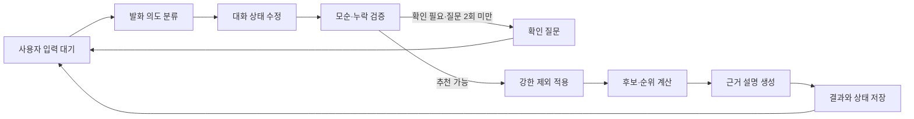

# 빵찾깅 제품 문서 재구성 설계

**상태:** 사용자 승인 내용을 반영한 최종 검토본

**작성일:** 2026-07-22

**적용 범위:** 제품·경험·추천·계약·아키텍처·데이터·신뢰·실험·운영 문서

**이번 작업의 성격:** 애플리케이션 구현이 아니라 기존 기획 문서의 분리·보강·정합성 수정

## 1. 배경

현재 `docs/service-plan.md`는 상세 PRD에 가까운 내용을 갖추고 있지만 제품 요구사항, 추천 알고리즘, LLM 계약, 시스템 구조, 데이터 설계, 보안, 플랫폼 정책과 운영 기준이 한 문서에 섞여 있다. `docs/data-design.md`는 실행 가능한 수준으로 상세하지만 서비스 기획서와 책임 범위가 중복되고, 일부 전제는 이후 제품 결정과 충돌한다.

이번 개편은 기존 내용을 버리고 새로 쓰는 작업이 아니다. 기존 문장을 주제별 기준 문서로 이동하고, 빠진 제품 기준을 보강하며, 2026-07-22까지 사용자가 확정한 결정을 모든 문서에 일관되게 반영한다.

## 2. 목표와 비목표

### 2.1 목표

1. 한 문서가 한 종류의 결정을 책임지는 작은 위키형 문서 체계를 만든다.
2. 간결한 PRD에서 세부 설계와 근거 문서로 이동할 수 있게 한다.
3. 사용자·문제·가설·성공 지표·분석 이벤트·화면 상태·수용 기준을 추가한다.
4. 자연어 중심의 전체 세션 멀티턴 추천 경험을 명확히 정의한다.
5. 카카오싱크 계정, 계정별 대화 기록, 선택적 실시간 위치 사용을 반영한다.
6. 추천 점수, 의료 안전, 경로 API 상태처럼 기존 문서가 서로 다르게 말하는 항목을 해소한다.
7. 기존 데이터 설계의 상세도와 추적 가능성을 보존한다.

### 2.2 비목표

- 이번 문서 개편에서 웹 애플리케이션이나 worker 코드를 구현하지 않는다.
- 서울 이외 지역으로 추천 범위를 확대하지 않는다.
- 빵집의 재료·알레르기·교차접촉 안전성을 판정하지 않는다.
- 계정 전체에 적용되는 장기 취향 프로필을 만들지 않는다.
- 백그라운드 위치 추적을 구현하지 않는다.
- 추천 점수를 사용자에게 숫자로 표시하지 않는다.
- 리뷰 플랫폼의 접근 제한을 우회하거나 자동 수집 권한이 확보된 것으로 표현하지 않는다.

## 3. 문서 정보 구조

최종 문서 트리는 다음과 같다.

```text
docs/
├─ README.md
├─ 00-product/
│  └─ prd.md
├─ 01-experience/
│  ├─ user-journey.md
│  └─ ux-states-and-copy.md
├─ 02-recommendation/
│  ├─ recommendation-spec.md
│  └─ evaluation-plan.md
├─ 03-contracts/
│  └─ llm-contracts.md
├─ 04-architecture/
│  ├─ system-architecture.md
│  └─ worker-design.md
├─ 05-data/
│  └─ data-design.md
├─ 06-trust/
│  ├─ security-design.md
│  └─ policy-review.md
├─ 07-experiments/
│  └─ review-collection-experiment.md
├─ 08-operations/
│  └─ operating-baselines.md
└─ 09-decisions/
   └─ decision-log.md
```

`docs/README.md`는 문서 허브이자 읽기 순서를 설명한다. 저장소 루트의 `README.md`는 서비스 소개, 현재 단계와 문서 허브만 간결하게 연결한다.

기존 `docs/service-plan.md`는 내용을 중복 유지하지 않고 새 PRD와 문서 허브를 안내하는 짧은 이전 안내문으로 바꾼다. 기존 `docs/data-design.md`의 내용은 `docs/05-data/data-design.md`로 이동하되, 계정·대화·위치·카카오 경로 API와 충돌하는 부분만 새 결정에 맞게 갱신한다.

### 3.1 단일 책임 원칙

| 결정 종류 | 기준 문서 | 다른 문서의 처리 |
|---|---|---|
| 사용자 문제, 범위, P0, 성공 정의 | `00-product/prd.md` | 요약 후 링크 |
| 사용자 흐름과 화면 상태 | `01-experience/*` | 구현 계약은 링크 |
| 후보, 필터, 순위, 정렬 | `02-recommendation/recommendation-spec.md` | 수식 복제 금지 |
| 평가 세트와 성공 판정 | `02-recommendation/evaluation-plan.md` | PRD에는 목표값만 표시 |
| 자연어 구조화와 설명 출력 | `03-contracts/llm-contracts.md` | JSON 계약 복제 금지 |
| 앱·LangGraph·인증·외부 API 구조 | `04-architecture/system-architecture.md` | 데이터 정의는 링크 |
| 적재·정규화·worker 작업 | `04-architecture/worker-design.md` | 정책 판단은 링크 |
| 스키마, 출처, 보존, 품질 | `05-data/data-design.md` | UX 문구는 링크 |
| 인증·개인정보·위치·삭제 | `06-trust/security-design.md` | PRD에는 원칙만 표시 |
| 리뷰 플랫폼 정책과 공개 전 조건 | `06-trust/policy-review.md` | 실험 구현은 링크 |
| Playwright 리뷰 실험 | `07-experiments/review-collection-experiment.md` | 제품 기본 기능처럼 표현 금지 |
| 운영 시간·비용·최신성·장애 대응 | `08-operations/operating-baselines.md` | 각 문서는 기준 링크 |
| 승인된 결정과 변경 이유 | `09-decisions/decision-log.md` | 날짜·대안·영향 기록 |

## 4. 제품 정의

### 4.1 핵심 사용자와 JTBD

MVP의 주 사용자는 **원하는 특정 빵이나 맛·식감이 있지만 어느 빵집에 있는지 모르는 탐색형 사용자**다.

핵심 JTBD는 다음과 같다.

> 먹고 싶은 빵의 특징과 오늘의 방문 조건을 자연어로 말했을 때, 갈 수 있는 서울 베이커리 후보와 그 이유를 빠르게 비교하고 실제 방문할 곳을 정하고 싶다.

보조 상황은 다음과 같다.

- 특정 재료나 맛을 피하면서 대체 빵을 찾는다.
- 현재 위치에서 빨리 갈 수 있는 후보를 비교한다.
- 이전에 추천받았던 빵집을 다시 찾아본다.
- 조건을 조금씩 바꾸며 더 가까운 곳이나 다른 빵을 탐색한다.

### 4.2 제품 가설

1. 자연어 입력과 짧은 확인 질문은 처음부터 상세 필터를 조작하는 것보다 탐색 완료율을 높인다.
2. 제외 조건을 유사도 검색보다 먼저 적용하면 사용자가 싫다고 말한 특징의 재등장을 막아 신뢰를 높인다.
3. 숫자 점수보다 추천 이유, 이동시간, 거리와 주의점을 보여주는 편이 실제 선택에 도움이 된다.
4. 이동시간순과 관련도순이 서로 다른 선두 후보를 보여주면 상황에 따른 탐색이 쉬워진다.
5. 과거 대화와 추천 결과를 다시 볼 수 있으면 재방문과 다른 후보 탐색에 도움이 된다.

### 4.3 P0 범위

사용자는 축소안 대신 기존의 넓은 P0 범위를 유지하기로 했다. 다음 항목은 모두 P0다.

- 카카오싱크 필수 로그인과 계정별 데이터 격리
- 자연어 중심 전체 세션 멀티턴 입력
- 의도 구조화, 확인 질문과 수정 가능한 조건 요약
- 결정론적 후보 생성, 하드 제외와 내부 관련도 계산
- Kakao 경로 API 기반 이동시간과 경로 대안
- 지도·목록·상세·즐겨찾기·추천 이력·대화 기록·삭제
- 빈 결과 회복과 외부 API·LLM 실패 대체 흐름
- 관리자 검수, 공공데이터 동기화와 데이터 품질 관리
- 제한된 리뷰 수집 실험과 LLM 특징 추출

범위가 넓다는 위험은 숨기지 않는다. 1인 개발·운영 기준으로 주당 최소 5시간을 확보하고, 문서의 수용 기준과 검증 우선순위로 진행 상태를 통제한다.

### 4.4 후순위 범위

- 버스만, 버스+지하철 등 교통수단 조합 필터
- 다양한 정렬 방식과 개인별 정렬 기본값
- 서울 밖 지역 확장
- 계정 전체 장기 취향 기억
- 백그라운드 위치 추적
- 공개 서비스 규모의 리뷰 라이선스 데이터 도입

## 5. 사용자 경험

### 5.1 진입과 동의

1. 사용자는 카카오 계정으로 로그인한다.
2. 카카오싱크 간편가입 화면에서 서비스 약관과 개인정보 처리 항목을 확인한다.
3. 위치 사용은 로그인 필수 조건과 분리된 **선택 동의**로 제공한다.
4. 사용자가 위치 기반 이동시간 계산을 선택하면 서비스가 정확 위치의 목적과 Kakao 전송 사실을 설명한다.
5. 그 다음 브라우저 또는 OS의 위치 권한을 요청한다.
6. 위치를 거부하거나 가져오지 못하면 역·동·구를 직접 입력해 계속 이용한다.

카카오싱크 동의는 브라우저 GPS 권한을 대신하지 않는다. 화면과 문서에서 두 동의를 하나인 것처럼 표현하지 않는다.

### 5.2 대화와 추천 흐름

1. 새 대화에서 사용자가 원하는 빵과 방문 조건을 자연어로 말한다.
2. 시스템은 원하는 특징, 약한 회피, 강한 제외, 방문 조건을 분리한다.
3. 결과가 크게 달라지는 모순이나 누락만 확인하며, 시스템이 먼저 묻는 질문은 한 추천 시도당 최대 2개다.
4. 사용자는 분석된 조건 요약을 확인하고 자연어 또는 칩으로 수정한다.
5. 시스템은 강한 제외를 먼저 적용한 뒤 후보를 계산한다.
6. 지도에는 조건을 통과한 전체 후보를 표시하고 목록은 기본적으로 이동시간이 짧은 순서로 보여준다.
7. 사용자는 관련도순으로 전환하거나 결과를 제외하고 다시 추천받을 수 있다.
8. 추천 후에도 `더 가까운 곳`, `초콜릿은 이제 괜찮아`, `2번은 빼줘`, `관련도순으로 보여줘`처럼 계속 대화한다.
9. 과거 대화를 열어 당시 추천을 확인하거나 대화를 이어간다.
10. 필요하면 `이 조건으로 새 대화 시작`을 사용한다.

### 5.3 대화 기억 경계

- 각 대화는 자신의 메시지와 구조화 상태만 기억한다.
- 새 대화는 과거의 선호·제외 조건을 자동 상속하지 않는다.
- 계정 전체 장기 취향 프로필을 만들지 않는다.
- 사용자가 명시적으로 선택할 때만 과거 조건을 새 대화에 복사한다.
- 대화 원문, 분석된 조건과 추천 결과는 사용자가 삭제하거나 탈퇴할 때까지 계정별로 저장한다.
- 정확한 현재 위치 좌표는 대화에 저장하지 않는다.

### 5.4 결과 표현

- 사용자에게 100점 또는 숫자형 추천 점수를 표시하지 않는다.
- 결과 카드에는 대표 빵·매칭 이유·주의점·현재 위치 기준 이동시간·거리를 표시한다.
- 기본 정렬은 `이동시간순`, 대안 정렬은 `관련도순`이다.
- 정렬 방식은 내부 순위와 선두 후보군을 실제로 다시 계산한다.
- 지도에는 모든 적격 후보를 표시하며, 목록은 선두 결과부터 탐색할 수 있게 한다.
- 한 목적지에 여러 경로가 있으면 전체 대안을 총 이동시간이 짧은 순으로 보여준다.
- 과거 대화의 추천에는 생성 시각을 표시한다. 이동시간은 저장값처럼 오해하게 하지 않고 현재 위치에서 다시 계산할 수 있게 한다.

### 5.5 안전 문구

의료 상태는 추천 필터나 점수에 사용하지 않는다. 사용자가 알레르기나 건강 상태를 입력해도 매장 안전성을 판정하지 않는다. 모든 추천 결과와 관련 화면에는 다음 의미가 분명한 문구를 사용한다.

> 빵찾깅은 빵집을 추천하는 서비스입니다. 재료·알레르기·교차접촉 정보는 검증하지 않으며 안전을 보장하지 않습니다. 주문하거나 방문하기 전에 매장에 직접 확인해 주세요.

빈 결과나 안내 문구에서도 `안전한 빵집이 없다` 같은 의료적 판단을 하지 않는다.

## 6. 멀티턴 의도 처리 설계

### 6.1 대화 상태

대화별 상태는 최소한 다음 범주를 구분한다.

```text
ConversationState
├─ wanted: 원하는 메뉴·맛·식감·특징
├─ avoided: 선호하지 않지만 완전 제외는 아닌 특징
├─ hardExcluded: 절대 추천하면 안 되는 재료·메뉴·매장
├─ visitContext: 위치 라벨·이동시간 상한·방문 조건
├─ resultControls: 정렬 방식·사용자가 제외한 결과
├─ clarificationCount: 현재 추천 시도의 시스템 질문 수
├─ recommendationSnapshot: 당시 추천과 근거
└─ versions: 의도·추천·데이터·프롬프트 버전
```

의료 상태를 위한 구조화 필드는 만들지 않는다. 메시지 원문에 사용자가 자발적으로 쓴 내용이 있을 수 있으나 분석 이벤트, 추천 상태 또는 추천 근거로 옮기지 않는다.

### 6.2 LangGraph 흐름

LangGraph는 한 번 답하고 끝나는 파이프라인이 아니라 대화가 열려 있는 동안 반복되는 상태 기계로 설계한다.



발화 분류는 새 요구 추가, 기존 요구 수정·취소, 결과 제외, 정렬 전환, 설명 요청, 경로 요청, 새 추천 요청을 구분한다. 사용자 추가 발화 횟수에는 제한이 없다.

### 6.3 부정 조건 보호

`초콜릿이 싫어`, `초콜릿은 빼줘`처럼 강하게 해석된 조건은 임베딩·유사도·관련도 계산 전에 후보에서 제거한다. 제외된 특징이나 매장은 유사도가 높더라도 다시 들어올 수 없다.

부정 강도가 모호하고 결과가 달라질 때만 `완전히 제외할까요, 우선순위만 낮출까요?`처럼 확인한다. 구조화 출력 이후에는 결정론적 검증기가 원문 부정 표현과 `hardExcluded`의 불일치를 검사한다.

### 6.4 LLM과 결정론적 로직의 경계

LLM은 다음만 담당한다.

- 사용자 자연어를 허용된 의도 스키마로 구조화
- 필요한 확인 질문 후보 생성
- 이미 확정된 추천 결과의 이유를 제한된 근거로 설명
- 비식별 리뷰에서 허용된 맛·식감 특징 후보 추출

후보 생성, 하드 제외, 프랜차이즈 판정, 영업 상태 판정, 내부 점수 계산, 정렬과 동점 처리는 TypeScript의 결정론적 로직이 담당한다. LLM은 DB에 없는 매장·메뉴·가격·영업시간·거리·안전성·인기도를 만들어내지 않는다.

## 7. 추천과 경로 설계

### 7.1 후보와 필터

추천 대상은 서울에서 영업 중이며 데이터 검수 기준을 통과한 독립 베이커리와 허용된 소규모 직영 브랜드다. 강한 사용자 제외, 비활성 영업 상태, 프랜차이즈 제외와 게시 품질 차단은 결과가 부족해도 자동 완화하지 않는다.

의료·알레르기 상태는 하드 필터가 아니다. 안전성 데이터가 확인되지 않았다는 고지를 제공하고 사용자가 매장에 직접 확인하도록 안내한다.

### 7.2 내부 관련도

내부 관련도는 결과 계산과 설명 근거 선택에 계속 사용한다. 동일 입력·동일 데이터·동일 버전에서 같은 순서를 내는 결정론적 계산이어야 한다. 기존 100점 구성 요소는 재검토해 내부 정규화 값으로 유지할 수 있지만 화면에는 숫자 총점이나 구성점수를 노출하지 않는다.

### 7.3 정렬 방식

- **이동시간순:** 현재 선택한 출발지에서 총 이동시간이 짧은 후보를 우선한다.
- **관련도순:** 사용자가 말한 맛·식감·메뉴와의 내부 관련도가 높은 후보를 우선한다.

두 정렬은 표시 라벨만 바꾸는 기능이 아니라 선두 후보군을 다시 구성한다. 경로 API 장애 시 이동시간을 추정값으로 꾸미지 않고, 거리와 관련도 기반 목록을 제공하며 장애 안내를 표시한다.

### 7.4 Kakao 경로 API

기존 문서의 `2026-07-21 출시 예정` 표현을 삭제하고, 2026-07-21 출시된 공식 도보·대중교통 경로 API를 P0 통합 대상으로 기록한다. 실제 구현 전에 앱 등록, 허용 범위, 무료 쿼터, 요금, 호출 제한, 응답 보관 조건을 공식 문서 기준으로 다시 점검한다.

사용자의 정확한 출발 좌표는 경로 요청 동안 Kakao에 전송될 수 있다. 이 사실은 위치 선택 동의 전에 고지한다. 응답 전체나 정확한 출발 좌표를 대화·추천 이력에 저장하지 않는다.

## 8. 계정, 위치와 개인정보

### 8.1 인증

- 카카오싱크 로그인을 필수로 한다.
- 직접 OAuth·세션 코드를 만들지 않고 Auth.js의 Kakao provider를 사용한다.
- 서버 측 검증과 안전한 쿠키를 사용하는 데이터베이스 세션을 적용한다.
- 계정 식별에는 자체 `user_id`와 Kakao provider account ID를 사용한다.
- 이메일, 전화번호, 생일, 성별은 서비스 기능에 필요하지 않으므로 요청하거나 저장하지 않는다.
- 닉네임은 로그인 화면 인사에 필요할 때만 선택적으로 사용하며 계정 식별자로 사용하지 않는다.
- 모든 대화, 즐겨찾기, 피드백과 추천 기록 조회에는 현재 계정의 소유권 검사를 적용한다.

카카오싱크 도입에는 비즈 앱, 비즈니스 채널 연결과 서비스 약관 구성이 필요하다는 선행 조건을 운영 문서에 기록한다.

### 8.2 탈퇴와 삭제

회원탈퇴는 로컬 데이터 삭제와 카카오 연결 해제를 하나의 사용자 작업으로 제공한다. 대화별 삭제는 해당 메시지, 구조화 상태, 추천 스냅숏과 연결된 사용자 피드백을 함께 제거한다. 탈퇴 시 계정의 대화, 즐겨찾기, 추천 기록, 피드백과 세션을 삭제한다.

카카오 연결 해제가 일시적으로 실패하더라도 서비스 데이터 삭제를 지연하지 않는다. 외부 연결 해제는 제한된 재시도 작업으로 기록하되 토큰이나 개인정보를 로그에 남기지 않는다.

### 8.3 실시간 위치

- 위치 사용은 선택 동의다.
- 앱의 지도·추천 화면이 전경에 열려 있을 때만 브라우저 위치를 계속 갱신한다.
- 백그라운드 추적은 하지 않는다.
- 기본 재계산 조건은 100m 이상 이동 또는 사용자 새로고침이다.
- 작은 위치 변동마다 경로 API를 호출하지 않도록 시간·거리 제한과 요청 합치기를 적용한다.
- 정확 좌표는 서버 DB, 브라우저 영구 저장소, 대화, 추천 이력, 분석, 오류 로그와 OpenAI 요청에 기록하지 않는다.
- 권한 철회, 시간 초과 또는 오류 시 역·동·구 입력으로 전환한다.

분석 이벤트에는 동의 상태와 성공·실패 사유 코드만 남기고 좌표나 정확한 주소를 남기지 않는다.

## 9. 대화 및 데이터 모델 변경

기존 로컬 익명 프로필 모델은 카카오 계정 모델로 교체한다. 상세 스키마는 데이터 설계서가 책임지되 다음 개념을 포함한다.

| 개념 | 역할 | 주요 보존 경계 |
|---|---|---|
| `user_account` | 서비스 사용자와 상태 | 탈퇴 시 삭제 |
| `auth_account` | Kakao provider ID 연결 | 탈퇴 시 삭제·연결 해제 |
| `auth_session` | 로그인 세션 | 만료 또는 탈퇴 시 삭제 |
| `conversation` | 대화 제목·시각·소유자 | 사용자가 삭제할 때까지 |
| `conversation_message` | 사용자·도우미 메시지 | 대화와 함께 삭제 |
| `conversation_state` | 구조화된 현재 조건과 버전 | 대화와 함께 삭제 |
| `recommendation_run` | 당시 후보·근거·버전 | 대화와 함께 삭제 |
| `recommendation_item` | 추천 매장과 순위·설명 | 정확한 사용자 좌표 저장 금지 |
| `favorite` | 계정별 저장 매장 | 사용자 삭제 또는 탈퇴 시 삭제 |
| `user_feedback` | 결과 피드백 | 계정·대화 소유권 연결 |

추천 기록에는 출발지의 거친 라벨을 사용자가 직접 선택한 경우에만 저장할 수 있다. 실시간 GPS에서 얻은 정확 좌표, 숫자형 이동 경로 원점과 Kakao 원본 응답은 저장하지 않는다.

## 10. 화면, 상태와 핵심 문구

### 10.1 주요 화면

- 카카오 로그인·약관 진입
- 위치 사용 안내와 직접 출발지 입력
- 새 대화·자연어 입력·조건 요약
- 지도+목록 추천 결과
- 빵집 상세와 전체 경로 대안
- 대화 기록 목록과 과거 대화
- 즐겨찾기
- 계정 데이터 및 삭제 설정
- 관리자 데이터 검수·동기화·실험 작업

### 10.2 필수 상태

각 화면 문서는 최소한 기본, 로딩, 부분 성공, 빈 결과, 권한 거부, 외부 API 실패, LLM 실패, 오래된 데이터, 비용 제한과 삭제 확인 상태를 정의한다.

| 상황 | 행동 |
|---|---|
| Kakao 로그인 실패 | 재시도와 오류 안내, 인증 전 데이터 생성 금지 |
| 위치 거부·시간 초과 | 역·동·구 입력 제공 |
| 경로 API 실패 | 지도·목록 유지, 거리·관련도 대체, 가짜 시간 금지 |
| LLM 의도 분석 실패 | 구조화 폼 또는 수정 가능한 조건 입력으로 전환 |
| LLM 설명 실패 | 서버 템플릿 이유 사용, 순위 유지 |
| 후보 0개 | 단계별 제거 이유와 완화 가능한 조건만 제안 |
| 공공 원장 30일 초과 | 새 추천 차단, 관리자에게 동기화 상태 표시 |
| 과거 추천 열기 | 당시 결과 시각 표시, 현재 이동시간 재계산 제공 |
| 대화 삭제 | 삭제 범위 확인 후 연관 사용자 데이터 함께 삭제 |

### 10.3 위치 동의 문구의 의미

문구에는 다음 네 내용을 포함한다.

1. 현재 위치는 빵집까지의 거리와 이동시간 계산에 사용한다.
2. 경로 계산을 위해 정확한 출발 좌표가 Kakao에 전송될 수 있다.
3. 정확한 위치는 계정·대화·분석·로그에 저장하지 않는다.
4. 동의하지 않아도 역·동·구를 입력해 이용할 수 있다.

## 11. 성공 지표와 분석 이벤트

### 11.1 MVP 성공 목표

5명의 비공개 파일럿에서 다음 목표를 사용한다.

| 지표 | 목표 |
|---|---:|
| 첫 추천 과업 완료율 | 80% 이상 |
| 입력 시작부터 결과 확인까지 중앙값 | 2분 이하 |
| 대표 시나리오 Hit Rate@5 | 85% 이상 |
| 관련도·설명 만족도 | 5점 중 4.0 이상 |
| LLM·경로 장애 대체 흐름 완료율 | 90% 이상 |
| 빈 결과 후 조건 수정 성공률 | 80% 이상 |
| 강한 제외 위반 | 0건 |
| 동일 입력·동일 버전 결과 결정성 | 100% |

예상 후보 정답은 개발자와 베이커리에 익숙한 독립 평가자 1명이 만든다. 불일치는 메뉴·공식 출처·검수 근거를 확인하고 합의하여 확정한다.

### 11.2 이벤트 원칙

분석 이벤트는 과업 흐름과 실패 지점을 측정하기 위한 최소 정보만 기록한다. 메시지 원문, 구조화된 취향 원문, 정확 좌표, 건강 관련 표현과 리뷰 본문은 이벤트에 넣지 않는다.

주요 이벤트는 다음과 같다.

- `login_started`, `login_succeeded`, `login_failed`
- `location_notice_viewed`, `location_consent_granted`, `location_consent_denied`
- `location_fallback_used`
- `conversation_created`, `conversation_reopened`, `conversation_deleted`
- `message_submitted`, `intent_updated`
- `clarification_shown`, `clarification_answered`
- `recommendation_requested`, `recommendation_completed`, `recommendation_empty`
- `sort_changed`, `result_opened`, `route_requested`, `route_failed`
- `favorite_changed`, `feedback_submitted`
- `conditions_copied_to_new_conversation`
- `fallback_started`, `fallback_completed`

각 이벤트 정의에는 발생 시점, 허용 속성, 금지 속성, 성공 지표 연결과 보존 기간을 명시한다.

## 12. 평가와 추적성

평가 계획은 사용자 시나리오, 제품 지표, 요구사항, 수용 기준과 테스트를 연결한다.

### 12.1 대표 평가 세트

- 특정 메뉴를 직접 찾는 요청
- 맛·식감 조합 요청
- 강한 부정과 긍정이 함께 있는 요청
- 대화 중 제외 조건 철회·추가
- 더 가까운 곳, 관련도순 전환
- 위치 허용·거부·철회
- 0개 결과 후 조건 완화
- 과거 대화 열기와 현재 경로 재계산
- LLM 실패·경로 API 실패·오래된 데이터
- 대화 삭제와 회원탈퇴

### 12.2 요구사항 식별자

PRD의 P0 요구사항에는 `FR-*`, 비기능 요구사항에는 `NFR-*`, 데이터·신뢰 요구사항에는 `TR-*` 식별자를 부여한다. 평가 계획은 다음 형식으로 추적한다.

| 요구사항 | 수용 기준 | 테스트 수준 | 지표·증거 |
|---|---|---|---|
| `FR-CONV-01` | 새 대화가 과거 조건을 자동 상속하지 않음 | 통합·E2E | 상태 스냅숏 비교 |
| `FR-REC-02` | 강한 제외가 모든 추천에서 0건 위반 | 단위·평가 세트 | 제외 위반 수 |
| `FR-LOC-03` | 위치 거부 후 직접 출발지로 완료 가능 | E2E·사용성 | 대체 흐름 완료율 |
| `TR-PRIV-01` | 정확 좌표가 DB·로그·분석에 없음 | 스키마·보안 검사 | 자동 검색 결과 |
| `FR-DATA-04` | 대화 삭제가 연결 상태와 추천을 함께 삭제 | 통합·E2E | 삭제 후 조회 404/빈 결과 |

## 13. 리뷰 수집 실험 경계

Playwright 리뷰 수집은 P0에 남지만 일반 사용자 기능이 아니다. 관리자만 로컬에서 수동 실행하는 정책 위험 실험으로 격리한다.

- 플랫폼·장소별 최근 30건, 실행당 최대 5개 장소, 동시 1페이지
- 로그인, CAPTCHA, 403, 429, 접근 거부가 나타나면 즉시 중단
- 비공개 API, 쿠키 재사용, 프록시, stealth, 세션 자동화와 우회 금지
- 작성자 식별정보·이미지·프로필 수집 금지
- 공개 배포 전에 제거하거나 공식 API·서면 허가·라이선스 데이터로 교체
- 카카오 로그인으로 얻은 사용자 세션을 리뷰 수집에 재사용하지 않음

제품 E2E용 Playwright와 리뷰 수집 실험은 패키지·설정·실행 명령을 분리한다.

## 14. 운영 기준

- 운영 가능 시간: 주당 최소 5시간
- 파일럿 인원: 비공개 5명
- 추천·스키마·프롬프트·데이터·정책 결정은 버전과 변경 기록을 가진다.
- 외부 호출 비용과 쿼터는 관리자 화면에서 공급자별로 분리해 관찰한다.
- Kakao 경로 API는 위치 변화마다 호출하지 않고 요청 합치기와 재계산 제한을 적용한다.
- LLM 비용 상한에 도달해도 결정론적 추천과 구조화 폼 대체 흐름은 계속 제공한다.
- 공공 원장 마지막 성공 동기화가 7일을 넘으면 경고하고 30일을 넘으면 새 추천을 차단한다.
- 사용자 데이터 접근, 삭제와 계정 연결 해제 실패를 비민감 오류 코드로 관찰한다.

## 15. 기존 문서 충돌 해소표

| 기존 전제 | 새 기준 |
|---|---|
| 계정 없이 `local_profile_id` 사용 | 카카오싱크 필수 로그인과 계정별 저장 |
| 개인 PC 단일 사용자 | 5명 비공개 다중 사용자 파일럿, 관리자 도구는 별도 격리 |
| 사용자 위치를 요청 한 번에만 사용 | 앱 전경에서 계속 갱신하되 영구 저장 금지 |
| 현재 위치 동의와 로그인 동의의 단일 처리 | 카카오싱크 약관, 서비스 위치 선택 동의, 브라우저 권한을 분리 |
| 화면에 100점 추천 점수 표시 | 내부 관련도만 유지하고 이유·시간·거리 표시 |
| 의료 안전을 하드 필터로 처리 | 의료 정보는 필터·점수에 사용하지 않고 직접 확인 고지 |
| Kakao 경로 API가 출시 전 | 2026-07-21 출시 확인, P0 통합 대상으로 갱신 |
| 경로 API 실패가 추천 순위에 영향 없음 | 이동시간순은 실패 시 명시적 대체 정렬, 가짜 시간 금지 |
| 단방향 또는 초기 확인형 대화 | 추천 이후에도 계속 수정 가능한 전체 세션 멀티턴 |
| 대화 전역 취향 저장 가능성 | 대화별 상태만 유지, 새 대화는 빈 상태 |
| 추천 이력 90일 중심 | 계정 대화 기록은 사용자가 삭제하거나 탈퇴할 때까지 유지 |

## 16. 문서 개편 실행 방식

1. 문서 폴더와 `docs/README.md` 허브를 만든다.
2. `service-plan.md` 내용을 책임 문서별로 이동하며 요구사항 식별자를 부여한다.
3. 제품 PRD에 사용자, JTBD, 가설, P0, 지표와 수용 기준을 보강한다.
4. 경험 문서에 화면 흐름, 상태, 카피, 위치 동의와 과거 대화 UX를 분리한다.
5. 추천·LLM·아키텍처 문서에 멀티턴, 부정 조건, 정렬과 인증 구조를 반영한다.
6. 데이터 설계서를 새 위치로 옮기고 계정·대화 스키마와 보존 경계를 갱신한다.
7. 보안·정책·실험 문서에 카카오싱크, 위치 전송, 삭제와 리뷰 수집 경계를 분리한다.
8. 운영·결정 기록에 지표, 비용, 5인 파일럿, 주 5시간과 승인 결정을 남긴다.
9. 기존 `service-plan.md`는 이전 안내문으로 바꾸고 루트 README의 링크를 갱신한다.
10. Markdown 링크, 중복 규범, 용어, 날짜, 식별자와 충돌 문장을 검사한다.

## 17. 문서 완료 조건

- `docs/README.md`에서 모든 기준 문서로 이동할 수 있다.
- PRD만 읽어도 사용자, 문제, P0, 성공 목표와 비목표를 이해할 수 있다.
- 세부 알고리즘·JSON·스키마·정책 문장은 각 책임 문서에 한 번만 정의된다.
- 기존 상세 데이터 설계의 출처, 품질, 보안과 운영 기준이 손실되지 않는다.
- 카카오싱크 필수 로그인과 계정별 대화 소유권이 모든 관련 문서에서 일치한다.
- 새 대화가 과거 취향을 상속하지 않는다는 경계가 UX·아키텍처·데이터 문서에서 일치한다.
- 실시간 위치 사용과 정확 좌표 비저장 원칙이 UX·보안·데이터·분석 문서에서 일치한다.
- 의료 상태를 추천에 사용하지 않으며 안전을 보증하지 않는다는 기준이 일치한다.
- 사용자 화면에 추천 숫자 점수를 표시한다는 문장이 남아 있지 않다.
- Kakao 경로 API를 출시 예정으로 표현한 문장이 남아 있지 않다.
- 모든 P0 요구사항에 수용 기준 또는 평가 항목이 연결된다.
- 리뷰 수집 실험이 사용자 서비스나 허가된 수집으로 오해되지 않는다.
- 저장소 내부 Markdown 링크 검사가 통과하고 더 이상 존재하지 않는 경로가 없다.

## 18. 승인된 결정 요약

- 특정 메뉴 탐색형 사용자를 MVP의 주 사용자로 삼는다.
- P0는 축소하지 않고 기존의 넓은 범위를 유지한다.
- 의료 정보는 추천에 사용하지 않고 매장 직접 확인을 안내한다.
- 추천 숫자 점수는 숨기고 이유·이동시간·거리를 보여준다.
- 기본 이동시간순, 대안 관련도순을 제공한다.
- 지도에는 전체 적격 후보, 경로 화면에는 전체 경로 대안을 보여준다.
- 자연어 중심 전체 세션 멀티턴과 강한 부정 선필터를 적용한다.
- 카카오싱크 로그인은 필수다.
- 위치는 선택 동의이며 거부해도 직접 출발지를 입력할 수 있다.
- 앱 전경에서 GPS를 계속 갱신하되 정확 좌표는 저장하지 않는다.
- 과거 대화는 열람·계속하기·삭제할 수 있다.
- 새 대화는 과거 취향을 자동 상속하지 않는다.
- 5명 비공개 파일럿, 주당 최소 5시간 운영 기준을 사용한다.

## 19. 참고 기준

- 카카오싱크 개념: <https://developers.kakao.com/docs/ko/kakaosync/common>
- 카카오싱크 도입 준비: <https://developers.kakao.com/docs/ko/kakaosync/prerequisite>
- 카카오싱크 개발 가이드: <https://developers.kakao.com/docs/ko/kakaosync/dev-guide>
- Kakao Maps API 공통: <https://developers.kakao.com/docs/ko/kakaomap/common>
- Kakao Maps REST API: <https://developers.kakao.com/docs/ko/kakaomap/rest-api>
- Auth.js Kakao provider: <https://github.com/nextauthjs/next-auth/blob/main/packages/core/src/providers/kakao.ts>
- LangGraph workflows and agents: <https://docs.langchain.com/oss/javascript/langgraph/workflows-agents>
- LangGraph Graph API: <https://docs.langchain.com/oss/javascript/langgraph/graph-api>
- LangGraph persistence: <https://docs.langchain.com/oss/javascript/langgraph/persistence>
- LangGraph interrupts: <https://docs.langchain.com/oss/javascript/langgraph/interrupts>
