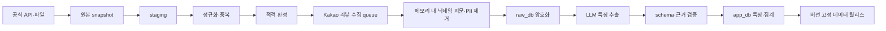

# 빵찾깅 P0 구현 로드맵 설계

**작성일:** 2026-07-23

**상태:** 사용자 승인 완료
**대상:** 5인 비공개 온라인 파일럿까지의 전체 P0 구현

**후속 실행 계획:** [P0 마스터 구현 계획](../plans/2026-07-23-p0-master-implementation.md)

## 1. 배경

빵찾깅은 제품·경험·추천·LLM·아키텍처·데이터·보안·운영 기준은 마련됐지만 애플리케이션 구현은 시작하지 않았다. 이 설계는 기존 기준을 실제 개발 순서로 연결하고, 각 Feature가 새로운 Codex 작업과 브랜치에서 독립적으로 구현·검증될 수 있도록 전체 경계를 정한다.

사용자 화면의 UI/UX 설계는 데이터 기반과 추천 코어를 완성한 뒤 진행한다. 구현은 실제 서울 데이터의 수집·검수·특징 집계부터 시작하고, 그 데이터 릴리스를 통과한 뒤 추천 엔진과 제품 백엔드로 이동한다.

## 2. 목표와 비목표

### 목표

- 서울 전체 제과점 원장과 적격 매장 데이터를 재현 가능하게 구축한다.
- Kakao Map의 실존 리뷰를 최근성·개인정보·중복 기준에 맞춰 수집한다.
- 최근 리뷰에서 메뉴·맛·식감 특징을 추출하고 근거 수준을 계산한다.
- 리뷰가 부족한 매장도 검수된 메뉴·방문 조건·이동시간으로 추천한다.
- 결정론적 추천, 멀티턴 대화, 지도·경로와 계정별 기록을 통합한다.
- 5명이 HTTPS 환경에서 사용할 수 있는 비공개 파일럿을 제공한다.
- 월 반복 운영비를 30,000원 이내에서 관리한다.

### 비목표

- 공개 서비스 출시
- Figma MCP 사용
- KakaoSync 도입
- Naver Map 리뷰 수집
- 플랫폼 접근 제한 우회
- 리뷰 닉네임 원문 저장 또는 사용자 화면 표시
- 모든 Feature를 한 Codex 작업이나 한 개발 브랜치에서 구현

## 3. 확정된 제품·운영 결정

| 영역 | 결정 |
|---|---|
| 최종 완료 지점 | 실제 외부 연동을 포함한 5인 비공개 온라인 파일럿 |
| 구현 순서 | 순수 데이터 우선 |
| 로컬 환경 | Node.js·pnpm은 Windows, PostgreSQL은 Docker Compose |
| 배포 이미지 | 코드 완성 뒤 web·worker production Docker image 작성 |
| 데이터 지역 | 서울 전체 |
| 인증 | 일반 Kakao Login + 서비스 내부 계정 |
| 지도 비용 | Bread_map을 개발자 계정의 첫 Kakao Map 활성 앱으로 등록해 무료 쿼터 사용 |
| 리뷰 출처 | Kakao Map만 사용 |
| 리뷰 범위 | 매장별 최근 12개월, 최대 20개 |
| 리뷰 갱신 | 초기 서울 전체 수집, 이후 우선순위 증분, 분기별 전체 갱신 |
| 리뷰 부족 | 매장을 제외하지 않고 대체 추천 경로 사용 |
| UI/UX | 데이터·추천·API 이후 Codex와 설계, Figma MCP 미사용 |
| Git | Feature별 `codex/...` 브랜치, 검증·사용자 확인 후 병합 |
| 반복 운영비 | 월 30,000원 이내 |
| 초기 LLM 비용 | 100개 리뷰 실측 후 전체 비용 산정, 사용자 승인 전 전체 실행 금지 |

## 4. 작업 계층과 실행 경계

작업 계층은 저장소 루트 `AGENTS.md`에 따라 `Epic → Feature → Task`를 사용한다.

- 이 로드맵은 P0 Epic 전체의 순서와 의존성을 소유한다.
- 각 Feature는 새로운 Codex 작업과 `codex/...` 브랜치를 사용한다.
- Feature 시작 시 파일·함수·테스트 수준의 상세 구현 계획서를 별도로 작성한다.
- 구현·직접 검증·수정은 같은 Feature 작업에서 완료한다.
- Subagent는 기본 0개이며 `AGENTS.md`의 제한적 재량 규칙을 따른다.
- Feature는 검증 결과와 미해결 위험을 보고하고 사용자 확인을 받은 뒤 병합한다.

## 5. 전체 구현 순서

1. 개발 준비
2. 공식 데이터 적재
3. 정규화와 적격 매장 판정
4. Kakao Map 리뷰 수집
5. 리뷰 정제와 특징 추출
6. 데이터 집계와 데이터 릴리스
7. 결정론적 추천 엔진
8. 제품 백엔드
9. UI/UX 설계와 목업 승인
10. 사용자·관리자 웹과 E2E
11. 배포와 5인 파일럿

데이터 단계에서도 스키마 계약, 테스트, CLI와 작업 상태 조회는 구현한다. 사용자 화면과 정식 `/admin`은 UI/UX 승인 뒤 구현하며, 데이터 단계의 운영은 `apps/worker` CLI가 담당한다.

## 6. Feature 목록

| 순서 | Feature | 브랜치 예시 |
|---:|---|---|
| 1 | Workspace·Docker·테스트 기반 | `codex/workspace-foundation` |
| 2 | 공공 원장·공정위 데이터 적재 | `codex/source-ingestion` |
| 3 | 매장 정규화·중복·좌표 처리 | `codex/store-normalization` |
| 4 | 프랜차이즈 제외·적격 매장 검수 | `codex/store-eligibility` |
| 5 | Kakao 리뷰 수집 Worker | `codex/kakao-review-collector` |
| 6 | 리뷰 개인정보 제거·암호화·중복 방지 | `codex/review-privacy` |
| 7 | 리뷰 LLM 특징 추출·집계 | `codex/review-feature-extraction` |
| 8 | 데이터 품질·서울 전체 릴리스 게이트 | `codex/data-release-gate` |
| 9 | 결정론적 추천 엔진 | `codex/recommendation-engine` |
| 10 | 추천 평가·회귀 시나리오 | `codex/recommendation-evaluation` |
| 11 | Kakao Login·계정 격리 | `codex/auth-accounts` |
| 12 | 대화·LangGraph·추천 API | `codex/conversation-api` |
| 13 | 위치·지도·경로 API | `codex/location-map-route` |
| 14 | 기록·즐겨찾기·피드백·삭제 | `codex/user-data-management` |
| 15 | UI/UX 설계·목업 | `codex/ui-ux-design` |
| 16 | 사용자 웹 화면 | `codex/user-web` |
| 17 | 관리자 운영 화면 | `codex/admin-web` |
| 18 | 배포·관측성·보안 강화 | `codex/pilot-deployment` |
| 19 | E2E·5인 파일럿 릴리스 | `codex/pilot-release` |

Feature 1~8은 순차 진행한다. Feature 15는 데이터 릴리스 후 추천·백엔드 계약이 안정된 시점에 시작하며, Feature 16·17은 UI/UX 승인 전 시작하지 않는다.

## 7. 저장소 구조

```text
Bread_map/
├─ apps/
│  ├─ web/
│  └─ worker/
├─ packages/
│  ├─ contracts/
│  ├─ app-db/
│  ├─ raw-db/
│  ├─ recommendation/
│  └─ testkit/
├─ prisma/
│  ├─ app/
│  └─ raw/
├─ infra/
│  ├─ compose.yaml
│  └─ docker/
├─ scripts/
├─ docs/
└─ AGENTS.md
```

- `apps/web`은 `packages/app-db`만 사용한다.
- `apps/web`에는 `raw_db` 접속 정보와 리뷰 암호화 키를 제공하지 않는다.
- `apps/worker`만 `app-db`와 `raw-db`를 모두 사용한다.
- 수집·정규화는 worker 내부에 두고 불필요한 패키지로 분리하지 않는다.
- 추천 계산은 DB·UI와 분리한 순수 TypeScript 패키지로 구현한다.
- 실제 다운로드 원본, 브라우저 임시 데이터와 리뷰 원문은 Git 밖에 둔다.
- 테스트 fixture는 비식별·고정 데이터만 포함한다.

## 8. 데이터 흐름



각 단계는 입력 snapshot, 설정·스키마 버전, 시작·종료 시각, 상태와 비민감 오류 코드를 기록한다. 실패한 단계만 재실행할 수 있고, 같은 입력과 버전의 재실행은 중복 행을 만들지 않는다.

## 9. 공식 데이터와 적격 매장

- 행정안전부 제과점영업 API·파일을 서울 전체 후보 원장으로 사용한다.
- 공정위 브랜드·가맹·직영 자료는 프랜차이즈 판정 보조 근거로 사용한다.
- 상호·주소·좌표를 정규화하고 중복 매장을 별도 상태로 검수한다.
- 폐업·팝업·배달 전용·미검수 매장은 추천하지 않는다.
- 서울 영업점 2~5개를 모두 직영하는 것으로 검수된 소규모 브랜드는 포함한다.
- 모든 활성 후보는 적격·제외·검수대기 중 하나의 상태와 이유를 가진다.

## 10. Kakao 리뷰 수집

### 수집 범위

- Kakao Map의 일반 사용자가 볼 수 있는 렌더링 DOM만 읽는다.
- 서울 전체 적격 매장에 초기 수집을 시도한다.
- 매장별 최근 12개월 리뷰 중 최대 20개를 수집한다.
- 리뷰 본문, 별점, 날짜 수준의 작성일과 출처를 사용한다.
- Naver Map 어댑터는 구현하지 않는다.

### 닉네임과 리뷰 지문

닉네임 원문은 중복 판정에 필요한 순간에만 메모리에서 읽는다. 다음 입력으로 매장 범위 리뷰 지문을 만든 뒤 즉시 폐기한다.

```text
review_fingerprint_hmac =
  HMAC-SHA-256(
    dedupe_key,
    provider | store_id | normalized_nickname |
    published_date | normalized_deidentified_text
  )
```

- 닉네임, 사용자 ID, 프로필 URL·사진과 다른 활동은 저장하지 않는다.
- 지문으로 다른 매장의 동일 작성자를 추적하지 않는다.
- 지문은 증분·분기별 재수집의 중복 차단에만 사용한다.
- 사용자 화면과 로그에는 지문도 표시하지 않는다.

### 실행 방식

- 관리자가 서울 전체 적격 매장 batch를 로컬에서 명시적으로 시작한다.
- worker는 브라우저 페이지 1개로 매장을 순차 처리한다.
- 작업·매장·페이지 수준 checkpoint를 PostgreSQL에 저장한다.
- PC나 worker가 종료돼도 다음 실행에서 이어서 처리한다.
- 일시정지·재개·전체 중단과 실패 매장 선택 재실행을 제공한다.
- 최초 전체 수집 후 신규·변경·자주 추천됨·오래된 수집 순으로 증분 갱신한다.
- 분기별 전체 갱신도 관리자가 수동 시작한다.
- 예약된 무한 반복과 배포된 사용자 웹의 수집 실행은 금지한다.

### 접근 경계

로그인 자동화, 사용자 세션 재사용, CAPTCHA 해결, 비공개 API 호출, 네트워크 응답 가로채기, proxy·IP 회전, stealth와 브라우저 지문 위장을 구현하지 않는다. 로그인 요구, CAPTCHA, 401·403·429, 접근 제한 또는 DOM 계약 변경이 나오면 해당 작업을 중단하고 자동 재시도하지 않는다.

## 11. 리뷰 정제·암호화·특징 추출

1. 본문을 정규화하고 URL·이메일·전화번호·계정 handle과 식별번호를 제거한다.
2. 안전하게 제거할 수 없는 개인정보가 의심되면 리뷰 전체를 폐기한다.
3. 정제 본문이 안전할 때만 메모리의 닉네임과 결합해 리뷰 지문을 만든다.
4. 리뷰 지문 생성 직후 원문 닉네임을 폐기한다.
5. 정제 본문은 `raw_db`에 AES-256-GCM으로 암호화한다.
6. 별점·작성일·출처·리뷰 지문은 구조화 메타데이터로 저장한다.
7. OpenAI는 메뉴·카테고리·맛·식감·허용 태그만 구조화한다.
8. 서버가 strict schema, 값 범위, 원문 근거 오프셋과 해시를 검증한다.
9. 검증된 특징만 `app_db`에 저장하고 추천용 집계를 만든다.
10. 정제 리뷰 원문은 수집 30일 뒤 hard delete한다.

LLM 구조화 오류는 최대 한 번만 다시 요청한다. 재실패는 검수대기로 보내고 같은 요청을 반복하지 않는다.

## 12. 리뷰 집계와 추천

최근 리뷰의 시간 가중치는 180일 반감기를 사용한다. 최근 12개월·최대 20개만 집계하며, 서로 다른 리뷰 3개 이상이 지지해야 리뷰 기반 특징을 확정한다.

```text
R = 0.60T + 0.25V + 0.15E
```

- `T`: 검수된 메뉴와 리뷰에서 얻은 카테고리·맛·식감·태그의 취향 일치
- `V`: 예산·영업시간·방문 목적의 방문 적합
- `E`: 리뷰 수, 특징 합의, 최신성, 근거 검증과 메뉴 검수 상태
- 실제 메뉴 카테고리는 검수된 메뉴 정보를 리뷰 추정보다 우선한다.
- 맛·식감은 최근 리뷰 합의를 핵심 근거로 사용한다.
- 별점은 핵심 관련도에 넣지 않고 최종 동점 보조값으로만 사용한다.

### 리뷰가 3개 미만인 매장

리뷰 부족 매장도 지도와 결과에서 제외하지 않는다. 다음 순서로 대체 추천한다.

1. 강한 제외·영업 상태·최대 거리·예산
2. 검수된 실제 메뉴·카테고리 일치
3. 방문 목적·영업시간·예산 적합
4. 이동시간 또는 직선거리
5. 데이터 최신성과 검수 완성도
6. 전체 평균으로 보정한 별점
7. `store_id` 안정 동점

결과에는 다음 의미의 안내를 표시한다.

> 최근 리뷰 근거가 부족해 확인된 메뉴와 방문 조건을 중심으로 추천했어요.

추천 실행은 데이터 버전, 계산 버전과 근거 ID를 저장하고 동일 입력·상태·버전의 순서를 재현한다.

## 13. 실패 처리

- 공식 API의 일시 오류만 제한적으로 자동 재시도한다.
- crawler 접근·정책 중단은 자동 재시도하지 않는다.
- 한 매장 실패가 서울 전체 batch를 중단시키지 않는다.
- PII 제거·암호화 실패 리뷰는 저장하지 않는다.
- 데이터 릴리스는 수집 중인 테이블이 아니라 검증된 고정 버전만 참조한다.
- 실패 상태와 재실행 가능 여부는 CLI와 이후 `/admin`에서 동일하게 표시한다.
- 동일 실패가 반복되면 같은 접근을 중단하고 원인·증거·대안을 보고한다.

## 14. 검증과 릴리스 게이트

### Feature 공통

- 관련 단위·통합 테스트 통과
- TypeScript 타입 검사, lint와 build 통과
- 변경 영역과 직접 의존성 검증
- migration·batch 재실행 안전성 확인
- 미실행 검사와 남은 위험 기록
- 사용자 확인 후 Feature 브랜치 병합

### 데이터 릴리스

- 서울 원장 적재 건수·누락·중복 보고서 생성
- 모든 활성 후보에 적격·제외·검수대기 상태 존재
- 모든 적격 매장에 수집 성공·리뷰 부족·접근 실패 상태 존재
- 수집 성공 리뷰는 12개월·20개 조건 충족
- 닉네임·리뷰 평문·비밀값 로그 노출 0건
- 리뷰 3개 이상과 근거 검증을 통과한 특징만 확정
- 리뷰 부족 매장에 대체 추천 데이터 존재
- worker 중단·재개 뒤 누락·중복 0건
- `apps/web`의 `raw_db` 접근 거부
- 30일 원문 삭제 확인

### 추천 릴리스

- 20개 대표 시나리오 Hit Rate@5 85% 이상
- 강한 제외 위반 0건
- 동일 입력 100회 순위 차이 0건
- 리뷰 부족 대체 순서 회귀 통과
- 별점이 핵심 취향 일치를 역전시키지 않음

실제 Kakao 페이지는 CI에서 호출하지 않는다. 비식별 고정 HTML fixture로 adapter 계약을 검사하고 실제 사이트 smoke test는 관리자 PC에서 수동 실행한다.

## 15. 사용자 준비 체크리스트

### Feature 1 시작 전

- Docker Desktop 설치와 WSL2 backend 활성화
- Kakao Developers 계정과 Bread_map 앱 생성
- 일반 Kakao Login 활성화
- 로컬 redirect URI, REST API key와 client secret 준비
- Bread_map 앱에서 계정 최초로 Kakao Map API 활성화
- 무료 쿼터 배지, JavaScript SDK domain과 key 확인
- 공공데이터포털 계정·서비스 key 준비
- 제과점 원장과 공정위 API·파일 접근 신청
- OpenAI API 전용 project와 project-scoped key 생성
- 결제 수단, 예산 알림과 사용 가능 model 설정

### 인증 Feature 시작 전

- 파일럿 HTTPS 주소와 운영 redirect URI 확정
- 최소 개인정보 처리방침 작성
- 서비스 탈퇴와 Kakao 연결 해제 동선 확정
- 파일럿 참여자 Kakao 계정 5개 준비

### 배포 Feature 시작 전

- 월 30,000원 안의 배포 공급자 선택
- web·worker·PostgreSQL과 backup 지원 확인
- HTTPS 주소와 배포용 secret 저장소 준비

API key는 대화·Markdown·Git에 붙이지 않는다. Codex는 `.env.example`과 안전한 key 생성·주입 명령만 제공하고 사용자가 실제 값을 로컬 환경이나 배포 secret 저장소에 입력한다.

## 16. 비용·배포 게이트

- 월 30,000원은 파일럿의 반복 web·DB·OpenAI·지도 비용 상한이다.
- 무료 plan과 Kakao Map 첫 앱 무료 quota를 우선한다.
- 관리자 승인 없이 유료 API나 초과 quota를 자동 활성화하지 않는다.
- 공급자는 Feature 18에서 최신 가격, worker 지원, backup과 서울 접근 지연을 비교해 선택한다.
- OpenAI dashboard의 budget은 soft threshold이므로 worker가 별도 hard cap을 집행한다.

초기 서울 전체 LLM 추출은 반복 운영비와 분리한다.

1. 실제 리뷰 100개로 후보 model의 schema 성공률·특징 정확도·token 비용을 측정한다.
2. 전체 대상 리뷰 수와 예상 비용·시간을 계산한다.
3. 사용자에게 후보 model과 예상 비용을 제시한다.
4. 사용자 승인 전 전체 추출 batch를 실행하지 않는다.
5. 승인된 비용 한도와 kill switch를 worker 설정에 기록한다.

## 17. UI/UX와 화면 구현

- UI/UX 설계는 Feature 15에서 별도 Codex 작업으로 진행한다.
- Figma MCP는 사용하지 않는다.
- Codex가 UI/UX 설계서와 로컬 interactive mockup을 만들고 사용자가 승인한다.
- 사용자 화면과 정식 `/admin` 구현은 목업 승인 뒤 시작한다.
- 데이터 단계에서는 사용자 UI 대신 worker CLI로 수집·중단·재개·상태 조회를 제공한다.

## 18. 기준 문서 변경

이 설계가 사용자 검토를 통과하면 마스터 계획 작성 전에 다음 현재 기준을 갱신한다.

- PRD: KakaoSync를 일반 Kakao Login으로 변경
- 사용자 여정·화면 카피: KakaoSync 약관 단계를 일반 로그인과 별도 서비스 고지로 변경
- 시스템·보안 구조: Auth.js Kakao provider와 내부 계정 흐름 반영
- Worker·데이터 설계: Kakao 단일 출처, 12개월·20개, 별점·날짜·일시 닉네임 HMAC 반영
- 리뷰 실험·정책: 서울 전체 재개 가능 batch와 증분·분기 갱신 반영
- 운영 기준: 월 30,000원과 초기 LLM 비용 승인 gate 반영
- 결정 기록: 기존 KakaoSync 결정을 대체하고 데이터 우선 구현 결정을 추가

과거 `docs/superpowers/specs`와 `docs/superpowers/plans` 기록은 당시 결정의 이력으로 보존하고 수정하지 않는다.

## 19. 설계 완료 조건

- 19개 Feature의 순서와 경계가 명확하다.
- 데이터 우선 전략과 UI/UX 시작 gate가 명확하다.
- Kakao Login·Kakao Map 첫 앱·외부 key 준비사항이 명확하다.
- 서울 전체 Kakao 리뷰 수집·재개·갱신 방식이 명확하다.
- 닉네임 원문 미저장과 리뷰 지문 목적이 명확하다.
- 리뷰 충분·부족 매장의 추천 경로가 모두 정의됐다.
- 비용·실제 외부 접근·전체 LLM batch에 사용자 승인 gate가 있다.
- 데이터·추천·파일럿 릴리스 검증 기준이 정의됐다.
- 기준 문서 변경 범위와 다음 마스터 계획 산출물이 명확하다.
