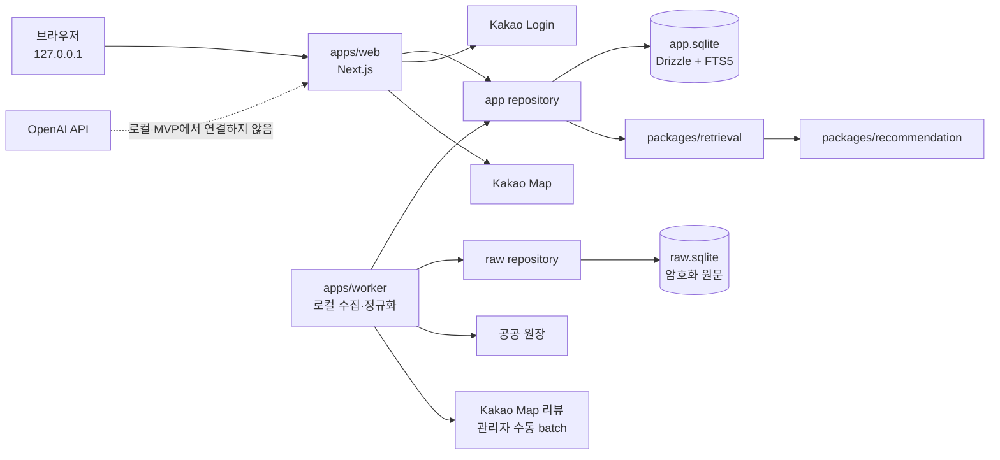
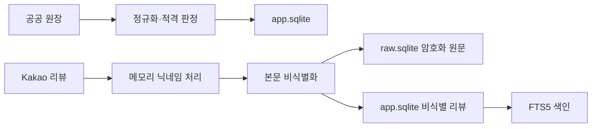
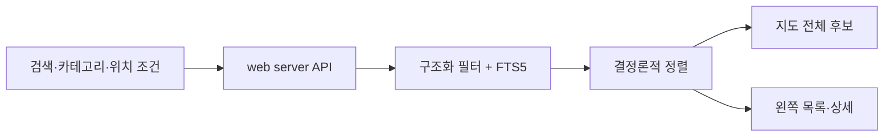

# 로컬 우선 SQLite 웹 MVP 설계

[문서 허브](../../README.md) · [PRD](../../00-product/prd.md) · [UI 디자인 시스템](../../01-experience/design-system.md) · [결정 기록](../../09-decisions/decision-log.md)

**상태:** 사용자 승인

**승인일:** 2026-07-24

**대상:** 로컬 웹 MVP, 서울 데이터 수집, 검색·추천, Kakao 로그인과 지도 UI

이 문서는 기존 PostgreSQL·Docker·배포 중심 구현 계획을 바로 확장하지 않고, 비용 없이 개인 PC에서 먼저 사용할 수 있는 Bread_map 로컬 웹을 만드는 현재 목표를 정의한다. 현재 저장소 코드는 PostgreSQL·Prisma 기반 최소 scaffold 상태이며, 이 문서는 구현 전 목표 구조다.

세부 시각 토큰과 화면 상호작용은 [UI 디자인 시스템](../../01-experience/design-system.md)이 소유한다. 제품 문구와 개인정보 경계는 기존 책임 문서가 계속 소유하되, 로컬 MVP의 저장 기술·배포 범위·챗봇 포함 여부는 이 문서와 DR-032·DR-033이 이전 계획을 대체한다.

## 1. 결정 요약

| 영역 | 승인된 결정 |
|---|---|
| 실행 환경 | 사용자 PC의 `127.0.0.1`에서만 실행 |
| 사용자 | 우선 본인, Kakao 로그인 계정 구조는 유지 |
| 배포 | 로컬 MVP 완료 조건에서 제외 |
| 서비스 DB | `app.sqlite`, SQLite/libSQL 호환, Drizzle |
| 수집 원문 DB | `raw.sqlite`, worker 전용, 암호화 |
| 검색 | SQLite FTS5와 구조화 필터 |
| 추천 | 결정론적 필터·정렬, LLM 미사용 |
| 리뷰 | 서울 전체 적격 매장, 최초 최근 12개월 전량 backfill과 이후 operator 수동 incremental, 매장별 hard cap 없음 |
| 사용자 UI | 전체 지도, 왼쪽 가게 드로어, 우측 하단 빵빵이 FAB |
| 채팅 | UI 셸만 구현, 입력 비활성화, OpenAI 호출 없음 |
| OpenAI 비용 | 로컬 MVP `$0` |
| 이후 확장 | 챗봇은 별도 Feature·Codex 작업, 배포는 Vercel·Turso 검토 |

## 2. 목표와 비목표

### 목표

1. Docker와 유료 호스팅 없이 로컬에서 웹·worker·데이터베이스를 실행한다.
2. 서울 적격 베이커리와 실제 Kakao 리뷰를 수집·비식별화해 검색 가능한 로컬 데이터로 만든다.
3. 지도에서 전체 가게를 보고 지역·가게명·메뉴·카테고리로 좁힐 수 있게 한다.
4. 가게 마커나 검색 결과를 선택해 기본 정보, 메뉴, 별점과 비식별 실제 리뷰를 확인한다.
5. 리뷰가 부족한 가게도 메뉴·영업·거리 등 다른 근거로 탐색할 수 있게 한다.
6. Kakao 로그인으로 계정별 즐겨찾기와 기록을 분리할 기반을 만든다.
7. 빵빵이 채팅 UI를 완성하되 실제 챗봇은 후속 Feature로 분리한다.
8. PC 재시작, 수집 중단과 SQLite 장애에서 복구 가능한 운영 기준을 갖춘다.

### 비목표

- Vercel 또는 다른 공개 호스팅 배포
- Turso 운영 DB 연결
- OpenAI API 호출, 자연어 의도 분석과 생성형 답변
- 멀티턴 챗봇, LLM 추천 설명과 RAG 답변 생성
- vector database와 embedding
- 관리자용 공개 웹 수집기
- 접근 제한, CAPTCHA, 403 또는 429 우회
- 서울 밖 지역 확장

### Epic과 Feature 경계

이 문서는 로컬 MVP Epic 전체의 목표 구조를 정의한다. 저장소 전환, 데이터 수집, 검색·추천, 인증·지도, 사용자 UI와 E2E는 서로 독립적으로 검증 가능한 Feature로 나눈다. 전체 Epic을 하나의 Codex 작업에서 구현하지 않으며 각 Feature는 새 Codex 작업에서 구현과 직접 검증을 함께 완료한다. 상세 Feature 순서와 파일 단위 작업은 이 설계서 승인 뒤 작성할 구현 계획이 소유한다.

## 3. 검토한 접근

### A. SQLite에 직접 결합

Next.js와 worker가 SQLite 파일과 쿼리 구현을 직접 공유하는 가장 단순한 방식이다. 초기 파일 수는 적지만 나중에 Turso로 이동할 때 호출부 전체가 원격 libSQL 차이를 알게 되고, web과 worker의 접근 경계도 흐려진다.

### B. SQLite/libSQL + Drizzle + 저장소 인터페이스

로컬은 SQLite 파일을 사용하고, 호출부는 `app` 저장소·검색 adapter 인터페이스에 의존한다. 스키마와 마이그레이션은 Drizzle로 관리한다. 초기 경계 정의가 조금 더 필요하지만 로컬 비용은 그대로 0원이며 나중에 app 데이터만 Turso로 전환하기 쉽다.

### C. 기존 PostgreSQL·Prisma·Docker 유지

현재 scaffold를 가장 적게 바꾸지만 로컬 시작 비용과 운영 복잡도가 크고, 사용자가 승인한 비용 없는 단일 PC 우선 목표에 맞지 않는다.

**선택:** B. 로컬 단순성과 이후 Vercel 가능성을 함께 유지한다.

## 4. 시스템 구조



### `apps/web`

- `127.0.0.1`에 bind하는 Next.js 사용자 웹
- Kakao OAuth callback `http://localhost:3000/api/auth/callback/kakao`
- 전체 지도, 검색·필터, 가게 상세, 즐겨찾기와 기록
- 빵빵이 FAB·채팅 UI 셸
- 브라우저에 DB 경로, 비밀, 원문 리뷰와 OpenAI 키를 노출하지 않음

### `apps/worker`

- 서울 공공 원장 적재와 정규화
- 적격 매장 판정 입력과 수집 상태 관리
- Kakao 리뷰 수집, 개인정보 제거, 중복 판정과 FTS 색인
- checkpoint, 실패 매장 재실행, backup과 복구 도구
- `raw.sqlite`에 접근할 수 있는 유일한 애플리케이션

### `packages/retrieval`

- 구조화 필터와 FTS5 검색을 하나의 인터페이스로 제공
- 로컬 SQLite adapter를 먼저 구현
- 향후 Turso adapter가 같은 호출 계약을 구현할 수 있게 함
- LLM이나 UI에 의존하지 않음

### `packages/recommendation`

- 검색 후보의 하드 필터와 결정론적 정렬
- 동일 입력·데이터·버전에서 같은 결과 보장
- 내부 관련도는 계산할 수 있지만 사용자에게 숫자 총점으로 노출하지 않음
- DB client, 지도 SDK와 OpenAI에 직접 의존하지 않음

## 5. 저장소 설계

### `app.sqlite`

사용자 웹이 조회할 수 있는 서비스 데이터다.

- Kakao 기반 사용자, 계정 연결과 세션
- 베이커리·매장·좌표·영업 상태
- 메뉴, 카테고리와 검색 동의어
- 비식별 리뷰, 별점, 게시일, 수집일과 출처
- FTS5 검색 색인
- 즐겨찾기, 검색·선택 기록과 비민감 피드백
- 수집·검수 최종 상태와 최신성

저장하지 않는 값:

- 리뷰 작성자 닉네임
- 정확한 사용자 현재 위치
- Kakao OAuth token 평문
- 리뷰 암호화 원문
- 프롬프트와 OpenAI 응답

### `raw.sqlite`

worker만 접근하는 수집·복구 데이터다.

- 암호화된 리뷰 수집 원문
- nonce, 인증 태그와 암호화 버전
- 수집 run·매장·페이지 checkpoint
- 중복 판정용 HMAC fingerprint
- 비식별화 상태와 실패 이유

원문은 비식별 처리와 복구 기간을 위해 최대 30일만 보관한다. 장기 backup 대상은 `app.sqlite`이며 `raw.sqlite` 원문은 장기 보관하지 않는다.

### ORM과 검색

- 스키마와 migration은 Drizzle이 소유한다.
- 로컬 driver는 SQLite/libSQL 호환 driver를 사용한다.
- 전문 검색은 SQLite FTS5로 시작한다.
- embedding과 vector DB를 추가하지 않는다.
- SQLite와 Turso의 FTS 문법 차이는 `packages/retrieval` adapter 내부에서 흡수한다.

## 6. 수집과 리뷰 처리

### 수집 범위

- 서울의 승인된 적격 매장 전체
- Kakao Map 단일 리뷰 출처
- 최초 run은 매장별 최근 12개월 공개 리뷰를 개수 상한 없이 backfill
- 후속 run은 operator가 수동으로 시작하고 성공 fingerprint anchor까지 incremental 처리하며, anchor 유실 시 같은 logical run에서 cutoff까지 backfill
- 리뷰가 없어도 적격 매장은 서비스에 남김

### 처리 순서

1. 공공 원장과 검수 결과에서 적격 매장을 확정한다.
2. worker가 브라우저 페이지 하나에서 매장을 순차 처리한다.
3. 리뷰 닉네임은 메모리에서 정규화해 HMAC fingerprint 입력으로만 사용한다.
4. 닉네임을 버리고 리뷰 본문을 비식별화한다.
5. 암호화 원문과 처리 상태는 `raw.sqlite`에 기록한다.
6. 비식별 리뷰·별점·날짜·출처를 `app.sqlite`에 기록한다.
7. FTS5 색인을 갱신한다.
8. 매장의 수집 최종 상태를 저장한다.

### 중복 판정

fingerprint 입력:

```text
provider | store_id | normalized_nickname |
published_date | normalized_deidentified_text
```

- HMAC key는 환경변수에서만 읽는다.
- nickname 평문과 fingerprint는 사용자 화면과 일반 로그에 표시하지 않는다.
- 같은 batch를 다시 실행해도 동일 리뷰가 중복 삽입되지 않아야 한다.

### 수집 상태

- `complete`
- `no_reviews`
- `review_insufficient`
- `access_failed`
- `deidentification_failed`
- `retry_pending`
- `admin_review`

모든 적격 매장은 한 번의 run에서 하나의 최종 상태 또는 명시적인 재시도 상태를 가져야 한다.

## 7. 검색과 결정론적 추천

### 사용자 입력

로컬 MVP는 자연어 챗봇 대신 다음 입력을 사용한다.

- 지역
- 가게명
- 메뉴명
- 빵 카테고리
- 영업 중 여부
- 거리·위치 조건
- 리뷰 최신성·충분성 상태

### 검색 흐름

1. 구조화된 하드 필터를 적용한다.
2. 검색어를 정규화하고 승인된 동의어를 확장한다.
3. 매장·메뉴·비식별 리뷰 FTS5를 조회한다.
4. 후보를 결정론적으로 정렬한다.
5. 지도에는 조건을 통과한 전체 후보를 표시한다.
6. 왼쪽 목록과 상세에는 사실 근거와 데이터 최신성을 표시한다.

### 정렬 우선순위

1. 명시적 메뉴·카테고리 일치
2. 리뷰 검색 관련도
3. 유효 리뷰 수와 최신성
4. 영업 상태·거리·예산 등 방문 조건
5. 데이터 완성도
6. 보정 별점
7. 안정적인 자체 `store_id`

별점은 핵심 관련도에 넣지 않고 마지막 동점 보조값으로만 사용한다.

### 리뷰 부족 대체

최근 유효 리뷰가 3개 미만이어도 매장을 제외하지 않는다.

1. 하드 조건
2. 검수 메뉴와 카테고리
3. 영업·거리와 방문 조건
4. 데이터 완성도
5. 보정 별점
6. `store_id`

화면에는 리뷰 근거 부족과 사용한 대체 근거를 함께 표시한다.

## 8. 사용자 웹과 인증

### Kakao 로그인

- 일반 Kakao Login을 사용하고 KakaoSync는 요구하지 않는다.
- 최소 provider account ID를 내부 `user_id`에 연결한다.
- 이메일·전화번호·생일·성별을 요구하지 않는다.
- 사용자별 즐겨찾기와 기록을 server에서 검증해 격리한다.
- 위치 권한은 로그인과 별도 선택 동의다.

### 핵심 화면

구체적인 토큰·크기·모션은 [UI 디자인 시스템](../../01-experience/design-system.md)을 따른다.

- 지도는 전체 화면의 지속적인 배경
- 왼쪽 드로어에서 검색 결과와 가게 상세 전환
- 마커와 왼쪽 목록은 같은 매장 집합 사용
- 가게 상세에 정보·메뉴·별점·비식별 실제 리뷰 표시
- 우측 하단 빵빵이 FAB
- FAB를 열면 FAB는 사라지고 비모달 채팅 UI 셸만 표시

### 채팅 UI 셸

로컬 MVP의 채팅창은 시각·상호작용 완성도만 검증한다.

- 선택한 가게를 상단 context로 표시
- 빵빵이 소개와 향후 사용 예시 표시
- 입력창과 제안 행동은 비활성화
- `챗봇 기능은 다음 단계에서 제공할 예정이에요` 안내
- submit handler, OpenAI client와 챗봇 API route 없음
- 열기·닫기·포커스 복귀·반응형·reduced motion만 동작
- 가짜 AI 답변이나 가짜 리뷰 근거를 표시하지 않음

## 9. 데이터 흐름

### 적재



### 사용자 조회



브라우저는 SQLite 파일이나 FTS 쿼리에 직접 접근하지 않는다.

## 10. 동시성, 중단과 복구

### SQLite

- `app.sqlite`와 `raw.sqlite`는 WAL mode를 사용한다.
- `busy_timeout`을 명시한다.
- writer transaction은 짧게 유지한다.
- 수집은 매장 단위 batch로 commit한다.
- 긴 전체 run을 하나의 transaction으로 묶지 않는다.
- lock 실패는 제한된 횟수만 재시도하고 새 정보 없이 반복하지 않는다.

### checkpoint

- 매장과 페이지 단위 checkpoint
- PC 재시작 뒤 마지막 확정 checkpoint부터 재개
- 매장 하나의 실패는 다음 매장 진행을 막지 않음
- 실패 매장만 다시 실행 가능

다음 상황에서는 전체 batch를 중단한다.

- 로그인 만료
- CAPTCHA
- 403 또는 429
- 명시적인 접근 제한
- 동일 원인의 광범위한 연속 실패

### backup

- 대규모 수집과 migration 전 SQLite backup API로 `app.sqlite` snapshot 생성
- 최근 정상 snapshot 여러 개 유지
- backup 파일도 로컬 사용자 영역에서 보호
- `raw.sqlite`는 30일 원문 보존 범위만 유지하고 장기 backup하지 않음
- 전체 갱신은 cron 없이 사용자가 명시적으로 시작

## 11. 실패 대체

| 실패 | 유지하는 기능 | 대체 |
|---|---|---|
| 리뷰 부족 | 매장 검색·추천 | 메뉴·영업·거리 우선 |
| FTS5 검색 실패 | 구조화 매장 데이터 | 메뉴·카테고리·지역 필터 |
| Kakao 지도 실패 | 왼쪽 목록·주소 | 목록 탐색과 직선거리 |
| Kakao OAuth 실패 | 로그인 화면 | 오류 ID와 재시도 |
| `raw.sqlite` 손상 | 기존 비식별 서비스 데이터 | 원문 재수집 |
| `app.sqlite` 손상 | 없음 | 검증된 snapshot 복구 |
| 챗봇 미구현 | 지도·검색·추천·상세 | 비활성 채팅 UI와 준비 중 안내 |

## 12. 개인정보와 보안

- web은 `raw.sqlite`에 접근하지 않는다.
- 원문 복호화 key, HMAC key와 Kakao secret은 server·worker 환경변수에서만 읽는다.
- 정확한 사용자 위치는 브라우저 메모리와 현재 요청에서만 사용하고 저장하지 않는다.
- 리뷰 닉네임은 fingerprint 생성 직후 폐기한다.
- 비식별 실패 리뷰는 `app.sqlite`와 FTS5에 넣지 않는다.
- 로그에는 secret, token, nickname, 정확 좌표, 리뷰 원문과 암호문을 남기지 않는다.
- SQLite 파일과 backup은 Git에 포함하지 않는다.
- UI의 실제 리뷰 표시는 nickname 없이 본문·별점·게시일·출처만 사용한다.

## 13. 검증 전략

### 단위 검증

- 검색어 정규화와 동의어 확장
- 구조화 필터와 정렬 동점 처리
- 리뷰 비식별화, fingerprint와 중복 방지
- 리뷰 부족 대체 순서
- SQLite·향후 Turso retrieval adapter 계약

### DB 통합 검증

- 빈 DB와 기존 DB migration
- FTS5 insert·update·delete 일관성
- WAL web read·worker write 동시성
- checkpoint 재개와 idempotency
- backup 생성과 복구

### 수집 검증

- 고정 공공 데이터 fixture
- 비식별 Kakao HTML fixture
- live Kakao 접속은 수동 smoke만 수행
- 서울 전체 적격 매장의 수집 상태 coverage
- 로그에서 nickname·secret·원문 노출 검사

### 웹 검증

- 로컬 Kakao OAuth smoke
- 두 계정의 즐겨찾기·기록 격리
- 지도 후보와 왼쪽 목록 일치
- 검색·필터·상세·리뷰 근거
- FAB와 채팅창 상호 배타 상태
- disabled composer가 network 요청을 만들지 않음
- keyboard, focus, reduced motion과 주요 viewport
- 지도 실패와 리뷰 부족 대체 상태

### 품질 기준

- 동일 조건·데이터·버전 100회 결과 순서 동일
- 구조화 대표 검색 시나리오 Hit Rate@5 85% 이상
- 결정론적 검색·필터·정렬 p95 1.5초 이하
- 외부 LLM 없는 추천 응답 p95 2초 이하
- 사용자 행동 후 진행 상태 100ms 이내

## 14. 로컬 MVP 완료 조건

다음 조건을 모두 충족해야 완료로 판단한다.

- 서울 적격 매장 전체와 명시적 수집 상태가 `app.sqlite`에 존재
- 동일 수집 재실행 후 중복 리뷰 0건
- 비식별 리뷰를 FTS5로 검색 가능
- nickname·원문·secret의 서비스 DB와 로그 노출 0건
- 지역·가게·메뉴·카테고리 검색과 필터 동작
- 리뷰 부족 매장도 메뉴·거리·영업 근거로 탐색 가능
- 지도와 왼쪽 목록·상세의 선택 매장이 일치
- Kakao 계정별 즐겨찾기와 기록 격리
- FAB와 채팅창이 동시에 표시되지 않음
- 채팅 UI가 OpenAI와 다른 챗봇 API를 호출하지 않음
- 재시작·checkpoint 재개·backup 복구 검증
- `127.0.0.1` 핵심 E2E 통과
- OpenAI 사용 비용 `$0`

Vercel 배포와 실제 챗봇 답변은 이 완료 조건에 포함하지 않는다.

## 15. 현재 저장소에서의 전환

현재 저장소에는 PostgreSQL·Prisma·Docker 기반 최소 foundation이 존재한다.

- `infra/compose.yaml`
- `prisma/app`
- `prisma/raw`
- `packages/app-db`
- `packages/raw-db`

구현 계획은 사용자 파일을 파괴적으로 제거하지 않고 다음 순서로 전환 범위를 확정해야 한다.

1. 현재 scaffold와 승인 문서의 차이를 기록한다.
2. SQLite/libSQL·Drizzle 저장소 경계를 먼저 만든다.
3. 새 migration과 repository 검증이 통과한 뒤 기존 PostgreSQL 경로의 제거 여부를 결정한다.
4. 데이터 적재·리뷰 수집·검색·추천을 순서대로 올린다.
5. Kakao 로그인·지도와 승인 UI를 연결한다.
6. 마지막에 chat UI 셸과 전체 E2E를 검증한다.

상세 파일·명령·테스트 순서는 이 문서 승인 뒤 `writing-plans` 단계에서 Feature 단위로 작성한다.

## 16. 후속 Feature

### 실제 빵빵이 챗봇

로컬 MVP와 분리된 새 Codex 작업에서 진행한다.

- 자연어 의도 구조화
- FTS5 review retrieval
- 결정론적 후보와 LLM 설명 연결
- 실제 리뷰 근거를 벗어나지 않는 답변
- 멀티턴 상태
- 모델·호출 수·token·일일·누적 비용 상한
- OpenAI 실패 시 template fallback

현재 수집한 비식별 리뷰와 FTS5 색인은 재수집 없이 사용한다. 모델과 비용 한도는 후속 Feature 시작 시 다시 승인한다.

### Vercel과 친구 사용

- 사용자 웹은 Vercel 배포 검토
- `app.sqlite` 데이터와 schema는 Turso 이동 검토
- `raw.sqlite`와 crawler는 사용자 로컬 PC에 유지
- 로컬 worker가 비식별 데이터만 원격 app DB에 sync
- production Kakao callback URI를 별도로 등록
- 배포·비용·backup·접근 제어를 별도 승인

## 17. 문서 영향

이 결정으로 다음 기존 계획은 현재 로컬 MVP에 그대로 적용되지 않는다.

- PostgreSQL·Prisma·Docker를 필수로 보는 기술 스택
- 5인 배포를 현재 완료 조건으로 보는 범위
- 자연어·멀티턴·OpenAI를 현재 사용자 흐름의 필수 기능으로 보는 범위
- 리뷰마다 LLM 특징 추출을 선행하는 데이터 처리

상세 구현 계획은 관련 소유 문서의 현재 단계 표기를 함께 갱신해야 하며, 과거 결정과 계획은 이력으로 남긴다.
