# Feature 4 카카오 빵집 발견·리뷰 수집 설계

[문서 허브](../../README.md) · [로컬 MVP 설계](2026-07-24-local-first-sqlite-web-design.md) · [리뷰 수집 실험](../../07-experiments/review-collection-experiment.md) · [결정 기록](../../09-decisions/decision-log.md)

**상태:** Feature 4 기반 설계 구현 완료, review 20건 상한은 DR-036에서 확장

**승인일:** 2026-07-26

**대상:** Feature 4 — 서울 카카오맵 빵집 발견, 제한된 리뷰 수집, 암호화 raw 저장

> 이 문서는 기존 Feature 4와 GitHub #14의 20건 제한 구현 이력을 보존한다. 현재 승인된 전량 backfill·수동 증분 경계는 [2026-07-29 확장 설계](2026-07-29-kakao-review-year-backfill-incremental-design.md)와 DR-036을 따른다.

이 문서는 카카오맵에서 `빵집`을 검색했을 때 `제과,베이커리` 태그로 분류되는 서울 장소를 수집 대상으로 발견하고, 동적 리뷰 화면에서 허용된 리뷰 필드를 제한적으로 수집하는 Feature 4 설계를 정의한다. 장소 후보를 빠짐없이 관측하는 것과 사용자 추천에 노출하는 것을 분리한다. 카카오 후보에는 프랜차이즈를 포함하지만, 사용자 웹에는 Feature 3 적격성 판정을 통과한 매장만 게시한다.

이 설계는 크롤링 기술을 데이터 수집 권한으로 간주하지 않는다. 카카오 공식 장소 API가 제공하는 데이터는 API로 조회하고, 공식 리뷰 API가 확인되지 않은 동적 리뷰 화면만 정책 위험 관리자 로컬 실험으로 다룬다. 공개 배포 전에 official API, written permission 또는 licensed data 중 하나를 확보하지 못하면 리뷰 수집기와 수집 리뷰를 제거한다.

## 1. 결정 요약

| 영역 | 승인된 결정 |
|---|---|
| 지역 | 서울 전역 |
| 발견 검색어 | `빵집` |
| 발견 태그 | 마지막 category segment를 정규화했을 때 정확히 `제과,베이커리` |
| 후보 범위 | 태그가 일치하는 카카오 장소 전체, 프랜차이즈 포함 |
| 서비스 게시 | 기존 `store_id`에 보수적으로 매칭되고 Feature 3에서 `published`인 매장만 |
| 장소 수집 방식 | Kakao Map/Local 공식 keyword search API |
| 리뷰 수집 방식 | TypeScript Playwright, 활성 browser page 1개 |
| 리뷰 범위 | 매장별 최근 12개월·최대 20개 |
| 리뷰 필드 | 비식별 본문, 별점, 게시일, source |
| nickname | worker memory에서 HMAC fingerprint 계산 직후 폐기 |
| raw 저장 | 비식별 성공 본문만 AES-256-GCM으로 `raw.sqlite`에 저장 |
| 후보 관측 보존 | `raw.sqlite`에 allowlist field만 400일, locator는 최대 30일 |
| 사용자 검색 게시 | Feature 5의 `app.sqlite`·FTS5 책임 |
| 실행 방식 | local operator의 명시적 수동 실행, cron·daemon 없음 |

## 2. 목표와 비목표

### 목표

1. 서울 전역을 공간적으로 나눠 `빵집` keyword 결과를 끝까지 조회한다.
2. category tag가 `제과,베이커리`인 장소를 프랜차이즈 여부와 무관하게 후보 관측으로 기록한다.
3. 후보를 기존 Feature 3 매장과 보수적으로 연결하고 불명확한 결과는 자동 게시하지 않는다.
4. 고정 HTML fixture에서 review selector·pagination·상한 계약을 검증한다.
5. local Playwright 한 page로 최근 12개월·최대 20개 review를 순차 수집한다.
6. nickname·PII·review 평문이 DB·log·fixture·trace에 남지 않게 한다.
7. 암호화 raw row, fingerprint와 checkpoint로 중단·재개 시 duplicate 0을 보장한다.
8. 접근 제한이나 DOM 변경을 우회하지 않고 provider run을 즉시 중단한다.

### 비목표

- 서울 밖 장소
- `제과,베이커리`가 아닌 카페·디저트·도넛·떡 category의 자동 포함
- 모든 과거 review 또는 매장당 20개를 초과하는 review 수집
- nickname·profile·작성자 ID·photo·다른 활동 저장
- login 자동화, session cookie 재사용 또는 private endpoint 호출
- CAPTCHA·401·403·429·access denial 우회
- BeautifulSoup 기반 live 수집이나 Python runtime 추가
- 일반 사용자 web의 수집 실행 화면
- Kakao 후보만으로 새 매장을 사용자 추천에 자동 게시
- `app.sqlite` review 게시와 FTS5 색인
- 공개 배포, remote schedule 또는 지속 감시

## 3. 검토한 접근

### A. BeautifulSoup 단독

HTTP로 받은 HTML을 Python에서 파싱한다. parser 자체는 단순하지만 JavaScript로 렌더링되는 동적 review 목록과 더보기 상태를 재현하지 못하고, 현재 TypeScript·pnpm workspace에 Python 실행·dependency·fixture 경계를 추가한다.

### B. Selenium browser 수집

실제 browser로 동적 DOM을 처리할 수 있다. 기술적으로 가능하지만 현재 workspace에는 이미 `@playwright/test`가 고정돼 있고 Feature 4 책임 문서도 Playwright를 전제로 한다. Selenium을 선택하면 같은 목적의 browser automation stack을 하나 더 운영하게 된다.

### C. 공식 장소 API + Playwright review adapter

장소 발견은 Kakao 공식 keyword search API로 처리하고, 공식 API에서 제공하지 않는 review 화면만 Playwright로 제한한다. 장소 coverage를 pagination·공간 분할로 검증할 수 있고, 동적 DOM 처리는 현재 TypeScript toolchain 안에 유지할 수 있다.

**선택:** C. BeautifulSoup과 Selenium은 추가하지 않는다.

## 4. Feature 경계

### Feature 3에서 받는 입력

- `store`
- `bakery`
- `eligibility_decision`
- `catalog_status`
- 서울 좌표와 정규화 상호·주소·전화

Feature 4는 Feature 3 판정을 덮어쓰지 않는다. 카카오에서 발견됐다는 사실은 독립 매장 또는 사용자 추천 적격성을 증명하지 않는다.

### Feature 4가 소유하는 결과

- Kakao place discovery run과 coverage
- `raw.sqlite`의 allowlist 장소 관측값과 400일 audit retention
- 기존 `store_id`와의 match 결정·근거
- review collection run·store/page checkpoint
- 암호화 review body·rating·published date
- store-scoped HMAC fingerprint
- 비식별 실패와 policy·access stop reason
- raw 30일 삭제 audit

### Feature 5로 넘기는 입력

- 내부 `review_id`
- 매칭이 승인된 `store_id`
- decrypt 후 사용 가능한 비식별 body
- rating·published date·provider
- review 상태와 collection version

Feature 5가 `app.sqlite` review row, FTS5, 게시 version, 삭제·검색 일관성을 소유한다. Feature 4 완료만으로 review가 사용자 화면이나 검색에 노출되지 않는다.

## 5. 시스템 구조와 데이터 흐름

```mermaid
flowchart LR
    Operator["local operator"] --> Gate["policy·secret·snapshot gate"]
    Gate --> Discovery["Kakao keyword API\nquery=빵집, 서울 tile"]
    Discovery --> Filter["category tag\n제과,베이커리"]
    Filter --> Observe["allowlist place observation"]
    Observe --> Match["Feature 3 store match"]
    Match -->|"matched + published"| Browser["Playwright 1 page"]
    Match -->|"excluded/unmatched/ambiguous"| Hold["후보 보관·게시 금지"]
    Browser --> Extract["body·rating·date·transient nickname"]
    Extract --> Scrub["본문 비식별"]
    Scrub -->|"불확실"| Reject["REJECTED_PII\n본문 폐기"]
    Scrub -->|"안전"| Fingerprint["HMAC fingerprint\nnickname 폐기"]
    Fingerprint --> Encrypt["AES-256-GCM"]
    Encrypt --> Raw[("raw.sqlite")]
    Raw --> Checkpoint["store/page checkpoint"]
    Raw -. "Feature 5" .-> App[("app.sqlite + FTS5")]
```



장소 발견과 browser review 수집 사이에 transaction을 열지 않는다. Kakao network 응답은 allowlist field로 변환한 뒤 폐기하며 전체 response JSON, DOM, screenshot, trace와 HAR를 저장하지 않는다.

## 6. 장소 발견 계약

### 검색과 공간 분할

- Kakao keyword search API에 `query=빵집`을 전달한다.
- 서울 bounds를 직사각형 tile로 분할해 `rect` 범위로 조회한다.
- 한 tile의 노출 가능 결과가 API pagination 상한에 도달하면 tile을 4개로 재분할한다.
- 각 tile은 page 1부터 `is_end=true`까지 순차 처리한다.
- 겹치는 tile과 page의 중복은 run memory의 transient Kakao place ID로 제거하고, 영구 identity는 자체 `observation_id`를 사용한다.
- 모든 leaf tile이 `is_end=true`로 끝난 run만 discovery coverage가 `COMPLETE`다.
- 중간 실패 또는 pagination 상한으로 coverage를 증명할 수 없으면 `PARTIAL`로 남기고 누락 장소를 삭제 근거로 사용하지 않는다.

현재 공식 문서의 keyword/category 검색 pagination 상한은 page 45, size 15다. 구현 시작 전에 [Kakao Map REST API](https://developers.kakao.com/docs/ko/kakaomap/rest-api)의 현재 quota·response contract를 fixture snapshot과 함께 다시 확인한다.

### category 판정

1. API `category_name`을 `>` 기준 segment로 나눈다.
2. 마지막 segment의 Unicode를 정규화한다.
3. comma 주변 whitespace를 제거한다.
4. 결과가 정확히 `제과,베이커리`일 때 포함한다.

표시 문자열 변화는 자동으로 유사 category를 포함하지 않는다. fixture contract와 다른 tag는 `CATEGORY_CONTRACT_CHANGED`로 기록하고 operator 검토 전까지 제외한다.

### allowlist 장소 필드

- display name
- category name과 정규화 tag
- road address와 lot address
- phone
- latitude·longitude
- place URL 또는 review navigation에 필요한 locator
- discovery run·tile·page·수집 시각

전체 API response와 임의 field는 저장하지 않는다. Kakao place ID와 URL locator는 review navigation·resume에 필요한 동안 worker-only raw 영역에 두고 run 완료 또는 30일 중 먼저 도달한 시점에 삭제한다. 장기 관측값은 자체 `observation_id`와 allowlist field만 사용한다.

`kakao_place_observation`은 `raw.sqlite`에서 discovery run 종료 후 400일 보존한다. 같은 장소의 관측 이력을 감사할 수 있게 하되, 이 table은 web에서 읽지 않고 app backup에도 포함하지 않는다. 이전 complete run에 있던 장소가 새 `PARTIAL` run에서 보이지 않는다는 사실만으로 관측값을 삭제하거나 매장을 비활성화하지 않는다.

### 기존 매장 연결

다음 신호를 함께 사용한다.

1. 정규화 도로명 주소
2. 좌표 거리
3. 정규화 전화번호
4. 정규화 상호명

신뢰도가 높은 단일 match만 기존 `store_id`에 자동 연결한다. 충돌·다중 match·Feature 3에 없는 후보는 관측 상태로 남기고 review 수집과 서비스 게시를 시작하지 않는다. 프랜차이즈와 `catalog_status='excluded'` 후보도 관측 coverage에는 포함하지만 review 수집 대상과 사용자 추천에서는 제외한다.

## 7. Review browser 계약

### 실행 경계

- `apps/worker`의 별도 command로만 실행한다.
- user service E2E Playwright config와 browser profile을 공유하지 않는다.
- active run 1개, active page 1개다.
- 장소 API key는 worker-only `KAKAO_REST_API_KEY`로 주입하고 browser·log·SQLite에 넣지 않는다.
- 로그인하지 않은 일반 사용자에게 보이는 DOM만 읽는다.
- 승인 selector는 비민감 HTML fixture로 먼저 고정한다.
- live smoke는 CI에서 실행하지 않고 operator가 명시적으로 요청할 때만 실행한다.

### 수집 field

- review body
- rating
- published date의 날짜 수준 값
- transient nickname

nickname은 DB model이나 command 결과 type에 포함하지 않는다. browser adapter와 review preparation 함수 사이의 memory-only input으로만 전달한다.

### 상한과 pagination

- 현재 날짜 기준 최근 12개월보다 오래된 review를 만나면 store를 완료한다.
- 유효 review 20개에 도달하면 store를 완료한다.
- 더보기 또는 다음 page control은 위 상한에 도달하는 데 필요한 횟수만 사용한다.
- 무한 scroll, site 전체 탐색과 상한 우회용 복수 run을 제공하지 않는다.

## 8. 비식별·fingerprint·암호화

### 처리 순서

1. browser memory에서 body·rating·date·nickname을 분리한다.
2. URL·email·phone·account handle·identifier pattern을 body에서 제거한다.
3. 사람 이름이나 sensitive 정보가 의심되고 안전하게 제거할 수 없으면 body 전체를 폐기한다.
4. 비식별 성공 body와 transient nickname으로 HMAC-SHA-256 fingerprint를 만든다.
5. nickname 참조를 즉시 폐기한다.
6. 비식별 body·rating·date를 AES-256-GCM으로 암호화한다.
7. ciphertext와 fingerprint를 `raw.sqlite`에 idempotent insert한다.

HMAC canonical input:

```text
provider | store_id | normalized_nickname |
published_date | normalized_deidentified_text
```

### cryptography 계약

- encryption key와 HMAC key는 서로 다른 32-byte secret다.
- AES-256-GCM은 row별 unique 12-byte nonce를 사용한다.
- AAD는 `review_id`, `store_id`, provider, schema version을 포함한다.
- 16-byte auth tag와 key·AAD version을 row에 저장한다.
- key 본문은 environment 또는 OS-protected secret에서만 읽는다.
- key·nonce·tag·fingerprint·ciphertext는 log·UI·error에 포함하지 않는다.
- decrypt 전에 AAD와 auth tag를 검증한다.
- raw ciphertext와 temporary place locator는 최대 30일 뒤 hard delete한다.
- `raw.sqlite`는 장기 backup하지 않는다.

## 9. 상태와 checkpoint

### discovery run

- `READY`
- `RUNNING`
- `COMPLETE`
- `PARTIAL`
- `STOPPED_POLICY`
- `STOPPED_ACCESS`
- `FAILED_FINAL`

### place observation

- `MATCHED_ELIGIBLE`
- `MATCHED_EXCLUDED`
- `UNMATCHED`
- `AMBIGUOUS`
- `CATEGORY_REJECTED`

### review store

- `PENDING`
- `RUNNING`
- `COMPLETE`
- `NO_REVIEWS`
- `FAILED_STORE`
- `STOPPED_PROVIDER`

checkpoint는 run, tile, page, store, review page cursor, 마지막 committed fingerprint와 단계 상태를 가진다. 한 review의 raw insert가 commit된 뒤 checkpoint를 진행한다. crash 뒤 같은 fingerprint insert는 unique constraint로 no-op이고 마지막 committed 단계부터 재개한다.

한 store의 parse·field 오류는 `FAILED_STORE`로 격리하고 다음 matched eligible store로 진행할 수 있다. policy·access·DOM contract 오류는 다른 store로 진행하지 않고 provider run 전체를 중단한다.

## 10. 오류 처리와 kill switch

다음 신호는 전체 review run을 즉시 중단하며 자동 retry하지 않는다.

- login·relogin 요구
- CAPTCHA 또는 human verification
- HTTP 401·403·429
- access denial·abnormal traffic·automation warning
- selector 또는 DOM contract 변경
- policy snapshot `DENY` 또는 `UNKNOWN`
- encryption·HMAC·SQLite integrity 실패
- operator 또는 global kill switch

다음 중 하나라도 탐지하면 global kill switch를 활성화한다.

- nickname·review 평문·secret의 DB·fixture·log 노출 1건
- nonce 재사용 또는 AES auth failure 1건
- raw retention 초과 1건
- duplicate fingerprint row 1건
- coverage `PARTIAL`을 완전 수집으로 표시한 경우

오류 메시지는 비민감 reason code와 audit ID만 노출한다. URL, place locator, SQLite 절대 path, DOM과 review 본문은 error에 포함하지 않는다.

## 11. 구성 요소 경계

```text
packages/contracts/src/review.ts
packages/raw-db/src/schema/kakao-discovery.ts
packages/raw-db/src/schema/review-runs.ts
packages/raw-db/src/schema/raw-reviews.ts
apps/worker/src/reviews/kakao-place-client.ts
apps/worker/src/reviews/normalize-kakao-category.ts
apps/worker/src/reviews/match-kakao-place.ts
apps/worker/src/reviews/browser-session.ts
apps/worker/src/reviews/extract-review-page.ts
apps/worker/src/reviews/deidentify-review.ts
apps/worker/src/reviews/fingerprint-review.ts
apps/worker/src/reviews/encrypt-raw-review.ts
apps/worker/src/reviews/run-review-batch.ts
apps/worker/src/commands/collect-reviews.ts
```

`packages/contracts`는 secret·nickname·browser handle을 노출하지 않는 public command·summary schema만 소유한다. `packages/raw-db`는 worker-only schema와 repository를 소유한다. browser·matching·crypto orchestration은 `apps/worker`가 소유한다. `apps/web`은 `raw-db`, review collector와 crypto module을 import하지 않는다.

Feature 4에서 최소 비식별과 fingerprint를 구현하는 이유는 평문과 nickname을 저장하지 않기 위해서다. Feature 5는 이 함수를 재사용해 app publish와 FTS5 경계를 완성하며 별도의 nickname 처리 경로를 만들지 않는다.

## 12. 검증 전략

### 단위 검증

- category 마지막 segment와 whitespace 정규화
- 정확한 `제과,베이커리` 포함과 유사 tag 제외
- 서울 tile 분할과 pagination 종료
- place allowlist projection
- store match의 주소·좌표·전화·상호 경계
- 최근 12개월·20개 중단
- 비식별 성공·전체 폐기 table
- HMAC 결정성과 store scope
- AES key 길이, unique nonce, AAD와 tamper detection

### DB 통합 검증

- 빈 DB·기존 DB raw migration
- active discovery/review run 1개
- place observation 400일 audit retention
- locator 30일 이내 삭제
- 동일 fingerprint duplicate 0
- raw commit 뒤 checkpoint crash resume
- `raw.sqlite`가 app backup에 포함되지 않음

### browser fixture 검증

- review list·rating·date parsing
- 더보기와 page 종료
- 오래된 review와 20개 상한
- login·CAPTCHA·access denial·DOM change stop
- screenshot·trace·video·HAR 생성 0
- fixture와 test output의 nickname·body 노출 0

### live 검증

live smoke는 operator 확인 뒤 서울의 승인된 matched eligible store 한 곳, browser page 한 개로 제한한다. key와 실제 review data는 Codex 대화·CI artifact·문서에 제공하지 않는다. live access가 준비되지 않아도 fixture·typecheck·lint·migration·unit test 완료와 구분해 보고한다.

## 13. 완료 조건

- 서울 discovery leaf tile coverage가 모두 `COMPLETE`
- `빵집` 검색 결과 중 정규화 tag `제과,베이커리` 후보가 allowlist 관측에 포함
- franchise 포함 후보 수와 matched·excluded·unmatched·ambiguous 수를 재현 가능
- Feature 3 미게시 매장의 review 수집·서비스 게시 0건
- 매장별 최근 12개월·최대 20개 상한 준수
- 중단·재개 후 missing review 0, duplicate fingerprint 0
- nickname·PII·review 평문의 DB·log·artifact 노출 0
- ciphertext 외 raw review 저장 0
- AES-GCM tamper detection과 raw 30일 hard delete 검증
- login·CAPTCHA·401·403·429·DOM change 우회 0
- CI에서 live browser network 호출 0

## 14. 책임 문서 영향

이 설계를 구현 계획으로 전환하기 전에 다음 책임 문서를 같은 결정으로 맞춘다.

1. DR-007을 확장해 allowlist Kakao place observation과 worker-only temporary locator를 허용하되, Kakao place ID를 permanent catalog identity로 사용하지 않음을 명시한다.
2. Feature 4 마스터 계획에 서울 `빵집` discovery와 최소 비식별·HMAC을 추가한다.
3. Feature 5 범위를 app review 게시·FTS5·검색 일관성으로 좁힌다.
4. 데이터 설계에 discovery run·place observation·temporary locator retention을 추가한다.
5. 정책·보안 문서의 nickname 저장 금지와 공개 배포 gate는 유지한다.
6. directory structure에 Feature 4 소유 파일과 import boundary를 추가한다.

이 문서가 승인되더라도 카카오 리뷰 자동 수집 허용, 공개 배포 가능 또는 닉네임 저장 허용을 의미하지 않는다.
