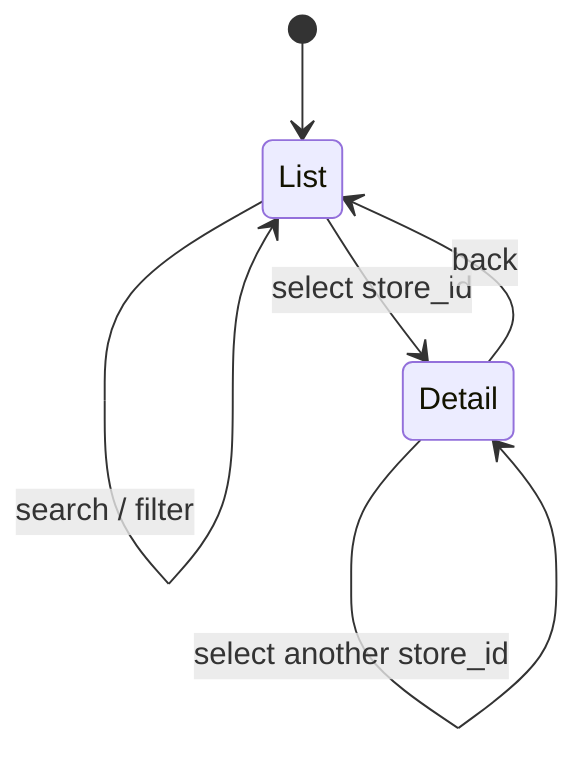

# Map-First UI and Disabled Chat Shell Design

## 1. Scope and Approval

Feature 9 turns the approved experience documents into the local MVP's
interactive home screen. It owns the structured-search form, the shared
map/list candidate surface, store detail, responsive navigation, Kakao Map
presentation, and the mutually exclusive 빵빵이 FAB/chat shell.

This design applies the ownership rules in `docs/README.md`:

- `docs/00-product/prd.md` owns current MVP scope and non-goals.
- `docs/01-experience/user-journey.md` owns task order and privacy behavior.
- `docs/01-experience/ux-states-and-copy.md` owns visible state semantics.
- `docs/01-experience/design-system.md` owns visual tokens, responsive
  behavior, motion, and interaction details.
- the Feature 8 contracts own search and detail wire data.

The owner documents are already approved, and the user explicitly authorized
autonomous end-to-end execution through Feature 10. That authorization is the
design approval for implementing this faithful translation without another
preference pause.

## 2. Selected Approach

`MapShell` is a single client-side coordinator backed by a pure reducer. It
owns only public UI state, the current complete search result, the current
snapshot version, and one `selectedStoreId`. Presentational children receive
typed data and callbacks:

- `StoreDrawer` contains search, list, and detail as explicit drawer states.
- `BakeryMap` consumes the same unmodified `items` array as `StoreList`.
- both marker and list selection call the same `selectStore(storeId)` command.
- `ChatShell` receives only the selected store's public name and address.
- `BbangbbangFab` exists only while chat is closed.

This was selected over:

1. a monolithic page component, which makes shared selection, stale-request
   protection, and independent failure states difficult to prove; and
2. URL-driven drawer/selection state, which would create unnecessary browser
   history and expose interaction details despite the product's data
   minimization rules.

No search text, exact location, selected store, or chat state enters the URL,
storage, logs, or analytics.

## 3. State Model

The reducer uses closed unions rather than loosely related booleans:

```ts
type SearchStatus =
  | "IDLE"
  | "LOADING"
  | "SUCCESS"
  | "PARTIAL"
  | "EMPTY"
  | "ERROR";

type DetailStatus = "IDLE" | "LOADING" | "SUCCESS" | "ERROR";
type DrawerView = "LIST" | "DETAIL";
type DrawerVisibility = "EXPANDED" | "COLLAPSED";
type MobileSurface = "LIST" | "MAP";
type ChatState = "CLOSED" | "OPEN";
type MapStatus = "LOADING" | "READY" | "MAP_UNAVAILABLE";
```

The following invariants are enforced by the reducer and tests:

- a new search clears detail and selection but preserves typed form values;
- `DETAIL` always has a non-null `selectedStoreId`;
- an empty or failed search cannot retain a selected store;
- selecting from either map or list writes the same `selectedStoreId`;
- stale detail responses cannot replace a newer selection;
- collapsing the desktop drawer preserves the current search and selection;
- mobile defaults to the list, changes map/list surface through an explicit
  `지도 보기` / `목록 보기` control, and returns to the list surface when a
  marker selection opens detail;
- chat open and FAB visible are mutually exclusive.

Async work remains outside the reducer. Search and detail requests use
`AbortController` plus monotonically increasing request IDs so late responses
cannot overwrite current state.

## 4. Search and Location

The search form sends the strict Feature 8 request:

```ts
{
  query: {
    region,
    storeName,
    menuName,
    categories,
    openNow,
    origin,
    maxDistanceM,
    reviewEvidenceStatus,
    sortMode,
    recommendationVersion: "recommendation-v1"
  },
  dataSnapshotVersion: null
}
```

Blank text becomes `null`; values are never inferred from earlier searches.
The category chips produce unique `INCLUDE` filters. Review and opening
filters use closed contract enums.

Current location is opt-in. The form explains purpose, possible Kakao
transmission, non-storage, and regional-input fallback before the checkbox is
available. If enabled, browser geolocation is requested only as part of an
explicit search submission. Exact coordinates live in a local variable for
that request and are released in `finally`; they never enter component state,
the URL, an error, or persistent browser storage. Permission failure ends
loading and keeps the regional-input path available.

`401 AUTHENTICATION_REQUIRED` shows the approved Kakao sign-in recovery
action. Validation, stale data, unavailable database, and unknown failures use
safe user copy without reflecting server detail.

## 5. Search and Detail Presentation

The left drawer has one state machine:



The list displays every item from the complete Feature 8 result. Cards show
store name, representative menus, reason text, opening state, the public
250-meter distance upper-bound when present, source basis date, and explicit
review evidence state. Numeric recommendation scores are never shown.

The detail request carries the originating `dataSnapshotVersion`; a detail
from another snapshot cannot be displayed. Detail sections independently
show:

- normalized address and verified opening status;
- verified menus and categories;
- rating as secondary evidence;
- deidentified review body/date and review evidence status;
- freshness basis date and warning state.

Insufficient review evidence never hides the store and uses the approved copy:
`최근 리뷰 근거가 부족해 확인된 메뉴와 방문 조건을 중심으로 표시합니다.`

## 6. Kakao Map Boundary

The browser-public `NEXT_PUBLIC_KAKAO_MAP_APP_KEY` is passed as a serializable
string from the server page to the client coordinator. `BakeryMap` loads only
the Kakao JavaScript SDK through `next/script`, with `autoload=false`.

When the SDK loads, `BakeryMap`:

- creates one map;
- creates one marker for every item in the exact shared candidate array;
- registers marker selection with the same store-ID callback as the list;
- changes the selected marker presentation;
- adjusts bounds without inventing a route or travel time;
- exposes all candidates through the keyboard-operable list rather than
  relying on inaccessible canvas/marker interaction.

Missing key, load error, invalid SDK, or map-construction failure transitions
to `MAP_UNAVAILABLE`. That state renders no imitation map or marker. It keeps
the full drawer, address, public distance bucket, detail navigation, and a
bounded retry action. No Kakao Route API, REST key, or paid request is added.

Automated browser tests use an intercepted, deterministic Kakao SDK fixture.
They never contact Kakao and incur no external cost. A real SDK smoke remains
`NOT_RUN_CREDENTIALS_REQUIRED` until a user-owned app identifier is supplied.

## 7. Chat Shell

The 64px desktop / 56px mobile FAB uses the original local bread mascot and
the exact accessible label `빵빵이에게 물어보기`.

Opening chat removes the FAB and shows a non-modal `role="region"` shell.
The shell:

- does not resize or block the map/drawer;
- shows only the selected store's public display context, or a no-store state;
- shows `챗봇 기능은 다음 단계에서 제공할 예정이에요`;
- includes disabled suggestion buttons and a disabled composer;
- has no form submit handler, send button behavior, API client, message store,
  `/api/chat` route, OpenAI dependency, or external request;
- closes with its button or Escape and returns focus to the newly rendered
  FAB.

Focus restoration uses a short layout effect keyed to the closed state; no
focus trap is introduced because the shell is not a dialog.

## 8. Responsive, Motion, and Accessibility

The CSS token file contains every approved color as a custom property; JSX
contains no repeated color literals. Layout follows the approved breakpoints:

- `>=1200px`: full map, `clamp(320px, 26vw, 380px)` drawer, 380px chat;
- `768..1199px`: 320px drawer and 360px chat;
- `<768px`: list-first single surface, explicit map toggle, bottom-sheet
  chat, 16px FAB inset.

At 200% zoom, desktop naturally crosses into the single-surface layout
without horizontal page scrolling. Interactive targets are at least 44px,
mobile form controls at least 48px. Landmarks, headings, labels, selected
states, `aria-live="polite"` result summaries, and visible focus rings are
present. Store markers always have an equivalent keyboard list path.

Motion uses only transform and opacity at the approved durations. Under
`prefers-reduced-motion: reduce`, transforms and mascot idle movement are
removed and any remaining opacity transition is at most 80ms.

The mascot is an original repository-owned SVG made from the approved bread
palette. No external font request, image, animation runtime, or third-party
character asset is introduced. Pretendard `1.3.9` is pinned as a dependency
and its variable WOFF2 is loaded through `next/font/local`, so runtime rendering
does not depend on a font CDN. The package's OFL-1.1 license remains with the
installed dependency, and the Korean system stack remains the fallback. The
dependency has a large unpacked distribution footprint, but the application
loads only its roughly 2 MB variable WOFF2 asset.

## 9. Verification

Feature 9 verification combines:

- reducer tests for every state invariant;
- API client tests for strict response validation and safe error mapping;
- Kakao adapter tests with a local SDK double;
- browser E2E for search, list/marker selection, detail, map failure, chat
  exclusivity/focus, disabled composer, keyboard operation, mobile layout,
  a 200%-zoom-equivalent effective viewport, and reduced motion;
- typecheck, lint, boundary checks, full unit suite, and production build;
- source audit proving no chat route, OpenAI call, active composer submit, or
  sensitive persistence.
